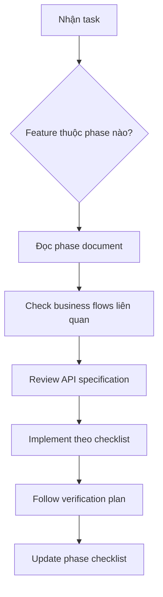
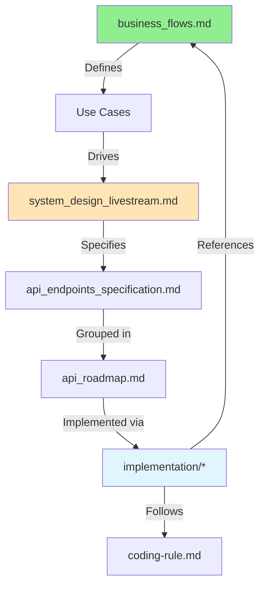

# Documentation Guide

> **Welcome to Live-stream Backend Documentation**  
> Tài liệu được tổ chức theo hướng **Business-First**: Hiểu nghiệp vụ trước, sau đó mới đến technical implementation.

---

## Documentation Structure

```
docs/
├── DOCS_GUIDE.md (this file)        # How to navigate documentation
├── business_flows.md                # ⭐ Use cases & user flows
├── system_design_livestream.md      # Technical architecture
├── api_endpoints_specification.md   # API reference
├── api_roadmap.md                   # API implementation order
├── implementation/                  # Phase-by-phase implementation
│   ├── ROADMAP.md                   # Implementation overview
│   ├── phase-1-foundation.md
│   ├── phase-2-simulation.md
│   ├── phase-3-authentication.md (✅ DONE)
│   ├── phase-4-streaming.md (🔄 NEXT)
│   └── ... (phases 5-12)
├── agent/AGENT_PLAYBOOK.md       # Agent quick-start
└── agent/rules/                     # Development standards
    └── coding-rule.md
```

---

## For Different Audiences

### For Product Owners / Stakeholders

**Start here**:
1. [Business Flows](business_flows.md) - Hiểu use cases và user journeys
2. [Implementation Roadmap](implementation/000_ROADMAP.md) - Theo dõi progress

**Key Questions Answered**:
- ❓ Platform có những tính năng gì? → [Core Use Cases](business_flows.md#core-use-cases)
- ❓ User journey như thế nào? → [User Flows](business_flows.md#user-flows)
- ❓ Business rules là gì? → [Business Rules](business_flows.md#business-rules)
- ❓ Đã implement được bao nhiêu? → [Current Status](implementation/000_ROADMAP.md#-current-status)

---

### For Developers (New to Project)

**Onboarding Path**:

- Bắt đầu bằng [Agent Playbook](agent/AGENT_PLAYBOOK.md) để nắm checklist tổng quan.

#### Step 1: Understand Business (30 mins)
1. Read [Business Flows](business_flows.md)
   - Focus on use cases you'll be working on
   - Study relevant sequence diagrams
   - Note business rules

#### Step 2: Learn Architecture (45 mins)
2. Read [System Design](system_design_livestream.md)
   - Understand why we chose Redis, RabbitMQ, PostgreSQL
   - Review architecture diagram
   - See how business requirements map to technical solutions

#### Step 3: API Reference (15 mins)
3. Skim [API Endpoints Specification](api_endpoints_specification.md)
   - Understand authorization strategy (Two-Tier)
   - Bookmark for reference when implementing

#### Step 4: Check Current Phase (10 mins)
4. Check [Implementation Roadmap](implementation/000_ROADMAP.md)
   - See what's completed
   - Find current phase
   - Read relevant phase document

#### Step 5: Development Standards (20 mins)
5. Read [Coding Rules](agent/rules/coding-rule.md)
   - **CRITICAL**: No JPA relationship annotations
   - Always use DTOs for API
   - Follow authorization patterns

**Total Time**: ~2 hours to be productive

---

### For Developers (Implementing New Feature)

**Workflow**:



**Example**: Implement Stream Management (Phase 4)

1. **Business Context**
   - Read [UC-02: Streamer Creates Livestream](business_flows.md#uc-02-streamer-creates-livestream)
   - Study [Streamer Lifecycle Journey](business_flows.md#flow-1-streamer-lifecycle-journey)

2. **Technical Spec**
   - Read [Phase 4: Stream Management](implementation/phase-4-streaming.md)
   - Check [Stream APIs](api_endpoints_specification.md#23-stream-management-apistreams)

3. **Implementation**
   - Follow checklist trong phase document
   - Refer to [Coding Rules](agent/rules/coding-rule.md)
   - Create `.http` file for testing

4. **Verification**
   - Run automated tests
   - Follow manual testing scenarios
   - Update phase checklist

---

### For DevOps / Infrastructure

**Key Documents**:
- [System Design - Infrastructure](system_design_livestream.md#2-kiến-trúc-tổng-quan)
- [Phase 10: Production Readiness](implementation/phase-10-production.md) (when available)

**Infrastructure Components**:
- **PostgreSQL 16**: Primary data store
- **Redis 7**: Caching, Pub/Sub, HyperLogLog, Sorted Sets
- **RabbitMQ 3**: Async message processing
- **Spring Boot 3.x**: Application runtime

---

## Document Relationships



**Reading Order**:
1. 🟢 **Business Flows** (Why & What)
2. 🟡 **System Design** (How - Architecture)
3. 🔵 **Implementation Phases** (How - Step by step)

---

## Quick Reference

### Common Questions

| Question | Document | Section |
|----------|----------|---------|
| Streamer tạo stream như thế nào? | [Business Flows](business_flows.md) | UC-02, Flow 1 |
| Gift transaction flow ra sao? | [Business Flows](business_flows.md) | Flow 3 |
| API nào cần role gì? | [API Specification](api_endpoints_specification.md) | Section 2 |
| Phase nào đang làm? | [Implementation Roadmap](implementation/000_ROADMAP.md) | Current Status |
| Tại sao dùng Redis Pub/Sub? | [System Design](system_design_livestream.md) | Section 4.3 |
| Làm sao test authentication? | [Phase 3](implementation/phase-3-authentication.md) | Verification Plan |

### File Naming Conventions

- `business_flows.md` - Business use cases (không có technical details)
- `system_design_*.md` - Technical architecture
- `api_*.md` - API documentation
- `implementation/phase-*.md` - Step-by-step implementation
- `agent/rules/*.md` - Development standards

---

## Keeping Documentation Updated

### When to Update

| Event | Update Document |
|-------|----------------|
| Complete một phase | `implementation/000_ROADMAP.md` (status), phase file (checklist) |
| Add new API endpoint | `api_endpoints_specification.md`, `api_roadmap.md` |
| Change business rule | `business_flows.md` (Business Rules section) |
| Modify architecture | `system_design_livestream.md` |

### Update Workflow

```bash
# 1. Make code changes
# 2. Update relevant docs
# 3. Commit together
git add docs/ src/
git commit -m "feat: implement stream management (Phase 4)

- Implemented StreamService, StreamController
- Updated docs/implementation/phase-4-streaming.md checklist
- Updated docs/implementation/000_ROADMAP.md status"
```

---

## Learning Path by Role

### Backend Developer (Junior)
1. Business Flows (focus on 1-2 use cases)
2. System Design (overview only)
3. Coding Rules (detailed)
4. One phase document (current phase)

### Backend Developer (Senior)
1. Business Flows (all use cases)
2. System Design (detailed)
3. API Specification (authorization strategy)
4. Implementation Roadmap (dependencies)

### Tech Lead / Architect
1. All documents (comprehensive understanding)
2. Focus on cross-cutting concerns
3. Validate phase dependencies
4. Review business rules enforcement

---

## Need Help?

- **Business questions**: Check [Business Flows](business_flows.md)
- **Technical questions**: Check [System Design](system_design_livestream.md)
- **API questions**: Check [API Specification](api_endpoints_specification.md)
- **Implementation questions**: Check relevant [Phase Document](implementation/000_ROADMAP.md)
- **Coding standards**: Check [Coding Rules](agent/rules/coding-rule.md)

---

**Last Updated**: 2025-12-18  
**Documentation Version**: 2.0 (Business-First Restructure)
