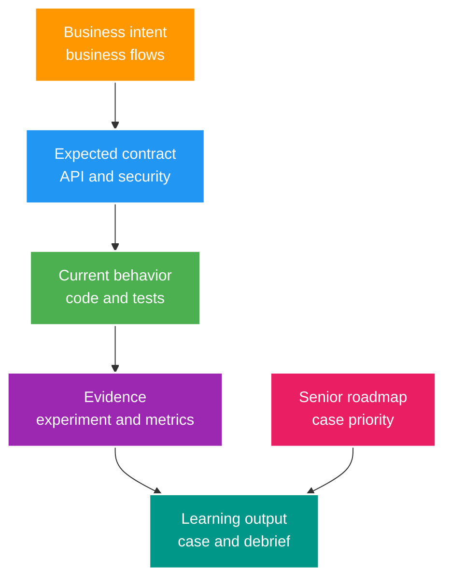

# Documentation Guide

> Trạng thái: `CANONICAL ENTRY POINT` 
> Cập nhật: 2026-07-25

## 1. Bắt đầu ở đâu

| Nhu cầu | Nguồn đọc đầu tiên | Nguồn tiếp theo |
| --- | --- | --- |
| Chọn nội dung học | [Senior Roadmap](001_SENIOR_JAVA_INTERVIEW_ROADMAP.md) | [Current State & Gaps](002_CURRENT_STATE_AND_GAP_ANALYSIS.md) |
| Biết code đang có gì | [Implementation Map](implementation/000_ROADMAP.md) | source code + tests |
| Hiểu kiến trúc hiện tại | [System Context](architecture/system-context.md) | active learning case/ADR |
| Hiểu nghiệp vụ | [Business Flows](business_flows.md) | [API Contract](api_endpoints_specification.md) |
| Làm security | [Security Flow](authorization_flow.md) | API contract + code/test |
| Làm Redis | [Redis Guide](redis_usage_guide.md) | code/test/runtime evidence |
| Làm RTMP webhook | [Webhook Concepts](concepts/webhooks.md) | security flow + active case |
| Làm việc với Codex | [AI Agent System](003_AI_AGENT_ENGINEERING_SYSTEM.md) | `AGENTS.md`, `PLANS.md`, project skill |

## 2. Source-of-truth flow

```mermaid
flowchart TB
    B["Business intent<br/>business flows"] --> C["Expected contract<br/>API and security"]
    C --> K["Current behavior<br/>code and tests"]
    K --> E["Evidence<br/>experiment and metrics"]
    E --> L["Learning output<br/>case and debrief"]
    R["Senior roadmap<br/>case priority"] --> L

    style B fill:#FF9800,stroke:#fff,stroke-width:2px,color:#fff
    style C fill:#2196F3,stroke:#fff,stroke-width:2px,color:#fff
    style K fill:#4CAF50,stroke:#fff,stroke-width:2px,color:#fff
    style E fill:#9C27B0,stroke:#fff,stroke-width:2px,color:#fff
    style L fill:#009688,stroke:#fff,stroke-width:2px,color:#fff
    style R fill:#E91E63,stroke:#fff,stroke-width:2px,color:#fff
```

Khi contract, code và docs mâu thuẫn, ghi nhận drift. Không đổi status để che mâu thuẫn và không coi một tài liệu thiết kế là bằng chứng implementation.

## 3. Active document map

### Direction và status

- [Senior Roadmap](001_SENIOR_JAVA_INTERVIEW_ROADMAP.md): thứ tự học, case backlog, exit gate.
- [Current State & Gaps](002_CURRENT_STATE_AND_GAP_ANALYSIS.md): snapshot bằng chứng và priority.
- [Implementation Map](implementation/000_ROADMAP.md): capability hiện có trong code.
- [AI Agent System](003_AI_AGENT_ENGINEERING_SYSTEM.md): rules/workflow/skills/docs lifecycle.

### Business và architecture

- [Business Flows](business_flows.md): target business use cases, có maturity marker.
- [System Context](architecture/system-context.md): topology và capability đang chạy.
- [API Contract](api_endpoints_specification.md): endpoint hiện tồn tại và authorization gap.
- [Security Flow](authorization_flow.md): current flow và Stage 0 invariants.

### Engineering references

- [Coding Standards](coding_standards.md)
- [Redis Usage Guide](redis_usage_guide.md)
- [Webhook Concepts](concepts/webhooks.md)
- [Data Initialization](usage/data-initialization.md)
- [P6Spy SQL Logging](usage/p6spy-sql-logging.md)
- [Codex PostgreSQL MCP](codex/mcp-postgres.md)

### Templates và history

- [Learning Case Template](templates/LEARNING_CASE_TEMPLATE.md)
- [Documentation Archive](archive/README.md)

## 4. Status vocabulary

| Label | Ý nghĩa |
| --- | --- |
| `CURRENT` | Có bằng chứng trong code/test hiện tại |
| `CURRENT GAP` | Có behavior nhưng vi phạm target invariant hoặc thiếu verification |
| `TARGET` | Intended design, chưa phải implementation |
| `LEARNING BACKLOG` | Chủ đề/case chưa active |
| `ARCHIVED` | Chỉ giữ lịch sử, không làm source of truth |

Maturity M0-M4 được định nghĩa trong [Current State & Gaps](002_CURRENT_STATE_AND_GAP_ANALYSIS.md#6-maturity-model-dùng-cho-project).

## 5. Reading workflow

### Một learning case

1. Chọn case trong Senior roadmap.
2. Đọc current-state snapshot và code path thật.
3. Chỉ nạp business/API/security/Redis/webhook docs liên quan.
4. Tạo file từ learning-case template.
5. Reproduce failure, so alternatives, implement, đo và inject failure.
6. Review, cập nhật evidence/status và tự teach-back.

### Một product change

1. Xác định business invariant và current API contract.
2. Kiểm tra change có thuộc active learning case không.
3. Dùng execution plan nếu xuyên nhiều layer hoặc có rủi ro.
4. Đồng bộ code, tests, OpenAPI, `.http` và active docs.
5. Không tự mở lại legacy phase plan làm backlog.

## 6. Quy ước file mới

- Learning case: `learning/cases/CASE-<DOMAIN>-<NN>-<slug>.md`.
- ADR: `architecture/adr/ADR-<NNNN>-<slug>.md`.
- Experiment: `learning/experiments/EXP-<DOMAIN>-<NN>-<slug>.md`.
- Runbook: `operations/runbooks/RUNBOOK-<SYSTEM>-<failure>.md`.
- Chỉ tạo folder/file khi có artifact thật; không scaffold cây rỗng.
- Mỗi active file ghi status, ngày cập nhật và source evidence/replacement khi phù hợp.

## 7. Maintenance rules

- Current behavior thay đổi: cập nhật code/test, OpenAPI, `.http`, API/security doc.
- Architecture decision: tạo ADR; không rewrite lịch sử quyết định âm thầm.
- Performance claim: link experiment có workload và raw result.
- Capability status chỉ tăng khi evidence gate tồn tại.
- Doc không còn owner/mục đích hoặc bị thay thế: chuyển archive và thêm replacement map.
- Link checker áp cho active docs; archive được xem là frozen historical material.

## 8. Documentation health gate

- Active file không link tới legacy phase/prompt như source chuẩn.
- Không có `file:///` hard-coded link.
- Mermaid fence có diagram type hợp lệ và layout đọc được.
- Một fact có một owner active.
- `CURRENT`, `TARGET` và `ARCHIVED` không bị trộn.
- README, Docs Guide, Senior Roadmap và Implementation Map thống nhất priority.
