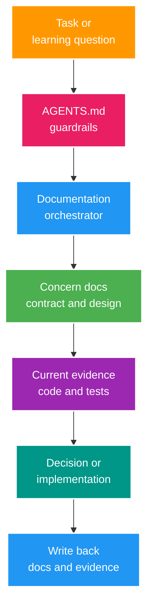

# Documentation Orchestrator

> Trạng thái: `CANONICAL ENTRY POINT`<br>
> Dành cho: Human, Codex và AI Agent khác<br>
> Cập nhật: 2026-07-25

File này trả lời ba câu hỏi:

1. Với một task cụ thể phải đọc tài liệu nào?
2. Khi các nguồn mâu thuẫn, nguồn nào có quyền quyết định?
3. Sau khi làm xong phải cập nhật artifact nào?

Không đọc toàn bộ `docs/`. Hãy phân loại intent rồi nạp context theo routing bên dưới.

## 1. Context orchestration flow



## 2. Routing theo intent

| Intent | Đọc bắt buộc | Chỉ đọc thêm khi liên quan | Output/write-back |
| --- | --- | --- | --- |
| Chọn case học tiếp | [Senior Roadmap](001_SENIOR_JAVA_INTERVIEW_ROADMAP.md), [Current Gaps](002_CURRENT_STATE_AND_GAP_ANALYSIS.md) | [Implementation Map](implementation/current-implementation-map.md) | Learning case từ [template](templates/learning-case-template.md) |
| Bắt đầu/tiếp tục phiên học Senior | [Learning System](learning/index.md), active case và checkpoint hiện tại | Theory/deep-dive, question bank, concern docs, code/test được checkpoint link | Knowledge artifact đúng owner, evidence và session cursor |
| Implement feature/case | `AGENTS.md`, active case, [Coding Standards](engineering/coding-standards.md) | Business/API/security/Redis/webhook theo concern | Code, tests, OpenAPI, `.http`, case evidence |
| Hiểu business | [Business Flows](contracts/business-flows.md) | [API Contract](contracts/api-contract.md) | Làm rõ invariant hoặc contract drift |
| Hiểu code đang có gì | [Implementation Map](implementation/current-implementation-map.md), [System Context](architecture/system-context.md) | Source code, tests, runtime evidence | Cập nhật map khi capability thay đổi |
| Security/auth | [Authorization Flow](security/authorization-flow.md), [API Contract](contracts/api-contract.md) | Redis guide, webhook guide | Negative tests, threat/decision notes |
| Redis/cache | [Redis Guide](engineering/redis-guide.md) | Security flow hoặc active case | Key catalog, TTL/invalidation, failure tests |
| RTMP webhook | [RTMP Webhook Guide](engineering/rtmp-webhook-guide.md) | Security flow, business flow | Signature/idempotency/state tests |
| Architecture/system design | [System Context](architecture/system-context.md), roadmap stage liên quan | ADR/experiment khi đã tồn tại | ADR, capacity model hoặc extraction scorecard |
| Debug local PostgreSQL | [Codex PostgreSQL MCP](tools/codex-postgres-mcp.md) | P6Spy guide | Reproducer và evidence; không sửa contract âm thầm |
| Quan sát SQL | [P6Spy Guide](tools/p6spy-sql-logging.md) | PostgreSQL learning case | Query count/plan/experiment |
| Seed local data | [Data Initialization](tools/data-initialization.md) | Current API contract | Chỉ local fixture; không thành production behavior |
| Làm việc với AI Agent | [AI Agent System](003_AI_AGENT_ENGINEERING_SYSTEM.md), [Skill Catalog](ai/skill-catalog.md) | `PLANS.md`, skill đã trigger | Plan, verification và docs sync |
| Tìm lịch sử cũ | [Archive Index](archive/index.md) | File archive cụ thể | Không dùng archive làm current contract |

## 3. Protocol cho AI Agent

### 3.1. Context tối thiểu

1. Luôn tuân thủ `AGENTS.md`; đọc file `AGENTS.md` gần task nhất nếu có.
2. Phân loại task theo routing table.
3. Nạp tối đa các concern docs cần thiết; không đọc archive hoặc toàn bộ docs mặc định.
4. Kiểm tra code/test trước khi kết luận current behavior.
5. Nếu thay đổi có rủi ro hoặc xuyên nhiều layer, dùng `PLANS.md`.

### 3.2. Khi nguồn mâu thuẫn

Áp thứ tự sau, nhưng không âm thầm bỏ qua drift:

| Câu hỏi | Source of truth | Nguồn mô tả intent |
| --- | --- | --- |
| Code hiện đang làm gì? | Source code + automated tests | Runtime logs/metrics |
| Business mong muốn gì? | [Business Flows](contracts/business-flows.md) | Active learning case |
| REST endpoint/quyền hiện tại? | [API Contract](contracts/api-contract.md) + code/test | OpenAPI và `.http` |
| Kiến trúc đang chạy? | [System Context](architecture/system-context.md) + runtime config | ADR target |
| Học gì tiếp theo? | [Senior Roadmap](001_SENIOR_JAVA_INTERVIEW_ROADMAP.md) | [Current Gaps](002_CURRENT_STATE_AND_GAP_ANALYSIS.md) |
| Agent được làm gì? | `AGENTS.md` | Skill/workflow đã trigger |
| Vì sao chọn solution? | ADR + experiment evidence | Learning case notes |

Nếu code và contract khác nhau, Agent phải báo cả `CURRENT` và `TARGET`, rồi chỉ sửa theo phạm vi người dùng đã giao.

### 3.3. Không được làm

- Không dùng file trong `archive/` làm active requirement.
- Không lấy dependency/TODO/document làm bằng chứng capability đã implement.
- Không tự nạp phase plan cũ hoặc phát triển tuần tự theo Phase 5–12.
- Không cập nhật status nếu thiếu evidence gate.
- Không tạo thêm guide trùng owner; bổ sung vào canonical doc hoặc tạo ADR/case đúng loại.

## 4. Reading path cho Human

### Onboarding nhanh

1. [Senior Roadmap](001_SENIOR_JAVA_INTERVIEW_ROADMAP.md): biết mục tiêu học.
2. [Current Gaps](002_CURRENT_STATE_AND_GAP_ANALYSIS.md): biết code yếu ở đâu.
3. [System Context](architecture/system-context.md): biết topology đang chạy.
4. [Implementation Map](implementation/current-implementation-map.md): biết capability nào thực sự có.
5. Chọn concern doc hoặc active case; không đọc archive trong onboarding.

### Chuẩn bị một buổi học

1. Mở [Learning System](learning/index.md) và đọc `Current session cursor`.
2. Đọc active case, đúng template và các artifact được checkpoint link.
3. Tiếp tục bằng `$run-senior-java-learning`; không tự nhảy qua evidence gate.
4. Chỉ đọc current code path/concern docs khi checkpoint đã tới case hoặc reproducer.
5. Kết thúc bằng cách ghi artifact đúng owner và cập nhật cursor cho session sau.

## 5. Write-back routing

| Thay đổi | Artifact phải cập nhật |
| --- | --- |
| Endpoint/quyền/DTO | Code/test, OpenAPI, `.http`, `contracts/api-contract.md` |
| Business invariant | `contracts/business-flows.md`, active case, tests |
| Architecture decision | ADR + `architecture/system-context.md` nếu baseline đổi |
| Redis key/TTL/serializer | `engineering/redis-guide.md`, tests, compatibility plan |
| Webhook contract | `engineering/rtmp-webhook-guide.md`, API contract, tests |
| Capability implementation | `implementation/current-implementation-map.md` + evidence link |
| Core/deep-dive knowledge | `learning/theory/...`; case/question bank chỉ link, không duplicate |
| Interview question/rubric | `learning/question-bank/<domain>.md` + theory/evidence links |
| Learning session progress | `learning/index.md` cursor + active artifact/case |
| Learning case complete | Case file, roadmap status/maturity |
| Experiment/interview extraction | `learning/experiments/...` raw evidence; `learning/interview-notes/...` teach-back cá nhân |
| Agent rule/workflow/skill | `AGENTS.md`, `003_AI_AGENT_ENGINEERING_SYSTEM.md`, `ai/skill-catalog.md`, skill validation |
| Tài liệu bị thay thế | Chuyển `archive/`, thêm banner và cập nhật `archive/index.md` |

## 6. Taxonomy hiện tại

```text
docs/
├── 000_DOCUMENTATION_ORCHESTRATOR.md
├── 001_SENIOR_JAVA_INTERVIEW_ROADMAP.md
├── 002_CURRENT_STATE_AND_GAP_ANALYSIS.md
├── 003_AI_AGENT_ENGINEERING_SYSTEM.md
├── ai/
│   └── skill-catalog.md
├── architecture/
│   └── system-context.md
├── contracts/
│   ├── api-contract.md
│   └── business-flows.md
├── security/
│   └── authorization-flow.md
├── engineering/
│   ├── coding-standards.md
│   ├── redis-guide.md
│   └── rtmp-webhook-guide.md
├── implementation/
│   └── current-implementation-map.md
├── learning/
│   ├── index.md
│   └── cases/
│       └── sec-01-access-vs-refresh-token.md
├── tools/
│   ├── codex-postgres-mcp.md
│   ├── data-initialization.md
│   └── p6spy-sql-logging.md
├── templates/
│   ├── experiment-template.md
│   ├── interview-note-template.md
│   ├── learning-case-template.md
│   ├── question-bank-template.md
│   └── theory-note-template.md
└── archive/
    └── index.md
```

Các folder `operations/` và `architecture/adr/` chỉ được tạo khi có artifact thật. Trong `learning/`, các nhánh `theory/core/<domain>`, `theory/deep-dives/<domain>`, `question-bank`, `experiments` và `interview-notes` cũng chỉ được tạo khi có artifact đầu tiên; không scaffold cây rỗng từ coverage map.

## 7. Naming convention

### Canonical navigation

- Chỉ bốn file có thứ tự đọc toàn repository dùng `NNN_UPPER_SNAKE_CASE.md`.
- `000` orchestrates docs; `001` roadmap; `002` snapshot; `003` AI engineering system.

### Concern artifacts

- Folder và file dùng English `lowercase-kebab-case`.
- Tên mô tả artifact, không mô tả phase: `api-contract.md`, không phải `phase-5-api.md`.
- Directory index dùng `index.md`.
- Template cũng dùng lowercase kebab-case.

### Root exceptions

`README.md`, `AGENTS.md` và `PLANS.md` giữ convention chuẩn của repository/tooling.

## 8. Status vocabulary

| Status | Ý nghĩa |
| --- | --- |
| `CURRENT` | Có bằng chứng trong code/test hiện tại |
| `CURRENT GAP` | Behavior tồn tại nhưng chưa đạt invariant/verification |
| `TARGET` | Intended design, chưa phải implementation |
| `LEARNING BACKLOG` | Case chưa active |
| `ARCHIVED` | Chỉ giữ lịch sử |

Maturity M0–M4 được định nghĩa trong [Current Gaps](002_CURRENT_STATE_AND_GAP_ANALYSIS.md#6-maturity-model-dùng-cho-project).

## 9. Orchestrator maintenance gate

- Mọi active doc phải xuất hiện trong taxonomy hoặc được link từ một active doc owner.
- Không có broken relative link hoặc hard-coded `file:///` path.
- Không có active filename ngoài hai convention đã định nghĩa.
- README và `AGENTS.md` phải trỏ tới file orchestrator này.
- Khi rename/move doc, cập nhật repository rules, project skills và link checker cùng lượt.
- Khi tạo, cài, rename, move, xóa hoặc đổi trigger/scope của skill, cập nhật `ai/skill-catalog.md` trong cùng change.
- `learning/index.md` phải trỏ đúng một active case và checkpoint không được đi trước evidence thực tế.
- Graphify phải được update sau một migration lớn trước khi dùng lại như source navigation.
