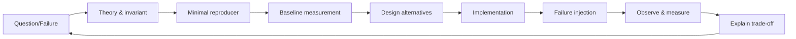

# Roadmap Senior Java Backend Interview Lab

> Canonical learning roadmap<br>
> Cập nhật: 2026-07-25<br>
> Hiện trạng chi tiết: [002_CURRENT_STATE_AND_GAP_ANALYSIS.md](002_CURRENT_STATE_AND_GAP_ANALYSIS.md)<br>
> Hệ thống làm việc với Codex: [003_AI_AGENT_ENGINEERING_SYSTEM.md](003_AI_AGENT_ENGINEERING_SYSTEM.md)

## 1. North star

Mục tiêu của project không phải là hoàn thành nhiều endpoint. Mục tiêu là có thể làm đủ bốn việc với các bài toán Backend Senior:

1. Giải thích bản chất và invariant bằng lý thuyết chính xác.
2. Tái hiện failure bằng test hoặc experiment nhỏ.
3. Triển khai một hoặc nhiều solution và đo được kết quả.
4. Bảo vệ trade-off trong phỏng vấn bằng code, query plan, metric và incident evidence.

Domain livestream chỉ là bối cảnh nhất quán để nối các chủ đề Java Core, Spring Boot, transaction, concurrency, security, PostgreSQL, Redis, Kafka, microservice và solution architecture.

## 2. Nguyên tắc điều hướng

- Giữ một deployable **modular monolith** cho tới khi module boundary, traffic và failure mode chứng minh cần tách service.
- Feature là phương tiện tạo case; không lấy CRUD coverage làm KPI.
- Học consistency trong một process và một database trước khi mở rộng sang distributed consistency.
- RabbitMQ và Kafka phải giải hai bài toán khác nhau hoặc được dùng trong experiment so sánh; không thêm broker để trang trí CV.
- Index, replica, partition và shard chỉ được thêm sau khi có workload, query và số liệu baseline.
- Production concerns xuất hiện từ case đầu: log an toàn, metric, test và recovery không bị dồn vào phase cuối.
- Mỗi case có một hypothesis đo được, một failure scenario và một exit gate.
- Không tự gọi một capability là `DONE`; dùng maturity M0-M4 trong [current-state assessment](002_CURRENT_STATE_AND_GAP_ANALYSIS.md#6-maturity-model-dùng-cho-project).

## 3. Learning loop chuẩn cho mọi case



Một case không hoàn thành nếu chỉ có code. Dùng [Learning Case Template](templates/LEARNING_CASE_TEMPLATE.md) để lưu toàn bộ vòng lặp.

## 4. Bản đồ năng lực

| Chủ đề | Case chính trong domain | Bằng chứng phải tạo |
| --- | --- | --- |
| Java Core | value object tiền, collections, equality, exception, executor | Unit test, JMH/JFR khi có performance claim, giải thích memory model |
| Concurrency | start webhook đồng thời, wallet deduct, consumer song song | Race test lặp lại, invariant query, lock/conflict metric |
| Spring Boot | bean lifecycle, proxy/AOP, validation, filter chain, configuration | Slice test, context test có mục tiêu, architecture test |
| Transaction | rollback, propagation, isolation, after-commit side effect | Integration test từng anomaly, transaction timeline |
| Security | JWT/session, webhook HMAC, RBAC/ownership, rate limit | Threat model, negative test, audit log đã redact |
| PostgreSQL | MVCC, lock, index, cursor, constraint, deadlock | Flyway migration, dataset generator, `EXPLAIN (ANALYZE, BUFFERS)` |
| Redis | cache-aside, TTL, stampede, HLL, ZSET, rate limit, lock | Key schema, hit ratio, degraded-mode test, recovery policy |
| RabbitMQ | command/work queue, retry, DLQ, manual ACK | Duplicate/crash test, queue metrics, replay procedure |
| Kafka | event log, partition/order, consumer group, replay, retention | Topic contract, key choice, lag/rebalance/replay experiment |
| Testing | unit, slice, integration, contract, concurrency, load, chaos | Test pyramid và CI artifact |
| Observability | structured log, metric, trace, SLI/SLO | Dashboard, alert, trace example, incident timeline |
| Data scale | primary/replica, lag, partition, archive, shard decision | Read-routing test, lag experiment, pruning/query-plan report |
| Design patterns | state machine, strategy, decorator, adapter, outbox, saga | ADR giải thích pattern và anti-pattern, không chỉ class diagram |
| Microservice | service boundary, contract, data ownership, resilience | Extraction scorecard, contract test, distributed trace |
| Solution architecture | capacity, bottleneck, HA, DR, security, cost | Architecture dossier và 15/45-minute interview presentation |

## 5. Roadmap theo stage

Roadmap có thứ tự dependency nhưng không có deadline cố định. Mỗi lần chỉ active một learning case chính; các case observability/test là phần của case đó, không phải side project.

### Stage 0 - Stabilize the laboratory

**Câu hỏi trung tâm:** Làm sao biết một thay đổi đúng và có thể tái lập?

Thực hiện:

- sửa các P0 về token type, auth matcher, session cache, stream-key exposure và hardening shared-secret webhook;
- tách `dev`, `test`, `prod` configuration; không để dev/test endpoint tự xuất hiện trong production;
- dùng Flyway làm nguồn schema versioned;
- dùng Testcontainers cho PostgreSQL, Redis và broker cần thiết;
- khóa JDK trong CI/toolchain; compile và test không phụ thuộc máy developer;
- tạo test data builder, deterministic clock/ID seam và test naming convention;
- thêm correlation ID và log-redaction baseline;
- tạo ADR đầu tiên và learning case đầu tiên.

**Exit gate**

- P0 đều có regression test.
- Test chạy trên máy sạch không cần database có sẵn.
- `ddl-auto` không âm thầm thay schema.
- CI xuất kết quả test; không có secret trong log.

### Stage 1 - Java Core, state và concurrency

**Câu hỏi trung tâm:** Điều gì thực sự atomic và điều gì chỉ trông có vẻ atomic?

Case:

1. Chuyển stream lifecycle thành state machine `CREATED -> LIVE -> ENDED`.
2. Gửi hai webhook start/end đồng thời và chứng minh transition invariant.
3. Thiết kế `Money`/amount value object bằng `BigDecimal`, scale và rounding rõ ràng.
4. Tái hiện lost update khi 100 request deduct cùng wallet.
5. So sánh optimistic lock, pessimistic lock và conditional SQL update.
6. Phân tích `synchronized`, `Lock`, atomic class, executor, `CompletableFuture`, ThreadLocal và Java Memory Model trong đúng context case.

Java 17 vẫn là baseline. Virtual threads được thử trên nhánh/lab JDK phù hợp sau khi có blocking-I/O benchmark; không nâng version chỉ để dùng keyword mới.

**Exit gate**

- Race test lặp nhiều lần vẫn giữ invariant.
- Có giải thích happens-before, visibility, atomicity và contention bằng timeline cụ thể.
- Chọn lock strategy dựa trên conflict rate và số liệu, không dựa trên sở thích.

### Stage 2 - Spring internals và transaction semantics

**Câu hỏi trung tâm:** Transaction boundary thực sự nằm ở đâu?

Case:

- `@Transactional` proxy, self-invocation, rollback rule và exception translation;
- propagation `REQUIRED`, `REQUIRES_NEW`, nested behavior và timeout;
- isolation anomalies trên PostgreSQL: non-repeatable read, phantom-like behavior, write skew/lost update;
- DB commit và Redis update: dùng after-commit, cache invalidation hoặc event-driven projection;
- controller validation, service invariant, repository constraint và global exception contract;
- transaction quá dài, connection-pool exhaustion và remote call bên trong transaction.

**Exit gate**

- Mỗi claim về propagation/isolation có integration test.
- Không có Redis/broker side effect được mô tả sai là atomic với database.
- Có sequence diagram cho commit, rollback và crash window.

### Stage 3 - PostgreSQL: model, index và query engineering

**Câu hỏi trung tâm:** Query chậm vì dữ liệu, query shape, index hay concurrency?

Case:

- xây wallet + immutable ledger, constraint bảo vệ balance/invariant;
- sửa manual N+1 của stream list bằng projection/batch query và đo query count;
- cursor pagination cho stream/history thay unbounded `findAll`;
- B-tree/composite/covering/partial index; column order, selectivity và write amplification;
- đọc `EXPLAIN (ANALYZE, BUFFERS)`, statistics, scan type và row-estimation error;
- MVCC, vacuum, bloat, lock wait, deadlock và retry có giới hạn;
- unique constraint/idempotency key như concurrency primitive.

**Exit gate**

- Dataset đủ lớn để query plan có ý nghĩa.
- Có before/after plan và latency distribution, không chỉ một con số trung bình.
- Mỗi index có query owner và chi phí ghi được ghi nhận.

### Stage 4 - Redis as a distributed data structure

**Câu hỏi trung tâm:** Nếu Redis sai, chậm hoặc biến mất thì business invariant còn đúng không?

Case:

- session cache: TTL, revoke-all, negative cache và security-sensitive validation;
- cache-aside với invalidation sau commit;
- cache stampede: single-flight/local lock, distributed lock, TTL jitter và stale-while-revalidate;
- rate limiting bằng token bucket/sliding window và Lua atomicity;
- current viewers bằng ZSET heartbeat; unique viewers bằng HyperLogLog;
- leaderboard bằng Sorted Set và rebuild từ PostgreSQL/event log;
- distributed lock với ownership token, expiry và fencing discussion;
- Redis unavailable, serialization migration và versioned key.

**Exit gate**

- PostgreSQL vẫn là source of truth cho durable invariant.
- Key, value type, TTL, cardinality và invalidation owner được document.
- Có failure test khi Redis timeout/down và metric hit/miss/error.

### Stage 5 - Messaging fundamentals: RabbitMQ và Kafka

**Câu hỏi trung tâm:** Queue, durable event log và business idempotency khác nhau thế nào?

Giữ RabbitMQ cho case command/work queue có ACK, retry và DLQ. Thêm Kafka cho domain-event stream cần partition ordering, consumer group, retention và replay. Trước khi giữ cả hai trong kiến trúc chính, phải có ADR chứng minh chi phí vận hành là hợp lý.

Kafka labs:

- topic/partition/offset/consumer group và partition-key selection;
- ordering chỉ trong partition và hậu quả của hot key;
- at-most-once, at-least-once, idempotent processing và phạm vi của exactly-once;
- manual offset, crash trước/sau DB commit, retry topic và poison message;
- consumer rebalance, lag, backpressure, schema evolution và replay;
- retention/compaction và event versioning.

RabbitMQ labs:

- exchange/routing key, publisher confirm, manual ACK/NACK;
- prefetch, competing consumers, retry/backoff, DLQ và replay;
- consumer xử lý xong nhưng crash trước ACK.

**Exit gate**

- Có decision matrix RabbitMQ vs Kafka theo semantics, không theo độ phổ biến.
- Duplicate, out-of-order, poison message và broker outage đều có test/runbook.
- Event contract không dùng JPA entity làm payload.

### Stage 6 - Reliable event-driven workflow

**Câu hỏi trung tâm:** Làm sao đóng crash window của dual write?

Capstone: gift purchase và wallet settlement.

```text
API request
  -> DB transaction: idempotency + ledger + gift + outbox
  -> publisher/CDC: outbox -> broker
  -> consumer: inbox/dedup -> projection/notification
  -> ACK/offset commit sau durable processing
```

Học và triển khai:

- transactional outbox; polling publisher trước, CDC là experiment nâng cao;
- inbox/dedup table, idempotent consumer và idempotency window;
- ordering key, optimistic conflict và retry budget;
- saga choreography/orchestration, compensation và semantic rollback;
- DLQ quarantine, replay authorization và audit;
- schema compatibility và event versioning.

**Exit gate**

- Kill process tại từng crash point vẫn không mất durable intent và không double-spend.
- Có invariant query đối soát ledger, gift và event processing.
- Trace/correlation ID nối request, outbox, broker và consumer.

### Stage 7 - Realtime, security và abuse resistance

**Câu hỏi trung tâm:** Realtime path bảo vệ state và tài nguyên như thế nào?

Case:

- WebSocket/STOMP auth ở CONNECT, SUBSCRIBE và SEND;
- ownership/ban/mute check, reconnect, duplicate message và token expiry;
- slow consumer, bounded queue, backpressure và message-size limit;
- webhook HMAC, timestamp window, nonce/event ID và secret rotation;
- per-user/room/IP rate limit, abuse signal và audit log;
- threat model theo asset, trust boundary và attacker story.

**Exit gate**

- Negative authorization test tồn tại ở HTTP, WebSocket và webhook.
- Load test chứng minh behavior khi client chậm hoặc reconnect storm.
- Token, stream key, webhook secret và payload nhạy cảm không xuất hiện trong log.

### Stage 8 - Observability, testing và performance engineering

**Câu hỏi trung tâm:** Khi production chậm hoặc sai, bằng chứng đầu tiên nằm ở đâu?

Thực hiện xuyên suốt rồi chuẩn hóa tại stage này:

- structured JSON log, correlation/trace ID và sampling/redaction;
- Actuator + Micrometer metrics, Prometheus/Grafana local stack;
- OpenTelemetry trace cho HTTP, JDBC, Redis và broker;
- SLI/SLO: availability, latency, error rate, consumer lag và queue depth;
- unit, slice, module, integration, contract, concurrency, load và fault test;
- k6/Gatling workload; JFR, GC log, thread dump và connection-pool analysis;
- incident drills: DB slow, Redis down, broker unavailable, poison message, replica lag.

**Exit gate**

- Một alert có runbook và được kích hoạt bằng fault injection.
- Có p50/p95/p99, throughput, saturation và error rate cho hot path.
- Có thể lần theo một gift request xuyên các component bằng trace/correlation ID.

### Stage 9 - Primary/replica, partitioning và data lifecycle

**Câu hỏi trung tâm:** Scale read/data mà không phá consistency như thế nào?

Case primary/replica:

- dựng local primary + hot standby chỉ sau khi query baseline ổn định;
- read/write routing và transaction `readOnly` không được coi là consistency guarantee;
- đo replication lag; tái hiện read-after-write trả stale data;
- sticky-primary/consistency token/lag threshold cho use case cần read-your-writes;
- sync vs async replication, failover, connection pool và recovery objective.

Case partitioning:

- chọn ledger/chat/audit table có retention và time-range query rõ ràng;
- range partition theo thời gian, partition pruning, local index và maintenance;
- benchmark trước/sau; ghi nhận planning overhead và constraint/unique-key caveat;
- detach/archive/drop partition và retention job;
- sharding chỉ làm architecture exercise sau khi single-node + replica + partition không đủ.

**Exit gate**

- Có lag/stale-read reproducer và policy theo từng endpoint.
- Partition key đến từ query/retention pattern, không từ phỏng đoán.
- Có RPO/RTO và failover runbook tối thiểu.

### Stage 10 - Modular monolith to microservices

**Câu hỏi trung tâm:** Nỗi đau nào đủ lớn để trả chi phí distributed system?

Trước khi tách:

- chuyển package-by-feature: `identity`, `stream`, `wallet`, `gift`, `chat`, `analytics`, `admin`, `shared`;
- định nghĩa module API, data owner và domain event;
- dùng architecture test hoặc Spring Modulith để phát hiện dependency vi phạm;
- đo coupling, deployment cadence, scaling profile và blast radius.

Service extraction đầu tiên nên là capability ít nằm trên strong-consistency path, ví dụ analytics hoặc notification. Không tách identity/wallet đầu tiên chỉ để có nhiều service.

Sau khi tách, học:

- service-owned data, API/event contract và compatibility;
- timeout, retry budget, circuit breaker, bulkhead và load shedding;
- service discovery/gateway chỉ khi topology cần;
- distributed trace, deployment độc lập và contract test;
- saga/outbox thay distributed transaction;
- canary/rollback, config/secret management và operational cost.

**Exit gate**

- Có extraction scorecard và ADR chỉ ra cả phương án không tách.
- Service tách ra có test contract, dashboard, runbook và owner dữ liệu.
- Chứng minh được lợi ích độc lập về scale/deploy/blast radius lớn hơn chi phí network/operation.

### Stage 11 - Solution architecture capstones

Mỗi capstone phải có assumption, capacity math, bottleneck, failure domain, consistency, security, cost và evolution path.

1. Livestream 100 nghìn concurrent viewers, chat fan-out và reconnect storm.
2. Gift sale spike với wallet invariant và event backlog.
3. Multi-region read, single-writer hoặc regional ownership; phân tích RPO/RTO.
4. Hot streamer/hot partition và celebrity problem.
5. Analytics near-real-time từ Kafka, replay và backfill.
6. Ban user toàn hệ thống: session, cache, WebSocket, event và audit.

Mỗi bài chuẩn bị ba phiên bản trình bày: 2 phút, 15 phút và 45 phút.

## 6. Case backlog ưu tiên

| ID | Case | Stage | Priority |
| --- | --- | --- | --- |
| SEC-01 | Access token vs refresh token confusion | 0 | P0 |
| SEC-02 | Logout-all với stale Redis session | 0/4 | P0 |
| SEC-03 | Stream key exposure và webhook replay | 0/7 | P0 |
| TEST-01 | Hermetic integration test bằng Testcontainers | 0 | P0 |
| CON-01 | Concurrent stream state transition | 1/2 | P0 |
| DB-01 | Manual N+1 và cursor pagination | 3 | P1 |
| WAL-01 | Lost update và ledger invariant | 1/3 | P1 |
| TX-01 | DB commit vs Redis side effect | 2/4 | P1 |
| RED-01 | Cache stampede và Redis outage | 4 | P1 |
| MQ-01 | Consumer crash before ACK/offset commit | 5 | P1 |
| KFK-01 | Partition key, ordering và hot partition | 5 | P1 |
| EVT-01 | Gift transactional outbox/inbox | 6 | P1 |
| RT-01 | WebSocket auth, reconnect và slow consumer | 7 | P2 |
| OBS-01 | Trace request-to-consumer và incident alert | 8 | P1 |
| DB-02 | Replica lag và read-your-writes | 9 | P2 |
| DB-03 | Time partitioning ledger/chat history | 9 | P2 |
| MS-01 | Analytics service extraction scorecard | 10 | P2 |
| ARCH-01 | 100k-viewer capacity and failure design | 11 | P2 |

Thứ tự bắt đầu đề xuất: `SEC-01 -> TEST-01 -> SEC-02 -> CON-01 -> DB-01 -> WAL-01`. Sau sáu case này mới quyết định nhánh Redis/Kafka tiếp theo theo mục tiêu phỏng vấn gần nhất.

## 7. Definition of Done cho một learning case

1. Có câu hỏi phỏng vấn và invariant cần bảo vệ.
2. Có phần lý thuyết do chính người học diễn giải lại.
3. Có reproducer hoặc baseline trước khi sửa.
4. Có ít nhất hai solution được so sánh nếu bài toán có trade-off thật.
5. Có ADR hoặc decision log, gồm phương án bị loại.
6. Có unit/integration/concurrency/load/fault test phù hợp.
7. Có metric/log/trace quan sát failure và success.
8. Có dữ liệu before/after nếu claim liên quan performance.
9. Có runbook/recovery nếu case liên quan hạ tầng hoặc async flow.
10. Contract/OpenAPI/`.http`/docs được đồng bộ khi behavior thay đổi.
11. Có phần "Tôi sẽ trả lời trong phỏng vấn" và follow-up questions.
12. Reviewer khác hoặc Codex skill review không còn finding critical/high chưa xử lý.

## 8. Anti-goals

- Không dựng nhiều microservice rỗng dùng chung một database.
- Không thêm Kafka rồi chỉ publish/consume một message happy path.
- Không dùng distributed lock để che database invariant thiết kế sai.
- Không partition bảng nhỏ và gọi đó là tối ưu.
- Không dùng cache làm source of truth cho money/security.
- Không khẳng định exactly-once nếu external side effect chưa idempotent.
- Không viết design pattern chỉ để tăng số class.
- Không dùng test coverage percentage thay cho failure coverage.
- Không tối ưu khi chưa có workload và measurement.

## 9. Tài liệu chính thức dùng đúng lúc

- [Spring transaction management](https://docs.spring.io/spring-framework/reference/data-access/transaction.html)
- [Spring Security reference](https://docs.spring.io/spring-security/reference/)
- [Spring Boot Testcontainers](https://docs.spring.io/spring-boot/reference/testing/testcontainers.html)
- [Spring Boot observability](https://docs.spring.io/spring-boot/reference/actuator/observability.html)
- [Spring Modulith fundamentals](https://docs.spring.io/spring-modulith/reference/fundamentals.html)
- [PostgreSQL transaction isolation](https://www.postgresql.org/docs/current/transaction-iso.html)
- [PostgreSQL indexes and `EXPLAIN`](https://www.postgresql.org/docs/current/indexes.html)
- [PostgreSQL partitioning](https://www.postgresql.org/docs/current/ddl-partitioning.html)
- [PostgreSQL high availability and replication](https://www.postgresql.org/docs/current/high-availability.html)
- [Redis data types](https://redis.io/docs/latest/develop/data-types/)
- [Redis Pub/Sub delivery semantics](https://redis.io/docs/latest/develop/interact/pubsub/)
- [Apache Kafka design](https://kafka.apache.org/documentation/#design)
- [RabbitMQ acknowledgements and confirms](https://www.rabbitmq.com/docs/confirms)
- [OpenTelemetry concepts](https://opentelemetry.io/docs/concepts/)

Chỉ đọc reference phục vụ case đang active. Không biến việc đọc tài liệu thành một roadmap song song với việc tái hiện và đo lường.
