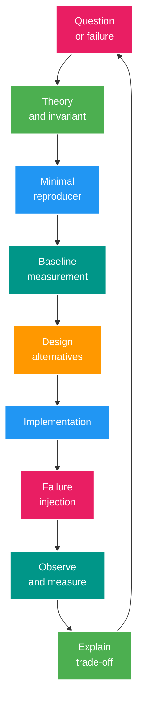

# Roadmap Senior Java Backend Interview Lab

> Canonical learning roadmap<br>
> Cập nhật: 2026-07-25<br>
> Hiện trạng chi tiết: [002_CURRENT_STATE_AND_GAP_ANALYSIS.md](002_CURRENT_STATE_AND_GAP_ANALYSIS.md)<br>
> Hệ thống làm việc với Codex: [003_AI_AGENT_ENGINEERING_SYSTEM.md](003_AI_AGENT_ENGINEERING_SYSTEM.md)

## 1. North star

Mục tiêu của project không phải là hoàn thành nhiều endpoint. Mục tiêu là có thể làm đủ bốn việc với các bài toán Backend Senior:

1. Giải thích bản chất và invariant bằng lý thuyết chính xác.
2. Tái hiện failure bằng test hoặc experiment nhỏ.
3. Triển khai một hoặc nhiều solution và đo được kết quả.
4. Bảo vệ trade-off trong phỏng vấn bằng code, query plan, metric và incident evidence.

Domain livestream chỉ là bối cảnh nhất quán để nối các chủ đề Java Core, Spring Boot, transaction, concurrency, security, PostgreSQL, Redis, Kafka, microservice và solution architecture.

## 2. Nguyên tắc điều hướng

- Giữ một deployable **modular monolith** cho tới khi module boundary, traffic và failure mode chứng minh cần tách service.
- Feature là phương tiện tạo case; không lấy CRUD coverage làm KPI.
- Học consistency trong một process và một database trước khi mở rộng sang distributed consistency.
- RabbitMQ và Kafka phải giải hai bài toán khác nhau hoặc được dùng trong experiment so sánh; không thêm broker để trang trí CV.
- Index, replica, partition và shard chỉ được thêm sau khi có workload, query và số liệu baseline.
- Production concerns xuất hiện từ case đầu: log an toàn, metric, test và recovery không bị dồn vào phase cuối.
- Mỗi case có một hypothesis đo được, một failure scenario và một exit gate.
- Không tự gọi một capability là `DONE`; dùng maturity M0-M4 trong [current-state assessment](002_CURRENT_STATE_AND_GAP_ANALYSIS.md#6-maturity-model-dùng-cho-project).

### 2.1. Thang ưu tiên năng lực

Priority dưới đây đo **độ quan trọng đối với năng lực Senior Java Backend**, không phải defect/incident severity hay thứ tự tự động triển khai case. Dependency, case đang active và bằng chứng còn thiếu vẫn quyết định thứ tự học thực tế.

| Priority | Ý nghĩa | Độ sâu tối thiểu |
| --- | --- | --- |
| **P0 - Essential** | Không thể bỏ qua với Senior Java Backend ở hầu hết môi trường | Giải thích từ first principles, debug failure, triển khai được và bảo vệ trade-off bằng evidence |
| **P1 - High** | Gặp thường xuyên trong backend production; thiếu sẽ tạo lỗ hổng năng lực đáng kể | Thiết kế được, có ít nhất một case/lab thực tế và biết failure/operations |
| **P2 - Contextual** | Quan trọng tùy quy mô, domain hoặc platform của công ty | Biết khi nào cần, chọn/loại phương án có lý do; implementation có thể là lab nhỏ |
| **P3 - Specialization** | Hữu ích cho vị trí/chuyên môn cụ thể, không phải baseline chung | Có vocabulary chính xác, decision criteria và biết giới hạn để không over-engineer |

Độ sâu kiến thức dùng thang riêng: **D1 - nhận diện đúng**, **D2 - giải thích/so sánh**, **D3 - áp dụng, tái hiện và debug bằng evidence**, **D4 - dẫn dắt, teach-back và tiến hóa quyết định qua nhiều constraint**. Thang D1-D4 không thay maturity M0-M4 của implementation đang chạy. Tiêu chí tự đánh giá đầy đủ theo từng capability nằm trong [Knowledge Depth Rubric](learning/knowledge-depth-rubric.md).

Quy tắc coverage: P0 phải đạt ít nhất D3; P1 nên đạt D2-D3; P2 đạt D1-D2 theo mục tiêu phỏng vấn; P3 chỉ học khi job description hoặc case thực tế yêu cầu. Một tên công nghệ không tự tạo coverage nếu chưa có câu hỏi, failure scenario và evidence.

### 2.2. Biên coverage và cách rà soát lại

Roadmap này đặt baseline cho **Senior Java Backend có thể tiến tới Solution Architect**, không cố biến một người thành đồng thời DBA, security specialist, SRE và platform engineer. P0/P1 là core coverage; P2/P3 được chọn theo job description, domain, quy mô hệ thống và khoảng trống evidence của người học.

Rà soát lại ma trận mỗi quý hoặc trước một vòng phỏng vấn: đối chiếu job description, phiên bản Java/Spring được hỗ trợ, incident/case mới và maturity M0-M4. Công nghệ mới chỉ được thêm khi nó đại diện cho capability hoặc trade-off chưa có; công nghệ cũ được thay thế bằng decision/evidence mới thay vì giữ vì quán tính.

### 2.3. Đích theo level phỏng vấn

- **Senior Java Backend:** toàn bộ P0 đạt D3 và các P1 sát job description đạt ít nhất D2; có thể tự triển khai, debug và vận hành một vertical slice production.
- **Senior+ / Solution Architect:** ngoài baseline Senior, các năng lực distributed systems, security, reliability, data, capacity/cost và evolution đạt D3-D4; bảo vệ được quyết định liên team và failure domain.
- **Expert theo domain:** giữ breadth ở baseline Senior nhưng chọn một đến hai năng lực đạt D4 bằng incident, benchmark, source-level/runtime analysis hoặc production-scale evidence. Không yêu cầu “expert mọi stack”.

## 3. Learning loop chuẩn cho mọi case



Một case không hoàn thành nếu chỉ có code. Dùng [Learning Case Template](templates/learning-case-template.md) để lưu toàn bộ vòng lặp.

## 4. Bản đồ năng lực

| Năng lực | Priority | Độ sâu đích | Case/chủ đề chính trong domain | Bằng chứng phải tạo |
| --- | --- | --- | --- | --- |
| Java language, collections, algorithm và complexity | P0 | D3 | Java 17-to-21/25 release policy, final/preview/incubator boundary, value object tiền, equality/hash, collection choice, heap/queue, Big-O trên hot path | Compatibility matrix, unit/property test, complexity và memory trade-off |
| Object-oriented design và refactoring | P0 | D3 | encapsulation, composition/polymorphism, coupling/cohesion, SOLID heuristic, state/strategy/adapter/decorator | Refactoring diff, characterization/invariant test và ADR giải thích cả anti-pattern |
| JVM runtime và diagnostics | P0 | D3 | class loading, bytecode awareness, heap/off-heap, allocation, JIT, safepoint, G1/ZGC | JFR/GC log, heap/thread dump, profiling report và tuning hypothesis |
| Concurrency, JMM và async model | P0 | D3 | start webhook đồng thời, wallet deduct, executor, virtual thread, reactive/backpressure | Race test lặp lại, happens-before timeline, contention/throughput metric |
| Spring Framework và Spring Boot | P0 | D3 | IoC lifecycle, proxy/AOP, MVC pipeline, validation, configuration, auto-configuration | Slice/context test có mục tiêu, condition report, architecture test |
| HTTP, API design và network fundamentals | P0 | D3 | method/status/cache semantics, idempotency, pagination, versioning, compatibility, TLS/DNS/TCP/proxy/LB | Contract test, packet/request timeline, compatibility và client-failure test |
| Transaction và data consistency | P0 | D3 | rollback, propagation, isolation, after-commit side effect | Integration test từng anomaly, transaction/crash timeline |
| Security và identity | P0 | D3 | JWT/session, OAuth2/OIDC, webhook HMAC, RBAC/ownership, OWASP API risks, secrets | Threat model, negative test, dependency/security scan, audit log đã redact |
| PostgreSQL, SQL và data modeling | P0 | D3 | schema/normalization, join/aggregation/window/CTE, set-based DML, MVCC, lock, index, cursor, constraint, deadlock, pool | Flyway migration, dataset, SQL test, `EXPLAIN (ANALYZE, BUFFERS)`, lock/pool evidence |
| Testing và quality strategy | P0 | D3 | unit, property, slice, module, integration, contract, concurrency, load, fault | Risk-based test pyramid, mutation/coverage interpretation và CI artifact |
| Observability, reliability và incident response | P0 | D3 | structured log, metric cardinality, trace-context propagation, sampling/telemetry cost, SLI/SLO, alert, capacity, graceful degradation | Dashboard, actionable alert, telemetry budget, runbook, incident timeline/postmortem |
| Distributed systems fundamentals | P0 | D3 | partial failure, timeout/retry budget, retry storm, circuit breaker/bulkhead/load shedding, consistency model, time/clock, CAP/PACELC, coordination, backpressure | Fault-injection matrix, sequence/timeline, saturation metric, consistency và recovery decision |
| Solution architecture | P0 | D3 | Little's Law/queueing, concurrency budget, headroom, bottleneck, HA, DR, security, cost, evolution | Capacity sheet, architecture dossier và phiên trình bày 2/15/45 phút |
| Technical leadership và delivery | P0 | D3 | code review, ADR, incident leadership, mentoring, prioritization, stakeholder trade-off | Review record, ADR, postmortem và STAR/teach-back story có evidence |
| Redis | P1 | D3 | cache-aside, TTL, stampede, HLL, ZSET, rate limit, lock | Key schema, hit ratio, degraded-mode test, recovery policy |
| RabbitMQ/Kafka và event-driven workflow | P1 | D3 | queue/log, partition/order, ACK/offset, retry/DLQ, outbox/inbox, saga | Contract, duplicate/crash/replay experiment, lag/queue metric |
| Domain modeling và modular architecture | P1 | D3 | bounded context, aggregate invariant, module API/data owner, state machine | Context/module map, architecture test, ADR và invariant test |
| Git, Linux, container, build và CI/CD | P1 | D2-D3 | diff/history/bisect/revert, process/thread/socket/FD, cgroup, Maven/BOM, image, probe, resource limit, rollout | Reproducible build, SBOM, container/runtime evidence, rollback drill |
| Data operations và lifecycle | P1 | D2-D3 | safe migration, backup/restore/PITR, replica, retention, partition | Migration rehearsal, restore evidence, lag/pruning report, RPO/RTO |
| Microservice architecture | P1 | D2-D3 | service boundary, contract, data ownership, resilience | Extraction scorecard, contract test, distributed trace |
| Cloud/Kubernetes/IaC | P2 | D1-D2 | workload/probe/resource/autoscaling, IAM/secret, managed service, IaC | Deployment lab hoặc design review; cost/failure/lock-in trade-off |
| Storage selection ngoài RDBMS | P2 | D1-D2 | search index, object storage, document/key-value/columnar use case | Decision matrix theo access pattern, consistency, operation và cost |
| Reactive programming/WebFlux | P2 | D1-D2 | MVC vs virtual threads vs Reactor, non-blocking I/O và backpressure | Benchmark đúng workload, thread/context trace, decision record |
| gRPC/GraphQL, native image và platform-specific stack | P3 | D1 | chỉ thêm khi contract, latency, startup hoặc target role chứng minh cần | Spike nhỏ và ADR nêu rõ benefit, constraint, operational cost |

## 5. Roadmap theo stage

Roadmap có thứ tự dependency nhưng không có deadline cố định. Mỗi lần chỉ active một learning case chính; mỗi case phải tự sở hữu test/observability evidence liên quan. `TEST-01` là ngoại lệ bootstrap một lần để tạo hermetic harness cho các case sau; `OBS-01` chỉ được active khi có một instrumentation/failure hypothesis hẹp, không phải side project dựng dashboard chung chung.

### Stage 0 - Stabilize the laboratory

**Câu hỏi trung tâm:** Làm sao biết một thay đổi đúng và có thể tái lập?

**Ưu tiên đầu tiên:** đưa build/runtime về Java 21 LTS có evidence trước khi thêm implementation mới. Java 21 mở đường cho virtual threads và các capability hiện đại, nhưng virtual threads là lab/decision có measurement; không phải default configuration.

Thực hiện:

- `JDK-01`: audit declared JDK, Maven/CI/runtime/container compatibility; chuyển baseline project sang Java 21, chạy compile/test/startup evidence và đánh giá virtual threads bằng workload + JFR;
- sau Java 21 baseline và safety net, chạy `JDK-02` decision gate cho JDK 25 + exact Spring Boot/BOM candidate; gate phải kết thúc bằng `MIGRATE_NOW` hoặc `TIME_BOXED_DEFERRED` có owner/revisit date, compatibility matrix, regression và rollback plan;
- sửa các correctness/security defect đang chặn Stage 0 về token type, auth matcher, session cache, stream-key exposure và hardening shared-secret webhook;
- tách `dev`, `test`, `prod` configuration; không để dev/test endpoint tự xuất hiện trong production;
- dùng Flyway làm nguồn schema versioned;
- dùng Testcontainers cho PostgreSQL, Redis và broker cần thiết;
- khóa JDK, Maven Wrapper, plugin và dependency management/BOM trong CI; compile và test không phụ thuộc máy developer;
- thực hành Git diff/history, conflict resolution, revert và bisect trên change nhỏ; commit phải review/rollback được;
- hiểu dependency mediation, kiểm tra dependency convergence; tạo SBOM và dependency/CVE scan có policy xử lý finding thay vì chỉ sinh report;
- tạo test data builder, deterministic clock/ID seam và test naming convention;
- thêm correlation ID và log-redaction baseline;
- tạo ADR đầu tiên và learning case đầu tiên.

**Exit gate**

- Java 21 là declared/toolchain/CI/runtime baseline nhất quán; Java 25 + target Spring Boot line có compatibility decision rõ, không phải assumption hoặc backlog treo vô hạn.
- Virtual-thread mode được `enabled` hoặc `deferred` bằng workload/JFR evidence; không có claim performance chỉ từ feature flag.
- Các defect chặn Stage 0 đều có regression test.
- Test chạy trên máy sạch không cần database có sẵn.
- `ddl-auto` không âm thầm thay schema.
- CI xuất kết quả test, SBOM và security finding; không có secret trong log.
- Có thể giải thích dependency nào được chọn, vì sao và cách rollback một dependency upgrade lỗi.

### Stage 1 - Java Core, state và concurrency

**Câu hỏi trung tâm:** Điều gì thực sự atomic và điều gì chỉ trông có vẻ atomic?

Case:

1. Chuyển stream lifecycle thành state machine `CREATED -> LIVE -> ENDED`.
2. Gửi hai webhook start/end đồng thời và chứng minh transition invariant.
3. Thiết kế `Money`/amount value object bằng `BigDecimal`, scale và rounding rõ ràng.
4. Tái hiện lost update khi 100 request deduct cùng wallet.
5. So sánh optimistic lock, pessimistic lock và conditional SQL update.
6. Phân tích `synchronized`, `Lock`, atomic class, executor, `CompletableFuture`, ThreadLocal và Java Memory Model trong đúng context case.
7. Ôn generics/type erasure, immutability, exception contract, records/sealed classes, Stream API và equality/hash contract bằng code nhỏ có test.
8. Chọn collection/data structure bằng access pattern và Big-O: array/list, hash/tree, set/map, heap/priority queue, deque; phân tích CPU-memory trade-off thay vì học thuộc API.
9. Refactor theo encapsulation, composition/polymorphism, coupling/cohesion và SOLID như heuristic; so sánh state/strategy/adapter/decorator với phương án đơn giản hơn.
10. Xử lý time zone/clock, locale, money/rounding, null/optional và serialization compatibility tại domain boundary.
11. JVM lab: class loading/linking/initialization, stack/heap/metaspace/direct memory, allocation/GC roots, JIT/warm-up, safepoint, G1 và ZGC.
12. Chẩn đoán CPU spike, allocation pressure, memory leak, deadlock và thread starvation bằng JFR, GC log, heap/thread dump trước khi tuning.

Java 21 là baseline target đầu tiên của project và là prerequisite trước implementation mới. Java 17 chỉ là current declared state cho tới khi `JDK-01` đóng. JDK 25 là latest LTS tại thời điểm cập nhật roadmap; Spring Boot 3.4.13 công bố compatibility tới Java 24, Spring Boot 3.5.16 tới Java 25 và current Spring Boot 4.1.0 tới Java 26. Vì vậy `JDK-02` phải pin exact candidate/BOM được re-check tại lúc active thay vì ghi chung “3.5/4.x”, mặc định JDK 25 không dùng được hoặc nâng thẳng cả platform không cần regression plan. Virtual threads chỉ bật sau blocking-I/O benchmark và JFR/pinning check; không nâng version chỉ để dùng keyword mới và không dùng virtual thread như cách tăng tốc workload CPU-bound.

**Exit gate**

- Race test lặp nhiều lần vẫn giữ invariant.
- Có giải thích happens-before, visibility, atomicity và contention bằng timeline cụ thể.
- Chọn lock strategy dựa trên conflict rate và số liệu, không dựa trên sở thích.
- Giải thích được complexity và memory behavior của collection/algorithm đã chọn trên hot path.
- Có ít nhất một JVM diagnostic report nối triệu chứng với allocation, GC, lock/thread hoặc code path cụ thể.
- Phân biệt được platform thread, virtual thread và reactive model theo workload, backpressure, debugging và ecosystem constraint.

### Stage 2 - Spring internals, HTTP API và transaction semantics

**Câu hỏi trung tâm:** Transaction boundary thực sự nằm ở đâu?

Case:

- IoC lifecycle, bean scope, dependency cycle, configuration properties, auto-configuration/condition và startup failure;
- request đi qua servlet container, filter, Spring Security chain, `DispatcherServlet`, interceptor, argument resolver, validation, exception handler và message converter;
- HTTP method/status/cache semantics, safe/idempotent operation, conditional request, idempotency key và error contract;
- API evolution: cursor pagination, versioning, backward/forward compatibility, deprecation, quota và contract test;
- HTTP client: DNS/connect/TLS/read/write/pool timeout, cancellation, retry budget và connection-pool exhaustion;
- tái hiện retry storm/cascading failure; so sánh bounded retry với backoff+jitter, circuit breaker, bulkhead, admission control và load shedding;
- chọn Spring MVC, MVC + virtual threads hoặc WebFlux/Reactor bằng workload và benchmark; không trộn blocking call vào reactive path mà không kiểm soát;
- `@Transactional` proxy, self-invocation, rollback rule và exception translation;
- propagation `REQUIRED`, `REQUIRES_NEW`, nested behavior và timeout;
- isolation anomalies trên PostgreSQL: non-repeatable read, phantom-like behavior, write skew/lost update;
- DB commit và Redis update: dùng after-commit, cache invalidation hoặc event-driven projection;
- controller validation, service invariant, repository constraint và global exception contract;
- transaction quá dài, connection-pool exhaustion và remote call bên trong transaction.

**Exit gate**

- Mỗi claim về propagation/isolation có integration test.
- Không có Redis/broker side effect được mô tả sai là atomic với database.
- Có sequence diagram cho commit, rollback và crash window.
- Có thể lần một request qua đúng Spring pipeline và chứng minh một auto-configuration được bật/tắt vì condition nào.
- API có compatibility/idempotency/client-failure test, không chỉ happy-path controller test.

### Stage 3 - PostgreSQL: model, index và query engineering

**Câu hỏi trung tâm:** Query chậm vì dữ liệu, query shape, index hay concurrency?

Case:

- xây wallet + immutable ledger, constraint bảo vệ balance/invariant;
- schema modeling: key, normalization/denormalization, nullability, temporal/audit data và aggregate invariant;
- viết SQL set-based có join, aggregation, window function và CTE; đọc query shape trước khi đổ lỗi cho ORM hoặc thêm index;
- JPA persistence context, dirty checking, flush, batching, fetch strategy/projection và query boundary;
- sửa manual N+1 của stream list bằng projection/batch query và đo query count;
- cursor pagination cho stream/history thay unbounded `findAll`;
- B-tree/composite/covering/partial index; column order, selectivity và write amplification;
- đọc `EXPLAIN (ANALYZE, BUFFERS)`, statistics, scan type và row-estimation error;
- MVCC, vacuum, bloat, lock wait, deadlock và retry có giới hạn;
- unique constraint/idempotency key như concurrency primitive;
- connection-pool sizing theo DB capacity và transaction time; tái hiện pool exhaustion;
- Flyway migration theo expand-contract, lock/scan risk, rollback/roll-forward và zero/low-downtime compatibility.

**Exit gate**

- Dataset đủ lớn để query plan có ý nghĩa.
- Có before/after plan và latency distribution, không chỉ một con số trung bình.
- Mỗi index có query owner và chi phí ghi được ghi nhận.
- Migration được rehearsal trên dataset đại diện và tương thích ít nhất hai phiên bản application khi rollout yêu cầu.

### Stage 4 - Redis as a distributed data structure

**Câu hỏi trung tâm:** Nếu Redis sai, chậm hoặc biến mất thì business invariant còn đúng không?

Case:

- session cache: TTL, revoke-all, negative cache và security-sensitive validation;
- cache-aside với invalidation sau commit;
- cache stampede: single-flight/local lock, distributed lock, TTL jitter và stale-while-revalidate;
- rate limiting bằng token bucket/sliding window và Lua atomicity;
- current viewers bằng ZSET heartbeat; unique viewers bằng HyperLogLog;
- leaderboard bằng Sorted Set và rebuild từ PostgreSQL/event log;
- distributed lock với ownership token, expiry và fencing discussion;
- Redis unavailable, serialization migration và versioned key.

**Exit gate**

- PostgreSQL vẫn là source of truth cho durable invariant.
- Key, value type, TTL, cardinality và invalidation owner được document.
- Có failure test khi Redis timeout/down và metric hit/miss/error.

### Stage 5 - Messaging fundamentals: RabbitMQ và Kafka

**Câu hỏi trung tâm:** Queue, durable event log và business idempotency khác nhau thế nào?

Giữ RabbitMQ cho case command/work queue có ACK, retry và DLQ. Thêm Kafka cho domain-event stream cần partition ordering, consumer group, retention và replay. Trước khi giữ cả hai trong kiến trúc chính, phải có ADR chứng minh chi phí vận hành là hợp lý.

Kafka labs:

- topic/partition/offset/consumer group và partition-key selection;
- ordering chỉ trong partition và hậu quả của hot key;
- at-most-once, at-least-once, idempotent processing và phạm vi của exactly-once;
- manual offset, crash trước/sau DB commit, retry topic và poison message;
- consumer rebalance, lag, backpressure, schema evolution và replay;
- retention/compaction và event versioning.

RabbitMQ labs:

- exchange/routing key, publisher confirm, manual ACK/NACK;
- prefetch, competing consumers, retry/backoff, DLQ và replay;
- consumer xử lý xong nhưng crash trước ACK.

**Exit gate**

- Có decision matrix RabbitMQ vs Kafka theo semantics, không theo độ phổ biến.
- Duplicate, out-of-order, poison message và broker outage đều có test/runbook.
- Event contract không dùng JPA entity làm payload.

### Stage 6 - Reliable event-driven workflow

**Câu hỏi trung tâm:** Làm sao đóng crash window của dual write?

Capstone: gift purchase và wallet settlement.

```text
API request
  -> DB transaction: idempotency + ledger + gift + outbox
  -> publisher/CDC: outbox -> broker
  -> consumer: inbox/dedup -> projection/notification
  -> ACK/offset commit sau durable processing
```

Học và triển khai:

- transactional outbox; polling publisher trước, CDC là experiment nâng cao;
- inbox/dedup table, idempotent consumer và idempotency window;
- ordering key, optimistic conflict và retry budget;
- saga choreography/orchestration, compensation và semantic rollback;
- DLQ quarantine, replay authorization và audit;
- schema compatibility và event versioning.

**Exit gate**

- Kill process tại từng crash point vẫn không mất durable intent và không double-spend.
- Có invariant query đối soát ledger, gift và event processing.
- Trace/correlation ID nối request, outbox, broker và consumer.

### Stage 7 - Realtime, security và abuse resistance

**Câu hỏi trung tâm:** Realtime path bảo vệ state và tài nguyên như thế nào?

Case:

- phân biệt authentication, authorization, delegation và federation; OAuth2/OIDC role, authorization code + PKCE, token audience/scope, key rotation và logout/revocation boundary;
- đặt custom session-backed JWT hiện tại cạnh chuẩn OAuth2/OIDC để giải thích khi nào tự xây là phù hợp và khi nào phải dùng authorization server/identity provider;
- WebSocket/STOMP auth ở CONNECT, SUBSCRIBE và SEND;
- ownership/ban/mute check, reconnect, duplicate message và token expiry;
- slow consumer, bounded queue, backpressure và message-size limit;
- webhook HMAC, timestamp window, nonce/event ID và secret rotation;
- per-user/room/IP rate limit, abuse signal và audit log;
- threat model theo asset, trust boundary và attacker story;
- OWASP/API risks: broken object/function authorization, mass assignment/property binding, injection, SSRF, unsafe deserialization, resource exhaustion và security misconfiguration;
- CORS, CSRF, SameSite/cookie, TLS termination/proxy header trust, secret lifecycle và least-privilege service identity;
- adaptive password hashing và migration, account enumeration, brute-force/credential stuffing, recovery và MFA boundary; không tự xây authorization server chỉ để có keyword OAuth2;
- software supply chain: trusted artifact/repository, SBOM, dependency/CVE response, build provenance và secret scanning.

**Exit gate**

- Negative authorization test tồn tại ở HTTP, WebSocket và webhook.
- Load test chứng minh behavior khi client chậm hoặc reconnect storm.
- Token, stream key, webhook secret và payload nhạy cảm không xuất hiện trong log.
- Có protocol/threat timeline cho login, token refresh/rotation/replay, key rotation và compromised credential.
- Mỗi finding từ dependency/security scan có owner, severity rationale và remediation/acceptance record.

### Stage 8 - Observability, testing, runtime và delivery engineering

**Câu hỏi trung tâm:** Khi production chậm hoặc sai, bằng chứng đầu tiên nằm ở đâu?

Thực hiện xuyên suốt rồi chuẩn hóa tại stage này:

- structured JSON log, correlation/trace ID và sampling/redaction;
- kiểm soát metric cardinality, trace-context propagation qua async/broker, sampling, telemetry overhead/cost và PII;
- Actuator + Micrometer metrics, Prometheus/Grafana local stack;
- OpenTelemetry trace cho HTTP, JDBC, Redis và broker;
- SLI/SLO: availability, latency, error rate, consumer lag và queue depth;
- unit, slice, module, integration, contract, concurrency, load và fault test;
- k6/Gatling workload; JFR, GC log, thread dump và connection-pool analysis;
- Linux/runtime diagnostics: process/thread, signal, socket/file descriptor, DNS/TCP/TLS, proxy/load balancer và cgroup CPU/memory behavior;
- container image tối thiểu, non-root runtime, immutable configuration, startup/readiness/liveness semantics và graceful shutdown/drain;
- CPU/memory request-limit, JVM container awareness, OOM kill/throttling và autoscaling signal;
- CI/CD quality gate, artifact promotion, database compatibility, rolling/blue-green/canary deployment và rollback;
- incident drills: DB slow, Redis down, broker unavailable, poison message, replica lag, bad deploy và resource exhaustion.

**Exit gate**

- Một alert có runbook và được kích hoạt bằng fault injection.
- Có p50/p95/p99, throughput, saturation và error rate cho hot path.
- Có thể lần theo một gift request xuyên các component bằng trace/correlation ID.
- Phân biệt đúng startup/readiness/liveness; graceful shutdown không làm mất request/message đang xử lý.
- Có deployment/rollback rehearsal và chứng minh behavior dưới CPU throttling, OOM hoặc exhausted file/socket/connection resource.

### Stage 9 - Primary/replica, partitioning và data lifecycle

**Câu hỏi trung tâm:** Scale read/data mà không phá consistency như thế nào?

Case primary/replica:

- dựng local primary + hot standby chỉ sau khi query baseline ổn định;
- read/write routing và transaction `readOnly` không được coi là consistency guarantee;
- đo replication lag; tái hiện read-after-write trả stale data;
- sticky-primary/consistency token/lag threshold cho use case cần read-your-writes;
- sync vs async replication, failover, connection pool và recovery objective.

Case partitioning:

- chọn ledger/chat/audit table có retention và time-range query rõ ràng;
- range partition theo thời gian, partition pruning, local index và maintenance;
- benchmark trước/sau; ghi nhận planning overhead và constraint/unique-key caveat;
- detach/archive/drop partition và retention job;
- sharding chỉ làm architecture exercise sau khi single-node + replica + partition không đủ.

Case data operations:

- backup strategy theo dữ liệu và RPO/RTO; phân biệt logical backup, physical/base backup và WAL archive;
- thực hành restore/PITR vào môi trường cô lập rồi đối soát invariant, không coi “backup job thành công” là bằng chứng restore được;
- retention, archive, legal/privacy deletion và restore dependency được ghi rõ;
- failover/failback, split-brain risk, credential/DNS/pool refresh và application recovery sau role change.

**Exit gate**

- Có lag/stale-read reproducer và policy theo từng endpoint.
- Partition key đến từ query/retention pattern, không từ phỏng đoán.
- Có RPO/RTO và failover runbook tối thiểu.
- Có restore/PITR evidence với thời gian thực tế, phạm vi dữ liệu mất và invariant sau recovery.

### Stage 10 - Modular monolith to microservices

**Câu hỏi trung tâm:** Nỗi đau nào đủ lớn để trả chi phí distributed system?

Trước khi tách:

- xác định bounded context, ubiquitous language, aggregate/invariant và transaction boundary; DDD là công cụ làm rõ model chứ không phải yêu cầu tạo đủ mọi tactical pattern;
- chuyển package-by-feature: `identity`, `stream`, `wallet`, `gift`, `chat`, `analytics`, `admin`, `shared`;
- định nghĩa module API, data owner và domain event;
- dùng architecture test hoặc Spring Modulith để phát hiện dependency vi phạm;
- đo coupling, deployment cadence, scaling profile và blast radius.

Service extraction đầu tiên nên là capability ít nằm trên strong-consistency path, ví dụ analytics hoặc notification. Không tách identity/wallet đầu tiên chỉ để có nhiều service.

Sau khi tách, học:

- failure model của distributed system: partial failure, unbounded delay, duplicate/reorder, clock skew và network partition;
- consistency model, quorum/leader/consensus awareness, CAP/PACELC và read/write guarantee theo từng use case; không dùng theorem như khẩu hiệu;
- service-owned data, API/event contract và compatibility;
- timeout, retry budget, circuit breaker, bulkhead và load shedding;
- service discovery/gateway chỉ khi topology cần;
- distributed trace, deployment độc lập và contract test;
- saga/outbox thay distributed transaction;
- canary/rollback, config/secret management và operational cost.

**Exit gate**

- Có extraction scorecard và ADR chỉ ra cả phương án không tách.
- Service tách ra có test contract, dashboard, runbook và owner dữ liệu.
- Chứng minh được lợi ích độc lập về scale/deploy/blast radius lớn hơn chi phí network/operation.
- Mỗi remote interaction có failure/timeout/retry/idempotency/backpressure policy và consistency expectation tường minh.

### Stage 11 - Solution architecture capstones

Mỗi capstone phải có assumption, Little's Law/queueing hoặc capacity math phù hợp, concurrency budget, saturation/headroom, bottleneck, failure domain, consistency, security, cost và evolution path.

1. Livestream 100 nghìn concurrent viewers, chat fan-out và reconnect storm.
2. Gift sale spike với wallet invariant và event backlog.
3. Multi-region read, single-writer hoặc regional ownership; phân tích RPO/RTO.
4. Hot streamer/hot partition và celebrity problem.
5. Analytics near-real-time từ Kafka, replay và backfill.
6. Ban user toàn hệ thống: session, cache, WebSocket, event và audit.
7. Chọn PostgreSQL, Redis, search index, object storage hoặc columnar store theo access pattern, consistency, retention, scale, recovery, operation và cost.
8. Thiết kế public API qua DNS/TLS/CDN/load balancer/gateway; phân tích connection, timeout, cache, quota, DDoS boundary và multi-region traffic.
9. Chọn cloud managed service/Kubernetes/self-managed và IaC theo team capability, compliance, portability, failure domain, observability và total cost of ownership.

Mỗi bài chuẩn bị ba phiên bản trình bày: 2 phút, 15 phút và 45 phút.

### Stage 12 - Technical leadership và delivery

Đây là track xuyên suốt, được tổng kết sau các capstone; không chờ đến cuối mới bắt đầu ghi evidence.

- review một change theo correctness, security, compatibility, operability, test gap và blast radius; phân biệt blocker với suggestion;
- viết ADR ngắn, nêu context, constraint, options, decision, consequence và trigger cần revisit;
- dẫn dắt incident drill: triage, giao tiếp, mitigation, recovery, timeline và blameless postmortem có action owner;
- quản lý technical debt và roadmap theo risk/value/dependency; chia delivery thành increment rollback được;
- mentoring/teach-back, đặt câu hỏi để phát hiện mental model sai và đưa feedback có thể hành động;
- chuẩn bị behavioral story theo STAR/CAR cho conflict, failure, ownership, influence without authority và quyết định có trade-off;
- giao tiếp architecture cho developer, product, security và operations ở độ sâu phù hợp.

**Exit gate**

- Có ít nhất ba evidence story lấy từ learning case thật, không phải câu trả lời chung chung.
- Một review/ADR/postmortem cho thấy quyết định, dữ liệu, owner và follow-up đã đóng vòng lặp.
- Có thể teach-back một P0 topic trong 15 phút và xử lý follow-up ở mức Senior/Solution Architect.

## 6. Case backlog ưu tiên

Priority đo importance của năng lực/evidence theo mục 2.1; **không phải số thứ tự chạy**. Backlog dùng năm loại artifact để tránh biến mọi chủ đề thành feature:

- `CASE`: một failure/invariant của project, thường có implementation;
- `LAB`: một workload/hypothesis hẹp, kết thúc bằng số đo hoặc diagnostic;
- `DECISION`: compatibility/architecture gate kết thúc bằng quyết định, owner và trigger revisit;
- `CAPSTONE`: bài thiết kế có assumption, capacity/failure/cost và defense, không bắt buộc sửa application;
- `TRACK`: evidence tích lũy xuyên nhiều case, không được active như một feature độc lập.

Mỗi `CASE`/`LAB` vẫn đi đủ `theory -> deep-dive -> question bank -> reproducer -> decision -> implementation/experiment -> evidence -> review -> teach-back`. Chỉ tạo artifact/folder khi item được active; backlog không phải yêu cầu scaffold hàng loạt.

### 6.1. Execution queue hiện tại

Queue canonical được chia thành wave để chỉ **item đầu tiên chưa đóng** là next actionable:

| Wave | Sequence | Mục tiêu trước khi sang wave sau |
| --- | --- | --- |
| F0 - Platform/safety net | `JDK-01 -> TEST-01 -> JDK-02 decision gate -> MIG-01 -> CFG-01` | Build/runtime/test/schema/profile tái lập; latest-LTS decision có owner |
| C1 - Current P0 security | `SEC-01 -> SEC-06 -> SEC-02 -> SEC-03 -> SEC-05` | Token, matcher, cache revocation, secret và webhook trust boundary có negative test |
| C2 - Core correctness | `SPR-01 -> CON-01 -> TX-01 -> WAL-01 -> DB-01` | Spring/transaction/state/money invariant đúng trước khi tối ưu query |

- `JDK-01` đứng đầu vì POM vẫn khai báo Java 17, runtime evidence từng là Java 22 và người học ưu tiên Java 21/virtual threads. Trước khi đổi baseline, case phải chụp compile/test/startup hiện tại bằng smoke test sẵn có; kết quả chỉ là M1 platform characterization, không được gọi là functional safety net.
- `TEST-01` tạo hermetic safety net trước `JDK-02`, schema/security behavior và mọi implementation tiếp theo; không phủ nhận giới hạn evidence được chấp nhận riêng trong JDK-01 bootstrap.
- `JDK-02` là **decision gate**, không phải nâng cấp mặc định: kết thúc bằng `MIGRATE_NOW` hoặc `TIME_BOXED_DEFERRED` có owner/revisit date. Matrix phải pin exact patch/BOM được xác minh tại lúc active; candidate tham chiếu ở snapshot này là Spring Boot 3.5.16 hoặc 4.1.0, không phải nhãn chung “3.5/4.x”. Một quyết định defer rõ ràng không được chặn các correctness case.
- `MIG-01` làm sạch schema bootstrap bằng Flyway trên database rỗng trước các case tạo thêm durable state.
- `CFG-01` tách dev/test controller, Swagger, seed/default secret và diagnostic logging khỏi production context bằng profile/conditional-bean/fail-fast test.
- `SEC-01` chỉ đóng token-purpose confusion; `SEC-06`, `SEC-02`, `SEC-03` và `SEC-05` lần lượt đóng public matcher, cache revocation, secret exposure và webhook replay thay vì gộp nhiều trust boundary vào một case.
- Correctness đi trước performance: Spring/transaction boundary, state transition, DB-Redis consistency và wallet invariant đứng trước N+1/pagination.

Sau `DB-01`, chọn lane kế tiếp theo P0/P1 depth gap và job description gần nhất; không coi toàn bộ bảng dưới đây là một chuỗi phải chạy máy móc.

### 6.2. Backlog catalog theo lane

| Lane | ID | Scope hẹp / activation rule | Kind | Stage | Priority |
| --- | --- | --- | --- | --- | --- |
| Foundation | [JDK-01](learning/cases/jdk-01-java21-platform-baseline.md) | Java 21 baseline, toolchain drift và virtual-thread decision | CASE/LAB | 0/1 | P0 |
| Foundation | TEST-01 | One-time bootstrap: hermetic integration test bằng Testcontainers và risk-based boundary | CASE | 0 | P0 |
| Foundation | JDK-02 | JDK 25 + exact supported Spring Boot/BOM candidate; migrate-now hoặc time-boxed defer | DECISION | 0/1 | P1 |
| Foundation | MIG-01 | Flyway baseline và clean-database bootstrap; không gộp online migration/PITR | CASE | 0/3 | P0 |
| Foundation | CFG-01 | Dev/test/prod profile isolation, public diagnostic surface, default secret và production fail-fast | CASE | 0/7/8 | P0 |
| Correctness | [SEC-01](learning/cases/sec-01-access-vs-refresh-token.md) | Access token vs refresh token confusion; prerequisite lấy từ execution queue/cursor | CASE | 0 | P0 |
| Correctness | SEC-06 | Public/private URL matcher và method-authorization boundary | CASE | 0 | P0 |
| Correctness | SEC-02 | Logout-all với stale Redis session | CASE | 0/4 | P0 |
| Correctness | SEC-03 | Stream-key/secret exposure, audience DTO và log redaction | CASE | 0/7 | P0 |
| Correctness | SEC-05 | Webhook HMAC, timestamp/event ID, replay và secret rotation | CASE | 0/7 | P0 |
| Correctness | SPR-01 | Bean/proxy/AOP, request pipeline và `@Transactional` self-invocation failure | CASE/LAB | 2 | P0 |
| Correctness | CON-01 | Concurrent stream state transition | CASE | 1/2 | P0 |
| Correctness | TX-01 | DB commit vs Redis side effect và crash window | CASE | 2/4 | P0 |
| Correctness | WAL-01 | Lost update và ledger invariant | CASE | 1/3 | P0 |
| Correctness | DB-01 | Manual N+1, cursor pagination và before/after query plan | CASE/LAB | 3 | P1 |
| Core evidence | JAVA-01 | Chỉ active sau khi chọn hot path/data shape cụ thể cho collection/algorithm trade-off | LAB | 1 | P0 |
| Core evidence | JVM-01 | Chỉ active với workload/triệu chứng cụ thể cho allocation/GC/JIT/thread diagnostic | LAB | 1/8 | P0 |
| Core evidence | API-01 | HTTP semantics, idempotency và compatible API evolution; client resilience thuộc RES-01, RES-02, RES-03 | CASE/LAB | 2 | P0 |
| Core evidence | SQL-01 | Join/aggregation/window/CTE, set-based DML và plan trên dataset đại diện | LAB | 3 | P0 |
| Core evidence | TEST-02 | Property/contract/concurrency/load/fault/mutation evidence tích lũy từ case thật | TRACK | 0/8 | P0 |
| Data/events | RED-01 | Cache stampede và Redis outage | CASE/LAB | 4 | P1 |
| Data/events | MQ-01 | RabbitMQ consumer crash before ACK | CASE/LAB | 5 | P1 |
| Data/events | KFK-01 | Kafka partition key, ordering và hot partition | LAB | 5 | P1 |
| Data/events | EVT-01 | Gift transactional outbox/inbox | CASE | 6 | P1 |
| Reliability | RES-01 | Outbound timeout/cancellation và connection-pool exhaustion với một stub dependency | CASE/LAB | 2/8 | P0 |
| Reliability | RES-02 | Retry budget, exponential backoff+jitter và retry-storm amplification | LAB | 8/10 | P0 |
| Reliability | RES-03 | Circuit breaker/bulkhead, admission control và load shedding dưới saturation | LAB | 8/10 | P0 |
| Identity/realtime | SEC-04 | OAuth2/OIDC/resource-server threat model, token replay/key rotation; không tự xây IdP | LAB/CAPSTONE | 7 | P0 |
| Identity/realtime | RT-01 | WebSocket auth, reconnect, slow consumer và resource protection | CASE/LAB | 7 | P1 |
| Operability | OBS-01 | Trace request-to-consumer, cardinality/sampling/context propagation và incident alert | CASE/LAB | 8 | P0 |
| Operability | OPS-01 | Container probes, resource limit, graceful shutdown và rollback | CASE/LAB | 8 | P1 |
| Data lifecycle | DB-02 | Replica lag và read-your-writes | LAB | 9 | P2 |
| Data lifecycle | DB-03 | Time partitioning ledger/chat history | LAB | 9 | P2 |
| Data lifecycle | DB-04 | Safe online schema migration theo expand-contract | CASE/LAB | 3/9 | P1 |
| Data lifecycle | DR-01 | Backup/restore/PITR, failover và RPO/RTO evidence | LAB | 9 | P1 |
| Architecture | DDD-01 | Bounded context, aggregate invariant và modular boundary | CASE/CAPSTONE | 10 | P1 |
| Architecture | DS-01 | Partial failure, consistency model và clock/coordination decision; resilience experiment thuộc RES-01, RES-02, RES-03 | CAPSTONE | 10/11 | P0 |
| Architecture | MS-01 | Analytics service extraction scorecard | CAPSTONE | 10 | P2 |
| Architecture | ARCH-01 | 100k-viewer capacity, queueing, saturation và failure design | CAPSTONE | 11 | P0 |
| Conditional | DATA-01 | Storage/search/object-store selection theo access pattern và cost | CAPSTONE | 11 | P2 |
| Conditional | CLOUD-01 | Kubernetes/managed service/IaC deployment decision | CAPSTONE | 11 | P2 |
| Conditional | REACT-01 | MVC vs virtual thread vs WebFlux benchmark; chỉ khi có workload phù hợp | LAB | 1/2/8 | P2 |
| Cross-cutting | LEAD-01 | Review, ADR, incident/postmortem, mentoring và behavioral evidence từ các case đã chạy | TRACK | 12 | P0 |

P0 owner mapping: Java `JDK-01/JAVA-01`; OOD `SPR-01/CON-01/DDD-01`; JVM `JDK-01/JVM-01`; concurrency `CON-01/WAL-01`; Spring `SPR-01/TX-01/SEC-01`; HTTP/network `API-01/RES-01`; transaction `TX-01/WAL-01`; security `CFG-01/SEC-*`; PostgreSQL/SQL `MIG-01/DB-01/SQL-01/WAL-01`; testing `TEST-01/TEST-02` và test gate của mọi case; observability `OBS-01`; distributed systems `RES-01/RES-02/RES-03/DS-01/EVT-01`; solution architecture `ARCH-01`; leadership `LEAD-01` và review/teach-back của mọi case. Một owner ID chỉ chứng minh coverage khi artifact đạt depth/evidence gate; tên trong backlog không tự nâng D1-D4.

Roadmap không sở hữu trạng thái động. Active case, checkpoint, prerequisite đã reschedule và next action luôn lấy từ [Learning System](learning/index.md); catalog này chỉ sở hữu coverage, dependency mặc định, kind và priority.

## 7. Definition of Done cho một learning case

1. Có câu hỏi phỏng vấn và invariant cần bảo vệ.
2. Có phần lý thuyết do chính người học diễn giải lại.
3. Có reproducer hoặc baseline trước khi sửa.
4. Có ít nhất hai solution được so sánh nếu bài toán có trade-off thật.
5. Có ADR hoặc decision log, gồm phương án bị loại.
6. Có unit/integration/concurrency/load/fault test phù hợp.
7. Có metric/log/trace quan sát failure và success.
8. Có dữ liệu before/after nếu claim liên quan performance.
9. Có runbook/recovery nếu case liên quan hạ tầng hoặc async flow.
10. Contract/OpenAPI/`.http`/docs được đồng bộ khi behavior thay đổi.
11. Có phần "Tôi sẽ trả lời trong phỏng vấn" và follow-up questions.
12. Reviewer khác hoặc Codex skill review không còn finding critical/high chưa xử lý.

## 8. Anti-goals

- Không dựng nhiều microservice rỗng dùng chung một database.
- Không thêm Kafka rồi chỉ publish/consume một message happy path.
- Không dùng distributed lock để che database invariant thiết kế sai.
- Không partition bảng nhỏ và gọi đó là tối ưu.
- Không dùng cache làm source of truth cho money/security.
- Không khẳng định exactly-once nếu external side effect chưa idempotent.
- Không viết design pattern chỉ để tăng số class.
- Không dùng test coverage percentage thay cho failure coverage.
- Không tối ưu khi chưa có workload và measurement.
- Không thêm Kubernetes, NoSQL, reactive stack, gRPC hoặc native image chỉ để tăng số keyword; phải có use case, constraint, evidence và exit strategy.

## 9. Tài liệu chính thức dùng đúng lúc

- [Oracle Java SE Support Roadmap](https://www.oracle.com/java/technologies/java-se-support-roadmap.html)
- [OpenJDK JEP 444 - Virtual Threads](https://openjdk.org/jeps/444)
- [Spring Boot 3.4 system requirements](https://docs.spring.io/spring-boot/3.4/system-requirements.html)
- [Spring Boot 3.5 system requirements](https://docs.spring.io/spring-boot/3.5/system-requirements.html)
- [Spring Boot current system requirements](https://docs.spring.io/spring-boot/system-requirements.html)
- [Spring Boot 3.4 virtual threads](https://docs.spring.io/spring-boot/3.4/reference/features/spring-application.html#features.spring-application.virtual-threads)
- [Maven dependency mechanism và BOM](https://maven.apache.org/guides/introduction/introduction-to-dependency-mechanism.html)
- [RFC 9110 - HTTP Semantics](https://www.rfc-editor.org/rfc/rfc9110.html)
- [Spring transaction management](https://docs.spring.io/spring-framework/reference/data-access/transaction.html)
- [Spring Web MVC](https://docs.spring.io/spring-framework/reference/web/webmvc.html)
- [Spring WebFlux](https://docs.spring.io/spring-framework/reference/web/webflux.html)
- [Spring Security reference](https://docs.spring.io/spring-security/reference/)
- [RFC 9700 - OAuth 2.0 Security Best Current Practice](https://www.rfc-editor.org/rfc/rfc9700.html)
- [OWASP API Security Top 10](https://owasp.org/API-Security/editions/2023/en/0x03-introduction/)
- [CISA SBOM Resources Library](https://www.cisa.gov/topics/cyber-threats-and-advisories/sbom/sbomresourceslibrary)
- [Spring Boot Testcontainers](https://docs.spring.io/spring-boot/reference/testing/testcontainers.html)
- [Spring Boot observability](https://docs.spring.io/spring-boot/reference/actuator/observability.html)
- [Spring Modulith fundamentals](https://docs.spring.io/spring-modulith/reference/fundamentals.html)
- [PostgreSQL transaction isolation](https://www.postgresql.org/docs/current/transaction-iso.html)
- [PostgreSQL indexes and `EXPLAIN`](https://www.postgresql.org/docs/current/indexes.html)
- [PostgreSQL partitioning](https://www.postgresql.org/docs/current/ddl-partitioning.html)
- [PostgreSQL high availability and replication](https://www.postgresql.org/docs/current/high-availability.html)
- [PostgreSQL backup/restore và PITR](https://www.postgresql.org/docs/current/backup.html)
- [Redis data types](https://redis.io/docs/latest/develop/data-types/)
- [Redis Pub/Sub delivery semantics](https://redis.io/docs/latest/develop/interact/pubsub/)
- [Apache Kafka design](https://kafka.apache.org/documentation/#design)
- [RabbitMQ acknowledgements and confirms](https://www.rabbitmq.com/docs/confirms)
- [OpenTelemetry concepts](https://opentelemetry.io/docs/concepts/)
- [Docker multi-stage builds](https://docs.docker.com/build/building/multi-stage/)
- [Kubernetes startup/readiness/liveness probes](https://kubernetes.io/docs/concepts/workloads/pods/probes/)
- [Kubernetes resource requests và limits](https://kubernetes.io/docs/concepts/configuration/manage-resources-containers/)

Chỉ đọc reference phục vụ case đang active. Không biến việc đọc tài liệu thành một roadmap song song với việc tái hiện và đo lường.
