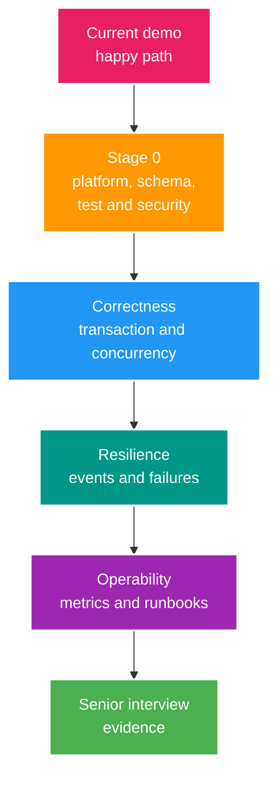

# Đánh giá hiện trạng và khoảng cách tới Senior Backend Lab

> Snapshot: 2026-07-25 
> Mục tiêu: ghi nhận bằng chứng về code đang chạy, không dùng số lượng dependency hay số lượng endpoint làm thước đo năng lực Senior.

## 1. Kết luận

Project có domain phù hợp để luyện phỏng vấn Senior Backend, nhưng implementation hiện ở mức **happy-path demo**. Giá trị lớn nhất của code hiện tại là tạo ra các điểm xuất phát thật cho bài toán security, transaction, concurrency, cache consistency, messaging và database performance.

Legacy Phase 5-12 không còn là active backlog. Trước hết cần đóng platform/toolchain drift, tạo test/schema safety net và xử lý các security gap hiện hữu; sau đó phát triển theo từng learning case trong [roadmap Senior Backend](001_SENIOR_JAVA_INTERVIEW_ROADMAP.md). [Implementation Map](implementation/current-implementation-map.md) chỉ ghi nhận code coverage hiện tại; phase plan cũ đã chuyển vào archive.

## 1.1. Khoảng cách cần thu hẹp

## 2. Phương pháp kiểm tra

Snapshot này dựa trên:

- static review mã nguồn, cấu hình, tài liệu, `.http`, rules và skills;
- dùng graphify snapshot trước migration để lần quan hệ code/tài liệu; graph cần được update sau khi structure mới ổn định;
- chạy `./mvnw.cmd -DskipTests compile` thành công;
- chạy `./mvnw.cmd test` thành công với đúng 1 test `contextLoads`;
- không chạy load test, fault injection hoặc benchmark;
- không khởi động hạ tầng mới. Test đã dùng PostgreSQL local đang sẵn có.

Vì test hiện dùng profile mặc định, PostgreSQL local và `ddl-auto=update`, kết quả test chưa chứng minh build có thể tái lập trên máy sạch hoặc CI.

## 3. Inventory có bằng chứng

| Hạng mục | Hiện trạng |
| --- | --- |
| Runtime khai báo | Java 17, Spring Boot 3.4.0, Maven Wrapper |
| Runtime thực tế khi test | Java 22.0.2; chưa có Maven Toolchains để khóa JDK |
| Mã nguồn | 53 file Java chính, khoảng 2.665 dòng |
| Test | 1 file, 9 dòng, chỉ `contextLoads` |
| HTTP surface | 7 controller, 27 request mappings khi Spring context khởi động |
| Persistence | 5 JPA entity, 5 repository, PostgreSQL, `ddl-auto=update` |
| Redis | typed session cache, live-status key, HyperLogLog unique viewers |
| RabbitMQ | dependency, cấu hình local và test-connectivity endpoint; chưa có business publisher/consumer |
| WebSocket | dependency; chưa có broker config, handler hoặc authorization flow chạy được |
| Kafka | chưa có dependency, topology, producer, consumer hoặc contract |
| Observability | log và P6Spy; chưa có Actuator, metrics, tracing, dashboard hoặc alert |
| AI agent | `AGENTS.md`, `PLANS.md` và 6 project skills đã có nền tảng tốt |

## 4. Những gì nên giữ và tái sử dụng

- Domain livestream có state transition, realtime traffic, money flow và fan-out nên đủ đất cho bài toán nhỏ lẫn system design lớn.
- Simulation-first cho phép tái hiện webhook, deposit và stream lifecycle mà không cần media server hay payment provider thật.
- DTO-first, `open-in-view=false`, explicit foreign ID, OpenAPI và `.http` là baseline tốt.
- Session-backed refresh token tạo bài toán security/cache thực tế hơn JWT stateless thuần túy.
- PostgreSQL, Redis, RabbitMQ và WebSocket đã tạo các seam tự nhiên để học consistency và failure mode.
- Business flow, API spec và phase docs có thể tiếp tục làm nguồn yêu cầu; không cần viết lại toàn bộ.
- `AGENTS.md` đã có guardrail về security, transaction, Redis, async processing và verification.

## 5. Khoảng trống ưu tiên

Priority trong section này là thứ tự remediation của codebase hiện tại. Nó không thay thế priority P0-P3 về tầm quan trọng năng lực Senior trong [Senior Roadmap](001_SENIOR_JAVA_INTERVIEW_ROADMAP.md).

### P0 - phải xử lý trước khi thêm feature

| Vấn đề | Bằng chứng hiện tại | Learning case mở ra |
| --- | --- | --- |
| Declared/runtime JDK bị drift | POM khai báo Java 17, test snapshot từng chạy Java 22.0.2, chưa có Toolchains/CI lock | `JDK-01`: Java release policy, `--release`/toolchain/runtime boundary và Java 21 baseline |
| Không có migration versioned | Schema bootstrap chưa tái lập từ database rỗng và khó benchmark index an toàn | `MIG-01`: Flyway baseline và clean-database bootstrap |
| Dev/test surface và default secret có trong default context | `/api/dev/**`, `/api/test/**`, Swagger/diagnostic surface và `dev-secret-key` chưa bị chặn bằng production-context test | `CFG-01`: profile isolation, conditional bean và production fail-fast |
| Access/refresh token chưa phân biệt loại | Cùng key, cùng `validateToken`; access token filter không kiểm tra claim loại token | JWT claims, token lifecycle, key rotation, negative security test |
| Auth matcher quá rộng | `/api/auth/**` đang `permitAll`, bao gồm cả endpoint cần đăng nhập | Filter chain, URL rule và method security |
| Logout-all không invalid session cache | DB bulk update nhưng không xóa cache; cache-hit path không recheck DB status | Source of truth, cache invalidation, security-sensitive cache |
| Stream key bị lộ | `StreamDTO` public có `streamKey`; service và webhook log giá trị key | DTO theo audience, secret handling, log redaction |
| Webhook auth mới ở mức shared secret | Controller so sánh `X-Webhook-Secret`, nhưng có default `dev-secret-key`, chưa có HMAC/timestamp/event-ID chống replay | HMAC, secret rotation, replay protection, idempotency, timestamp window |
| Test không đủ làm safety net | Chỉ có một context smoke test và phụ thuộc DB local | Test pyramid, Testcontainers, deterministic fixtures |

### P1 - lifecycle, correctness, transaction và concurrency

| Vấn đề | Failure mode cần tái hiện |
| --- | --- |
| JDK 25 và framework lifecycle chưa có quyết định versioned | Nâng đồng thời JDK/framework không có compatibility matrix, hoặc defer vô thời hạn không owner/revisit date; xử lý bằng `JDK-02` |
| Stream chỉ có boolean `isLive` | start lặp lại reset `startedAt`; start/end đồng thời không có transition guard |
| DB và Redis được cập nhật trong cùng method nhưng không atomic | DB rollback sau khi Redis đã đổi hoặc Redis lỗi sau DB update |
| `findAll` và DTO mapping gọi thêm query creator | unbounded response và manual N+1 |
| Max-session dùng count rồi revoke rồi insert | login đồng thời có thể vượt giới hạn hoặc revoke sai session |
| Wallet mới là simulation, chưa có ledger | lost update, balance âm, thiếu audit và idempotency |
| HyperLogLog được dùng cho viewer count | HLL đo unique reach xấp xỉ, không biểu diễn current concurrent viewers |

### P2 - distributed systems và operations

- Chưa có transactional outbox/inbox, deduplication, delivery semantics hoặc replay procedure.
- Chưa có Kafka để học partition, ordering, consumer group, offset, retention và stream replay.
- Chưa có structured logging, correlation ID, metrics, tracing, SLI/SLO hoặc incident runbook.
- Chưa có primary/replica, read routing, replication-lag policy, partitioning experiment hoặc archival strategy.
- Chưa có module boundary được kiểm chứng; package hiện tổ chức chủ yếu theo technical layer.
- Chưa có capacity model, load profile, JFR/GC/thread-dump analysis hoặc benchmark report.

## 6. Maturity model dùng cho project

Không dùng nhãn `DONE` duy nhất. Mỗi capability được đánh giá theo năm mức:

| Mức | Ý nghĩa | Bằng chứng tối thiểu |
| --- | --- | --- |
| M0 - Declared | Có trong docs hoặc dependency | Link spec/dependency |
| M1 - Demo | Happy path chạy local | Request hoặc smoke test |
| M2 - Correct | Invariant, negative case, transaction và concurrency được test | Automated tests và constraint |
| M3 - Resilient | Retry, idempotency, degraded mode và recovery được chứng minh | Fault-injection report và runbook |
| M4 - Operable | SLO, dashboard, alert, capacity và benchmark có dữ liệu | Metrics/traces/load report |

Đánh giá tổng quát hiện tại:

- REST/JPA/auth/stream: chủ yếu M1.
- Redis session/live viewers: M1, một phần design tiến tới M2.
- RabbitMQ/WebSocket: M0.
- Kafka, replica, partitioning, microservice: chưa đạt M0 trong implementation.
- Testing/observability/operations: dưới M1.
- Docs và agent rules: canonical structure đã được dọn; cần tiếp tục giữ link/status gate tự động.

## 7. Documentation migration đã thực hiện

- README, Docs Guide, Implementation Map, API contract, security, architecture, coding và Redis docs đã được đồng bộ theo current evidence.
- Product roadmap/API roadmap Phase 1-12 đã chuyển tới `docs/archive/2025-product-roadmap/`.
- Reference 2025 trộn current/target đã chuyển tới `docs/archive/2025-reference/`; active docs mới có status rõ.
- Prompt AI chung đã chuyển tới `docs/archive/2025-ai-prompts/`; workflow Codex active nằm trong `003_AI_AGENT_ENGINEERING_SYSTEM.md` và `.agents/skills/*`.
- Business flows được giữ làm target contract nhưng có capability status; source code/test vẫn là current evidence.

Archive manifest và replacement map nằm tại [Documentation Archive](archive/index.md). Graphify output hiện phản ánh topology trước migration và không được coi là source-of-truth cho đường dẫn mới cho tới lần update kế tiếp.

## 8. Cổng bắt đầu

Chỉ bắt đầu case Wallet/Kafka/microservice sau khi Stage 0 của roadmap đạt các điều kiện:

1. Java 21 là declared/toolchain/CI/runtime baseline có compile/test/startup evidence; JDK 25 + target Spring Boot line có `MIGRATE_NOW` hoặc `TIME_BOXED_DEFERRED` decision rõ.
2. Unit/integration test chạy tái lập bằng profile test và Testcontainers.
3. Flyway thay `ddl-auto=update` trong runtime kiểm soát và bootstrap được database rỗng.
4. P0 security có regression test.
5. CI chạy compile + test trên JDK đã khóa.
6. Có learning-case template, ADR đầu tiên và nơi lưu kết quả experiment.

Snapshot này cần được cập nhật khi hoàn thành một stage, không cập nhật sau từng commit nhỏ.
