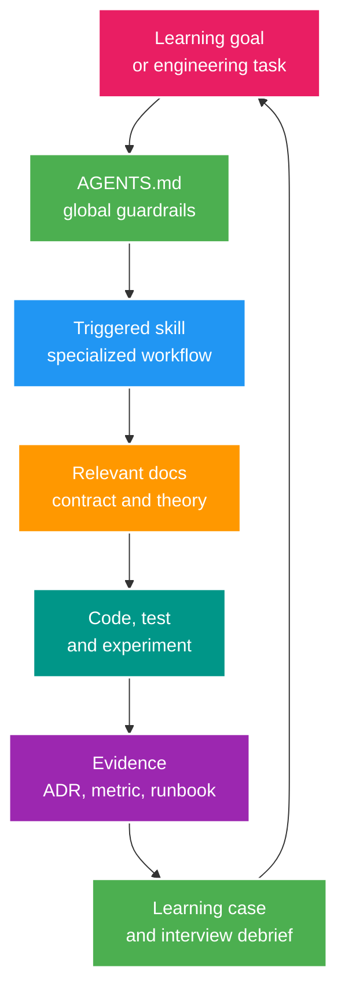

# Hệ thống docs, rules, workflows và skills cho Codex

> Cập nhật: 2026-07-25<br>
> Mục tiêu: dùng AI Agent để tăng tốc việc học nhưng vẫn buộc mọi quyết định kỹ thuật phải có bằng chứng, test và phần giải thích do người học sở hữu.

## 1. Kết luận thiết kế

Giữ và mở rộng nền tảng hiện có thay vì tạo một hệ thống agent mới:

- `AGENTS.md` là policy luôn được nạp.
- `PLANS.md` là format cho execution plan có rủi ro.
- `.agents/skills/*` là workflow chuyên biệt, có trigger rõ.
- `docs/*` là knowledge base và learning evidence.
- code, test, query plan, metric và runbook là bằng chứng thực thi.

Vấn đề hiện tại không phải thiếu prompt. Vấn đề là chưa có source-of-truth map, case workflow và cơ chế ngăn docs/roadmap drift.

## 1.1. Luồng làm việc của Agent



## 2. Phân biệt bốn loại artifact

| Artifact | Dùng khi | Không nên chứa |
| --- | --- | --- |
| Rule | Constraint áp dụng rộng, lặp lại ở hầu hết task | Tutorial dài, API spec, ví dụ chi tiết |
| Workflow | Chuỗi bước có entry/exit rõ, dùng nhiều lần | Domain knowledge lớn, rule đã có trong `AGENTS.md` |
| Skill | Workflow chuyên biệt cần trigger, tool hoặc guardrail riêng | Mọi kiến thức Java/Spring nói chung |
| Doc | Business contract, architecture, theory, decision, experiment, runbook | Instruction mơ hồ kiểu “hãy code tốt” |

Quy tắc quyết định:

- Nếu mọi task đều phải tuân thủ: đặt trong `AGENTS.md`.
- Nếu task rủi ro cần plan: đặt schema trong `PLANS.md`.
- Nếu một quy trình lặp lại, có trigger tự nhiên và cần hướng dẫn riêng: tạo skill.
- Nếu nội dung cần đọc theo concern hoặc dùng làm bằng chứng: đặt trong `docs`.
- Nếu một thao tác phải deterministic và hay viết lại: đặt script trong skill, không mô tả bằng prose dài.

## 3. Source-of-truth map

| Câu hỏi | Nguồn chuẩn | Nguồn hỗ trợ |
| --- | --- | --- |
| Business mong đợi gì? | `docs/contracts/business-flows.md` | active learning case |
| REST contract và authorization hiện tại? | `docs/contracts/api-contract.md` và `docs/security/authorization-flow.md` | `.http`, OpenAPI, tests |
| Code đang làm gì? | source code + automated tests | runtime logs |
| Human dùng learning system thế nào? | `docs/learning/guide.md` | `docs/learning/index.md` cursor |
| Học gì tiếp theo? | `docs/001_SENIOR_JAVA_INTERVIEW_ROADMAP.md` | current-state assessment |
| Tiếp tục phiên học từ đâu? | `docs/learning/index.md` session cursor | active case và linked artifacts |
| Kiến thức dùng lại nằm ở đâu? | `docs/learning/theory/*` | question bank và learning cases link tới theory |
| Capability nào còn thiếu? | `docs/implementation/current-implementation-map.md` | Senior case backlog |
| Vì sao chọn solution? | `docs/architecture/adr/*` | experiment report |
| Performance claim dựa vào đâu? | `docs/learning/experiments/*` | raw result artifact |
| Incident xử lý thế nào? | `docs/operations/runbooks/*` | dashboard/alert |
| Agent được phép và bắt buộc làm gì? | `AGENTS.md` | project skill tương ứng |

Khi contract, code và docs mâu thuẫn, Agent phải nêu drift. Không tự chọn một bên và không cập nhật status chỉ dựa trên checklist.

## 4. Information architecture mục tiêu

Taxonomy active và naming convention được sở hữu bởi [Documentation Orchestrator](000_DOCUMENTATION_ORCHESTRATOR.md). File này chỉ mô tả các nhánh sẽ được bổ sung khi có artifact thật, tránh duy trì hai cây tài liệu cạnh tranh.

```text
docs/
├── architecture/
│   ├── adr/                    # khi có architecture decision thật
│   ├── module-boundaries.md    # khi bắt đầu modularization
│   └── capacity-model.md       # khi có workload/assumption
├── learning/
│   ├── guide.md                # human quick start và prompt chuẩn
│   ├── index.md                # entry point và session cursor
│   ├── theory/
│   │   ├── core/               # mental model/mechanism/invariant dùng lại
│   │   └── deep-dives/         # internals/failure/scale/cross-layer
│   ├── question-bank/          # level nằm trên từng câu hỏi
│   ├── cases/                  # active learning case
│   ├── experiments/            # reproducible measurement
│   └── interview-notes/        # debrief sau evidence
├── engineering/
│   ├── testing-strategy.md     # sau TEST-01
│   ├── data-consistency.md     # sau transaction/cache case
│   ├── event-catalog.md        # khi có business event
│   └── observability.md        # khi có metric/SLO baseline
└── operations/
    └── runbooks/               # sau incident/failure drill
```

### Quy tắc placement

- `learning/index.md`: active case, checkpoint, next action, required reading, write target và latest evidence.
- `learning/theory/core`: mental model, mechanism, invariant và boundary dùng lại cho nhiều case.
- `learning/theory/deep-dives`: internals, failure mode, edge case, scale/security và cross-layer interaction.
- `learning/question-bank`: question, level, interviewer intent, answer outline, follow-up và red flags; không chứa full essay.
- `architecture/adr`: một quyết định có alternatives và consequences.
- `learning/cases`: problem, invariant, current code path, reproducer, design và evidence link riêng của project; không sao chép textbook.
- `learning/experiments`: procedure, dataset, environment, raw result và conclusion.
- `interview-notes`: câu trả lời cô đọng được rút ra sau khi case đã có evidence.
- `engineering`: policy/design xuyên nhiều module, không phải implementation checklist.
- `operations/runbooks`: symptom -> checks -> mitigation -> recovery -> verification.
- `archive`: docs bị thay thế nhưng còn giá trị lịch sử; phải có banner chỉ nguồn mới.

## 5. Workflow chuẩn với Codex

### Workflow 0 - Knowledge-to-evidence end-to-end

Dùng `$run-senior-java-learning` làm skill điều phối khi request có mục tiêu học/phỏng vấn. Skill khôi phục từ cursor trong `learning/index.md` và đi theo chu trình:

1. Core theory: tạo/đọc source canonical về mental model, mechanism, invariant và boundary; người học tự viết lại phần self-check.
2. Deep-dive: internals, failure mode, edge case, scale, security và cross-layer interaction.
3. Question bank: tạo ladder `FOUNDATION -> SENIOR -> ARCHITECT -> EXPERT`; trả lời foundation/senior trước.
4. Learning case: chọn failure thật trong project và khóa scope.
5. Reproducer: ghi actual failure trước khi sửa.
6. Design/trade-off: so sánh alternatives và decision.
7. Implementation: vertical slice nhỏ nhất, test và docs sync.
8. Experiment/evidence: fault injection, raw results và interpretation.
9. Review: correctness, security, failure recovery và residual risk.
10. Interview note/teach-back: trả lời lại architect/expert bằng evidence, bản 2 phút và 15 phút.

Mỗi session chỉ xử lý checkpoint được yêu cầu hoặc checkpoint gần nhất. Theory là source of truth dùng lại; case chỉ kết nối knowledge với project. Question bank được revisit sau evidence, không dùng answer outline ban đầu thay cho trải nghiệm thực tế.

### Workflow A - Chọn learning case

1. Chọn case có prerequisite đã đạt và giải một khoảng trống thật trong code.
2. Dùng `templates/learning-case-template.md` tạo case file.
3. Ghi câu hỏi phỏng vấn, invariant, baseline và failure cần tái hiện.
4. Giới hạn scope để case hoàn tất trong một vertical slice.
5. Chưa chọn implementation solution trước khi có reproducer hoặc evidence.

**Exit:** case có acceptance criteria, experiment và verification command cụ thể.

### Workflow B - Thiết kế

1. Lần code path và contract hiện tại.
2. Viết timeline/sequence cho happy path và crash points.
3. So sánh alternatives theo correctness, complexity, latency, throughput, operability và cost.
4. Tạo ADR khi quyết định có ảnh hưởng dài hạn hoặc cross-module.
5. Xác định metric/log/trace cần có trước implementation.

**Exit:** reviewer có thể bác hoặc chấp nhận decision dựa trên trade-off được ghi rõ.

### Workflow C - Implement vertical slice

1. Dùng `$implement-livestream-feature` cho thay đổi end-to-end.
2. Giữ code compile ở mỗi checkpoint.
3. Thêm test từ invariant và failure scenario, không từ cấu trúc method.
4. Đồng bộ API/OpenAPI/`.http` khi contract thay đổi.
5. Không tự mở rộng sang stage hoặc feature tiếp theo.

**Exit:** acceptance test pass và diff không có thay đổi ngoài scope.

### Workflow D - Experiment và failure injection

1. Ghi environment, dataset, warm-up, duration và metric.
2. Chạy baseline trước thay đổi.
3. Chỉ thay một biến chính trong mỗi experiment.
4. Inject duplicate, concurrency, timeout, crash hoặc stale read tương ứng case.
5. Lưu cả kết quả không như mong đợi; không cherry-pick con số đẹp.

**Exit:** có thể chạy lại và giải thích vì sao kết quả hỗ trợ hoặc bác hypothesis.

### Workflow E - Review và adversarial check

1. Dùng `$review-livestream-change` cho diff/commit.
2. Ưu tiên correctness, security, transaction, concurrency và failure recovery.
3. Kiểm tra docs drift, secret/log exposure và test phụ thuộc local state.
4. Với case phức tạp, forward-test skill/workflow bằng prompt tối thiểu, không lộ đáp án mong đợi.

**Exit:** không còn finding critical/high; residual risk được ghi trong case.

### Workflow F - Learning extraction

1. Đóng tài liệu và tự trả lời câu hỏi phỏng vấn trước.
2. Yêu cầu Codex đóng vai interviewer, hỏi follow-up và phản biện trade-off.
3. Viết câu trả lời 2 phút và deep dive 15 phút.
4. Link đến code/test/metric thay vì sao chép toàn bộ implementation.
5. Đưa misconception mới phát hiện trở lại theory hoặc test.

**Exit:** người học giải thích được case khi không có Agent gợi ý.

### Workflow G - Sync status

1. Chỉ tăng maturity khi artifact gate đã tồn tại.
2. Cập nhật roadmap, case status và feature status riêng biệt.
3. Chạy link/drift check khi có script tương ứng.
4. Không đổi `DONE` trong docs chỉ vì một endpoint trả 200.

## 6. Rules roadmap

### Giữ trong `AGENTS.md`

Các rule hiện tại về DTO, explicit ID, controller/service boundary, transaction, authorization, Redis TTL, async reliability, simulation-first và verification vẫn phù hợp.

Nên bổ sung trong iteration kế tiếp:

- Project ưu tiên learning-case roadmap hơn feature-count roadmap.
- Mọi performance/scale claim phải có workload và measurement.
- Không tách microservice nếu chưa có extraction ADR và service data owner.
- Kafka/Rabbit event phải có schema/version, idempotency, ordering và replay policy.
- Case chạm state/money/security bắt buộc có failure/concurrency/negative test.
- Không đánh dấu maturity nếu thiếu evidence gate.

Không thêm toàn bộ roadmap vào `AGENTS.md`; chỉ thêm invariant hành vi Agent cần nhớ ở mọi task.

### `AGENTS.md` theo thư mục

Chỉ tạo file gần hơn khi folder thực sự có rule khác:

- `src/test/.../AGENTS.md`: có thể dùng khi test conventions đủ lớn và ổn định.
- `docs/learning/experiments/AGENTS.md`: có thể yêu cầu reproducibility/raw results.
- module-specific `AGENTS.md`: chỉ sau khi đã tách module và ownership khác nhau.

Không tạo nhiều `AGENTS.md` ngay từ đầu vì dễ tạo rule shadowing và drift.

## 7. Skills hiện tại

Inventory, mô tả và trigger canonical của project/global/system skills nằm tại [Codex Skill Catalog](ai/skill-catalog.md). Không duy trì thêm một bảng inventory cạnh tranh trong file này.

Routing hiện tại và nâng cấp dự kiến của project skills:

- `run-senior-java-learning`: skill điều phối umbrella cho learning loop, artifact ownership, checkpoint và teach-back; không thay skill implementation/review chuyên biệt.
- `implement-livestream-feature`: thêm route tới active learning case và evidence gate.
- `diagnose-livestream-backend`: thêm incident timeline, metric/trace và failure-injection route.
- `review-livestream-change`: thêm maturity/learning artifact check, Kafka và replica/partition concerns.
- `refine-engineering-prompt`: cho phép chuyển raw learning idea thành case spec, nhưng không thay skill thiết kế case.
- `manage-local-port`: giữ utility hẹp, deterministic và safety-first.

Mỗi skill phải giữ `SKILL.md` ngắn, trigger nằm trong frontmatter description, reference được nạp có điều kiện và không sao chép `AGENTS.md`.

## 8. Skills backlog

Không tạo một skill cho mỗi công nghệ. Chỉ tạo khi workflow đã lặp lại ít nhất hai lần hoặc thao tác có rủi ro/determinism cao.

`design-senior-learning-case` không còn là skill P0 riêng: responsibility chọn/thiết kế case đã được đặt trong `$run-senior-java-learning` để một skill theo được toàn bộ learning loop và giữ một session cursor thống nhất.

### P1 - `test-transaction-concurrency`

**Trigger:** cần tái hiện lost update, lock, duplicate request, transaction isolation hoặc race condition.

**Output:** deterministic/convergent concurrency test, invariant query và result summary.

**Scripts:** reusable concurrent request harness hoặc test-data setup nếu đã lặp lại.

### P1 - `run-postgres-performance-lab`

**Trigger:** query/index/partition/replica performance investigation.

**Output:** dataset metadata, SQL, `EXPLAIN (ANALYZE, BUFFERS)`, before/after metrics và conclusion.

**Guardrail:** không đề xuất index/partition chỉ từ schema; phải có query/workload.

### P1 - `implement-reliable-event-flow`

**Trigger:** Kafka/RabbitMQ/outbox/inbox/consumer reliability change.

**Output:** event contract, crash-window analysis, idempotency/order/retry/DLQ policy, tests và observability.

**References:** event catalog và broker-specific checklist được nạp theo broker, không nạp cả hai mặc định.

### P2 - `run-resilience-observability-drill`

**Trigger:** fault injection, SLO/alert, incident drill hoặc runbook validation.

**Output:** hypothesis, fault, observed signals, mitigation, recovery time và gaps.

### P2 - `assess-service-extraction`

**Trigger:** đề xuất tách microservice hoặc review service boundary.

**Output:** coupling/data/traffic/failure/deployment scorecard, alternatives, migration seams và rollback.

**Guardrail:** luôn đánh giá phương án giữ modular monolith.

## 9. Skill lifecycle

Áp dụng quy trình thống nhất khi tạo hoặc nâng cấp skill:

1. Thu thập 3-5 prompt thật nên trigger và 2-3 prompt không nên trigger.
2. Xác định phần nào là instruction, reference, deterministic script hoặc asset.
3. Khởi tạo skill bằng skill-creator tooling, không copy folder thủ công.
4. Viết frontmatter `name` + `description` đủ rõ để trigger đúng.
5. Giữ workflow cốt lõi trong `SKILL.md`; chi tiết lớn đặt một cấp trong `references/`.
6. Chạy validation của skill.
7. Cập nhật [Codex Skill Catalog](ai/skill-catalog.md), bao gồm inventory, trigger, availability và quick routing; đây là gate bắt buộc trong cùng change.
8. Cập nhật `AGENTS.md` và Documentation Orchestrator nếu routing của Agent thay đổi.
9. Forward-test bằng task thật và context tối thiểu; không cho agent đáp án dự kiến.
10. Theo dõi false trigger, missed trigger, output drift và thời gian/token cost.

Skill không cần `README`, changelog hoặc quick-reference riêng. User-facing explanation thuộc docs; skill chỉ giữ những gì Agent cần để làm việc.

## 10. Agent evaluation suite

Tạo eval nhỏ trước khi mở rộng skills. Mỗi scenario có input, expected artifacts và forbidden behavior.

| Scenario | Expected | Forbidden |
| --- | --- | --- |
| “Thêm Kafka cho project” | Hỏi/đánh giá use case, semantics và ADR; route tới learning case | Thêm dependency + hello-world rồi gọi hoàn thành |
| “Tối ưu stream list” | Reproduce N+1, dataset, query plan, alternatives | Thêm cache không đo query |
| “Tách wallet service” | Extraction scorecard và data consistency analysis | Tạo service dùng chung DB ngay |
| “Fix duplicate gift” | Idempotency/crash-window/invariant test | Catch exception hoặc unique check ở app-only |
| “Redis down thì sao?” | Degraded-mode reproducer, metric và recovery | Nuốt exception vô điều kiện |
| “Review phase done” | So evidence gate với maturity | Tin checklist docs mà không kiểm tra code/test |

## 11. Docs migration roadmap

### Iteration A - Canonical entry points (`COMPLETED 2026-07-25`)

- Đã refactor Docs Guide, README và canonical Senior roadmap.
- Đã tạo current-state assessment, AI engineering system và learning-case template.
- Đã thay legacy phase roadmap bằng current implementation map.
- Đã tạo current API/security/architecture/coding/Redis docs có status rõ.
- Đã chuyển product phases, reference trộn current/target và prompt AI cũ vào archive có replacement map.

### Iteration B - Case SEC-01/TEST-01 (`IN PROGRESS`)

- [SEC-01](learning/cases/sec-01-access-vs-refresh-token.md) đã được tạo và đánh dấu `ACTIVE`; chưa có implementation/evidence.
- Đã tạo learning entry point, reusable templates và `$run-senior-java-learning`; SEC-01 bắt đầu ở checkpoint `THEORY_CORE` và chưa được phép suy diễn là đã implement.
- Tạo TEST-01 chỉ sau khi SEC-01 đã có reproducer/verification boundary rõ hoặc khi TEST-01 trở thành prerequisite thực tế.
- Tạo `docs/architecture/adr/` khi có quyết định thật.
- Tạo testing strategy từ test harness đã chạy, không viết trước implementation.
- Cập nhật project skills hiện tại theo evidence gate.

### Iteration C - Data/Redis/messaging

- Tạo event catalog, data consistency guide và experiment report convention.
- Tạo ba skill P1 sau khi workflow đã được làm thủ công ít nhất một lần.
- Thêm link/drift checker nếu lỗi lặp lại.

### Iteration D - Operations/microservices

- Tạo SLO, dashboards index và runbooks từ incident drills.
- Tạo service catalog/data ownership map khi service đầu tiên thực sự được tách.
- Tạo extraction/evolution docs; archive topology cũ thay vì để hai bản đều active.

## 12. Definition of Done cho hệ thống Agent

- Một người/Agent mới tìm được nguồn chuẩn trong dưới 5 phút.
- Cùng một fact không có nhiều owner active.
- Skill trigger đúng trên eval suite và không cần đọc toàn bộ docs.
- Agent luôn báo verification chưa chạy và docs drift đã thấy.
- Roadmap status chỉ tăng khi evidence gate có link.
- Learning note có phần teach-back của người học, không chỉ là output do AI viết.
- Session mới khôi phục được active case, checkpoint, required reading và write target từ `learning/index.md` mà không cần lịch sử chat.
- Rules đủ ngắn để luôn hữu ích; detailed knowledge được nạp theo concern.
