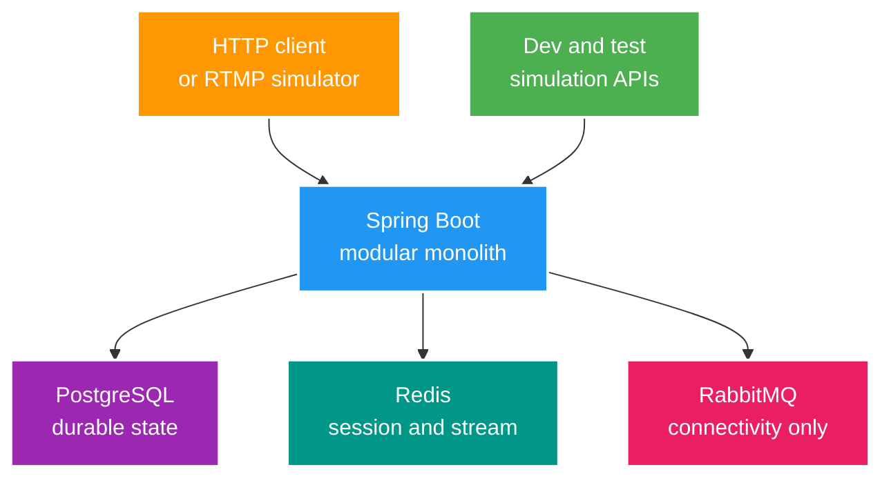

# System Context và Architecture Baseline

> Trạng thái: `CURRENT BASELINE` 
> Cập nhật: 2026-07-25 
> Thiết kế giả định 2025 được lưu tại [archive](../archive/2025-reference/system-design-livestream.md).

## 1. Kiến trúc đang chạy

Không có load balancer/gateway, media server, payment provider, Kafka, business RabbitMQ consumer, WebSocket/STOMP flow, replica hay microservice đang chạy trong repository này.

## 2. Current capability map

| Capability | Implementation | Maturity |
| --- | --- | --- |
| Identity/session | JWT, PostgreSQL `user_sessions`, Redis session cache | M1 demo; P0 security gaps |
| User profile | GET/PUT DTO API | M1 |
| Stream | Create/list/detail/my, RTMP webhook start/end | M1; state/concurrency gaps |
| Viewer analytics | Redis HyperLogLog unique viewers | M1; không phải concurrency count |
| Wallet | Stateless simulated deposit DTO | M0-M1 simulation; không có ledger/entity |
| RabbitMQ | Dependency/config/test publish | M0 only |
| WebSocket | Dependency only | M0 only |
| Testing | Một context smoke test | Dưới M1 |
| Observability | Application/P6Spy logs | Dưới M1 |

## 3. Boundary hiện tại

Source tổ chức theo technical layer (`controller`, `service`, `repository`, `model`). Trước khi tách microservice, roadmap yêu cầu chuyển dần sang package-by-feature và kiểm chứng dependency boundary. PostgreSQL vẫn là một data owner duy nhất.

## 4. Evolution path

1. Stage 0: security, profile, migration, hermetic test và log baseline.
2. Stage 1-4: state/concurrency, transaction, PostgreSQL và Redis correctness.
3. Stage 5-6: RabbitMQ/Kafka labs và reliable event flow với outbox/inbox.
4. Stage 7-9: realtime security, observability, replica và partition experiments.
5. Stage 10: chỉ tách service khi có extraction scorecard, data owner và operational evidence.

Chi tiết và exit gate nằm trong [Senior Java Interview Roadmap](../001_SENIOR_JAVA_INTERVIEW_ROADMAP.md).

## 5. Architecture invariants

- Controller không sở hữu business transaction.
- API không trả JPA entity.
- Entity giữ foreign ID tường minh, không dùng JPA relationship graph.
- PostgreSQL là durable source of truth; Redis/broker là state khác consistency boundary.
- External integration giữ simulation-first cho tới khi task yêu cầu tích hợp thật.
- Mọi claim về scale cần workload, metric và failure model.
