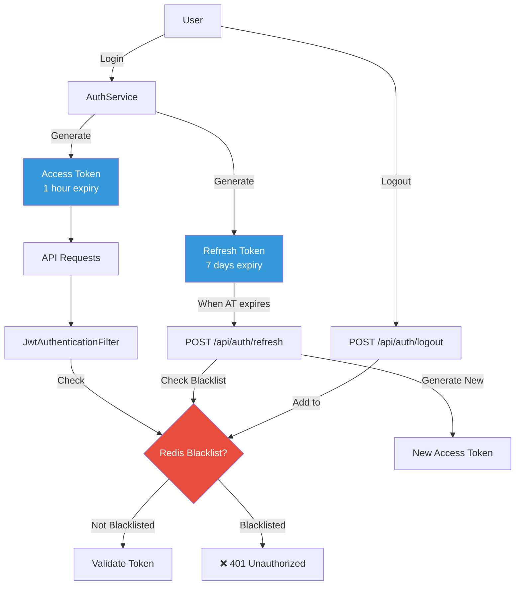

# Authentication & Authorization Considerations

> **Mục đích**: Educational document về design decisions, best practices, và advanced considerations cho Authentication & Authorization trong production environments.

---

## Table of Contents

1. [Current Implementation Analysis](#current-implementation-analysis)
2. [Security Considerations](#security-considerations)
3. [Performance Considerations](#performance-considerations)
4. [Advanced Features (Not Yet Implemented)](#advanced-features-not-yet-implemented)
5. [Real-World Use Cases & Solutions](#real-world-use-cases--solutions)
6. [Comparison với Alternative Approaches](#comparison-với-alternative-approaches)

---

## Current Implementation Analysis

### Kiến Trúc Hiện Tại



---

### Design Decisions

#### 1️⃣ **Tại sao sử dụng Access Token + Refresh Token?**

**❌ Alternative: Long-lived Access Token only**
- Access Token với expiry 7 days (hoặc lâu hơn)
- Đơn giản, không cần refresh logic

**❗ Vấn đề**:
- Nếu token bị leak, attacker có quyền truy cập lâu dài
- Logout không hiệu quả (phải blacklist token lớn suốt 7 days)
- Không thể revoke permissions nhanh chóng

**✅ Solution: Short-lived Access Token + Long-lived Refresh Token**
- Access Token: 1 hour (giảm thiểu exposure window)
- Refresh Token: 7 days (giảm UX friction do frequent login)
- Logout chỉ cần blacklist access token trong 1 hour (tiết kiệm Redis memory)

**Trade-offs**:
| Aspect | Pro | Con |
|--------|-----|-----|
| Security | ✅ Token leak có impact time ngắn | ❌ Thêm complexity |
| Performance | ✅ Blacklist TTL ngắn (1h) | ❌ Thêm refresh calls |
| UX | ✅ Không cần login lại thường xuyên | ⚠️ Cần handle token refresh |

---

#### 2️⃣ **Tại sao sử dụng Redis Blacklist?**

**❌ Alternative 1: Stateless JWT only**
- Không có blacklist
- Logout chỉ delete token ở client-side

**❗ Vấn đề**:
- Logout không thực sự an toàn (token vẫn valid nếu bị steal)
- Không thể force logout user
- Không revoke được stolen tokens

**❌ Alternative 2: Database Whitelist**
- Lưu tất cả active tokens trong database
- Check database mỗi request

**❗ Vấn đề**:
- Database query bottleneck (slow)
- High load trên database
- Không scale tốt

**✅ Solution: Redis Blacklist**
- In-memory storage (very fast: <1ms)
- TTL tự động cleanup (không cần manual maintenance)
- Chỉ lưu logged-out tokens (smaller dataset)

**Trade-offs**:
| Aspect | Pro | Con |
|--------|-----|-----|
| Security | ✅ Thực sự logout, revoke tokens | ❌ Vẫn stateful (mất stateless JWT benefit) |
| Performance | ✅ Redis rất nhanh (<1ms) | ❌ +1 Redis call mỗi request |
| Scalability | ✅ Redis cluster scale tốt | ⚠️ Cần maintain Redis infrastructure |

---

## Security Considerations

### 🔐 Token Security

#### 1. Token Storage (Client-side)

| Storage Method | Security Level | Use Case | Vulnerabilities |
|----------------|----------------|----------|-----------------|
| **httpOnly Cookie** | ✅ HIGH | Web applications | ⚠️ CSRF (cần CSRF token) |
| **Secure Storage API** | ✅ HIGH | Mobile apps (iOS/Android) | ✅ Minimal if properly implemented |
| **localStorage** | ❌ LOW | ❌ AVOID | ❌ XSS attacks can steal tokens |
| **sessionStorage** | ❌ LOW | ❌ AVOID | ❌ XSS attacks can steal tokens |
| **In-memory only** | ✅ HIGHEST | SPA (short sessions) | ⚠️ Lost on refresh (poor UX) |

**Best Practice cho Web Application**:
```javascript
// ✅ GOOD: Store refresh token in httpOnly cookie
// Server sets cookie:
response.addCookie(new Cookie("refreshToken", token) {{
    setHttpOnly(true);
    setSecure(true); // HTTPS only
    setSameSite("Strict");
    setMaxAge(7 * 24 * 60 * 60); // 7 days
}});

// ✅ GOOD: Store access token in memory (React example)
const [accessToken, setAccessToken] = useState(null);

// ❌ BAD: localStorage
localStorage.setItem('accessToken', token); // Vulnerable to XSS!
```

---

#### 2. Token Transmission Security

**✅ MUST DO**:
- Always use HTTPS in production
- Never log tokens (even in development)
- Use `Authorization: Bearer {token}` header (not query params)

**❌ NEVER DO**:
```javascript
// ❌ BAD: Token in URL (visible in logs, browser history)
fetch(`/api/user?token=${accessToken}`);

// ❌ BAD: Token in localStorage with XSS vulnerability
<div>{userInput}</div> // XSS can steal localStorage tokens
```

---

#### 3. Attack Vectors & Mitigations

##### **Attack 1: XSS (Cross-Site Scripting)**

**Scenario**: Attacker injects malicious script để steal tokens từ localStorage

**Mitigation**:
- ✅ Use httpOnly cookies (cannot be accessed by JavaScript)
- ✅ Sanitize all user inputs
- ✅ Use Content Security Policy (CSP) headers
- ✅ Regular security audits

```java
// Spring Security CSP configuration
http.headers(headers -> headers
    .contentSecurityPolicy("script-src 'self'")
);
```

---

##### **Attack 2: Token Theft (Man-in-the-Middle)**

**Scenario**: Attacker intercepts network traffic để steal tokens

**Mitigation**:
- ✅ Enforce HTTPS (TLS/SSL)
- ✅ HTTP Strict Transport Security (HSTS)
- ✅ Certificate pinning (mobile apps)

```java
// HSTS configuration
http.headers(headers -> headers
    .httpStrictTransportSecurity(hsts -> hsts
        .maxAgeInSeconds(31536000) // 1 year
        .includeSubDomains(true)
    )
);
```

---

##### **Attack 3: Token Replay Attack**

**Scenario**: Attacker reuses stolen token sau khi user đã logout

**Current Mitigation**:
- ✅ Redis Blacklist (logged-out tokens are rejected)

**Gap**: Stolen token BEFORE logout vẫn valid cho đến khi expire

**Advanced Mitigation** (chưa implement):
- IP binding (token chỉ valid từ IP đã issue)
- Device fingerprinting
- Anomaly detection (unusual usage patterns)

---

#### 4. JWT Secret Management

**Current (Development)**:
```yaml
# application.yml
app:
  jwt:
    secret: base64-encoded-secret-256-bits
```

**Production Best Practices**:

```bash
# 1. Environment Variable
export JWT_SECRET=$(openssl rand -base64 32)

# 2. Secret Management Service
# AWS Secrets Manager, HashiCorp Vault, Azure Key Vault
aws secretsmanager get-secret-value --secret-id jwt-secret

# 3. Kubernetes Secrets
kubectl create secret generic jwt-secret --from-literal=key=<generated-secret>
```

**Secret Rotation Strategy**:
```java
// Support multiple secrets for rotation
@Value("${app.jwt.secrets}")
private List<String> jwtSecrets; // [current, previous]

public boolean validateToken(String token) {
    for (String secret : jwtSecrets) {
        if (tryValidate(token, secret)) return true;
    }
    return false;
}
```

---

## Performance Considerations

### ⚡ Redis Blacklist Performance Impact

#### Baseline Performance Analysis

**Without Blacklist (Pure Stateless JWT)**:
- Request → JWT validation → Controller
- ~0.5ms overhead (JWT parsing + signature verification)

**With Redis Blacklist**:
- Request → JWT validation → **Redis check** → Controller
- ~1.5ms overhead (JWT + Redis roundtrip)

**Impact**: +1ms per request (Redis check)

#### Is this acceptable?

**YES** for most applications:
- Redis p99 latency: <2ms (in same datacenter)
- Total request latency: typically 50-200ms
- 1ms is ~1% of total latency

**Optimization Strategies**:

##### 1️⃣ **Local Cache (Guava/Caffeine)**
```java
@Service
public class JwtBlacklistService {
    private final RedisTemplate<String, String> redis;
    
    // Cache negative results (not blacklisted)
    private final LoadingCache<String, Boolean> cache = Caffeine.newBuilder()
        .expireAfterWrite(60, TimeUnit.SECONDS)
        .maximumSize(10_000)
        .build(token -> redis.hasKey("jwt:blacklist:" + token));
    
    public boolean isBlacklisted(String token) {
        return cache.get(token);
    }
}
```

**Trade-off**: Logout có thể delay tối đa 60s (cache TTL)

---

##### 2️⃣ **Redis Pipeline/Batch**
```java
// Check nhiều tokens cùng lúc (nếu cần)
public Map<String, Boolean> isBlacklistedBatch(List<String> tokens) {
    return redis.executePipelined(connection -> {
        tokens.forEach(token -> 
            connection.hasKey(("jwt:blacklist:" + token).getBytes())
        );
        return null;
    });
}
```

---

##### 3️⃣ **Bloom Filter (Advanced)**
```java
// Pre-filter với Bloom Filter (probabilistic data structure)
// False positive possible, but false negative impossible
private BloomFilter<String> bloomFilter;

public boolean isBlacklisted(String token) {
    // Quick check: nếu Bloom Filter says NO → definitely NOT blacklisted
    if (!bloomFilter.mightContain(token)) return false;
    
    // Chỉ check Redis khi Bloom Filter says MAYBE
    return redis.hasKey("jwt:blacklist:" + token);
}
```

**Benefit**: 99% requests skip Redis call (Bloom Filter check: ~0.01ms)

---

### 📊 Token Size & Network Overhead

**Access Token Size**: ~500-800 bytes (base64 encoded)
**Refresh Token Size**: ~500-800 bytes

**Impact trên Network**:
- Mỗi request: +500 bytes (Authorization header)
- Response: +500-800 bytes (nếu refresh token included)

**Optimization**:
- ❌ AVOID: Embed large payloads in JWT claims
- ✅ DO: Only store minimal claims (userId, roles, exp)

```java
// ❌ BAD: Large claims
.claim("user", fullUserObject) // 5KB+ token!

// ✅ GOOD: Minimal claims
.claim("userId", user.getId())
.claim("roles", user.getRoles())
// Total: ~500 bytes
```

---

### 🚀 Scalability với Large User Base

**Scenario**: 1 million concurrent users

**Redis Memory Usage (Blacklist)**:
- Average token size: 500 bytes
- Logout rate: 5% users per hour → 50,000 tokens/hour
- Average TTL: 30 minutes (half of 1 hour access token)
- **Memory**: 50,000 tokens × 500 bytes = **25 MB**

**Conclusion**: Redis Blacklist scales very well!

**Alternative Scenario**: Whitelist approach (store ALL active tokens)
- 1M users × 2 tokens × 500 bytes = **1 GB memory**
- 40x more memory!

---

## Advanced Features (Not Yet Implemented)

### 🔄 Refresh Token Rotation

#### Concept

**Current Implementation**:
```
User refreshes access token
→ Get NEW access token
→ SAME refresh token (không thay đổi)
```

**Refresh Token Rotation**:
```
User refreshes access token
→ Get NEW access token
→ Get NEW refresh token (old refresh token invalidated)
```

#### Why?

**Security Benefit**: Detect token theft/replay attacks

**Scenario**:
1. Attacker steals refresh token
2. Legitimate user refreshes → gets new tokens
3. Attacker tries to use old refresh token → **DENIED**
4. System detects suspicious activity → **Revoke all tokens for this user**

#### Implementation Approach

```java
@Service
public class AuthService {
    
    public AuthResponse refreshAccessToken(String oldRefreshToken) {
        // 1. Validate old refresh token
        if (!jwtTokenProvider.validateToken(oldRefreshToken)) {
            throw new InvalidTokenException();
        }
        
        // 2. Check if already used (rotation detection)
        if (redisTemplate.hasKey("refresh:used:" + oldRefreshToken)) {
            // TOKEN REUSE DETECTED - Possible theft!
            String userId = jwtTokenProvider.getUserIdFromToken(oldRefreshToken);
            revokeAllTokensForUser(userId); // Security measure
            throw new SecurityException("Token reuse detected");
        }
        
        // 3. Mark old refresh token as used
        redisTemplate.opsForValue().set(
            "refresh:used:" + oldRefreshToken,
            "used",
            7, TimeUnit.DAYS // Same as refresh token expiry
        );
        
        // 4. Generate new tokens
        String newAccessToken = jwtTokenProvider.generateToken(auth);
        String newRefreshToken = jwtTokenProvider.generateRefreshToken(auth);
        
        return new AuthResponse(newAccessToken, newRefreshToken);
    }
    
    private void revokeAllTokensForUser(String userId) {
        // Add all active refresh tokens to blacklist
        // Force user to login again
    }
}
```

#### Trade-offs

| Aspect | Pro | Con |
|--------|-----|-----|
| **Security** | ✅ Detect token theft | ❌ Complexity |
| **Storage** | ❌ Store used refresh tokens (7 days) | - |
| **UX** | ⚠️ Concurrent refresh fails | - |

**Concurrent Refresh Problem**:
```
Browser Tab 1: Refresh → Get Token A'
Browser Tab 2: Refresh (same time) → Get Token B' (different)
Tab 1 uses Token A' → ✅ OK
Tab 2 uses Token B' → ❌ FAIL (Token A already issued, B' is "old")
```

**Solution**: Grace period (allow both tokens for 30 seconds)

---

### 🔐 Remember Me Functionality

#### Use Case

User checks "Remember Me" → Stay logged in for 30 days (instead of 7 days refresh token)

#### Implementation Approach

**Option 1: Separate Token Type**
```java
public enum TokenType {
    NORMAL,    // 7 days refresh token
    REMEMBER_ME // 30 days refresh token
}

public String generateRefreshToken(Authentication auth, TokenType type) {
    long expiry = type == TokenType.REMEMBER_ME 
        ? THIRTY_DAYS_MS 
        : SEVEN_DAYS_MS;
    
    return Jwts.builder()
        .subject(username)
        .claim("type", type)
        .expiration(new Date(now + expiry))
        .signWith(key)
        .compact();
}
```

**Option 2: Device-Bound Tokens**
```java
// Bind token to device fingerprint
public String generateRememberMeToken(User user, DeviceInfo device) {
    return Jwts.builder()
        .subject(user.getUsername())
        .claim("deviceId", device.getId())
        .expiration(new Date(now + THIRTY_DAYS_MS))
        .signWith(key)
        .compact();
}

// Validate: check device matches
public boolean validateRememberMeToken(String token, DeviceInfo device) {
    String deviceId = getClaimFromToken(token, "deviceId");
    return deviceId.equals(device.getId());
}
```

#### Security Considerations

**Risks**:
- Longer exposure window (30 days vs 7 days)
- Higher impact if device is compromised

**Mitigations**:
- Require device fingerprinting
- Require re-authentication for sensitive operations
- Anomaly detection (unusual login location)

---

### 📱 Multi-Device Session Management

#### Concept

Track all active sessions for a user across devices:
- Web browser
- Mobile app (iOS)
- Mobile app (Android)
- Tablet

#### Goals

1. **Visibility**: User can see all active sessions
2. **Control**: User can logout from specific device
3. **Security**: User can logout from ALL devices

#### Architecture

```mermaid
flowchart TD
    User[User Login] -->|Device A| Session1[Create Session Entry]
    User -->|Device B| Session2[Create Session Entry]
    
    Session1 -->|Store in Redis| Registry[Session Registry<br/>user:123:sessions]
    Session2 --> Registry
    
    Registry --> List[Session List:<br/>- Web / Chrome / Tokyo<br/>- Mobile / iOS / Hanoi]
    
    User2[User] -->|View Sessions| API[GET /api/sessions]
    API --> Registry
    
    User2 -->|Logout Device| Revoke[DELETE /api/sessions/{id}]
    Revoke -->|Add to Blacklist| Blacklist[Redis Blacklist]
    
    style Registry fill:#3498db,color:#fff
    style Blacklist fill:#e74c3c,color:#fff
```

#### Implementation

##### 1️⃣ **Session Registry (Redis)**
```java
@Service
public class SessionRegistryService {
    
    private static final String SESSION_KEY = "user:sessions:";
    
    // Create session entry on login
    public void registerSession(String userId, SessionInfo session) {
        String key = SESSION_KEY + userId;
        
        // Add to Set
        redisTemplate.opsForSet().add(key, session.toJson());
        
        // Set expiry = refresh token expiry (7 days)
        redisTemplate.expire(key, 7, TimeUnit.DAYS);
    }
    
    // Get all sessions for user
    public List<SessionInfo> getAllSessions(String userId) {
        String key = SESSION_KEY + userId;
        Set<String> sessions = redisTemplate.opsForSet().members(key);
        
        return sessions.stream()
            .map(json -> SessionInfo.fromJson(json))
            .collect(Collectors.toList());
    }
    
    // Revoke specific session
    public void revokeSession(String userId, String sessionId) {
        // 1. Remove from registry
        String key = SESSION_KEY + userId;
        SessionInfo session = findSession(userId, sessionId);
        redisTemplate.opsForSet().remove(key, session.toJson());
        
        // 2. Add tokens to blacklist
        jwtBlacklistService.addToBlacklist(session.getAccessToken(), 3600);
        jwtBlacklistService.addToBlacklist(session.getRefreshToken(), 7 * 24 * 3600);
    }
    
    // Revoke ALL sessions (logout from all devices)
    public void revokeAllSessions(String userId) {
        List<SessionInfo> sessions = getAllSessions(userId);
        
        sessions.forEach(session -> {
            jwtBlacklistService.addToBlacklist(session.getAccessToken(), 3600);
            jwtBlacklistService.addToBlacklist(session.getRefreshToken(), 7 * 24 * 3600);
        });
        
        // Clear registry
        redisTemplate.delete(SESSION_KEY + userId);
    }
}

@Data
public class SessionInfo {
    private String sessionId; // UUID
    private String deviceType; // WEB, IOS, ANDROID
    private String deviceName; // Chrome, Safari, iPhone
    private String location; // IP geolocation
    private String accessToken;
    private String refreshToken;
    private LocalDateTime createdAt;
    private LocalDateTime lastActivity;
}
```

##### 2️⃣ **Session Management API**
```java
@RestController
@RequestMapping("/api/sessions")
public class SessionController {
    
    @GetMapping
    public ApiResponse<List<SessionDTO>> getAllSessions() {
        String userId = getCurrentUserId();
        List<SessionInfo> sessions = sessionRegistry.getAllSessions(userId);
        return ApiResponse.success(sessions);
    }
    
    @DeleteMapping("/{sessionId}")
    public ApiResponse<Void> revokeSession(@PathVariable String sessionId) {
        String userId = getCurrentUserId();
        sessionRegistry.revokeSession(userId, sessionId);
        return ApiResponse.success(null, "Session revoked");
    }
    
    @PostMapping("/revoke-all")
    public ApiResponse<Void> revokeAllSessions() {
        String userId = getCurrentUserId();
        sessionRegistry.revokeAllSessions(userId);
        return ApiResponse.success(null, "All sessions revoked");
    }
}
```

#### UI Example

```
📱 Active Sessions

┌─────────────────────────────────────┐
│ 🌐 Chrome on Windows                │
│ Tokyo, Japan • Active now           │
│ [Currently using]                   │
└─────────────────────────────────────┘

┌─────────────────────────────────────┐
│ 📱 iPhone 13 Pro                    │
│ Hanoi, Vietnam • 2 hours ago        │
│ [Logout this device]                │
└─────────────────────────────────────┘

[🚪 Logout from all devices]
```

#### Trade-offs

| Aspect | Pro | Con |
|--------|-----|-----|
| **Security** | ✅ User control over sessions | ❌ Complexity |
| **Storage** | ❌ Store session info in Redis | - |
| **UX** | ✅ Transparency, control | ⚠️ May confuse non-tech users |

---

## Real-World Use Cases & Solutions

### Use Case 1: Concurrent Logout Across Devices

**Scenario**: User clicks logout trên web browser. Mobile app vẫn đang dùng token.

**Current Behavior**:
- Web logout → Access token vào blacklist
- Mobile app: Access token bị reject ngay lập tức ✅
- Mobile app refresh → Get new access token ❌ (refresh token không bị blacklist)

**Problem**: User expect logout everywhere, nhưng mobile vẫn logged in!

**Solution**:
```java
// Option 1: Blacklist cả access + refresh token
public void logout(String accessToken, String refreshToken) {
    jwtBlacklistService.addToBlacklist(accessToken, 3600); // 1h
    jwtBlacklistService.addToBlacklist(refreshToken, 7 * 24 * 3600); // 7d
}

// Option 2: Separate "Logout All" button
public void logoutAll(String userId) {
    sessionRegistry.revokeAllSessions(userId);
}
```

---

### Use Case 2: Token Refresh Race Conditions

**Scenario**: Multiple browser tabs cùng refresh token đồng thời

**Problem**:
```
Tab 1: Refresh at 10:00:00.000
Tab 2: Refresh at 10:00:00.050 (50ms later)

Without rotation:
- Both get new access token ✅ (same refresh token reused)

With rotation (naive implementation):
- Tab 1: Get new tokens (refresh1 → refresh2)
- Tab 2: Use refresh1 → FAIL (already rotated)
```

**Solution: Grace Period**
```java
public AuthResponse refreshAccessToken(String oldRefreshToken) {
    // Check if recently rotated
    String newRefreshToken = redis.get("refresh:rotation:" + oldRefreshToken);
    
    if (newRefreshToken != null) {
        // Grace period: allow both old and new for 30 seconds
        if (isWithinGracePeriod(oldRefreshToken)) {
            return new AuthResponse(accessToken, newRefreshToken);
        }
        throw new TokenExpiredException("Refresh token rotated");
    }
    
    // Normal rotation...
    String newToken = generateNewRefreshToken();
    
    // Store mapping for grace period
    redis.setex("refresh:rotation:" + oldRefreshToken, 30, newToken);
    
    return new AuthResponse(accessToken, newToken);
}
```

---

### Use Case 3: Handling Expired Refresh Tokens Gracefully

**Scenario**: User không mở app trong 7 days → Refresh token expired

**Current Behavior**: API return 400/401 error

**Better UX**:
```java
@ControllerAdvice
public class GlobalExceptionHandler {
    
    @ExceptionHandler(RefreshTokenExpiredException.class)
    public ResponseEntity<?> handleRefreshTokenExpired(Exception ex) {
        return ResponseEntity.status(401).body(new ErrorResponse(
            "SESSION_EXPIRED",
            "Your session has expired. Please login again.",
            Map.of(
                "redirectTo", "/login",
                "reason", "refresh_token_expired"
            )
        ));
    }
}
```

**Client-side handling**:
```javascript
try {
    const response = await refreshAccessToken(refreshToken);
} catch (error) {
    if (error.code === 'SESSION_EXPIRED') {
        // Smooth redirect to login
        router.push('/login', { 
            message: 'Your session has expired. Please login again.' 
        });
    }
}
```

---

### Use Case 4: Mobile App Token Management

**Challenges**:
1. App ở background → Token expired
2. Network interruption → Refresh fails
3. App reinstall → Lost tokens

**Solution 1: Background Refresh**
```java
// iOS: Background App Refresh
func applicationDidEnterBackground(_ application: UIApplication) {
    scheduleTokenRefresh(in: 50.minutes)
}

// Android: WorkManager
WorkManager.getInstance(context).enqueue(
    PeriodicWorkRequestBuilder<TokenRefreshWorker>(50, TimeUnit.MINUTES).build()
)
```

**Solution 2: Retry with Exponential Backoff**
```kotlin
suspend fun refreshAccessToken(retryCount: Int = 0): String {
    try {
        return authApi.refresh(refreshToken)
    } catch (e: NetworkException) {
        if (retryCount < 3) {
            delay(2.0.pow(retryCount) * 1000) // 1s, 2s, 4s
            return refreshAccessToken(retryCount + 1)
        }
        throw e
    }
}
```

---

## Comparison với Alternative Approaches

### Approach 1: Session-Based Authentication

**Implementation**:
```java
// Server stores session in Redis/Database
@PostMapping("/login")
public String login(@RequestBody LoginRequest request, HttpSession session) {
    User user = authenticate(request);
    session.setAttribute("userId", user.getId());
    return "sessionId"; // Session cookie
}

// Validate on each request
public boolean isAuthenticated(HttpSession session) {
    return session.getAttribute("userId") != null;
}
```

**Comparison**:

| Aspect | Session-Based | JWT (Current) |
|--------|---------------|---------------|
| **Stateful/Stateless** | ❌ Stateful | ✅ Stateless (except blacklist) |
| **Scalability** | ⚠️ Cần sticky sessions hoặc shared storage | ✅ Horizontal scaling dễ dàng |
| **Security** | ✅ Dễ revoke (delete session) | ⚠️ Cần blacklist |
| **Complexity** | ✅ Đơn giản | ⚠️ Phức tạp hơn |
| **Mobile Apps** | ❌ Không phù hợp (cookies) | ✅ Native support |
| **Microservices** | ❌ Khó (cần shared session store) | ✅ Easy (decode JWT) |

**When to use Session-Based**:
- Monolithic web application
- No mobile app requirement
- Simple use case

---

### Approach 2: OAuth2 / OpenID Connect

**Implementation**:
- Use OAuth2 server (Keycloak, Auth0, AWS Cognito)
- Client redirects to OAuth2 provider
- Receive access token + ID token

**Comparison**:

| Aspect | OAuth2/OIDC | JWT (Current) |
|--------|-------------|---------------|
| **Setup Complexity** | ❌ High (external service) | ✅ Moderate (in-house) |
| **Maintenance** | ✅ Low (managed service) | ⚠️ Medium (self-hosted) |
| **Cost** | ❌ Monthly fee (Auth0, etc.) | ✅ Free (Redis + self-hosted) |
| **Flexibility** | ⚠️ Limited customization | ✅ Full control |
| **Social Login** | ✅ Built-in (Google, Facebook) | ❌ Must implement separately |
| **Enterprise SSO** | ✅ Native support | ❌ Complex to implement |

**When to use OAuth2/OIDC**:
- Need Social Login (Google, Facebook)
- Enterprise SSO requirements (SAML, Active Directory)
- Multi-tenant SaaS application
- Want managed authentication service

---

### Approach 3: Stateless JWT Only (No Blacklist)

**Implementation**:
```java
// Pure stateless: No blacklist, no Redis
public boolean validateToken(String token) {
    return jwtTokenProvider.validateToken(token);
}

// Logout just deletes token on client
public void logout() {
    // Client removes token from storage
    localStorage.removeItem('accessToken');
}
```

**Comparison**:

| Aspect | Stateless JWT | JWT + Blacklist (Current) |
|--------|---------------|---------------------------|
| **Performance** | ✅ No Redis call | ⚠️ +1ms Redis call |
| **Scalability** | ✅ Perfect horizontal scaling | ✅ Good (Redis cluster) |
| **Security** | ❌ Cannot revoke tokens | ✅ Can revoke via blacklist |
| **Complexity** | ✅ Very simple | ⚠️ Moderate |
| **Logout** | ❌ Không thực sự logout (token vẫn valid) | ✅ Thực sự logout |

**When to use Stateless JWT**:
- Very short token expiry (<5 minutes)
- Low security requirements
- Need maximum performance
- Immutable tokens acceptable

---

## Summary & Recommendations

### Current Implementation ✅

**Strengths**:
- ✅ Good balance giữa security và performance
- ✅ Scalable architecture (Redis)
- ✅ Real logout functionality (blacklist)
- ✅ Reasonable token expiry (1h access, 7d refresh)

**Weaknesses**:
- ⚠️ Không có refresh token rotation (theft detection)
- ⚠️ Không có multi-device session management
- ⚠️ Không có remember me functionality

---

### Recommended Next Steps

#### Phase 1: Security Enhancements (High Priority)
1. **Implement Refresh Token Rotation** (with grace period)
   - Impact: High security improvement
   - Complexity: Medium
   - ~2-3 days implementation

2. **Add Device Fingerprinting**
   - Impact: Medium security improvement
   - Complexity: Low
   - ~1 day implementation

#### Phase 2: UX Improvements (Medium Priority)
3. **Multi-Device Session Management**
   - Impact: High UX improvement
   - Complexity: Medium
   - ~3-4 days implementation

4. **Remember Me Functionality**
   - Impact: Medium UX improvement
   - Complexity: Low
   - ~1 day implementation

#### Phase 3: Performance Optimization (Low Priority - if needed)
5. **Implement Local Cache for Blacklist**
   - Impact: ~1ms latency reduction
   - Complexity: Low
   - ~0.5 day implementation

---

### Key Takeaways

1. **There is no perfect solution** - Always trade-offs
2. **Security vs Performance vs Complexity** - Balance based on requirements
3. **Start simple, evolve as needed** - Current implementation is a good foundation
4. **Monitor and measure** - Before optimizing, measure actual bottlenecks
5. **Learn from real-world use cases** - Adapt based on user behavior

---

**End of Document**
