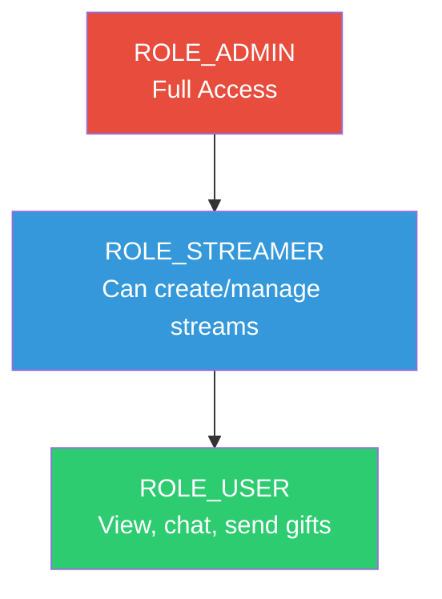
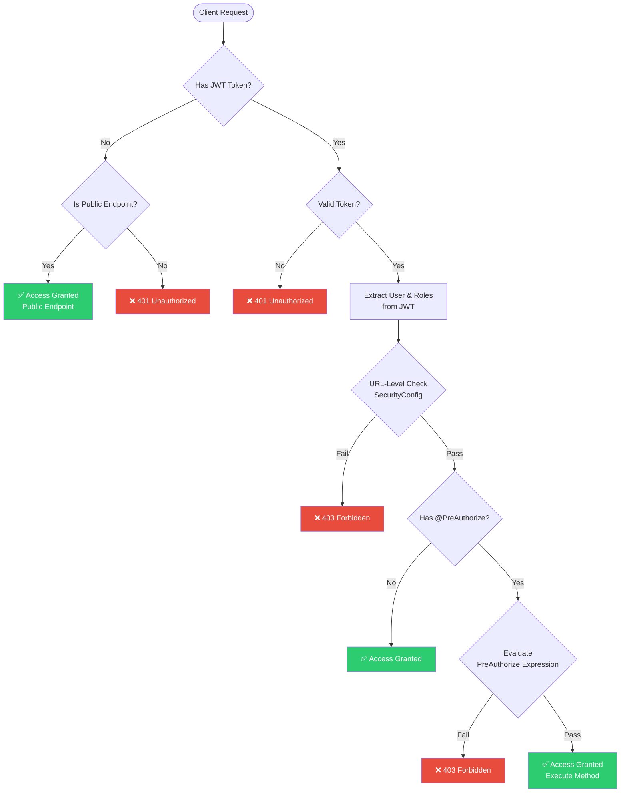
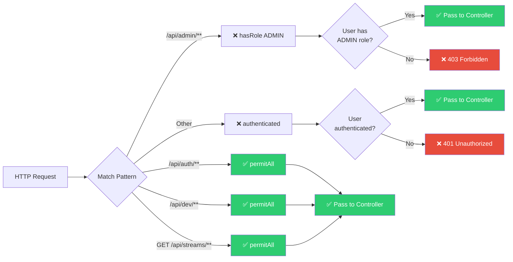
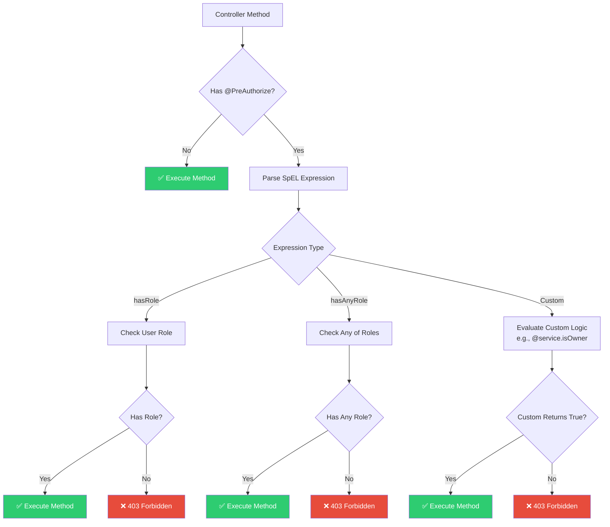
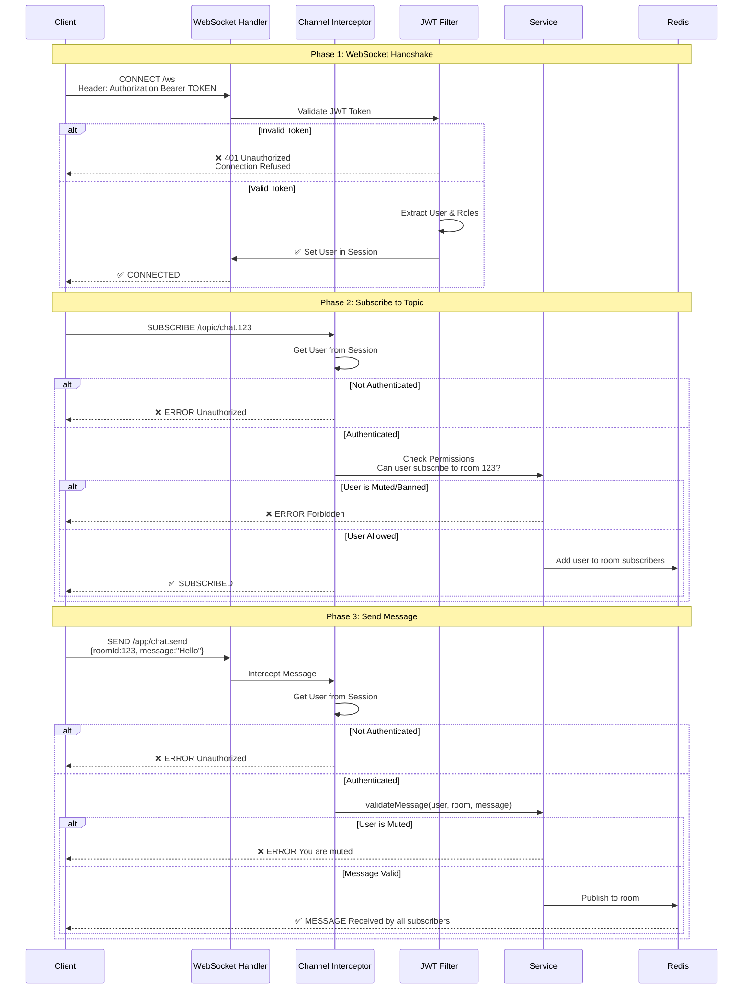
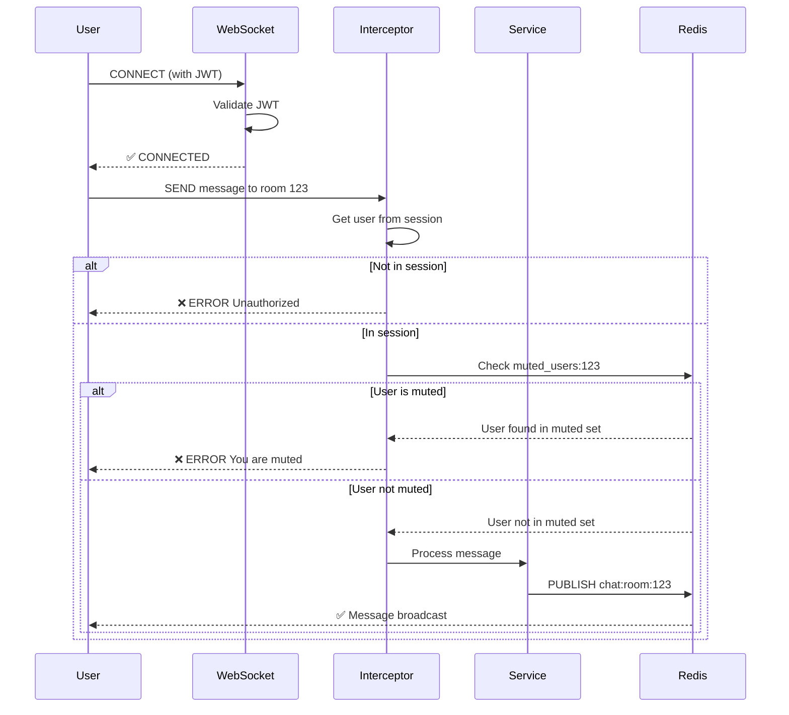

# Authorization Flow - Spring Boot Livestream Backend

> **Mục đích**: Làm rõ luồng phân quyền (authorization flow) trong dự án, bao gồm REST API và WebSocket.

---

## Table of Contents

1. [Overview](#overview)
2. [REST API Authorization Flow](#rest-api-authorization-flow)
3. [WebSocket Authorization Flow](#websocket-authorization-flow)
4. [Two-Tier Authorization Strategy](#two-tier-authorization-strategy)
5. [Common Scenarios](#common-scenarios)

---

## Overview

Dự án sử dụng **JWT-based authentication** kết hợp với **Role-Based Access Control (RBAC)**.

### Roles Hierarchy



---

## REST API Authorization Flow

### Complete Request Flow



---

### URL-Level Authorization (SecurityConfig)



---

### Method-Level Authorization (@PreAuthorize)



---

## WebSocket Authorization Flow

### WebSocket Connection & Subscription

> ⚠️ **Lưu ý**: WebSocket authorization khác với REST API vì:
> - Connection được thiết lập một lần (handshake)
> - Messages được gửi liên tục sau đó
> - Cần check authorization ở cả handshake và message level



---

### WebSocket Authorization Layers


---

## Two-Tier Authorization Strategy

### When to Use Each Tier

```mermaid
graph TD
    Decision{Authorization<br/>Requirement}
    
    Decision -->|Pattern-based<br/>Entire endpoint group| URLLevel[URL-Level<br/>SecurityConfig]
    Decision -->|Fine-grained<br/>Specific conditions| MethodLevel[Method-Level<br/>@PreAuthorize]
    
    URLLevel --> URLExamples["Examples:<br/>• /api/admin/** → ADMIN only<br/>• /api/auth/** → Public<br/>• GET /api/streams/** → Public"]
    
    MethodLevel --> MethodExamples["Examples:<br/>• Owner or Admin<br/>• Self or Admin<br/>• Custom business logic"]
    
    URLExamples --> Implementation1["SecurityFilterChain<br/>.requestMatchers(...).hasRole(...)"]
    MethodExamples --> Implementation2["@PreAuthorize('hasRole(...) or ...')"]
    
    style URLLevel fill:#3498db,color:#fff
    style MethodLevel fill:#9b59b6,color:#fff
    style Implementation1 fill:#ecf0f1,color:#2c3e50
    style Implementation2 fill:#ecf0f1,color:#2c3e50
```

---

## Common Scenarios

### Scenario 1: Create Stream (STREAMER or ADMIN only)

```mermaid
flowchart LR
    Request[POST /api/streams] --> URL{URL-Level Check}
    
    URL -->|/api/streams/**| Auth1{Authenticated?}
    Auth1 -->|No| Fail1[❌ 401]
    Auth1 -->|Yes| Method{@PreAuthorize Check}
    
    Method -->|Check| Roles{Has STREAMER<br/>or ADMIN?}
    
    Roles -->|No| Fail2[❌ 403 Forbidden]
    Roles -->|Yes| Create[✅ Create Stream]
    
    style Create fill:#2ecc71,color:#fff
    style Fail1 fill:#e74c3c,color:#fff
    style Fail2 fill:#e74c3c,color:#fff
```

**Code:**
```java
@PreAuthorize("hasAnyRole('STREAMER', 'ADMIN')")
@PostMapping("/api/streams")
public ApiResponse<StreamDTO> createStream(@Valid @RequestBody CreateStreamRequest request) {
    // Only STREAMER or ADMIN reach here
}
```

---

### Scenario 2: Update Stream (Owner or ADMIN)

```mermaid
flowchart LR
    Request[PUT /api/streams/123] --> URL{URL-Level Check}
    
    URL -->|/api/streams/**| Auth1{Authenticated?}
    Auth1 -->|No| Fail1[❌ 401]
    Auth1 -->|Yes| Method{@PreAuthorize Check}
    
    Method -->|Check| Owner{Is Owner<br/>or ADMIN?}
    
    Owner -->|Check Service| Service[@streamService.isOwner<br/>StreamId: 123<br/>Username: currentUser]
    
    Service -->|No & Not Admin| Fail2[❌ 403 Forbidden]
    Service -->|Yes or Admin| Update[✅ Update Stream]
    
    style Update fill:#2ecc71,color:#fff
    style Fail1 fill:#e74c3c,color:#fff
    style Fail2 fill:#e74c3c,color:#fff
```

**Code:**
```java
@PreAuthorize("hasRole('ADMIN') or @streamService.isStreamOwner(#streamId, authentication.principal.username)")
@PutMapping("/api/streams/{streamId}")
public ApiResponse<StreamDTO> updateStream(@PathVariable Long streamId, ...) {
    // Only owner or admin reach here
}
```

---

### Scenario 3: WebSocket Chat (Authenticated, Check Mute)



**Code:**
```java
@MessageMapping("/chat.send")
public void sendMessage(@Payload ChatMessage message, Principal principal) {
    // User already authenticated via handshake
    String username = principal.getName();
    
    // Check if user is muted
    if (chatService.isUserMuted(message.getRoomId(), username)) {
        throw new AccessDeniedException("You are muted in this room");
    }
    
    // Process and broadcast
    chatService.sendMessage(message);
}
```

---

## Summary Table

| Type | Layer | When to Use | Example |
|------|-------|-------------|---------|
| **URL-Level** | SecurityConfig | Pattern-based, entire endpoint group | `/api/admin/**` → ADMIN only |
| **Method-Level** | @PreAuthorize | Fine-grained, conditional | Owner or Admin can update |
| **WebSocket Handshake** | JWTFilter | Connection establishment | Validate JWT in upgrade request |
| **WebSocket Channel** | Interceptor | Subscription control | Can user subscribe to this topic? |
| **WebSocket Message** | Service Logic | Message-level validation | Is user muted? Rate limiting? |

---

## Best Practices

### ✅ DO

1. **Use URL-Level for broad patterns**
   ```java
   .requestMatchers("/api/admin/**").hasRole("ADMIN")
   ```

2. **Use Method-Level for specific conditions**
   ```java
   @PreAuthorize("@service.isOwner(#id, auth.name)")
   ```

3. **Always validate WebSocket messages**
   ```java
   if (chatService.isUserMuted(roomId, username)) {
       throw new AccessDeniedException();
   }
   ```

4. **Check spec before implementing**
   - Read `docs/api_endpoints_specification.md`
   - Follow defined patterns

### ❌ DON'T

1. **Don't skip authorization on WebSocket messages**
   - Handshake authentication ≠ message authorization

2. **Don't expose entities in responses**
   - Always use DTOs

3. **Don't create custom endpoint patterns**
   - Follow specification

4. **Don't forget Swagger annotations**
   - @Tag, @Operation required

---

**End of Document**
