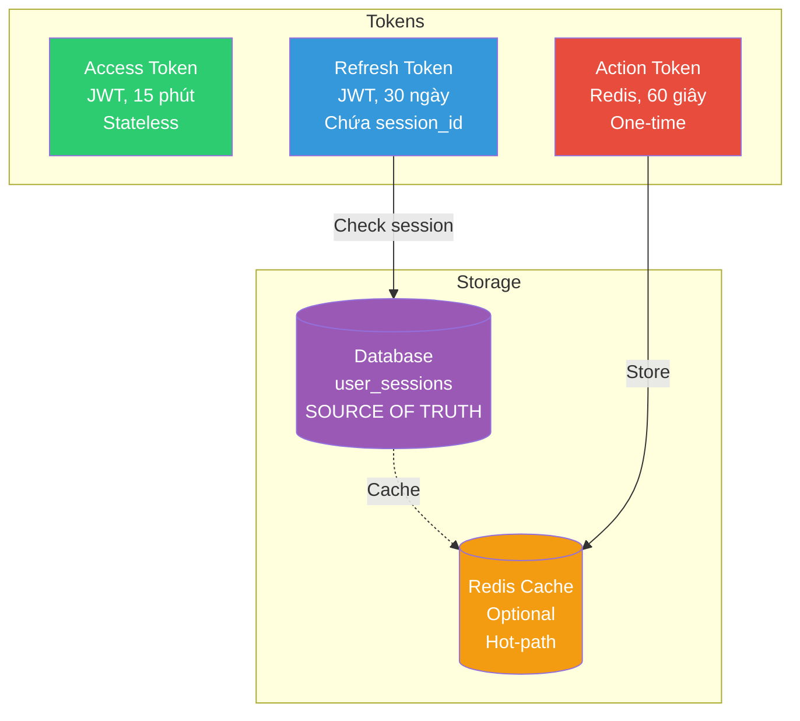
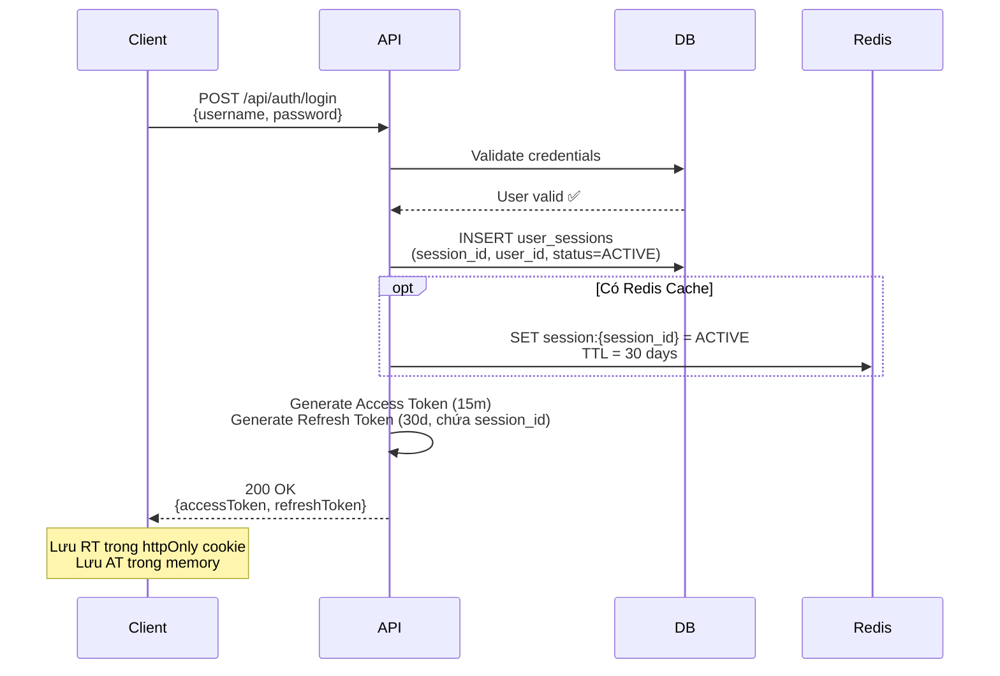
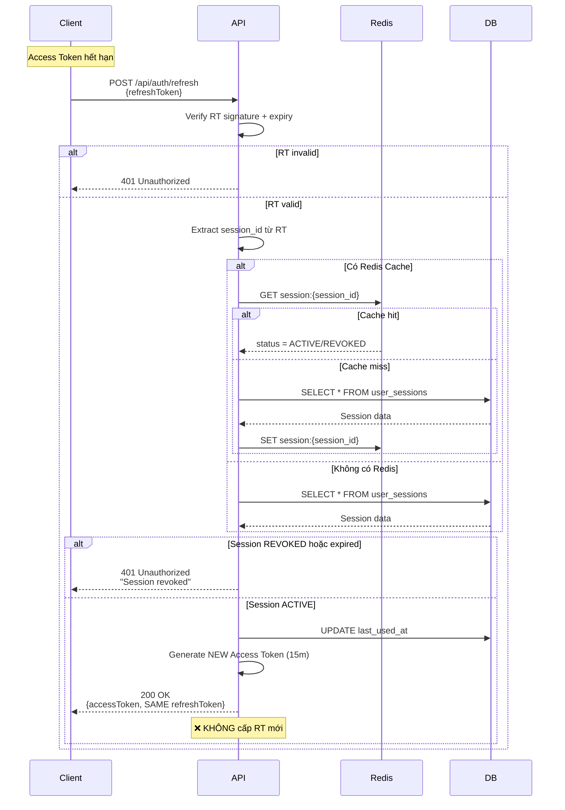
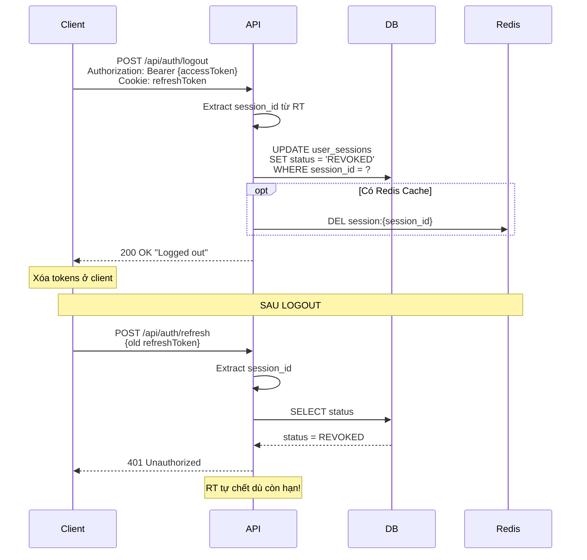
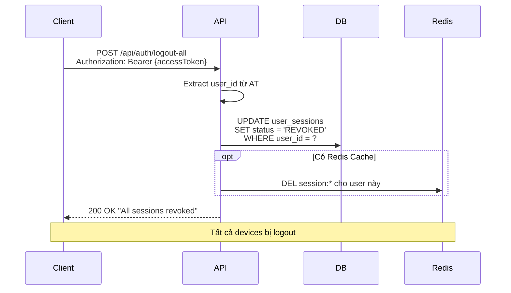
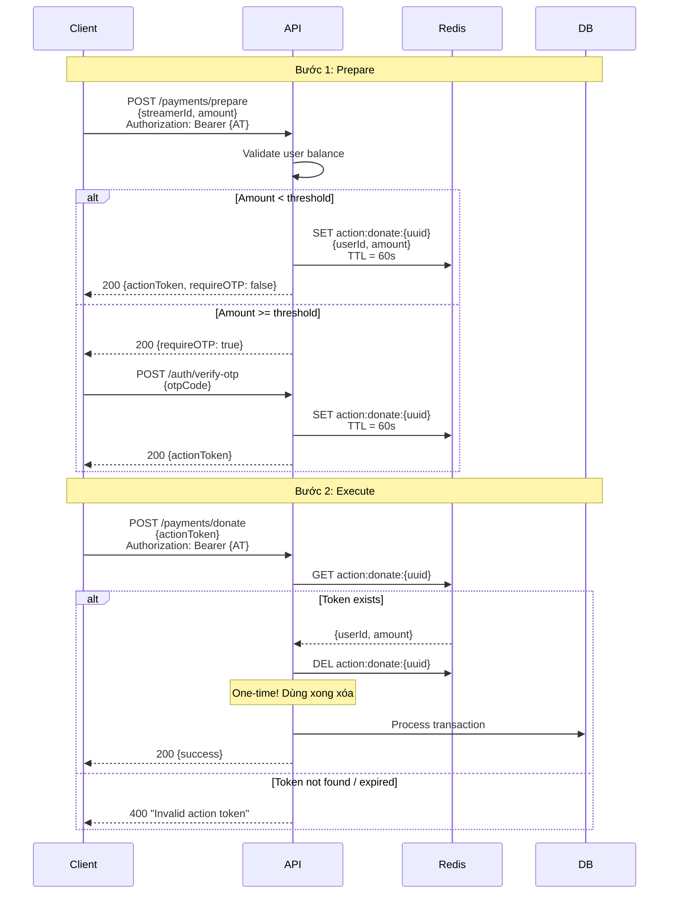
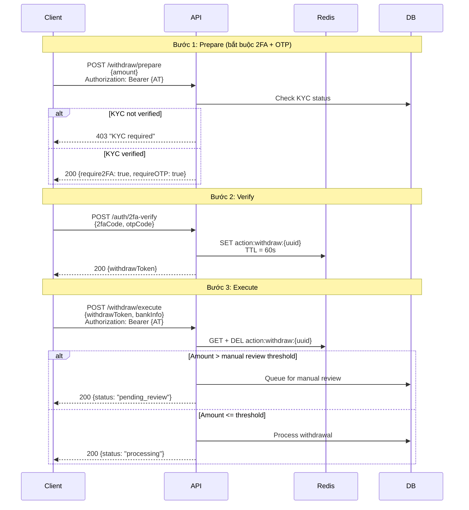

# Authorization Flow - Livestream Backend

> **Phiên bản**: Final (17/12/2024)
> **Kiến trúc**: JWT + Session-backed Refresh Token
> **Phù hợp**: Hệ thống Livestream có Donate/Withdraw

---

## Table of Contents

1. [Nguyên Tắc Cốt Lõi](#1-nguyên-tắc-cốt-lõi)
2. [Kiến Trúc 3 Tầng](#2-kiến-trúc-3-tầng)
3. [Database Schema](#3-database-schema)
4. [Flow Chi Tiết](#4-flow-chi-tiết)
5. [Action Token (Money Flow)](#5-action-token-money-flow)
6. [Redis Usage](#6-redis-usage)
7. [Security Matrix](#7-security-matrix)

---

## 1. Nguyên Tắc Cốt Lõi

```
┌─────────────────────────────────────────────────────────────────────┐
│                         NGUYÊN TẮC VÀNG                             │
├─────────────────────────────────────────────────────────────────────┤
│  1. SESSION LÀ NGUỒN SỰ THẬT    →  DB lưu session, không trust JWT  │
│  2. JWT CHỈ LÀ CARRIER          →  Mang session_id đi xa            │
│  3. TIỀN DÙNG ACTION TOKEN      →  One-time, Redis, 60s TTL         │
│  4. KHÔNG BLOCKLIST TOKEN       →  Revoke session, không revoke JWT │
└─────────────────────────────────────────────────────────────────────┘
```

> ❝ Big tech không "trust token", họ trust server-side state ❞

---

## 2. Kiến Trúc 3 Tầng



### Chi tiết từng tầng

| Tầng  | Thành phần    | Đặc điểm                             | Dùng cho              |
| ----- | ------------- | ------------------------------------ | --------------------- |
| **1** | Access Token  | JWT, 15m, stateless, KHÔNG revoke    | View, Chat, WebSocket |
| **2** | Refresh Token | JWT, 30d, chứa session_id → check DB | Lấy AT mới            |
| **3** | Action Token  | Redis, 60s, one-time                 | Donate, Withdraw      |

---

## 3. Database Schema

### Bảng `user_sessions`

```sql
CREATE TABLE user_sessions (
    session_id      UUID PRIMARY KEY DEFAULT gen_random_uuid(),
    user_id         BIGINT NOT NULL,
    device_id       VARCHAR(255),
    device_name     VARCHAR(255),
    ip_address      VARCHAR(45),
    status          VARCHAR(20) DEFAULT 'ACTIVE',  -- ACTIVE, REVOKED
    created_at      TIMESTAMP DEFAULT CURRENT_TIMESTAMP,
    last_used_at    TIMESTAMP DEFAULT CURRENT_TIMESTAMP,
    expires_at      TIMESTAMP NOT NULL,

    CONSTRAINT fk_user FOREIGN KEY (user_id) REFERENCES users(id) ON DELETE CASCADE
);

CREATE INDEX idx_sessions_user_id ON user_sessions(user_id);
CREATE INDEX idx_sessions_status ON user_sessions(status);
CREATE INDEX idx_sessions_expires ON user_sessions(expires_at);
```

### Entity Java

```java
@Entity
@Table(name = "user_sessions")
@Data
@Builder
public class UserSession {
    @Id
    private UUID sessionId;

    @Column(nullable = false)
    private Long userId;

    private String deviceId;
    private String deviceName;
    private String ipAddress;

    @Enumerated(EnumType.STRING)
    private SessionStatus status = SessionStatus.ACTIVE;

    private LocalDateTime createdAt;
    private LocalDateTime lastUsedAt;
    private LocalDateTime expiresAt;

    public enum SessionStatus {
        ACTIVE, REVOKED
    }

    public boolean isValid() {
        return status == SessionStatus.ACTIVE
            && expiresAt.isAfter(LocalDateTime.now());
    }
}
```

---

## 4. Flow Chi Tiết

### 4.1 LOGIN



**Refresh Token chứa:**

```json
{
  "sub": "user_123",
  "session_id": "550e8400-e29b-41d4-a716-446655440000",
  "device_id": "browser_chrome_win",
  "exp": 1705420800
}
```

---

### 4.2 REFRESH



---

### 4.3 LOGOUT



---

### 4.4 LOGOUT ALL DEVICES



---

## 5. Action Token (Money Flow)

### 5.1 Tại sao cần Action Token?

| Vấn đề                   | Giải pháp                     |
| ------------------------ | ----------------------------- |
| AT/RT leak → mất tiền?   | ❌ Không đủ, cần Action Token |
| Replay attack donate     | Action Token one-time         |
| Withdraw cần bảo mật cao | Action Token + OTP + 2FA      |

---

### 5.2 DONATE Flow



---

### 5.3 WITHDRAW Flow



---

## 6. Redis Usage

### Phân biệt rõ ràng

| Mục đích                    | Có dùng Redis? | Key pattern                                      |
| --------------------------- | -------------- | ------------------------------------------------ |
| ❌ Blocklist Access Token   | KHÔNG          | -                                                |
| ❌ Blocklist Refresh Token  | KHÔNG          | -                                                |
| ❌ Rotate RT mỗi refresh    | KHÔNG          | -                                                |
| ✅ Cache Session (optional) | CÓ             | `session:{session_id}`                           |
| ✅ Action Token             | CÓ             | `action:donate:{uuid}`, `action:withdraw:{uuid}` |
| ✅ Rate Limiting            | CÓ             | `rate:chat:{userId}`, `rate:donate:{userId}`     |

### Redis Key Schema

```
# Session cache (optional, TTL = session expiry)
session:{session_id}     → {"status": "ACTIVE", "userId": 123}

# Action tokens (one-time, 60s TTL)
action:donate:{uuid}     → {"userId": 123, "streamerId": 456, "amount": 100}
action:withdraw:{uuid}   → {"userId": 123, "amount": 500}

# Rate limiting
rate:chat:{userId}       → count (TTL 60s, max 30/min)
rate:donate:{userId}     → count (TTL 3600s, max 10/hour)
```

---

## 7. Security Matrix

| Hành vi          | Access Token | Session Check | Action Token | OTP | 2FA | Manual Review |
| ---------------- | :----------: | :-----------: | :----------: | :-: | :-: | :-----------: |
| View stream      |      ❌      |      ❌       |      ❌      | ❌  | ❌  |      ❌       |
| Chat             |      ✅      |      ❌       |      ❌      | ❌  | ❌  |      ❌       |
| Update profile   |      ✅      |      ❌       |      ❌      | ❌  | ❌  |      ❌       |
| Refresh token    |      ❌      |      ✅       |      ❌      | ❌  | ❌  |      ❌       |
| Donate < $10     |      ✅      |      ❌       |      ✅      | ❌  | ❌  |      ❌       |
| Donate >= $10    |      ✅      |      ❌       |      ✅      | ✅  | ❌  |      ❌       |
| Withdraw < $100  |      ✅      |      ❌       |      ✅      | ✅  | ✅  |      ❌       |
| Withdraw >= $100 |      ✅      |      ❌       |      ✅      | ✅  | ✅  |      ✅       |
| Change password  |      ✅      |      ❌       |      ✅      | ✅  | ❌  |      ❌       |

---

## 8. Tóm Tắt Cuối Cùng

### Những thứ KHÔNG làm

- ❌ Rotate Refresh Token mỗi lần refresh
- ❌ Redis blocklist cho Access Token
- ❌ Redis blocklist cho Refresh Token
- ❌ Nhét permissions vào JWT
- ❌ Dùng RT/AT cho money flow

### Những thứ CÓ làm

- ✅ Session trong DB (source of truth)
- ✅ Logout = Revoke session trong DB
- ✅ Action Token cho Donate/Withdraw
- ✅ Step-up auth (OTP, 2FA) cho tiền lớn
- ✅ Redis cache session (optional, cho scale)

---

> 📌 **Xem thêm**: [security_best_practices.md](./security_best_practices.md)

**End of Document**
