# Authorization Flow - Spring Boot Livestream Backend

> **Mục đích**: Làm rõ luồng phân quyền (authorization flow) trong dự án, bao gồm REST API và WebSocket.

---

## Table of Contents

1. [Overview](#overview)
2. [JWT Token Lifecycle](#jwt-token-lifecycle)
3. [REST API Authorization Flow](#rest-api-authorization-flow)
4. [WebSocket Authorization Flow](#websocket-authorization-flow)
5. [Two-Tier Authorization Strategy](#two-tier-authorization-strategy)
6. [Common Scenarios](#common-scenarios)

---

## Overview

Dự án sử dụng **JWT-based authentication** kết hợp với **Role-Based Access Control (RBAC)** và **Redis Blacklist** cho token management.

### Authentication Mechanism

- **Access Token**: JWT với expiry 1 hour, dùng cho API authentication
- **Refresh Token**: JWT với expiry 7 days, dùng để refresh access token
- **Redis Blacklist**: Lưu trữ tokens đã logout với TTL tự động expire

### Roles Hierarchy


---

## JWT Token Lifecycle

### Token Flow Overview


---

### Register/Login Flow


**Key Points**:
- Access Token expiry: **1 hour** (3600000 ms)
- Refresh Token expiry: **7 days** (604800000 ms)
- Auto-login sau register
- Response bao gồm: `accessToken`, `refreshToken`, `tokenType`, `expiresIn`, `username`, `roles`

---

### Refresh Token Flow


**Key Points**:
- Refresh token **không bị thay đổi** khi refresh access token
- Access token mới có expiry 1 hour
- Refresh token có thể bị blacklist khi user logout

---

### Logout Flow (Redis Blacklist)


**Key Points**:
- Token được lưu trong Redis với key `jwt:blacklist:{token}`
- TTL được tính tự động dựa trên remaining expiration time
- Redis tự động xóa token sau khi TTL hết
- `JwtAuthenticationFilter` check blacklist trước khi authenticate

---

## REST API Authorization Flow

### Complete Request Flow (with Blacklist Check)

```mermaid
flowchart TD
    Start([Client Request]) --> HasToken{Has JWT Token?}
    
    HasToken -->|No| CheckPublic{Is Public Endpoint?}
    HasToken -->|Yes| ValidToken{Valid Token?}
    
    CheckPublic -->|Yes| Public[✅ Access Granted<br/>Public Endpoint]
    CheckPublic -->|No| Reject1[❌ 401 Unauthorized]
    
    ValidToken -->|No| Reject2[❌ 401 Unauthorized]
    ValidToken -->|Yes| CheckBlacklist{Token in<br/>Redis Blacklist?}
    
    CheckBlacklist -->|Yes| Reject5[❌ 401 Unauthorized<br/>Token blacklisted]
    CheckBlacklist -->|No| ExtractUser[Extract User & Roles<br/>from JWT]
    
    ExtractUser --> URLCheck{URL-Level Check<br/>SecurityConfig}
    
    URLCheck -->|Fail| Reject3[❌ 403 Forbidden]
    URLCheck -->|Pass| MethodCheck{Has @PreAuthorize?}
    
    MethodCheck -->|No| Success1[✅ Access Granted]
    MethodCheck -->|Yes| CheckPreAuth{Evaluate<br/>PreAuthorize Expression}
    
    CheckPreAuth -->|Fail| Reject4[❌ 403 Forbidden]
    CheckPreAuth -->|Pass| Success2[✅ Access Granted<br/>Execute Method]
    
    style Public fill:#2ecc71,color:#fff
    style Success1 fill:#2ecc71,color:#fff
    style Success2 fill:#2ecc71,color:#fff
    style Reject1 fill:#e74c3c,color:#fff
    style Reject2 fill:#e74c3c,color:#fff
    style Reject3 fill:#e74c3c,color:#fff
    style Reject4 fill:#e74c3c,color:#fff
    style Reject5 fill:#e74c3c,color:#fff
    style CheckBlacklist fill:#f39c12,color:#fff
```



---

### URL-Level Authorization (SecurityConfig)


---

### Method-Level Authorization (@PreAuthorize)

```mermaid
flowchart TD
    Controller[Controller Method] --> HasAnno{Has @PreAuthorize?}
    
    HasAnno -->|No| Execute1[✅ Execute Method]
    HasAnno -->|Yes| ParseExpr[Parse SpEL Expression]
    
    ParseExpr --> TypeCheck{Expression Type}
    
    TypeCheck -->|hasRole| CheckRole[Check User Role]
    TypeCheck -->|hasAnyRole| CheckAnyRole[Check Any of Roles]
    TypeCheck -->|Custom| CheckCustom[Evaluate Custom Logic<br/>e.g., @service.isOwner]
    
    CheckRole --> RoleResult{Has Role?}
    CheckAnyRole --> AnyRoleResult{Has Any Role?}
    CheckCustom --> CustomResult{Custom Returns True?}
    
    RoleResult -->|Yes| Execute2[✅ Execute Method]
    RoleResult -->|No| Deny1[❌ 403 Forbidden]
    
    AnyRoleResult -->|Yes| Execute3[✅ Execute Method]
    AnyRoleResult -->|No| Deny2[❌ 403 Forbidden]
    
    CustomResult -->|Yes| Execute4[✅ Execute Method]
    CustomResult -->|No| Deny3[❌ 403 Forbidden]
    
    style Execute1 fill:#2ecc71,color:#fff
    style Execute2 fill:#2ecc71,color:#fff
    style Execute3 fill:#2ecc71,color:#fff
    style Execute4 fill:#2ecc71,color:#fff
    style Deny1 fill:#e74c3c,color:#fff
    style Deny2 fill:#e74c3c,color:#fff
    style Deny3 fill:#e74c3c,color:#fff
```



---

## WebSocket Authorization Flow

### WebSocket Connection & Subscription

> ⚠️ **Lưu ý**: WebSocket authorization khác với REST API vì:
> - Connection được thiết lập một lần (handshake)
> - Messages được gửi liên tục sau đó
> - Cần check authorization ở cả handshake và message level

```mermaid
sequenceDiagram
    participant Client
    participant WSHandler as WebSocket Handler
    participant Interceptor as Channel Interceptor
    participant Auth as JWT Filter
    participant Service
    participant Redis
    
    Note over Client,Redis: Phase 1: WebSocket Handshake
    
    Client->>WSHandler: CONNECT /ws<br/>Header: Authorization Bearer TOKEN
    WSHandler->>Auth: Validate JWT Token
    
    alt Invalid Token
        Auth-->>Client: ❌ 401 Unauthorized<br/>Connection Refused
    else Valid Token
        Auth->>Auth: Extract User & Roles
        Auth->>WSHandler: ✅ Set User in Session
        WSHandler-->>Client: ✅ CONNECTED
    end
    
    Note over Client,Redis: Phase 2: Subscribe to Topic
    
    Client->>Interceptor: SUBSCRIBE /topic/chat.123
    Interceptor->>Interceptor: Get User from Session
    
    alt Not Authenticated
        Interceptor-->>Client: ❌ ERROR Unauthorized
    else Authenticated
        Interceptor->>Service: Check Permissions<br/>Can user subscribe to room 123?
        
        alt User is Muted/Banned
            Service-->>Client: ❌ ERROR Forbidden
        else User Allowed
            Service->>Redis: Add user to room subscribers
            Interceptor-->>Client: ✅ SUBSCRIBED
        end
    end
    
    Note over Client,Redis: Phase 3: Send Message
    
    Client->>WSHandler: SEND /app/chat.send<br/>{roomId:123, message:"Hello"}
    WSHandler->>Interceptor: Intercept Message
    Interceptor->>Interceptor: Get User from Session
    
    alt Not Authenticated
        Interceptor-->>Client: ❌ ERROR Unauthorized
    else Authenticated
        Interceptor->>Service: validateMessage(user, room, message)
        
        alt User is Muted
            Service-->>Client: ❌ ERROR You are muted
        else Message Valid
            Service->>Redis: Publish to room
            Redis-->>Client: ✅ MESSAGE Received by all subscribers
        end
    end
```



---

### WebSocket Authorization Layers

```mermaid
flowchart TD
    Start([WebSocket Request]) --> Layer1{Layer 1: Handshake<br/>Connection Level}
    
    Layer1 -->|No JWT| Reject1[❌ 401 Connection Refused]
    Layer1 -->|Invalid JWT| Reject1
    Layer1 -->|Valid JWT| Layer2[✅ Connection Established<br/>User in Session]
    
    Layer2 --> Action{User Action}
    
    Action -->|SUBSCRIBE| SubCheck{Layer 2: Subscription<br/>Channel Level}
    Action -->|SEND| MsgCheck{Layer 3: Message<br/>Business Logic}
    
    SubCheck -->|Public Channel| Allow1[✅ Subscribe OK]
    SubCheck -->|Private Channel| CheckPerm1{Has Permission?}
    
    CheckPerm1 -->|No| Reject2[❌ ERROR Forbidden]
    CheckPerm1 -->|Yes| Allow2[✅ Subscribe OK]
    
    MsgCheck --> CheckMuted{User Muted<br/>in Redis?}
    
    CheckMuted -->|Yes| Reject3[❌ ERROR You are muted]
    CheckMuted -->|No| CheckBanned{User Banned?}
    
    CheckBanned -->|Yes| Reject4[❌ ERROR You are banned]
    CheckBanned -->|No| Validate{Validate Message<br/>Content & Rate}
    
    Validate -->|Invalid| Reject5[❌ ERROR Invalid message]
    Validate -->|Valid| Process[✅ Process & Broadcast]
    
    style Allow1 fill:#2ecc71,color:#fff
    style Allow2 fill:#2ecc71,color:#fff
    style Process fill:#2ecc71,color:#fff
    style Reject1 fill:#e74c3c,color:#fff
    style Reject2 fill:#e74c3c,color:#fff
    style Reject3 fill:#e74c3c,color:#fff
    style Reject4 fill:#e74c3c,color:#fff
    style Reject5 fill:#e74c3c,color:#fff
```



---

## Two-Tier Authorization Strategy

### When to Use Each Tier

```mermaid
graph TD
    Decision{Authorization<br/>Requirement}
    
    Decision -->|Pattern-based<br/>Entire endpoint group| URLLevel[URL-Level<br/>SecurityConfig]
    Decision -->|Fine-grained<br/>Specific conditions| MethodLevel[Method-Level<br/>@PreAuthorize]
    
    URLLevel --> URLExamples["Examples:<br/>• /api/admin/** → ADMIN only<br/>• /api/auth/** → Public<br/>• GET /api/streams/** → Public"]
    
    MethodLevel --> MethodExamples["Examples:<br/>• Owner or Admin<br/>• Self or Admin<br/>• Custom business logic"]
    
    URLExamples --> Implementation1["SecurityFilterChain<br/>.requestMatchers(...).hasRole(...)"]
    MethodExamples --> Implementation2["@PreAuthorize('hasRole(...) or ...')"]
    
    style URLLevel fill:#3498db,color:#fff
    style MethodLevel fill:#9b59b6,color:#fff
    style Implementation1 fill:#ecf0f1,color:#2c3e50
    style Implementation2 fill:#ecf0f1,color:#2c3e50
```

---

## Common Scenarios

### Scenario 1: Create Stream (STREAMER or ADMIN only)

```mermaid
flowchart LR
    Request[POST /api/streams] --> URL{URL-Level Check}
    
    URL -->|/api/streams/**| Auth1{Authenticated?}
    Auth1 -->|No| Fail1[❌ 401]
    Auth1 -->|Yes| Method{@PreAuthorize Check}
    
    Method -->|Check| Roles{Has STREAMER<br/>or ADMIN?}
    
    Roles -->|No| Fail2[❌ 403 Forbidden]
    Roles -->|Yes| Create[✅ Create Stream]
    
    style Create fill:#2ecc71,color:#fff
    style Fail1 fill:#e74c3c,color:#fff
    style Fail2 fill:#e74c3c,color:#fff
```

**Code:**
```java
@PreAuthorize("hasAnyRole('STREAMER', 'ADMIN')")
@PostMapping("/api/streams")
public ApiResponse<StreamDTO> createStream(@Valid @RequestBody CreateStreamRequest request) {
    // Only STREAMER or ADMIN reach here
}
```

---

### Scenario 2: Update Stream (Owner or ADMIN)

```mermaid
flowchart LR
    Request[PUT /api/streams/123] --> URL{URL-Level Check}
    
    URL -->|/api/streams/**| Auth1{Authenticated?}
    Auth1 -->|No| Fail1[❌ 401]
    Auth1 -->|Yes| Method{@PreAuthorize Check}
    
    Method -->|Check| Owner{Is Owner<br/>or ADMIN?}
    
    Owner -->|Check Service| Service[@streamService.isOwner<br/>StreamId: 123<br/>Username: currentUser]
    
    Service -->|No & Not Admin| Fail2[❌ 403 Forbidden]
    Service -->|Yes or Admin| Update[✅ Update Stream]
    
    style Update fill:#2ecc71,color:#fff
    style Fail1 fill:#e74c3c,color:#fff
    style Fail2 fill:#e74c3c,color:#fff
```

**Code:**
```java
@PreAuthorize("hasRole('ADMIN') or @streamService.isStreamOwner(#streamId, authentication.principal.username)")
@PutMapping("/api/streams/{streamId}")
public ApiResponse<StreamDTO> updateStream(@PathVariable Long streamId, ...) {
    // Only owner or admin reach here
}
```

---

### Scenario 3: WebSocket Chat (Authenticated, Check Mute)

```mermaid
sequenceDiagram
    participant User
    participant WS as WebSocket
    participant Interceptor
    participant Service
    participant Redis
    
    User->>WS: CONNECT (with JWT)
    WS->>WS: Validate JWT
    WS-->>User: ✅ CONNECTED
    
    User->>Interceptor: SEND message to room 123
    Interceptor->>Interceptor: Get user from session
    
    alt Not in session
        Interceptor-->>User: ❌ ERROR Unauthorized
    else In session
        Interceptor->>Redis: Check muted_users:123
        
        alt User is muted
            Redis-->>Interceptor: User found in muted set
            Interceptor-->>User: ❌ ERROR You are muted
        else User not muted
            Redis-->>Interceptor: User not in muted set
            Interceptor->>Service: Process message
            Service->>Redis: PUBLISH chat:room:123
            Redis-->>User: ✅ Message broadcast
        end
    end
```



**Code:**
```java
@MessageMapping("/chat.send")
public void sendMessage(@Payload ChatMessage message, Principal principal) {
    // User already authenticated via handshake
    String username = principal.getName();
    
    // Check if user is muted
    if (chatService.isUserMuted(message.getRoomId(), username)) {
        throw new AccessDeniedException("You are muted in this room");
    }
    
    // Process and broadcast
    chatService.sendMessage(message);
}
```

---

### Scenario 4: Refresh Token Flow (Access Token Expired)

```mermaid
flowchart LR
    Client[Client] -->|Access Token Expired| Refresh[POST /api/auth/refresh]
    Refresh --> Validate{Validate<br/>Refresh Token}
    
    Validate -->|Invalid| Fail1[❌ 400 Bad Request<br/>Invalid token]
    Validate -->|Valid| CheckBlacklist{In Blacklist?}
    
    CheckBlacklist -->|Yes| Fail2[❌ 400 Bad Request<br/>Token revoked]
    CheckBlacklist -->|No| LoadUser[Load User & Roles<br/>from Database]
    
    LoadUser --> Generate[Generate New<br/>Access Token]
    Generate --> Success[✅ 200 OK<br/>New Access Token<br/>+ Same Refresh Token]
    
    style Success fill:#2ecc71,color:#fff
    style Fail1 fill:#e74c3c,color:#fff
    style Fail2 fill:#e74c3c,color:#fff
```



**Code:**
```java
@PostMapping("/api/auth/refresh")
public ApiResponse<AuthResponse> refresh(@Valid @RequestBody RefreshTokenRequest request) {
    // Service validates refresh token, checks blacklist, generates new access token
    AuthResponse response = authService.refreshAccessToken(request.getRefreshToken());
    return ApiResponse.success(response, "Token refreshed successfully");
}
```

**Key Points**:
- Access token mới có expiry 1 hour
- Refresh token không thay đổi
- Refresh token có thể bị reject nếu đã logout

---

### Scenario 5: Logout Flow (Add Token to Blacklist)

```mermaid
flowchart TD
    Client[Client] -->|Logout Request| Controller[POST /api/auth/logout<br/>Authorization: Bearer TOKEN]
    Controller --> Extract[Extract Token<br/>from Header]
    Extract --> GetExpiry[Get Expiration<br/>from Token]
    GetExpiry --> CalcTTL[Calculate Remaining<br/>TTL in seconds]
    CalcTTL --> Redis[Add to Redis<br/>jwt:blacklist:TOKEN<br/>with TTL]
    Redis --> Success[✅ 200 OK<br/>Logged out]
    
    Success --> NextRequest[Subsequent Request<br/>with SAME TOKEN]
    NextRequest --> Filter[JwtAuthenticationFilter]
    Filter --> CheckBlacklist{Check Redis<br/>Blacklist}
    CheckBlacklist -->|Found| Reject[❌ 401 Unauthorized<br/>Token blacklisted]
    
    style Success fill:#2ecc71,color:#fff
    style Reject fill:#e74c3c,color:#fff
    style Redis fill:#f39c12,color:#fff
```



**Code:**
```java
@PostMapping("/api/auth/logout")
public ApiResponse<Void> logout(@RequestHeader("Authorization") String authHeader) {
    String token = authHeader.substring(7); // Remove "Bearer "
    authService.logout(token); // Add to Redis blacklist with TTL
    return ApiResponse.success(null, "Logged out successfully");
}

// In JwtAuthenticationFilter
if (jwtBlacklistService.isBlacklisted(token)) {
    // Reject request - token is blacklisted
    return;
}
```

**Key Points**:
- Token được lưu trong Redis với TTL = remaining expiration time
- Redis tự động xóa token sau khi hết hạn
- Tất cả requests với token này sẽ bị reject

---

## Summary Table

| Type | Layer | When to Use | Example |
|------|-------|-------------|---------|
| **URL-Level** | SecurityConfig | Pattern-based, entire endpoint group | `/api/admin/**` → ADMIN only |
| **Method-Level** | @PreAuthorize | Fine-grained, conditional | Owner or Admin can update |
| **JWT Blacklist** | JwtAuthenticationFilter | Token revocation (logout) | Check Redis before authenticating |
| **WebSocket Handshake** | JWTFilter | Connection establishment | Validate JWT in upgrade request |
| **WebSocket Channel** | Interceptor | Subscription control | Can user subscribe to this topic? |
| **WebSocket Message** | Service Logic | Message-level validation | Is user muted? Rate limiting? |

---

## Best Practices

### ✅ DO

1. **Use URL-Level for broad patterns**
   ```java
   .requestMatchers("/api/admin/**").hasRole("ADMIN")
   ```

2. **Use Method-Level for specific conditions**
   ```java
   @PreAuthorize("@service.isOwner(#id, auth.name)")
   ```

3. **Always check blacklist before authenticating**
   ```java
   if (jwtBlacklistService.isBlacklisted(token)) {
       return; // Reject blacklisted tokens
   }
   ```

4. **Use refresh tokens instead of long-lived access tokens**
   - Access token: 1 hour (short-lived, frequently refreshed)
   - Refresh token: 7 days (long-lived, used to get new access tokens)

5. **Calculate correct TTL for Redis blacklist**
   ```java
   long remainingMs = expiration.getTime() - System.currentTimeMillis();
   long ttlSeconds = Math.max(remainingMs / 1000, 0);
   redisTemplate.opsForValue().set(key, "blacklisted", ttlSeconds, TimeUnit.SECONDS);
   ```

6. **Always validate WebSocket messages**
   ```java
   if (chatService.isUserMuted(roomId, username)) {
       throw new AccessDeniedException();
   }
   ```

7. **Check spec before implementing**
   - Read `docs/api_endpoints_specification.md`
   - Read `docs/authorization_flow.md` (this document)
   - Follow defined patterns

---

### ❌ DON'T

1. **Don't skip blacklist check in JwtAuthenticationFilter**
   - Invalid tokens can still have valid signatures
   - Always check Redis blacklist after token validation

2. **Don't blacklist refresh tokens on access token logout**
   - Only blacklist the token that was explicitly logged out
   - Refresh tokens should remain valid until explicitly revoked

3. **Don't store tokens in localStorage (Frontend)**
   - Use httpOnly cookies or secure storage mechanisms
   - Prevent XSS attacks

4. **Don't skip authorization on WebSocket messages**
   - Handshake authentication ≠ message authorization

5. **Don't expose entities in responses**
   - Always use DTOs

6. **Don't create custom endpoint patterns**
   - Follow specification

7. **Don't forget Swagger annotations**
   - @Tag, @Operation required

8. **Don't use same secret in production**
   - Use environment variables for JWT secret
   - Rotate secrets periodically

---

### 🔐 Security Considerations

1. **JWT Secret Management**
   ```yaml
   # Development (application.yml)
   app:
     jwt:
       secret: base64-encoded-secret
   
   # Production (environment variable)
   export JWT_SECRET="production-secret-from-secure-vault"
   ```

2. **Token Storage (Client-side)**
   - ✅ GOOD: httpOnly cookies (prevents XSS)
   - ✅ GOOD: Secure storage APIs (mobile apps)
   - ❌ BAD: localStorage (vulnerable to XSS)
   - ❌ BAD: sessionStorage (vulnerable to XSS)

3. **Refresh Token Rotation (Optional Future Enhancement)**
   - Invalidate old refresh token when generating new one
   - Detect token reuse attempts
   - Revoke all tokens for a user on suspicious activity

4. **Redis Security**
   - Use password protection for Redis in production
   - Enable TLS for Redis connections
   - Monitor for unusual blacklist patterns

---

**End of Document**
