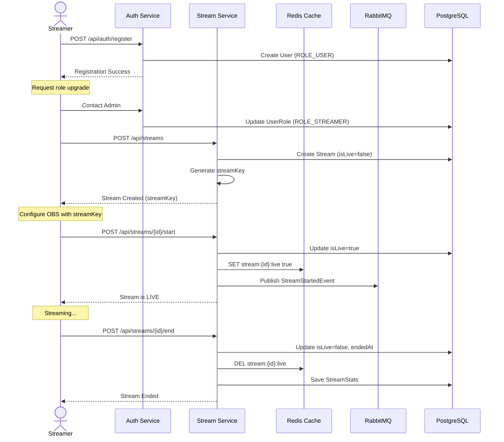
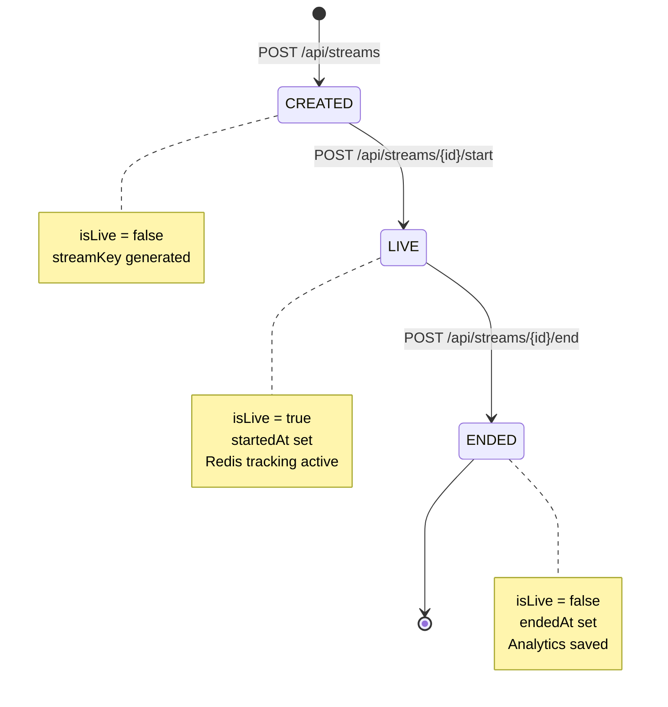

# Business Flows & Use Cases

> **Mục đích**: Tài liệu mô tả các use cases nghiệp vụ, user flows, và business rules của hệ thống Livestream Platform.  
> **Đối tượng**: Product Owners, Business Analysts, Developers, Stakeholders  
> **Cập nhật**: 2025-12-18

---

## 📖 Table of Contents

1. [Core Use Cases](#core-use-cases)
2. [User Flows](#user-flows)
3. [Business Rules](#business-rules)
4. [State Transitions](#state-transitions)

---

## Core Use Cases

### UC-01: User Registration & Authentication

**Actors**: Guest User, Registered User  
**Goal**: Tạo tài khoản và đăng nhập vào hệ thống

**Main Flow**:
1. Guest truy cập platform
2. Chọn "Register" và nhập thông tin (username, email, password)
3. Hệ thống tạo tài khoản với role mặc định `ROLE_USER`
4. User đăng nhập bằng username/password
5. Hệ thống trả về JWT tokens (Access Token + Refresh Token)
6. User có thể truy cập các tính năng authenticated

**Business Value**: Cho phép users tham gia platform và quản lý identity

**Related APIs**:
- `POST /api/auth/register`
- `POST /api/auth/login`
- `POST /api/auth/refresh`
- `POST /api/auth/logout`

---

### UC-02: Streamer Creates Livestream

**Actors**: Streamer (user với `ROLE_STREAMER`)  
**Goal**: Tạo và quản lý livestream session

**Preconditions**: 
- User đã đăng nhập
- User có role `ROLE_STREAMER` hoặc `ROLE_ADMIN`

**Main Flow**:
1. Streamer tạo stream mới với title và description
2. Hệ thống generate unique `streamKey`
3. Streamer cấu hình OBS với streamKey (hoặc dùng simulation API)
4. Streamer bắt đầu stream → Status chuyển sang `LIVE`
5. Hệ thống notify followers về stream mới
6. Streamer kết thúc stream → Status chuyển sang `ENDED`
7. Hệ thống lưu analytics (peak viewers, revenue, duration)

**Business Value**: Cho phép content creators phát sóng và tương tác với audience

**Related APIs**:
- `POST /api/streams` - Tạo stream
- `POST /api/streams/{id}/start` - Bắt đầu live
- `POST /api/streams/{id}/end` - Kết thúc live
- `PUT /api/streams/{id}` - Cập nhật metadata

---

### UC-03: Viewer Watches Stream

**Actors**: Viewer (authenticated user hoặc guest)  
**Goal**: Xem livestream và tham gia tương tác

**Main Flow**:
1. Viewer browse danh sách streams đang live
2. Chọn stream để xem
3. Hệ thống track viewer (Redis HyperLogLog)
4. Viewer có thể:
   - Xem video stream (giả lập - không có media server thật)
   - Đọc chat messages
   - Gửi chat messages (nếu authenticated)
   - Tặng quà cho streamer (nếu có balance)
5. Viewer rời stream → Hệ thống update viewer count

**Business Value**: Tạo audience engagement và monetization opportunities

**Related APIs**:
- `GET /api/streams` - Browse live streams
- `GET /api/streams/{id}` - Stream details
- `GET /api/streams/{id}/viewers` - Realtime viewer count
- WebSocket `/topic/chat.{streamId}` - Chat subscription

---

### UC-04: Real-time Chat Interaction

**Actors**: Authenticated User, Streamer  
**Goal**: Tương tác real-time qua chat trong livestream

**Preconditions**:
- User đã đăng nhập
- User không bị mute trong stream

**Main Flow**:
1. User join stream room (WebSocket connection)
2. User gửi chat message
3. Hệ thống validate:
   - User authenticated
   - User không bị mute
4. Message được publish qua Redis Pub/Sub (realtime broadcast)
5. Message được gửi vào RabbitMQ queue (async persistence)
6. Tất cả viewers trong room nhận message qua WebSocket
7. RabbitMQ consumer lưu message vào DB

**Alternative Flow - Mute User**:
- Streamer/Admin có thể mute user
- Muted user không thể gửi message (check Redis Set)
- Mute có thời hạn (TTL trong Redis)

**Business Value**: Tạo community engagement và real-time interaction

**Related APIs**:
- WebSocket `/app/chat.send` - Gửi message
- WebSocket `/topic/chat.{streamId}` - Nhận messages
- `GET /api/chat/{streamId}/history` - Lịch sử chat
- `POST /api/chat/{streamId}/mute` - Mute user

---

### UC-05: Gift Sending & Wallet Management

**Actors**: Viewer (Sender), Streamer (Receiver)  
**Goal**: Tặng quà ảo cho streamer và quản lý virtual currency

**Preconditions**:
- Sender đã đăng nhập
- Sender có đủ balance trong wallet

**Main Flow**:
1. Viewer browse gift catalog
2. Chọn gift và số lượng
3. Hệ thống tính total amount = gift price × quantity
4. **Atomic Transaction**:
   - Trừ tiền từ wallet của Viewer (Optimistic Locking)
   - Nếu không đủ tiền → Throw `InsufficientBalanceException`
5. **Async Processing** (RabbitMQ):
   - Publish `GiftEvent` vào queue
   - Consumer xử lý:
     - Cộng tiền vào wallet của Streamer
     - Tạo Transaction record
     - Broadcast "Donation Alert" vào chat room
     - Update leaderboard (Redis Sorted Set)
6. Viewer và Streamer nhận notification

**Business Value**: Monetization model cho platform và streamers

**Related APIs**:
- `GET /api/gifts` - Gift catalog
- `POST /api/gifts/send` - Tặng quà
- `GET /api/users/{userId}/wallet` - Xem balance
- `GET /api/users/{userId}/transactions` - Lịch sử giao dịch

---

### UC-06: Analytics & Leaderboard

**Actors**: Viewer (Public), Streamer (Owner), Admin  
**Goal**: Xem thống kê và bảng xếp hạng

**Main Flow - Public Leaderboard**:
1. User truy cập leaderboard
2. Hệ thống query Redis Sorted Set
3. Hiển thị top gifters (daily/weekly/all-time)

**Main Flow - Stream Analytics**:
1. Streamer/Admin xem báo cáo stream
2. Hệ thống aggregate data:
   - Peak viewers (Redis HyperLogLog)
   - Total views
   - Total gifts received
   - Revenue breakdown
3. Hiển thị dashboard

**Business Value**: Gamification và transparency cho community

**Related APIs**:
- `GET /api/analytics/leaderboard` - Public leaderboard
- `GET /api/analytics/streams/{id}/report` - Stream report (Owner/Admin)
- `GET /api/analytics/dashboard` - System dashboard (Admin only)

---

### UC-07: Admin Moderation

**Actors**: Admin  
**Goal**: Quản lý users, streams, và system health

**Main Flow**:
1. Admin login với `ROLE_ADMIN`
2. Admin có thể:
   - Xem danh sách tất cả users
   - Ban/Unban users
   - Thay đổi roles (promote user to STREAMER)
   - Xóa streams vi phạm
   - Xem tất cả transactions (audit trail)
   - Refund transactions nếu cần
3. Hệ thống log tất cả admin actions

**Business Value**: Platform governance và user safety

**Related APIs**:
- `GET /api/admin/users` - User management
- `POST /api/admin/users/{id}/ban` - Ban user
- `PUT /api/admin/users/{id}/roles` - Change roles
- `GET /api/admin/transactions` - Audit transactions

---

## User Flows

### Flow 1: Streamer Lifecycle Journey

---

### Flow 2: Viewer Journey

---

### Flow 3: Gift Transaction Flow

---

### Flow 4: Authentication & Session Management

---

## Business Rules

### Authentication & Authorization

| Rule ID | Description | Enforcement |
|---------|-------------|-------------|
| BR-01 | Mọi user mới đăng ký đều có role `ROLE_USER` mặc định | `AuthService.register()` |
| BR-02 | Chỉ ADMIN mới có thể promote user lên `ROLE_STREAMER` | `@PreAuthorize("hasRole('ADMIN')")` |
| BR-03 | Access Token có TTL 15 phút, Refresh Token 30 ngày | `JwtTokenProvider` config |
| BR-04 | Refresh Token phải được validate với session trong DB | `AuthService.refresh()` |
| BR-05 | Logout phải revoke session (set status=REVOKED) | `AuthService.logout()` |

### Stream Management

| Rule ID | Description | Enforcement |
|---------|-------------|-------------|
| BR-06 | Chỉ STREAMER/ADMIN mới được tạo stream | `@PreAuthorize("hasAnyRole('STREAMER', 'ADMIN')")` |
| BR-07 | Chỉ owner hoặc ADMIN mới được update/end stream | `@streamService.isStreamOwner()` |
| BR-08 | Stream key phải unique trong hệ thống | `StreamRepository.existsByStreamKey()` |
| BR-09 | Một stream chỉ có thể ở 1 trong 3 states: CREATED, LIVE, ENDED | State machine enforcement |
| BR-10 | Khi stream end, phải lưu analytics vào DB | `StreamService.endStream()` |

### Chat & Moderation

| Rule ID | Description | Enforcement |
|---------|-------------|-------------|
| BR-11 | Chỉ authenticated users mới được gửi chat | WebSocket authentication |
| BR-12 | Muted users không thể gửi message | Redis Set check `muted:{streamId}` |
| BR-13 | Chỉ stream owner/ADMIN mới được mute users | `@PreAuthorize` |
| BR-14 | Mute có thời hạn (TTL), tự động unmute khi hết hạn | Redis TTL |
| BR-15 | Chat messages phải được persist vào DB (async) | RabbitMQ consumer |

### Wallet & Transactions

| Rule ID | Description | Enforcement |
|---------|-------------|-------------|
| BR-16 | Mỗi user chỉ có 1 wallet duy nhất | Unique constraint `userId` |
| BR-17 | Balance không được âm | Check trước khi deduct |
| BR-18 | Gift transaction phải atomic (deduct + publish) | `@Transactional` |
| BR-19 | Nếu deduct fail, không được publish event | Try-catch logic |
| BR-20 | Transaction status: PENDING → COMPLETED/FAILED | State machine |

### Analytics

| Rule ID | Description | Enforcement |
|---------|-------------|-------------|
| BR-21 | Viewer count dùng HyperLogLog (unique users) | Redis `PFADD` |
| BR-22 | Leaderboard update real-time khi có gift | Redis Sorted Set `ZINCRBY` |
| BR-23 | Stream analytics chỉ owner/ADMIN xem được | `@PreAuthorize` |
| BR-24 | System dashboard chỉ ADMIN xem được | `hasRole('ADMIN')` |

---

## State Transitions

### Stream State Machine

### Transaction State Machine

### User Session State Machine

---

## Cross-References

### Business Flow → Technical Implementation

| Business Flow | Technical Components |
|---------------|---------------------|
| UC-01: Authentication | JWT + Session-backed Refresh Token ([System Design](system_design_livestream.md#41-xác-thực--phân-quyền-rbac)) |
| UC-02: Streaming | Redis Live Status + WebSocket ([System Design](system_design_livestream.md#42-quản-lý-stream-webhook-giả-lập)) |
| UC-04: Chat | Redis Pub/Sub + RabbitMQ Persistence ([System Design](system_design_livestream.md#43-hệ-thống-chat-real-time)) |
| UC-05: Gifts | Atomic Wallet + Async Processing ([System Design](system_design_livestream.md#44-ví--hệ-thống-tặng-quà-dòng-tiền)) |
| UC-06: Analytics | Redis HyperLogLog + Sorted Sets ([System Design](system_design_livestream.md#45-analytics-redis-hll--sorted-sets)) |

### Use Case → API Endpoints

| Use Case | API Endpoints |
|----------|---------------|
| UC-01 | [Authentication APIs](api_endpoints_specification.md#21-authentication-apiauth) |
| UC-02 | [Stream Management APIs](api_endpoints_specification.md#23-stream-management-apistreams) |
| UC-03 | [Stream Viewing APIs](api_endpoints_specification.md#23-stream-management-apistreams) |
| UC-04 | [Chat APIs](api_endpoints_specification.md#24-chat-apichat) |
| UC-05 | [Gift & Transaction APIs](api_endpoints_specification.md#25-gifts--transactions-apigifts-apitransactions) |
| UC-06 | [Analytics APIs](api_endpoints_specification.md#26-analytics-apianalytics) |
| UC-07 | [Admin APIs](api_endpoints_specification.md#27-admin-apiadmin) |

### Use Case → Implementation Phase

| Use Case | Implementation Phase |
|----------|---------------------|
| UC-01 | [Phase 3: Authentication](implementation/phase-3-authentication.md) |
| UC-02 | [Phase 4: Stream Management](implementation/phase-4-streaming.md) |
| UC-04 | [Phase 6: Real-time Chat](implementation/phase-6-realtime-chat.md) |
| UC-05 | [Phase 5: Economy](implementation/phase-5-economy.md) + [Phase 7: Gifts](implementation/phase-7-gifts.md) |
| UC-06 | [Phase 8: Analytics](implementation/phase-8-analytics.md) |
| UC-07 | [Phase 9: Admin](implementation/phase-9-admin.md) |

---

**Next Steps**: 
- Đọc [System Design](system_design_livestream.md) để hiểu technical architecture
- Xem [Implementation Roadmap](implementation/000_ROADMAP.md) để theo dõi progress
- Check [API Specification](api_endpoints_specification.md) cho endpoint details
