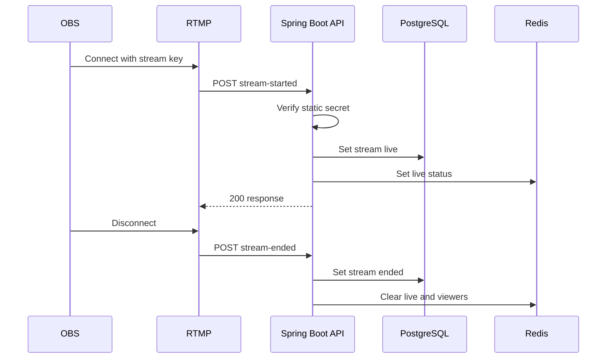

# RTMP Webhook: Concepts, Current Flow và Hardening

> Trạng thái: `CURRENT + SEC-05 TARGET`<br>
> Cập nhật: 2026-07-25

Webhook là endpoint do một external service gọi khi sự kiện xảy ra. Trong project này, RTMP server được mô phỏng gọi backend khi OBS bắt đầu hoặc kết thúc stream. Webhook xác thực service identity, không dùng user JWT.

## 1. Current flow



Endpoints:

- `POST /api/webhooks/rtmp/stream-started`
- `POST /api/webhooks/rtmp/stream-ended`

Current request dùng `RtmpWebhookRequest` có `streamKey`; caller gửi `X-Webhook-Secret`.

## 2. Tại sao webhook thay user action

Nút “Go Live” không chứng minh media stream đã tới RTMP server. Event từ RTMP server gần source hơn với sự thật “stream thực sự connected”. Dù vậy, webhook vẫn có thể duplicate, đến trễ, out-of-order hoặc bị giả mạo.

## 3. Current limitations

- Secret tĩnh có default development value.
- So sánh secret trực tiếp; chưa có key ID/rotation.
- Không ký raw body bằng HMAC.
- Không có timestamp window hoặc event ID chống replay.
- Start lặp lại có thể reset `startedAt`; start/end đồng thời chưa có transition guard.
- Stream key đang xuất hiện trong log và public `StreamDTO`.
- DB update và Redis side effect không phải một atomic transaction.

## 4. SEC-05 target contract

Headers dự kiến:

```text
X-Webhook-Key-Id: rtmp-key-2026-01
X-Webhook-Timestamp: <unix-seconds>
X-Webhook-Event-Id: <unique-id>
X-Webhook-Signature: sha256=<hex-hmac>
```

Signature phải bind timestamp, event ID và raw request body. Backend:

1. Chọn secret theo key ID.
2. Reject timestamp ngoài cửa sổ cho phép.
3. Tính HMAC trên bytes gốc và so sánh constant-time.
4. Claim event ID bằng unique constraint/idempotency store.
5. Áp state transition có guard.
6. Ghi audit metadata đã redact, không log stream key/signature.

## 5. Failure cases phải test

| Case | Expected behavior |
| --- | --- |
| Missing/invalid signature | `401`, không đổi state |
| Timestamp quá cũ/tương lai | Reject |
| Duplicate event ID | Idempotent response, không chạy side effect lần hai |
| End trước start | Theo state-machine decision, không âm thầm tạo state sai |
| Hai start đồng thời | Chỉ một valid transition |
| DB commit, Redis fail | DB là source of truth; có metric/recovery path |
| Secret rotation | Old/new key overlap theo window có giới hạn |

## 6. Development testing

Cho tới khi có media server thật, dùng `.http`/curl hoặc test fixture để mô phỏng caller. Secret chỉ lấy từ development/test configuration; không hard-code production credential trong repository.
