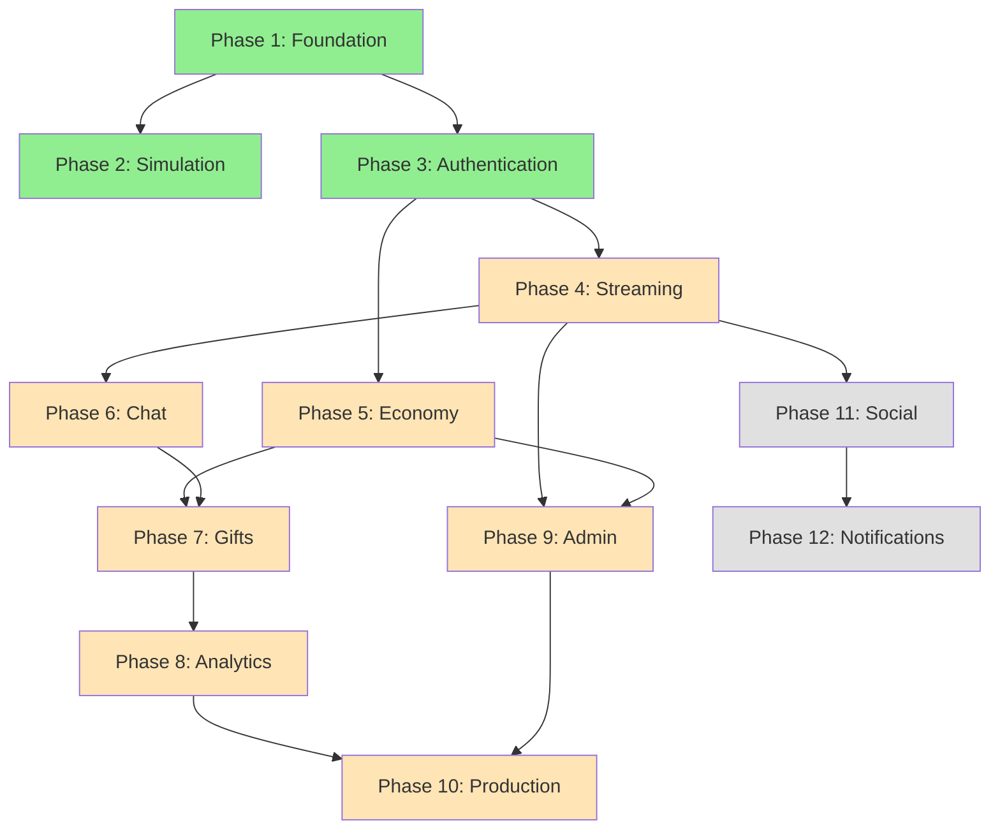

# Implementation Roadmap

> **Mục đích**: Tổng quan về lộ trình implementation của Spring Boot Livestream Backend  
> **Cập nhật**: 2025-12-18

---

## 📖 Navigation

Mỗi phase được document riêng biệt để dễ theo dõi và implement:

| Phase | Status | Business Goals | Document |
|-------|--------|----------------|----------|
| **Phase 1** | ✅ DONE | Infrastructure setup | [phase-1-foundation.md](phase-1-foundation.md) |
| **Phase 2** | ✅ DONE | Development simulation & testing | [phase-2-simulation.md](phase-2-simulation.md) |
| **Phase 3** | ✅ DONE | User identity & authentication | [phase-3-authentication.md](phase-3-authentication.md) |
| **Phase 4** | 🔄 TODO | Core livestream functionality | [phase-4-streaming.md](phase-4-streaming.md) |
| **Phase 5** | 🔄 TODO | Virtual economy foundation | [phase-5-economy.md](phase-5-economy.md) |
| **Phase 6** | 🔄 TODO | Real-time community interaction | [phase-6-realtime-chat.md](phase-6-realtime-chat.md) |
| **Phase 7** | 🔄 TODO | Monetization mechanism | [phase-7-gifts.md](phase-7-gifts.md) |
| **Phase 8** | 🔄 TODO | Data insights & gamification | [phase-8-analytics.md](phase-8-analytics.md) |
| **Phase 9** | 🔄 TODO | Platform governance | [phase-9-admin.md](phase-9-admin.md) |
| **Phase 10** | 🔄 TODO | Production deployment readiness | [phase-10-production.md](phase-10-production.md) |
| **Phase 11** | 🔄 OPTIONAL | Social networking features | [phase-11-social.md](phase-11-social.md) |
| **Phase 12** | 🔄 OPTIONAL | Notification system | [phase-12-notifications.md](phase-12-notifications.md) |

---

## 🎯 Current Status

**Completed**: Phases 1-3  
**Next Up**: Phase 4 (Stream Management Module)  
**Overall Progress**: 3/12 phases (25%)

---

## 📊 Phase Dependencies

**Legend**:
- 🟢 Green: Completed
- 🟡 Orange: In Progress / Next
- ⚪ Gray: Optional

---

## 🚀 Quick Start Guide

### For New Developers

1. **Understand Business Context**
   - Read [Business Flows](../business_flows.md) để hiểu use cases
   - Xem sequence diagrams để nắm user journeys

2. **Review System Design**
   - Đọc [System Design](../system_design_livestream.md) để hiểu architecture
   - Nắm rõ lý do chọn công nghệ (Redis, RabbitMQ, PostgreSQL)

3. **Check Current Phase**
   - Xem table ở trên để biết phase nào đang active
   - Đọc phase document tương ứng

4. **Follow Implementation**
   - Mỗi phase có checklist chi tiết
   - Follow verification steps để test

### For Stakeholders

- **Business Value Tracking**: Xem cột "Business Goals" trong table
- **Progress Monitoring**: Check "Status" column
- **Feature Availability**: Completed phases = features ready to use

---

## 📝 Phase Breakdown Summary

### ✅ Completed Phases

#### Phase 1: Foundation & Infrastructure
- **Business Value**: Platform infrastructure ready
- **Deliverables**: Docker Compose, Spring Boot setup, common utilities
- **Use Cases Enabled**: None (foundation only)

#### Phase 2: Development Simulation APIs
- **Business Value**: Fast development & testing without external dependencies
- **Deliverables**: Simulation endpoints for stream start/end, payment deposit
- **Use Cases Enabled**: Testing infrastructure

#### Phase 3: Authentication & User Management
- **Business Value**: User identity & access control
- **Deliverables**: JWT auth, RBAC, user profile management
- **Use Cases Enabled**: UC-01 (User Registration & Authentication)

---

### 🔄 Upcoming Phases

#### Phase 4: Stream Management Module (NEXT)
- **Business Value**: Core livestream functionality
- **Deliverables**: Stream CRUD, live status tracking, viewer count
- **Use Cases Enabled**: UC-02 (Streamer Creates Livestream), UC-03 (Viewer Watches Stream)
- **Dependencies**: Phase 3 (Authentication)

#### Phase 5: Economy & Transaction System
- **Business Value**: Virtual currency foundation for monetization
- **Deliverables**: Wallet management, transaction history, atomic operations
- **Use Cases Enabled**: UC-05 (Wallet Management)
- **Dependencies**: Phase 3 (Authentication)

#### Phase 6: Real-time Chat System
- **Business Value**: Community engagement through real-time interaction
- **Deliverables**: WebSocket chat, Redis Pub/Sub, message persistence
- **Use Cases Enabled**: UC-04 (Real-time Chat Interaction)
- **Dependencies**: Phase 4 (Streaming)

#### Phase 7: Gift System & Async Processing
- **Business Value**: Monetization mechanism for streamers
- **Deliverables**: Gift catalog, send gift flow, RabbitMQ async processing
- **Use Cases Enabled**: UC-05 (Gift Sending)
- **Dependencies**: Phase 5 (Economy), Phase 6 (Chat for alerts)

#### Phase 8: Analytics & Leaderboard
- **Business Value**: Data insights & gamification
- **Deliverables**: Viewer tracking, leaderboard, stream reports
- **Use Cases Enabled**: UC-06 (Analytics & Leaderboard)
- **Dependencies**: Phase 7 (Gifts for leaderboard data)

#### Phase 9: Admin Management Module
- **Business Value**: Platform governance & user safety
- **Deliverables**: User management, moderation tools, audit trail
- **Use Cases Enabled**: UC-07 (Admin Moderation)
- **Dependencies**: Phase 4 (Streams), Phase 5 (Transactions)

#### Phase 10: Production Readiness & Polish
- **Business Value**: Deployment-ready platform
- **Deliverables**: Security hardening, performance optimization, monitoring
- **Use Cases Enabled**: Production deployment
- **Dependencies**: Phases 8, 9

---

### 🔮 Optional Phases

#### Phase 11: Social Features
- **Business Value**: Social networking & user engagement
- **Deliverables**: Follow/unfollow, followers list, social graph
- **Use Cases Enabled**: Social interactions
- **Dependencies**: Phase 4 (Streaming)

#### Phase 12: Notification System
- **Business Value**: User engagement through timely notifications
- **Deliverables**: Real-time notifications, notification history
- **Use Cases Enabled**: Event notifications
- **Dependencies**: Phase 11 (Social for follower notifications)

---

## 🎯 Implementation Strategy

### Philosophy
- **Business-First**: Mỗi phase bắt đầu với business goals
- **Incremental**: Mỗi phase có thể test độc lập
- **Pragmatic**: Simulation APIs cho phép test mà không cần external services

### Best Practices
1. **Read Phase Document First**: Hiểu business context trước khi code
2. **Follow Checklist**: Mỗi phase có checklist chi tiết
3. **Verify Early**: Test sau mỗi component, không đợi đến cuối phase
4. **Document As You Go**: Update docs khi có thay đổi

### Testing Approach
- **Unit Tests**: Test business logic trong Services
- **Integration Tests**: Test API endpoints với authorization
- **Manual Testing**: Follow user scenarios trong verification plan

---

## 📚 Related Documentation

- [Business Flows](../business_flows.md) - Use cases & user journeys
- [System Design](../system_design_livestream.md) - Technical architecture
- [API Specification](../api_endpoints_specification.md) - Endpoint details
- [API Roadmap](../api_roadmap.md) - API implementation order
- [Coding Rules](../agent/rules/coding-rule.md) - Development standards

---

## 🔄 How to Update This Document

Khi complete một phase:
1. Update status từ 🔄 TODO → ✅ DONE
2. Update "Current Status" section
3. Update progress percentage
4. Update dependency diagram colors

Khi bắt đầu phase mới:
1. Mark phase as 🔄 IN PROGRESS
2. Update "Next Up" trong Current Status
3. Create detailed phase document nếu chưa có
