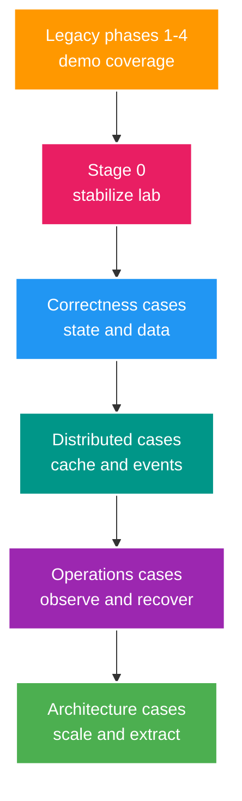

# Current Implementation Map

> Trạng thái: `CURRENT CODE COVERAGE` 
> Cập nhật: 2026-07-25 
> Đây không còn là roadmap điều phối công việc. Roadmap học chuẩn là [Senior Java Interview Roadmap](../001_SENIOR_JAVA_INTERVIEW_ROADMAP.md). 
> Product phase plan 1-12 cũ được lưu tại [archive](../archive/2025-product-roadmap/implementation/overview.md).

## 1. Từ phase cũ sang learning cases

## 2. Capability coverage hiện tại

| Capability | Evidence trong code | Status |
| --- | --- | --- |
| Foundation | Spring Boot, PostgreSQL, Redis, RabbitMQ config, Docker Compose | Demo available |
| Simulation | Deposit DTO, infra test endpoints, RTMP webhook có thể gọi thủ công | Demo available; dev profile isolation pending |
| Authentication | Register/login/refresh/logout/session/RBAC | Demo available; SEC-01/02 pending |
| Stream | Create/list/detail/my, webhook start/end, HLL viewers | Demo available; SEC-03/CON-01/DB-01 pending |
| Durable wallet/gift | Không có wallet entity, ledger, gift hoặc transaction | Not implemented |
| Chat/WebSocket | Dependency only | Not implemented |
| Business messaging | RabbitMQ test publish only | Not implemented |
| Kafka/microservice/replica/partition | Không có implementation | Not implemented |
| Testing/observability | Một smoke test, application/P6Spy log | Laboratory not stable |

## 3. Active priority

Thứ tự bắt đầu:

1. `SEC-01` token type và auth matcher.
2. `TEST-01` hermetic integration test.
3. `SEC-02` logout-all/cache invalidation.
4. `CON-01` stream state transition.
5. `DB-01` N+1/pagination.
6. `WAL-01` durable wallet/ledger concurrency.

Không phục hồi Phase 5-12 thành active checklist. Business idea hữu ích từ chúng được map vào case backlog trong Senior roadmap khi case được kích hoạt.

## 4. Status rules

- `Demo available`: happy path có code, không đồng nghĩa correct/resilient/operable.
- `Not implemented`: dependency, TODO hoặc document không tính là implementation.
- Capability chỉ tăng maturity khi có link tới test, experiment, metric hoặc runbook tương ứng.
- Current behavior lấy từ code/test; intended behavior lấy từ business/API contract.
