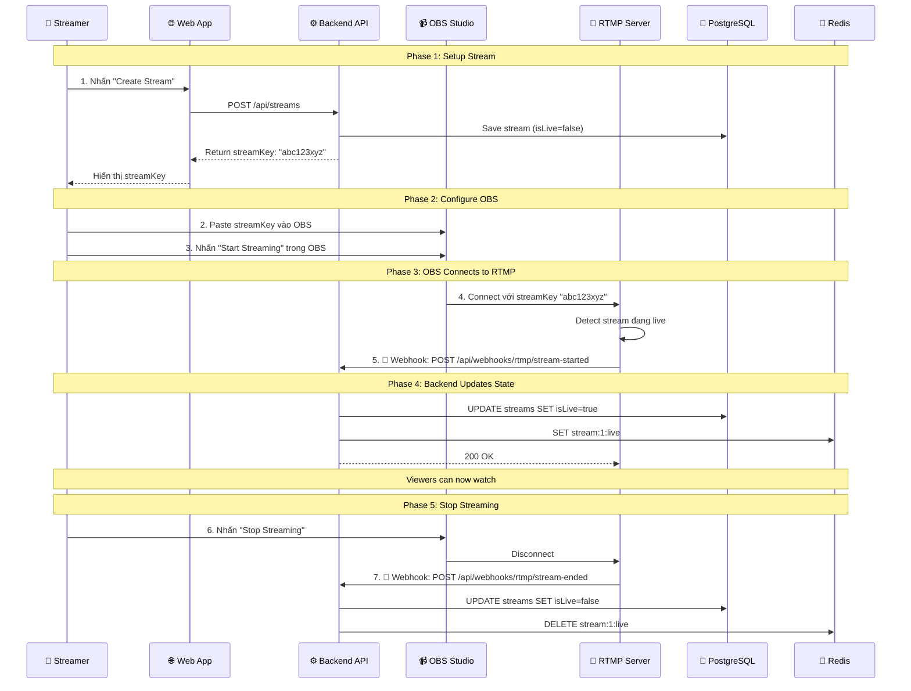

# Phase 4: Module Quản lý Livestream (Streaming)

> **Trạng thái**: ✅ DONE  
> **Phụ thuộc**: Phase 3 (Authentication & User Management)  
> **Cập nhật**: 2025-12-18

---

## Mục tiêu Nghiệp vụ

### Use Cases Đáp ứng

- **UC-02**: Streamer tạo Livestream
- **UC-03**: Viewer xem Stream

### Giá trị Nghiệp vụ mang lại

- ✅ Streamers có thể tạo và quản lý các phiên livestream
- ✅ Viewers có thể tìm kiếm và xem các luồng live
- ✅ Theo dõi số lượng người xem thực tế (Redis HyperLogLog)
- ✅ Quản lý vòng đời stream (Tạo → Live → Kết thúc)

### User Flows

- [Streamer Lifecycle Journey](../business_flows.md#flow-1-streamer-lifecycle-journey)
- [Viewer Journey](../business_flows.md#flow-2-viewer-journey)

---

## Triển khai Kỹ thuật

### 4.1. Mô hình Dữ liệu Core (`Stream`)

| Trường       | Kiểu dữ liệu | Ghi chú                                           |
| ------------ | ------------ | ------------------------------------------------- |
| `id`         | Long         | Khóa chính (Primary Key)                          |
| `creatorId`  | Long         | FK tới User (Tham chiếu thủ công)                 |
| `streamKey`  | String       | Unique, dùng cho phần mềm livestream (OBS/FFmpeg) |
| `title/desc` | String/Text  | Metadata (Tiêu đề/Mô tả)                          |
| `status`     | Enum         | Trạng thái: `CREATED`, `LIVE`, `ENDED`            |
| `startedAt`  | Timestamp    | Thiết lập khi status → `LIVE`                     |
| `endedAt`    | Timestamp    | Thiết lập khi status → `ENDED`                    |

### 4.2. Thiết kế API & Bảo mật

> [!NOTE]
> Các thông số chi tiết về API và quy tắc phân quyền đã được quy định tại Single Source of Truth:
> 👉 **[api_endpoints_specification.md > 2.3. Stream Management](../api_endpoints_specification.md#stream-management)**

**Điểm lưu ý khi triển khai:**

- **Công khai (Public)**: Xem danh sách stream và số người xem.
- **Phân quyền Role (RBAC)**: Chỉ `STREAMER` hoặc `ADMIN` mới được phép tạo stream.
- **Quyền sở hữu (Ownership)**: Cập nhật metadata yêu cầu người dùng là `creatorId`.

#### 🔴 Stream Lifecycle: Webhook Architecture

> [!IMPORTANT]
> **Stream start/end được quản lý qua RTMP Webhooks, không phải user-facing API endpoints.**
> Xem chi tiết: [Webhook Documentation](../concepts/webhooks.md)

**Flow thực tế:**



**Endpoints:**

| Controller           | Endpoint                              | Purpose                          | Auth                 |
| -------------------- | ------------------------------------- | -------------------------------- | -------------------- |
| **StreamController** | `POST /api/streams`                   | Tạo stream mới                   | STREAMER + ADMIN     |
| **StreamController** | `GET /api/streams`                    | Danh sách stream live            | Public               |
| **StreamController** | `GET /api/streams/{id}`               | Chi tiết stream                  | Public               |
| **StreamController** | `POST /api/streams/{id}/view`         | Track viewer (HyperLogLog)       | Public               |
| **StreamController** | `GET /api/streams/{id}/viewers`       | Số người xem hiện tại            | Public               |
| **WebhookController**| `POST /api/webhooks/rtmp/stream-started` | RTMP callback khi OBS start   | X-Webhook-Secret     |
| **WebhookController**| `POST /api/webhooks/rtmp/stream-ended`   | RTMP callback khi OBS stop    | X-Webhook-Secret     |

**Dev Testing:**
Dev có thể test webhook bằng cách gọi trực tiếp endpoint với secret key:
```http
POST /api/webhooks/rtmp/stream-started
X-Webhook-Secret: dev-secret-key
{"streamKey": "abc123xyz"}
```

### 4.3. Logic Nghiệp vụ (Pseudo-code)

#### A. Tạo Stream

```
1. Kiểm tra currentUser phải có ROLE_STREAMER
2. Tạo mã stream_key duy nhất (UUID hoặc NanoID)
3. Lưu bản ghi Stream với status = CREATED
4. Trả về StreamDTO
```

#### B. Bắt đầu Stream (Go Live)

```
1. RTMP server gọi POST /api/webhooks/rtmp/stream-started
2. Verify X-Webhook-Secret header
3. Tìm stream bằng streamKey
4. Cập nhật DB: isLive = true, startedAt = NOW
5. Đồng bộ Cache (Redis):
   - Set "stream:{id}:live" = "true" (TTL 24h)
6. TODO (Phase 6): Publish tới RabbitMQ: "stream.started"
```

#### C. Webhook: Kết thúc Stream (từ RTMP Server)

```
1. RTMP server gọi POST /api/webhooks/rtmp/stream-ended
2. Verify X-Webhook-Secret header
3. Tìm stream bằng streamKey
4. Lấy finalViewerCount từ HyperLogLog: PFCOUNT "stream:{id}:viewers"
5. Cập nhật DB: isLive = false, endedAt = NOW
6. Clear Redis: DELETE "stream:{id}:live"
7. TODO (Phase 6): Publish tới RabbitMQ: "stream.ended"
```

#### D. Theo dõi người xem thời gian thực (Redis)

```python
# Khi viewer tham gia/ping luồng stream
def track_viewer(stream_id, user_id):
    redis.PFADD(f"stream:{stream_id}:viewers", user_id)

# Lấy số lượng người xem hiện tại
def get_count(stream_id):
    return redis.PFCOUNT(f"stream:{stream_id}:viewers")
```

---

## Thiết kế Hạ tầng

### Chiến lược Lưu trữ

- **PostgreSQL**: Nguồn dữ liệu tin cậy (Source of Truth) cho tất cả metadata và lịch sử stream.
- **Redis (HyperLogLog)**: Đếm số lượng người xem duy nhất với độ phức tạp O(1) và tốn rất ít bộ nhớ cố định (~12KB mỗi stream).
- **RabbitMQ**: Tách rời (decoupling) các sự kiện stream khỏi logic cốt lõi (ví dụ: việc gửi push notification sẽ không làm chậm API).

---

## Kế hoạch Xác minh (Verification Plan)

### Kiểm thử Tự động (Automated Tests)

- **Unit**: Mock DB/Redis để test các bước chuyển đổi trạng thái trong `StreamService`.
- **Integration**: Sử dụng `MockMvc` + `@WithMockUser` để xác thực RBAC (Role-Based Access Control).

### Xác minh Thủ công

1. **Luồng chuẩn**: Tạo → Bắt đầu → Kiểm tra danh sách → Kết thúc → Kiểm tra lịch sử.
2. **Bảo mật**: Xác nhận `USER` không thể tạo stream; người không phải chủ sở hữu không thể bắt đầu/kết thúc stream.
3. **Redis**: Sử dụng `redis-cli PFCOUNT` để kiểm tra độ chính xác của việc theo dõi người xem.

---

## Ghi chú & Ràng buộc

- **Concurrency (Đồng thời)**: Sử dụng `@Transactional` cho các cập nhật trạng thái.
- **Performance (Hiệu năng)**: Việc liệt kê stream cần truy vấn `status = LIVE` đi kèm với index.
- **Khả năng mở rộng**: `streamKey` được tách biệt hoàn toàn khỏi DB ID để ẩn cấu trúc nội bộ hệ thống khỏi các công cụ livestream.
