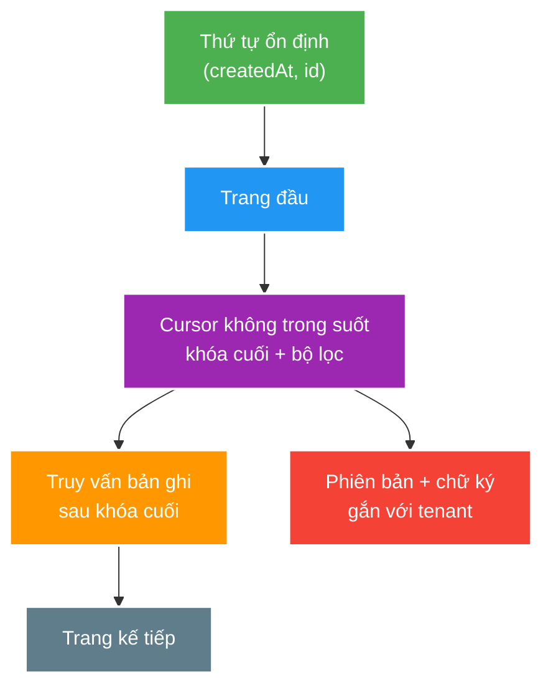

# Phân trang API, tiến hóa phiên bản và ranh giới mạng

> Type: `CORE` 
> Domain: `architecture` 
> Target depth: `D3 — thiết kế hợp đồng phân trang/tiến hóa và kiểm chứng hành vi qua proxy, retry và thao tác ghi đồng thời` 
> Teaching readiness: `TEACHABLE_DRAFT` 
> Status: `DRAFT` 
> Evidence status: `NOT RUN` 
> Prerequisites: [HTTP semantics](http-rest-semantics-and-idempotency.md), database ordering fundamentals 
> Related cases: [`FEED-UC-01`](../../../../use-case-catalog.md#31-foundation-và-senior-cases), [`API-UC-01`](../../../../use-case-catalog.md#32-architect-và-expert-cases) 
> Owner: `Project learner; Codex assists` 
> Updated: `2026-07-26`

Source canonical cho [API boundary question bank](../../question-bank/api-pagination-versioning-and-network-boundaries.md).

## 0. Cách học file này

Mô phỏng insert/delete giữa từng page và kiểm tra skip/duplicate. Với evolution, chạy old/new client-server matrix. Với network, test qua gateway thật hoặc cấu hình tương đương vì buffering/limits/retry không xuất hiện trong controller unit test.

## 1. Mục tiêu học

1. Chọn `offset`, `cursor` hoặc `keyset pagination` theo cách sắp xếp, mức độ dữ liệu thay đổi và nhu cầu chuyển trang.
2. Tiến hóa request/response mà vẫn giữ tương thích, có lộ trình ngừng hỗ trợ và kế hoạch chuyển đổi.
3. Xử lý giới hạn của proxy/gateway, quota, timeout và ranh giới của response từng phần hoặc streaming.

## 2. Mental model do người dạy cung cấp

Pagination (phân trang) là quá trình duyệt một tập dữ liệu có thứ tự kỳ vọng, chứ không chỉ là thêm `LIMIT` vào SQL. Cursor phải mô tả vị trí theo một **total order** — thứ tự mà mọi bản ghi đều phân biệt được — rồi truy vấn trang tiếp theo bằng quan hệ “đứng sau bộ khóa cuối”. API evolution là việc thay đổi hợp đồng mà client cũ và server mới vẫn có thể cùng hoạt động trong một khoảng chuyển tiếp. Gateway cũng là một thành phần của hợp đồng vì nó có giới hạn và hành vi riêng.

## 3. Cơ chế cốt lõi

`Offset pagination` dễ nhảy tới trang bất kỳ, nhưng database vẫn phải đi qua số lượng bản ghi ngày càng lớn trước khi lấy kết quả. Khi có insert/delete giữa hai lần gọi, vị trí số học bị dịch nên client có thể bỏ sót hoặc đọc lặp. `Keyset pagination` dùng khóa cuối đã nhìn thấy trong một thứ tự ổn định; cursor đóng gói khóa này cùng chiều duyệt, bộ lọc và phiên bản. Nếu khóa sắp xếp không duy nhất thì phải thêm `tie-breaker` (khóa phân xử), thường là `id`.

Tính tương thích không chỉ nằm ở tên trường JSON. HTTP status, header, giá trị mặc định, thứ tự, khả năng nhận `null`, error code, quy tắc phân trang và authorization đều là một phần của hợp đồng. Thay đổi chỉ thêm trường thường ít rủi ro hơn, nhưng client dùng parser/schema nghiêm ngặt vẫn có thể hỏng. Một thay đổi phá vỡ tương thích cần ranh giới phiên bản, khoảng thời gian hai phiên bản cùng tồn tại, telemetry về mức sử dụng, thông báo ngừng hỗ trợ và điều kiện rõ ràng trước khi xóa phiên bản cũ.

Thành phần trung gian trên mạng có giới hạn riêng cho request, header, body và thời gian; nó còn có thể buffer, nén, retry hoặc đóng kết nối. Vì vậy thiết kế API phải chốt kích thước trang/body tối đa, ngân sách timeout, cơ chế giới hạn tải và correlation ID. Một unit test gọi thẳng controller không chứng minh request sẽ hoạt động khi đi qua gateway thật.

### Worked example — timestamp tie

Nếu 20 rows có cùng `createdAt` và cursor chỉ giữ timestamp, query page sau bằng `< createdAt` sẽ bỏ những rows cùng timestamp chưa trả; dùng `<=` lại duplicate. Total order `(createdAt DESC, id DESC)` và tuple predicate giải quyết tie. Cursor còn phải bind filter/tenant để không bị sửa dùng chéo.

### Worked example — additive vẫn breaking

Thêm response field có thể vỡ strict schema parser, chữ ký canonical payload, cache size hoặc client exhaustive mapping. Vì vậy “additive” là hypothesis cần consumer test/telemetry, không phải guarantee. Removal cần deprecation window và usage gate.

## 4. Invariants và boundaries

1. Pagination có deterministic total order và document consistency expectation.
2. Cursor không cho caller sửa filter/tenant/position trái phép và không chứa secret/plain internal state nhạy cảm.
3. Contract change có consumer impact, telemetry và rollback/migration plan.
4. Quota/rate-limit scope đúng actor/tenant/cost; response hướng dẫn retry phù hợp.
5. Gateway/client/server timeout và body/header limits được align và test.

## 5. Failure modes

| Failure | Trigger | Symptom |
| --- | --- | --- |
| Offset under mutation | Insert/delete giữa pages | Skip/duplicate |
| Non-unique cursor sort | Equal timestamps | Missing/repeated rows |
| Cursor tampering | Unsigned filter/tenant state | Data exposure/query abuse |
| Silent breaking change | Rename/default/error drift | Client regression |
| Proxy buffering/limit | Large response/upload | Latency, `413`/`502`/timeout |
| Retry non-idempotent call | Gateway/client retry | Duplicate side effect |

## 6. Bảng đánh đổi

| Option | Strength | Cost/limit |
| --- | --- | --- |
| Offset/page number | Simple/random access | Deep cost, mutation drift |
| Keyset | Stable/fast forward scan | No arbitrary jump, query complexity |
| Opaque signed cursor | Evolvable/tamper-resistant | Key rotation/versioning |
| URI/header/media version | Explicit coexistence | Routing/cache/client complexity |
| Additive single version | Low overhead | Cannot absorb semantic breaks forever |

## 7. Deep-dive và case

- [Cursor pagination, compatible evolution and proxy boundaries](../deep-dives/cursor-pagination-compatible-evolution-and-proxy-boundaries.md).
- `FEED-UC-01`: stable feed pagination under writes.
- `API-UC-01`: compatibility, gateway and consumer migration.

## 8. Dàn ý trả lời phỏng vấn

So offset/keyset bằng mutation/order/navigation; thiết kế opaque signed/versioned cursor; nêu compatibility matrix/deprecation telemetry; kết thúc bằng gateway timeout/body/header/buffering/retry tests.

## 8.1. Hai worked examples và phản ví dụ

**Worked example tối thiểu — page có ties:** ba rows có cùng `created_at`; order chỉ theo timestamp làm boundary không deterministic. Thêm `id` làm tie-breaker, cursor giữ `(created_at,id)` và predicate/index cùng tuple thì page kế không bỏ/lặp peers trong fixture cố định.

**Worked example gần project — proxy timeout:** gateway timeout 1 giây nhưng command tạo stream commit ở 1,2 giây. Client thấy `504`, retry và có thể tạo duplicate. Align deadline chưa đủ; command cần idempotency identity/status recovery và contract test đi qua proxy.

**Phản ví dụ:** version API chỉ bằng đổi URL `/v2` nhưng cùng lúc đổi default sort, error code và authorization filtering mà không old/new consumer matrix. Shape mới có version nhưng semantic compatibility/rollback vẫn không được bảo vệ.

## 9. Tóm tắt và learner write-back

- Cursor cần deterministic total order và tie-breaker.
- Consistency expectation qua pages phải document.
- Additive change vẫn có thể breaking với strict consumers.
- Gateway behavior là phần runtime API contract.

`LEARNER TODO — viết query/cursor invariant cho FEED-UC-01 và một evolution matrix.`

## 10. Guided self-check

1. **Question:** Vì sao `createdAt` chưa đủ? **Đọc lại nếu bí:** diagram và timestamp example. **Rubric:** ties, total order, ID tie-breaker and tuple predicate. **My answer:** `LEARNER TODO`
2. **Question:** Additive field khi nào breaking? **Đọc lại nếu bí:** evolution example, mục 3–5. **Rubric:** strict parser/schema/signature/size/exhaustive client and telemetry. **My answer:** `LEARNER TODO`
3. **Question:** Test gateway thế nào? **Đọc lại nếu bí:** mục 3–6. **Rubric:** aligned timeouts, size/header/buffering/compression/retry/correlation via integration boundary. **My answer:** `LEARNER TODO`

## 11. Nguồn chính thức

- [RFC 9110 — HTTP Semantics](https://www.rfc-editor.org/rfc/rfc9110.html)
- [Spring MVC — HTTP Message Conversion](https://docs.spring.io/spring-framework/reference/web/webmvc/mvc-config/message-converters.html)

## 12. Teach-back checklist

- [ ] Tôi chứng minh pagination invariant dưới concurrent mutation.
- [ ] Tôi có compatibility/deprecation/telemetry story.
- [ ] Tôi tính gateway limits và retry semantics.
- [ ] API boundary evidence vẫn `NOT RUN`.
