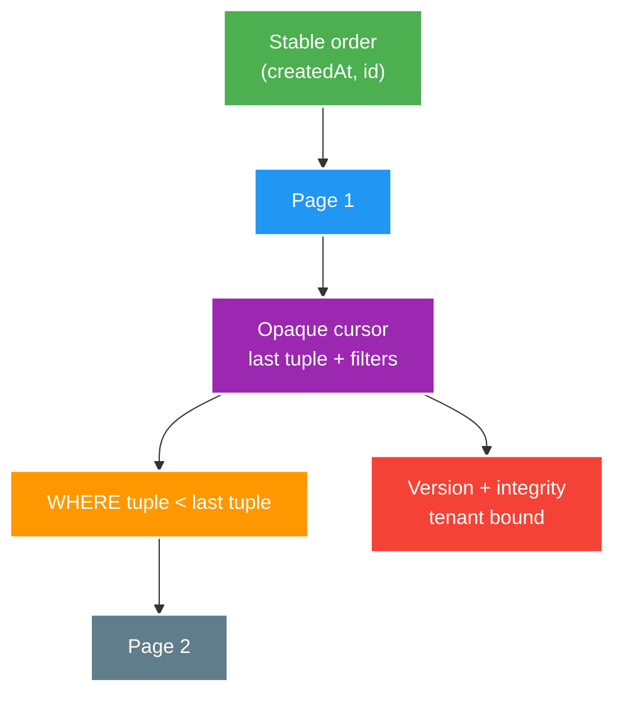

# API Pagination, Versioning and Network Boundaries

> Type: `CORE` 
> Domain: `architecture` 
> Target depth: `D3 — thiết kế pagination/evolution contract và kiểm chứng behavior qua proxy, retry và concurrent writes` 
> Teaching readiness: `TEACHABLE_DRAFT` 
> Status: `DRAFT` 
> Evidence status: `NOT RUN` 
> Prerequisites: [HTTP semantics](http-rest-semantics-and-idempotency.md), database ordering fundamentals 
> Related cases: [`FEED-UC-01`](../../../../use-case-catalog.md#31-foundation-và-senior-cases), [`API-UC-01`](../../../../use-case-catalog.md#32-architect-và-expert-cases) 
> Owner: `Project learner; Codex assists` 
> Updated: `2026-07-26`

Source canonical cho [API boundary question bank](../../question-bank/api-pagination-versioning-and-network-boundaries.md).

## 0. Cách học file này

Mô phỏng insert/delete giữa từng page và kiểm tra skip/duplicate. Với evolution, chạy old/new client-server matrix. Với network, test qua gateway thật hoặc cấu hình tương đương vì buffering/limits/retry không xuất hiện trong controller unit test.

## 1. Learning objectives

1. Chọn offset/cursor/keyset theo ordering, mutation và navigation requirement.
2. Tiến hóa request/response có compatibility, deprecation và migration plan.
3. Xử lý proxy/gateway limits, rate quota, timeout và partial/streaming response boundary.

## 2. Mental model do người dạy cung cấp

Pagination là traversal trên một ordered snapshot/stream kỳ vọng, không chỉ `LIMIT`. Cursor phải mang vị trí theo **total order** và query tiếp bằng quan hệ “sau tuple cuối”. API evolution là compatibility giữa reader/writer versions; gateway là một participant có limits và behavior riêng.

## 3. Cơ chế cốt lõi

Offset pagination dễ random access nhưng cost tăng theo offset và dễ skip/duplicate khi dataset thay đổi. Keyset/cursor dùng stable total order cùng last-seen key; cursor cần encode opaque state, direction/filter context và integrity/version. Sort key không unique phải có tie-breaker.

Compatibility không chỉ là JSON field: status/header/default/order/nullability/error code, pagination và authorization đều là contract. Additive change thường an toàn hơn nhưng client strict parser/schema vẫn có thể vỡ. Breaking change cần version boundary, coexistence, telemetry, deprecation và removal gate.

Network intermediary có request/header/body/time limits, buffering, compression, retry và connection behavior riêng. API design phải xác định max page/body, timeout budget, backpressure/rate quota và correlation; không dựa vào in-process assumption.

### Worked example — timestamp tie

Nếu 20 rows có cùng `createdAt` và cursor chỉ giữ timestamp, query page sau bằng `< createdAt` sẽ bỏ những rows cùng timestamp chưa trả; dùng `<=` lại duplicate. Total order `(createdAt DESC, id DESC)` và tuple predicate giải quyết tie. Cursor còn phải bind filter/tenant để không bị sửa dùng chéo.

### Worked example — additive vẫn breaking

Thêm response field có thể vỡ strict schema parser, chữ ký canonical payload, cache size hoặc client exhaustive mapping. Vì vậy “additive” là hypothesis cần consumer test/telemetry, không phải guarantee. Removal cần deprecation window và usage gate.

## 4. Invariants và boundaries

1. Pagination có deterministic total order và document consistency expectation.
2. Cursor không cho caller sửa filter/tenant/position trái phép và không chứa secret/plain internal state nhạy cảm.
3. Contract change có consumer impact, telemetry và rollback/migration plan.
4. Quota/rate-limit scope đúng actor/tenant/cost; response hướng dẫn retry phù hợp.
5. Gateway/client/server timeout và body/header limits được align và test.

## 5. Failure modes

| Failure | Trigger | Symptom |
| --- | --- | --- |
| Offset under mutation | Insert/delete giữa pages | Skip/duplicate |
| Non-unique cursor sort | Equal timestamps | Missing/repeated rows |
| Cursor tampering | Unsigned filter/tenant state | Data exposure/query abuse |
| Silent breaking change | Rename/default/error drift | Client regression |
| Proxy buffering/limit | Large response/upload | Latency, `413`/`502`/timeout |
| Retry non-idempotent call | Gateway/client retry | Duplicate side effect |

## 6. Trade-off matrix

| Option | Strength | Cost/limit |
| --- | --- | --- |
| Offset/page number | Simple/random access | Deep cost, mutation drift |
| Keyset | Stable/fast forward scan | No arbitrary jump, query complexity |
| Opaque signed cursor | Evolvable/tamper-resistant | Key rotation/versioning |
| URI/header/media version | Explicit coexistence | Routing/cache/client complexity |
| Additive single version | Low overhead | Cannot absorb semantic breaks forever |

## 7. Deep-dive và case

- [Cursor pagination, compatible evolution and proxy boundaries](../deep-dives/cursor-pagination-compatible-evolution-and-proxy-boundaries.md).
- `FEED-UC-01`: stable feed pagination under writes.
- `API-UC-01`: compatibility, gateway and consumer migration.

## 8. Interview answer outline

So offset/keyset bằng mutation/order/navigation; thiết kế opaque signed/versioned cursor; nêu compatibility matrix/deprecation telemetry; kết thúc bằng gateway timeout/body/header/buffering/retry tests.

## 9. Tóm tắt và learner write-back

- Cursor cần deterministic total order và tie-breaker.
- Consistency expectation qua pages phải document.
- Additive change vẫn có thể breaking với strict consumers.
- Gateway behavior là phần runtime API contract.

`LEARNER TODO — viết query/cursor invariant cho FEED-UC-01 và một evolution matrix.`

## 10. Guided self-check

1. **Question:** Vì sao `createdAt` chưa đủ? **Đọc lại nếu bí:** diagram và timestamp example. **Rubric:** ties, total order, ID tie-breaker and tuple predicate. **My answer:** `LEARNER TODO`
2. **Question:** Additive field khi nào breaking? **Đọc lại nếu bí:** evolution example, mục 3–5. **Rubric:** strict parser/schema/signature/size/exhaustive client and telemetry. **My answer:** `LEARNER TODO`
3. **Question:** Test gateway thế nào? **Đọc lại nếu bí:** mục 3–6. **Rubric:** aligned timeouts, size/header/buffering/compression/retry/correlation via integration boundary. **My answer:** `LEARNER TODO`

## 11. Official references

- [RFC 9110 — HTTP Semantics](https://www.rfc-editor.org/rfc/rfc9110.html)
- [Spring MVC — HTTP Message Conversion](https://docs.spring.io/spring-framework/reference/web/webmvc/mvc-config/message-converters.html)

## 12. Teach-back checklist

- [ ] Tôi chứng minh pagination invariant dưới concurrent mutation.
- [ ] Tôi có compatibility/deprecation/telemetry story.
- [ ] Tôi tính gateway limits và retry semantics.
- [ ] API boundary evidence vẫn `NOT RUN`.
