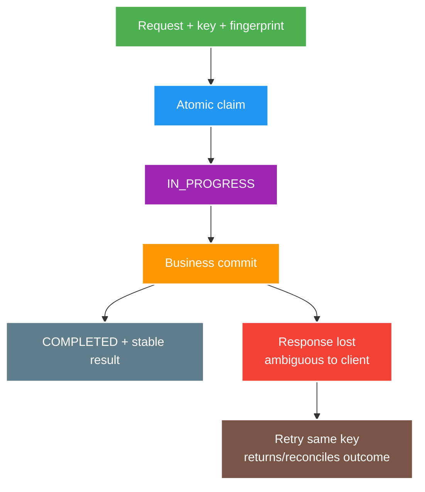

# HTTP, REST Semantics and Idempotency

> Type: `CORE` 
> Domain: `architecture` 
> Target depth: `D3 — thiết kế method/status/cache/idempotency contract và tái hiện ambiguous outcome/duplicate request` 
> Teaching readiness: `TEACHABLE_DRAFT` 
> Status: `DRAFT` 
> Evidence status: `NOT RUN` 
> Prerequisites: client-server networking and JSON API fundamentals 
> Related cases: [`GIFT-UC-01`](../../../../use-case-catalog.md#gift-uc-01), [`FOLLOW-UC-01`](../../../../use-case-catalog.md#31-foundation-và-senior-cases) 
> Owner: `Project learner; Codex assists` 
> Updated: `2026-07-26`

Source canonical cho [HTTP/REST question bank](../../question-bank/http-rest-semantics-and-idempotency.md).

## 0. Cách học file này

Theo một command từ client qua timeout, server commit và retry. Tách ba lớp: HTTP method semantics, business effect và cơ chế dedup durable. “Idempotent” chỉ có meaning khi nói rõ identity, scope, payload, concurrent claims và crash point.

## 1. Learning objectives

1. Dùng method, status, representation, header và cache/conditional semantics đúng contract.
2. Phân biệt safe, idempotent protocol semantics với business deduplication.
3. Thiết kế idempotency key cho command có side effect dưới retry/concurrency/crash.

## 2. Mental model do người dạy cung cấp

Mạng chỉ cho client biết response đã nhận, không cho biết server chắc chắn chưa làm. Sau timeout, outcome có thể là chưa nhận request, đang chạy, đã commit nhưng mất response hoặc đã fail. Idempotency record biến nhiều delivery attempts của cùng logical command thành một state machine có durable outcome.

## 3. Cơ chế cốt lõi

HTTP method mang semantics cho intermediary/client: safe method không yêu cầu thay đổi state do client; idempotent method có intended effect tương đương sau nhiều identical requests. Điều đó không có nghĩa server không log/charge internal cost, và không tự bảo vệ một `POST` business command khỏi duplicate.

Status code diễn đạt outcome của protocol: validation, authentication, authorization, absence, conflict, precondition, rate limit và server failure không nên collapse thành `200` với cờ lỗi. Representation/version/media type là contract; header như `ETag`, `If-Match`, cache controls và retry hints ảnh hưởng concurrency/intermediary behavior.

Idempotency key cần scope theo actor/operation, request fingerprint, atomic claim/result storage, trạng thái in-progress/completed/failed, TTL và conflict rule nếu cùng key khác payload. Server phải trả lại outcome ổn định hoặc chỉ rõ retry semantics; check-then-insert không atomic sẽ race.

### Worked example — gift command

Hai request đồng thời cùng `(userId, operation, key)` phải tranh một unique claim. Winner thực hiện ledger effect và lưu result; loser đọc `IN_PROGRESS` hoặc result, không chạy business logic lần hai. Cùng key với amount khác bị conflict vì fingerprint mismatch. Nếu business commit và record không cùng atomic boundary, phải có recovery/reconciliation cho intermediate state.

### Counterexample — PUT không tự cứu side effect phụ

`PUT /profiles/42` thay representation có intended effect idempotent, nhưng implementation gửi welcome email mỗi request sẽ duplicate external side effect. Protocol semantics định hướng client/intermediary; server vẫn phải thiết kế effects quan sát được tương ứng.

## 4. Invariants và boundaries

1. Không duplicate irreversible side effect cho cùng valid idempotency identity.
2. Cùng key nhưng payload khác phải bị reject/audit, không tái dùng kết quả âm thầm.
3. Idempotency storage và business commit cần atomic design hoặc reconciliation rõ.
4. Authorization được đánh giá cho caller hiện tại; cached result không làm lộ response qua tenant/user.
5. Client timeout không được coi là operation chắc chắn thất bại.

## 5. Failure modes

| Failure | Causal chain | Symptom |
| --- | --- | --- |
| Ambiguous outcome | Commit rồi response mất | Client retry gây duplicate |
| Non-atomic dedup | Concurrent check-then-write | Hai execution cùng thắng |
| Key collision/scope sai | Global key không tenant/operation | Trả nhầm result |
| TTL quá ngắn | Retry đến sau expiry | Side effect lặp |
| Cache semantics sai | Shared cache chứa private response | Data leak/stale response |
| Status collapse | Mọi lỗi thành `200` | Client/retry/monitor hiểu sai |

## 6. Trade-off matrix

| Option | Guarantee | Cost/risk |
| --- | --- | --- |
| Natural idempotent resource `PUT` | State replacement ổn định | Cần client biết resource identity |
| DB unique key + result row | Durable concurrency control | Storage/cleanup/schema coupling |
| Redis claim | Nhanh | Expiry/crash/durability gap |
| Conditional request | Optimistic concurrency | Client giữ validator/version |
| At-least-once + reconciliation | Availability cao | Duplicate compensation/ops cost |

## 7. Deep-dive và case

- [Idempotency, ambiguous outcomes and conditional requests](../deep-dives/idempotency-ambiguous-outcomes-and-conditional-requests.md).
- `GIFT-UC-01`: payment/gift command và ledger side effect.
- `FOLLOW-UC-01`: duplicate follow/unfollow/retry semantics.

## 8. Interview answer outline

Phân biệt safe/idempotent/retryable, kể ambiguous-outcome timeline và idempotency state machine. Nêu atomic claim, scope/fingerprint, stable result, TTL, authorization và crash/reconciliation. Tránh claim exactly-once end-to-end.

## 9. Tóm tắt và learner write-back

- Timeout không chứng minh failure.
- HTTP idempotency không tự tạo business dedup.
- Same key/different payload phải conflict.
- Cached idempotent result vẫn phải giữ tenant/auth scope.

`LEARNER TODO — thiết kế record/state transitions cho một gift command.`

## 10. Guided self-check

1. **Question:** Safe, idempotent, retryable khác gì? **Đọc lại nếu bí:** mục 2–3. **Rubric:** protocol intended effect vs operational retry conditions/business dedup. **My answer:** `LEARNER TODO`
2. **Question:** Record tối thiểu gồm gì? **Đọc lại nếu bí:** diagram, example, mục 4–6. **Rubric:** scoped identity, fingerprint, status, result/error, timestamps/TTL, atomic uniqueness. **My answer:** `LEARNER TODO`
3. **Question:** Timeout sau commit xử lý ra sao? **Đọc lại nếu bí:** mental model và failure modes. **Rubric:** retry/status lookup/reconciliation, stable outcome, no absolute exactly-once claim. **My answer:** `LEARNER TODO`

## 11. Official references

- [RFC 9110 — HTTP Semantics](https://www.rfc-editor.org/rfc/rfc9110.html)
- [RFC 9111 — HTTP Caching](https://www.rfc-editor.org/rfc/rfc9111.html)

## 12. Teach-back checklist

- [ ] Tôi dùng method/status/conditional semantics có lý do.
- [ ] Tôi phân biệt protocol idempotency với dedup implementation.
- [ ] Tôi giải thích race, TTL, scope và crash window.
- [ ] HTTP/idempotency evidence vẫn `NOT RUN`.
