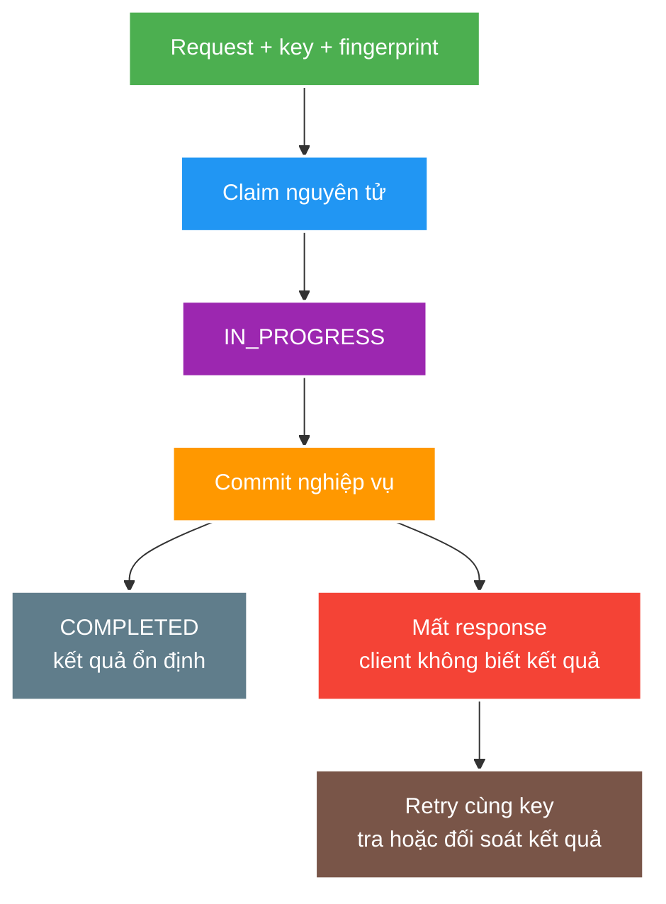

# Ngữ nghĩa HTTP/REST và tính idempotent

> Type: `CORE` 
> Domain: `architecture` 
> Target depth: `D3 — thiết kế method/status/cache/idempotency contract và tái hiện ambiguous outcome/duplicate request` 
> Teaching readiness: `TEACHABLE_DRAFT` 
> Status: `DRAFT` 
> Evidence status: `NOT RUN` 
> Prerequisites: kiến thức nền về mạng client-server và JSON API 
> Related cases: [`GIFT-UC-01`](../../../../use-case-catalog.md#gift-uc-01), [`FOLLOW-UC-01`](../../../../use-case-catalog.md#31-foundation-và-senior-cases) 
> Owner: `Project learner; Codex assists` 
> Updated: `2026-07-26`

Source canonical cho [HTTP/REST question bank](../../question-bank/http-rest-semantics-and-idempotency.md).

## 0. Cách học file này

Theo một command từ client qua timeout, server commit và retry. Tách ba lớp: HTTP method semantics, business effect và cơ chế dedup durable. “Idempotent” chỉ có meaning khi nói rõ identity, scope, payload, concurrent claims và crash point.

## 1. Mục tiêu học

1. Dùng HTTP method, status, representation, header và cache/conditional request đúng hợp đồng.
2. Phân biệt `safe`, `idempotent` ở tầng giao thức với việc chống xử lý trùng ở tầng nghiệp vụ.
3. Thiết kế idempotency key cho command có side effect khi xảy ra retry, xử lý đồng thời hoặc process bị crash.

## 2. Mental model do người dạy cung cấp

Mạng chỉ giúp client biết nó có nhận được response hay không; timeout không chứng minh server chưa thực hiện nghiệp vụ. Sau timeout, request có thể chưa tới server, đang chạy, đã rollback, hoặc đã commit nhưng response bị mất. `Idempotency record` là bản ghi bền vững gom nhiều lần gửi của cùng một command logic vào một state machine, nhờ đó lần retry có thể tra lại kết quả thay vì tạo side effect mới.

## 3. Cơ chế cốt lõi

HTTP method truyền đạt ý nghĩa cho client và thành phần trung gian. `Safe method` là thao tác mà client không yêu cầu thay đổi trạng thái nghiệp vụ. `Idempotent method` có hiệu ứng được mong đợi tương đương dù cùng request được gửi một hay nhiều lần. Điều này không cấm server ghi log hoặc tiêu tốn tài nguyên, và cũng không tự động chống trùng cho một `POST` tạo nghiệp vụ mới.

Status code diễn đạt kết quả ở tầng giao thức. Lỗi validation, chưa xác thực, không đủ quyền, không tìm thấy, xung đột, sai điều kiện tiên quyết, vượt giới hạn và lỗi server không nên bị gom thành `200` kèm một cờ lỗi. Representation, phiên bản và media type đều thuộc hợp đồng. Các header như `ETag`, `If-Match`, cache control và gợi ý retry ảnh hưởng trực tiếp đến xử lý đồng thời và hành vi của proxy/cache.

Idempotency key phải được giới hạn theo actor và loại thao tác, đi kèm `request fingerprint` (dấu vân tay của payload) để phát hiện cùng key nhưng nội dung khác. Việc nhận quyền xử lý và lưu kết quả phải có tính nguyên tử, với các trạng thái như đang xử lý, hoàn tất hoặc thất bại, cùng TTL và quy tắc xung đột. Mẫu “kiểm tra rồi mới insert” bằng hai thao tác rời rạc sẽ tạo race condition: hai request cùng thấy chưa có bản ghi và đều chạy nghiệp vụ.

### Worked example — gift command

Hai request đồng thời cùng `(userId, operation, key)` phải tranh một unique claim. Winner thực hiện ledger effect và lưu result; loser đọc `IN_PROGRESS` hoặc result, không chạy business logic lần hai. Cùng key với amount khác bị conflict vì fingerprint mismatch. Nếu business commit và record không cùng atomic boundary, phải có recovery/reconciliation cho intermediate state.

### Counterexample — PUT không tự cứu side effect phụ

`PUT /profiles/42` thay representation có intended effect idempotent, nhưng implementation gửi welcome email mỗi request sẽ duplicate external side effect. Protocol semantics định hướng client/intermediary; server vẫn phải thiết kế effects quan sát được tương ứng.

## 4. Invariants và boundaries

1. Không duplicate irreversible side effect cho cùng valid idempotency identity.
2. Cùng key nhưng payload khác phải bị reject/audit, không tái dùng kết quả âm thầm.
3. Idempotency storage và business commit cần atomic design hoặc reconciliation rõ.
4. Authorization được đánh giá cho caller hiện tại; cached result không làm lộ response qua tenant/user.
5. Client timeout không được coi là operation chắc chắn thất bại.

## 5. Failure modes

| Failure | Causal chain | Symptom |
| --- | --- | --- |
| Ambiguous outcome | Commit rồi response mất | Client retry gây duplicate |
| Non-atomic dedup | Concurrent check-then-write | Hai execution cùng thắng |
| Key collision/scope sai | Global key không tenant/operation | Trả nhầm result |
| TTL quá ngắn | Retry đến sau expiry | Side effect lặp |
| Cache semantics sai | Shared cache chứa private response | Data leak/stale response |
| Status collapse | Mọi lỗi thành `200` | Client/retry/monitor hiểu sai |

## 6. Bảng đánh đổi

| Option | Guarantee | Cost/risk |
| --- | --- | --- |
| Natural idempotent resource `PUT` | State replacement ổn định | Cần client biết resource identity |
| DB unique key + result row | Durable concurrency control | Storage/cleanup/schema coupling |
| Redis claim | Nhanh | Expiry/crash/durability gap |
| Conditional request | Optimistic concurrency | Client giữ validator/version |
| At-least-once + reconciliation | Availability cao | Duplicate compensation/ops cost |

## 7. Deep-dive và case

- [Idempotency, ambiguous outcomes and conditional requests](../deep-dives/idempotency-ambiguous-outcomes-and-conditional-requests.md).
- `GIFT-UC-01`: payment/gift command và ledger side effect.
- `FOLLOW-UC-01`: duplicate follow/unfollow/retry semantics.

## 8. Dàn ý trả lời phỏng vấn

Phân biệt safe/idempotent/retryable, kể ambiguous-outcome timeline và idempotency state machine. Nêu atomic claim, scope/fingerprint, stable result, TTL, authorization và crash/reconciliation. Tránh claim exactly-once end-to-end.

## 8.1. Hai worked examples và phản ví dụ

**Worked example tối thiểu — conditional update:** client đọc ETag `v7`, gửi `If-Match: v7`; server chỉ update nếu version hiện tại còn v7, nếu không trả precondition failure. Cơ chế bảo vệ stale overwrite nhưng không nhận diện hai deliveries của cùng một POST command.

**Worked example gần project — response loss sau commit:** gift đã commit nhưng response bị drop. Cùng idempotency key + payload fingerprint cho phép retry lấy outcome cũ; key mới là intent mới và có thể double debit. Status code transport không tự nói operation failed.

**Phản ví dụ:** trả `200` cho mọi outcome với field `success=false` làm cache/proxy/client retry khó reason, đồng thời coi POST là an toàn chỉ vì handler thường nhanh. HTTP method/status và business recovery contract phải nhất quán.

## 9. Tóm tắt và learner write-back

- Timeout không chứng minh failure.
- HTTP idempotency không tự tạo business dedup.
- Same key/different payload phải conflict.
- Cached idempotent result vẫn phải giữ tenant/auth scope.

`LEARNER TODO — thiết kế record/state transitions cho một gift command.`

## 10. Guided self-check

1. **Question:** Safe, idempotent, retryable khác gì? **Đọc lại nếu bí:** mục 2–3. **Rubric:** protocol intended effect vs operational retry conditions/business dedup. **My answer:** `LEARNER TODO`
2. **Question:** Record tối thiểu gồm gì? **Đọc lại nếu bí:** diagram, example, mục 4–6. **Rubric:** scoped identity, fingerprint, status, result/error, timestamps/TTL, atomic uniqueness. **My answer:** `LEARNER TODO`
3. **Question:** Timeout sau commit xử lý ra sao? **Đọc lại nếu bí:** mental model và failure modes. **Rubric:** retry/status lookup/reconciliation, stable outcome, no absolute exactly-once claim. **My answer:** `LEARNER TODO`

## 11. Nguồn chính thức

- [RFC 9110 — HTTP Semantics](https://www.rfc-editor.org/rfc/rfc9110.html)
- [RFC 9111 — HTTP Caching](https://www.rfc-editor.org/rfc/rfc9111.html)

## 12. Teach-back checklist

- [ ] Tôi dùng method/status/conditional semantics có lý do.
- [ ] Tôi phân biệt protocol idempotency với dedup implementation.
- [ ] Tôi giải thích race, TTL, scope và crash window.
- [ ] HTTP/idempotency evidence vẫn `NOT RUN`.
