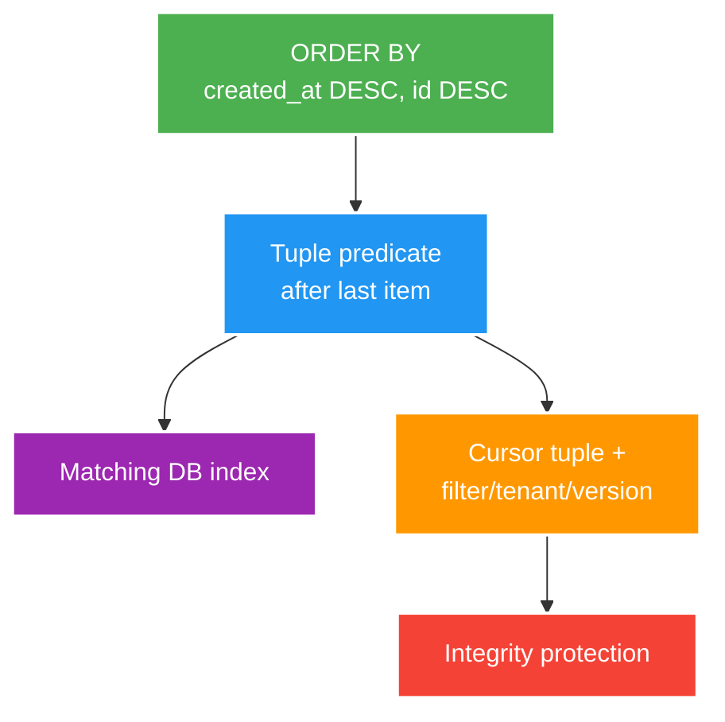

# Cursor Pagination, Compatible Evolution and Proxy Boundaries

> Type: `DEEP_DIVE` 
> Domain: `architecture` 
> Target depth: `D3 — chứng minh total-order pagination, consumer compatibility và intermediary behavior bằng contract tests` 
> Teaching readiness: `TEACHABLE_DRAFT` 
> Status: `DRAFT` 
> Evidence status: `NOT RUN` 
> Prerequisites: [API boundary core](../core/api-pagination-versioning-and-network-boundaries.md) 
> Related cases: [`FEED-UC-01`](../../../../use-case-catalog.md#31-foundation-và-senior-cases), [`API-UC-01`](../../../../use-case-catalog.md#32-architect-và-expert-cases) 
> Owner: `Project learner; Codex assists` 
> Updated: `2026-07-26`

## 0. Mental model và cách học

Giữ query predicate, order, index và cursor payload trên cùng một invariant. Sau đó thử equal keys, concurrent writes, tamper và reverse traversal. Evolution/proxy được kiểm bằng producer-consumer-intermediary matrix, không chỉ controller serialization test.

## 1. Cursor correctness

Worked query predicate cho descending order là `created_at < :lastCreatedAt OR (created_at = :lastCreatedAt AND id < :lastId)`, cùng `ORDER BY` và page limit. Composite index theo order/predicate giúp tránh scan/sort thoái hóa. Nullable sort key cần canonical null ordering hoặc bị cấm làm cursor component.

Với thứ tự giảm dần `(created_at, id)`, predicate của trang kế thường là phép so sánh từ điển “nhỏ hơn tuple cuối”, giữ nguyên filter và ordering. Tie-breaker làm thứ tự trở thành total order. Đảo chiều, nullable key và đổi filter cần semantics tường minh; index order phải hỗ trợ predicate/order nếu không latency sẽ thoái hóa khi scale.

Cursor payload can include version, last sort tuple, filter hash, tenant/subject scope and direction, then be encoded and integrity-protected. It should be opaque so clients do not construct it. Signing prevents tampering but not confidentiality; encryption is separate if payload sensitive.

Concurrent inserts before current position generally appear on refresh, not later page; deletes can shrink results. Snapshot-consistent traversal requires snapshot/token/storage support and higher cost. API must state whether it offers stable traversal, snapshot or best-effort feed semantics.

## 2. Evolution hazards

“Additive” can still break strict schema consumers, exhaustive enums, signatures, payload limits or clients interpreting unknown fields badly. Changing default sort, timestamp precision/timezone, nullability, numeric width, error status/code or authorization filtering is semantic evolution even if JSON names stay.

Version rollout needs producer/consumer compatibility window, contract tests, usage telemetry, deprecation communication and removal criteria. Dual write/read or tolerant reader patterns may help migrations; they need rollback and data reconciliation.

## 3. Proxy/gateway boundary

Ví dụ gateway timeout 1 giây nhưng server timeout 3 giây: gateway trả `504` trong khi server tiếp tục command thêm 2 giây, client retry và tạo ambiguous duplicate. Timeout phải align, command cần idempotency, cancellation/recovery phải được test qua proxy. `X-Forwarded-*` chỉ tin từ configured trusted proxy.

Gateway can normalize/drop headers, limit URL/header/body, buffer uploads/responses, retry requests, terminate TLS, compress and enforce timeouts/rate limits. Test should traverse the same proxy path for critical contracts. Correlation/client IP/security headers must have trusted-proxy rules, not accept spoofed public headers.

## 4. Experiment matrix

| Experiment | Assertion |
| --- | --- |
| Equal timestamps across page boundary | No missing/duplicate with tie-breaker |
| Insert/delete between page calls | Behavior matches documented consistency |
| Cursor tamper/filter/tenant change | Rejected safely |
| Old/new consumer against old/new producer | Compatibility matrix passes |
| Oversize body/header and slow response through gateway | Expected status/timeout, no partial side effect |
| Gateway retry of command | Idempotency prevents duplicate |

Toàn bộ evidence vẫn `NOT RUN`.

## 5. Trade-off matrix

| Decision | Benefit | Consequence |
| --- | --- | --- |
| Signed stateless cursor | No server session | Rotation/payload evolution |
| Server-side cursor token | Hide state/revoke | Storage/TTL/affinity |
| Snapshot traversal | Strong consistency | Resource/storage cost |
| Best-effort feed | Simple/scalable | Refresh may reorder/miss historical view |
| Long coexistence versions | Migration safety | Maintenance/observability cost |

## 6. Interview outline, recap và learner write-back

Viết tuple order/predicate/index, giải cursor opacity/integrity/confidentiality, nêu consistency expectation. Sau đó đưa old/new compatibility/removal telemetry và gateway limit/retry test.

- Signing chống sửa payload, không mã hóa nội dung.
- Snapshot traversal mạnh hơn nhưng tốn storage/resource.
- JSON shape không phải toàn bộ API semantics.
- Trusted proxy rules là security boundary.

`LEARNER TODO — viết cursor schema/predicate/index và version-removal gate.`

## 7. Guided self-check

1. **Question:** Predicate page kế là gì? **Đọc lại nếu bí:** worked query. **Rubric:** lexicographic descending predicate + same order/index. **My answer:** `LEARNER TODO`
2. **Question:** Signature bảo vệ gì? **Đọc lại nếu bí:** mental model, mục 1. **Rubric:** integrity/authenticity, not confidentiality; rotation/version scope. **My answer:** `LEARNER TODO`
3. **Question:** Compatibility/removal gate? **Đọc lại nếu bí:** mục 2–4. **Rubric:** old/new matrix, telemetry, deprecation, migration/rollback, zero/accepted usage threshold. **My answer:** `LEARNER TODO`

## 8. References

- [RFC 9110 — HTTP Semantics](https://www.rfc-editor.org/rfc/rfc9110.html)
- [OWASP — REST Security Cheat Sheet](https://cheatsheetseries.owasp.org/cheatsheets/REST_Security_Cheat_Sheet.html)

## 9. Teach-back checklist

- [ ] Tôi chứng minh query/order/index/cursor cùng một invariant.
- [ ] Tôi nhận diện semantic breaking changes.
- [ ] Tôi test qua trusted proxy boundary.
- [ ] Evidence vẫn `NOT RUN`.
