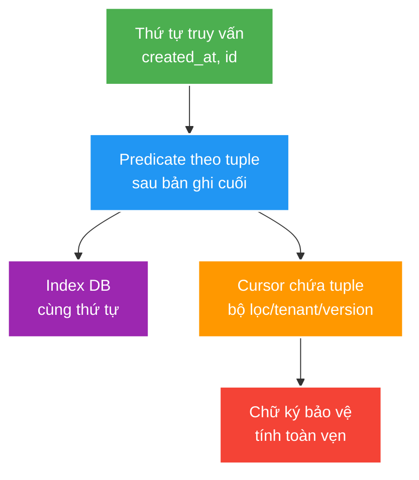

# Cursor pagination, tiến hóa tương thích và ranh giới proxy

> Type: `DEEP_DIVE` 
> Domain: `architecture` 
> Target depth: `D3 — chứng minh total-order pagination, consumer compatibility và intermediary behavior bằng contract tests` 
> Teaching readiness: `TEACHABLE_DRAFT` 
> Status: `DRAFT` 
> Evidence status: `NOT RUN` 
> Prerequisites: [API boundary core](../core/api-pagination-versioning-and-network-boundaries.md) 
> Related cases: [`FEED-UC-01`](../../../../use-case-catalog.md#31-foundation-và-senior-cases), [`API-UC-01`](../../../../use-case-catalog.md#32-architect-và-expert-cases) 
> Owner: `Project learner; Codex assists` 
> Updated: `2026-07-26`

## 0. Mental model và cách học

Hãy coi predicate của truy vấn, `ORDER BY`, database index và payload của cursor là bốn cách biểu diễn cùng một invariant về thứ tự. Sau đó cố tình thử khóa bằng nhau, thao tác ghi đồng thời, sửa cursor và duyệt ngược. Việc tiến hóa API phải được kiểm bằng ma trận producer-consumer-component trung gian, chứ không chỉ bằng test serialize ở controller.

## 1. Cursor correctness

Với thứ tự giảm dần, predicate cụ thể là `created_at < :lastCreatedAt OR (created_at = :lastCreatedAt AND id < :lastId)`. Nó phải đi cùng đúng `ORDER BY` và giới hạn kích thước trang. Composite index có cùng thứ tự giúp database tìm điểm bắt đầu thay vì scan và sort lại nhiều dữ liệu. Nếu sort key có thể `null`, hợp đồng phải quy định `null` đứng trước hay sau; lựa chọn an toàn hơn thường là không dùng trường nullable làm thành phần cursor.

Với thứ tự giảm dần `(created_at, id)`, predicate của trang kế thường là phép so sánh từ điển “nhỏ hơn tuple cuối”, giữ nguyên filter và ordering. Tie-breaker làm thứ tự trở thành total order. Đảo chiều, nullable key và đổi filter cần semantics tường minh; index order phải hỗ trợ predicate/order nếu không latency sẽ thoái hóa khi scale.

Payload cursor có thể chứa phiên bản, tuple sắp xếp cuối, hash của bộ lọc, phạm vi tenant/user và chiều duyệt. Server mã hóa biểu diễn này và bảo vệ tính toàn vẹn để client không tự lắp cursor. Chữ ký chỉ phát hiện payload bị sửa, không che giấu nội dung; nếu payload nhạy cảm thì cần mã hóa hoặc dùng token tham chiếu tới trạng thái lưu phía server.

Một bản ghi được insert ở phía trước vị trí hiện tại thường chỉ xuất hiện khi refresh từ đầu, không xuất hiện ở trang kế. Bản ghi bị xóa có thể làm trang ngắn hơn. Muốn mọi trang nhìn đúng một snapshot thì storage phải giữ snapshot hoặc token tương ứng, làm tăng chi phí và thời gian giữ tài nguyên. Vì vậy API phải nói rõ nó bảo đảm snapshot, duyệt ổn định theo khóa, hay chỉ cung cấp feed theo kiểu best effort.

## 2. Evolution hazards

Thay đổi “chỉ thêm” vẫn có thể làm hỏng consumer dùng schema nghiêm ngặt, enum exhaustive, chữ ký payload, giới hạn kích thước hoặc client diễn giải sai trường lạ. Đổi sort mặc định, độ chính xác/timezone của timestamp, nullability, độ rộng số, error status/code hoặc authorization filtering đều là thay đổi ngữ nghĩa dù tên trường JSON giữ nguyên.

Khi rollout phiên bản mới, producer và consumer cũ/mới cần một khoảng cùng tồn tại. Contract test, telemetry mức sử dụng, thông báo deprecation và tiêu chí xóa phiên bản cũ là các gate bắt buộc. Các mẫu như ghi song song hai định dạng, đọc cả cũ lẫn mới hoặc tolerant reader có thể hỗ trợ chuyển đổi, nhưng phải kèm rollback và đối soát dữ liệu.

## 3. Proxy/gateway boundary

Ví dụ gateway timeout 1 giây nhưng server timeout 3 giây: gateway trả `504` trong khi server tiếp tục command thêm 2 giây, client retry và tạo ambiguous duplicate. Timeout phải align, command cần idempotency, cancellation/recovery phải được test qua proxy. `X-Forwarded-*` chỉ tin từ configured trusted proxy.

Gateway có thể chuẩn hóa hoặc loại bỏ header, giới hạn URL/header/body, buffer upload/response, tự retry, kết thúc TLS, nén dữ liệu và áp timeout/rate limit. Những hợp đồng quan trọng phải được test qua chính đường proxy này. Các header về correlation ID, địa chỉ client hoặc bảo mật chỉ được tin khi đến từ proxy đã cấu hình; nếu nhận thẳng từ Internet, kẻ gọi có thể giả mạo chúng.

## 4. Ma trận thí nghiệm dự kiến

| Experiment | Assertion |
| --- | --- |
| Equal timestamps across page boundary | No missing/duplicate with tie-breaker |
| Insert/delete between page calls | Behavior matches documented consistency |
| Cursor tamper/filter/tenant change | Rejected safely |
| Old/new consumer against old/new producer | Compatibility matrix passes |
| Oversize body/header and slow response through gateway | Expected status/timeout, no partial side effect |
| Gateway retry of command | Idempotency prevents duplicate |

Toàn bộ evidence vẫn `NOT RUN`.

## 5. Bảng đánh đổi

| Decision | Benefit | Consequence |
| --- | --- | --- |
| Signed stateless cursor | No server session | Rotation/payload evolution |
| Server-side cursor token | Hide state/revoke | Storage/TTL/affinity |
| Snapshot traversal | Strong consistency | Resource/storage cost |
| Best-effort feed | Simple/scalable | Refresh may reorder/miss historical view |
| Long coexistence versions | Migration safety | Maintenance/observability cost |

### 5.1. Pathology A — chỉ cursor timestamp làm mất rows có cùng thời điểm

Page kết thúc ở `(10:00, id=200)`, nhưng còn rows `(10:00, id=199..)` chưa trả. Cursor chỉ giữ `10:00`; predicate `< 10:00` bỏ chúng, còn `<=` lặp rows đã trả. Total order `(created_at, id)` và predicate lexicographic giải quyết ties; index/predicate/order phải cùng direction. Test fixture cố tình tạo nhiều equal timestamps qua page boundary và assert union/no duplicate.

### 5.2. Pathology B — cursor hợp lệ bị tái dùng qua tenant/filter khác

Cursor chỉ signed tuple nhưng không bind tenant, subject/filter/sort version. Client lấy cursor tenant A rồi gửi ở tenant B hoặc đổi `status` filter, tạo leak/skip semantics. Payload cần scope/filter hash/direction/version và integrity; signing không mã hóa data. Key rotation/version compatibility phải có window hoặc server-side token store nếu cần revoke/hide state.

### 5.3. Pathology C — gateway timeout/retry tạo duplicate command

Gateway timeout 1 giây, server commit ở 1,2 giây và response bị bỏ. Gateway/client retry POST; nếu command thiếu stable idempotency identity, effect lặp. Align deadlines nhưng vẫn phải xử lý unknown outcome. Contract test cần đi qua real proxy path, drop/delay response after commit và assert duplicate retrieval/status behavior.

### 5.4. Bằng chứng để tiến hóa và xóa phiên bản cũ

Chạy old/new producer × old/new consumer, strict/unknown enum, nullability/default/time precision/error/auth filtering và payload/header limits. “Add field” vẫn có thể break strict client/signature/size. Removal gate cần client/version usage telemetry, deprecation horizon, replay/offline retention, migration/rollback và accepted zero-use threshold. Evidence `NOT RUN`; exact proxy/framework versions phải pin.

### 5.5. Walkthrough chẩn đoán trang bị thiếu hoặc lặp bản ghi

Đầu tiên lưu cursor đầu vào, bộ lọc, tenant, chiều duyệt và SQL cuối cùng đã bind parameter; không log dữ liệu nhạy cảm trong cursor. Tiếp theo kiểm `ORDER BY` có đủ tie-breaker và predicate có cùng chiều hay không. Dùng fixture nhiều bản ghi cùng timestamp nằm hai phía page boundary, rồi so hợp của các trang với tập kỳ vọng. Nếu query đúng trên dataset tĩnh nhưng sai khi insert/delete, cần đối chiếu semantics đã công bố: best-effort feed không thể hứa snapshot bất biến.

Sau đó chạy `EXPLAIN` trên dữ liệu đủ lớn để xem composite index có hỗ trợ predicate/order. Một query đúng về logic vẫn có thể thoái hóa vì sort/scan ở deep page. Cuối cùng kiểm cursor có gắn filter/tenant/version và chữ ký không. Nếu signing key rotate, server cần cửa sổ xác minh key cũ hoặc token phía server; nếu không, cursor hợp lệ phát hành trước rollout sẽ lỗi hàng loạt.

Version boundary còn gồm database collation/null ordering, serializer, gateway và client. Contract test gọi thẳng controller không bắt việc gateway loại header, giới hạn URL hoặc tự retry. Bằng chứng hoàn chỉnh phải đi qua proxy path thật với version đã pin và raw response; hiện vẫn `NOT RUN`.

## 6. Dàn ý phỏng vấn, tóm tắt và phần người học viết lại

Viết tuple order/predicate/index, giải cursor opacity/integrity/confidentiality, nêu consistency expectation. Sau đó đưa old/new compatibility/removal telemetry và gateway limit/retry test.

- Signing chống sửa payload, không mã hóa nội dung.
- Snapshot traversal mạnh hơn nhưng tốn storage/resource.
- JSON shape không phải toàn bộ API semantics.
- Trusted proxy rules là security boundary.

`LEARNER TODO — viết cursor schema/predicate/index và version-removal gate.`

## 7. Guided self-check

1. **Question:** Predicate page kế là gì? **Đọc lại nếu bí:** worked query. **Rubric:** lexicographic descending predicate + same order/index. **My answer:** `LEARNER TODO`
2. **Question:** Signature bảo vệ gì? **Đọc lại nếu bí:** mental model, mục 1. **Rubric:** integrity/authenticity, not confidentiality; rotation/version scope. **My answer:** `LEARNER TODO`
3. **Question:** Compatibility/removal gate? **Đọc lại nếu bí:** mục 2–4. **Rubric:** old/new matrix, telemetry, deprecation, migration/rollback, zero/accepted usage threshold. **My answer:** `LEARNER TODO`

## 8. References

- [RFC 9110 — HTTP Semantics](https://www.rfc-editor.org/rfc/rfc9110.html)
- [OWASP — REST Security Cheat Sheet](https://cheatsheetseries.owasp.org/cheatsheets/REST_Security_Cheat_Sheet.html)

## 9. Teach-back checklist

- [ ] Tôi chứng minh query/order/index/cursor cùng một invariant.
- [ ] Tôi nhận diện semantic breaking changes.
- [ ] Tôi test qua trusted proxy boundary.
- [ ] Evidence vẫn `NOT RUN`.
