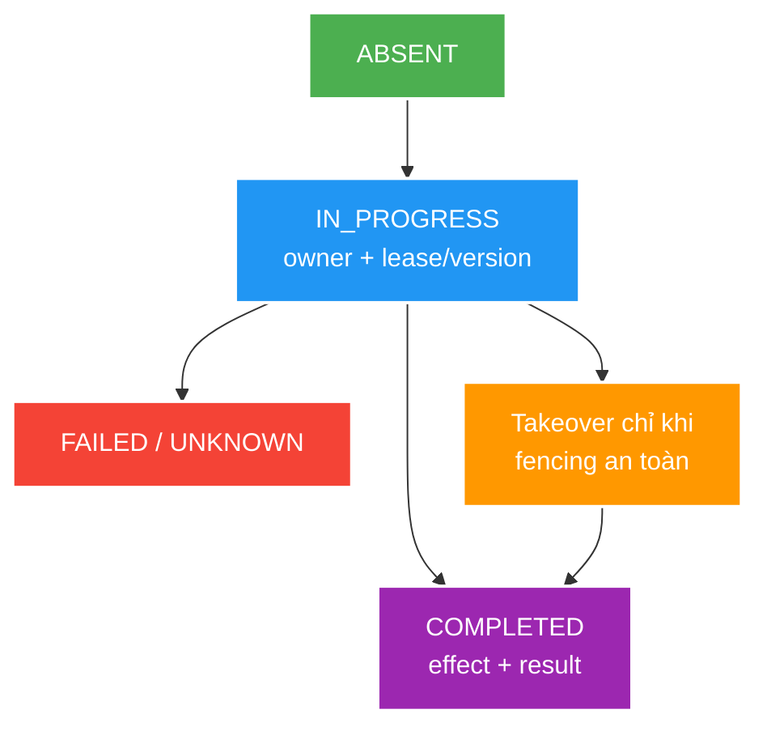

# Idempotency, Ambiguous Outcomes and Conditional Requests

> Type: `DEEP_DIVE` 
> Domain: `architecture` 
> Target depth: `D3 — thiết kế state machine/durable claim và fault-inject mọi commit/response boundary` 
> Teaching readiness: `TEACHABLE_DRAFT` 
> Status: `DRAFT` 
> Evidence status: `NOT RUN` 
> Prerequisites: [HTTP/REST core](../core/http-rest-semantics-and-idempotency.md) 
> Related cases: [`GIFT-UC-01`](../../../../use-case-catalog.md#gift-uc-01), [`FOLLOW-UC-01`](../../../../use-case-catalog.md#31-foundation-và-senior-cases) 
> Owner: `Project learner; Codex assists` 
> Updated: `2026-07-26`

## 0. Mental model và cách học

Idempotency là recovery protocol cho điều client không quan sát được. Vẽ state machine cùng DB commit/response points; tại mỗi crash, hỏi owner mới có thể tiếp quản mà old owner không commit muộn hay không. So riêng với conditional request: một bên dedup command, một bên bảo vệ observed resource version.

## 1. Ambiguous outcome model

Client quan sát timeout/disconnect chỉ biết không nhận được response; server có thể chưa bắt đầu, đang chạy, đã rollback hoặc đã commit. Vì vậy, retry command cần business identity và outcome recovery, không thể dựa vào trực giác ở transport layer.

Một idempotency record thực tế thường có scoped key, request fingerprint, state, owner/lease/version, result reference/response metadata, timestamps và expiry. Atomic insert/unique constraint elects one owner. Concurrent duplicate either waits/polls, gets an in-progress response, or retrieves completed outcome according to contract.

`FAILED` cần taxonomy: permanent validation failure có thể replay stable result; transient/infrastructure failure có thể cho takeover/retry; unknown crash state phải reconcile với business record. TTL must exceed realistic retry/offline window or business identity must remain protected elsewhere.

## 2. State machine and invariants

Worked example: worker A giữ lease 10 giây rồi bị pause; worker B takeover sau expiry. Nếu A tỉnh lại và vẫn có quyền update, cả hai có thể commit. Fencing token tăng dần phải được durable business write kiểm tra (`token >= current`) để old owner bị từ chối. Lease time đơn lẻ không tạo exclusive ownership khi process/network pause.

`ABSENT -> IN_PROGRESS -> COMPLETED` là đường chính. Lease expiry/takeover không được tạo hai owners cùng commit; fencing/version hoặc DB transaction may be needed. Business row và idempotency outcome tốt nhất commit cùng durable transaction khi cùng database.

Invariants:

1. Same scoped key + same fingerprint has at most one committed business effect.
2. Same key + different fingerprint is a conflict/security signal.
3. Completed result remains authorized for current caller and contract version.
4. Cleanup never removes the only durable duplicate guard too early.

## 3. Conditional requests

Ví dụ client đọc resource ETag `v7`, gửi `If-Match: v7`; server chỉ update nếu current vẫn v7, nếu không trả precondition failure. Nó ngăn lost overwrite từ stale view. Hai POST command khác delivery nhưng cùng logical gift vẫn cần idempotency identity; ETag không tự biết chúng là duplicate.

`ETag`/`If-Match` can express optimistic precondition for resource state; a failed precondition prevents overwriting a version the client did not observe. It solves concurrent resource update, not arbitrary duplicate command unless command semantics map cleanly to resource replacement/version.

Weak versus strong validators and intermediary/cache behavior matter. Validator generation must change whenever representation semantics requiring freshness change; avoid exposing sensitive internal version/state unnecessarily.

## 4. Fault matrix

| Fault point | State to inspect |
| --- | --- |
| Before idempotency claim | No owner/effect |
| After claim, before business write | Recoverable stale in-progress |
| After business write, before commit | Both rollback if one transaction |
| After commit, before response | Duplicate retrieves committed result |
| During result serialization/storage | Effect/result reconciliation |
| Concurrent same/different payload | One effect / conflict |

Chưa fault injection nào được chạy; evidence `NOT RUN`.

## 5. Trade-off matrix

| Storage/design | Correctness | Operability |
| --- | --- | --- |
| DB unique + same tx | Strong local atomicity | Table growth/cleanup |
| Redis `SET NX` + TTL | Fast claim | Crash/expiry/durability gaps |
| Business natural key | Minimal extra state | Only fits natural identity |
| Full response replay | Stable client outcome | PII/size/version retention |
| Result reference replay | Smaller | Reconstruct/auth/version logic |

## 6. Interview outline, recap và learner write-back

Kể ambiguous states, durable record/state/fingerprint, atomic claim và fencing. Nêu TTL cleanup window, authorization/result replay, fault matrix và contrast `If-Match`.

- Lease không đủ nếu old owner có thể commit muộn.
- Cleanup không được xóa duplicate guard trước business retry horizon.
- Full response replay có PII/version cost.
- Conditional request bảo vệ version, idempotency bảo vệ logical command.

`LEARNER TODO — hoàn thiện state machine và fencing rule cho GIFT-UC-01.`

## 7. Guided self-check

1. **Question:** Fencing làm gì? **Đọc lại nếu bí:** diagram và worked example. **Rubric:** monotonic token enforced at durable write rejects stale owner. **My answer:** `LEARNER TODO`
2. **Question:** TTL/cleanup an toàn ra sao? **Đọc lại nếu bí:** mục 1–2, 5. **Rubric:** realistic retry/offline/audit horizon, natural guard/reconciliation, no premature duplicate gap. **My answer:** `LEARNER TODO`
3. **Question:** `If-Match` và key khác gì? **Đọc lại nếu bí:** conditional example. **Rubric:** observed-version concurrency vs delivery dedup/logical operation identity. **My answer:** `LEARNER TODO`

## 8. References

- [RFC 9110 — Idempotent Methods](https://www.rfc-editor.org/rfc/rfc9110.html#name-idempotent-methods)
- [RFC 9110 — Preconditions](https://www.rfc-editor.org/rfc/rfc9110.html#name-preconditions)

## 9. Teach-back checklist

- [ ] Tôi reason từ client-observable ambiguity.
- [ ] Tôi có atomic claim/state/TTL/fencing story.
- [ ] Tôi phân biệt duplicate command với concurrent resource update.
- [ ] Evidence vẫn `NOT RUN`.
