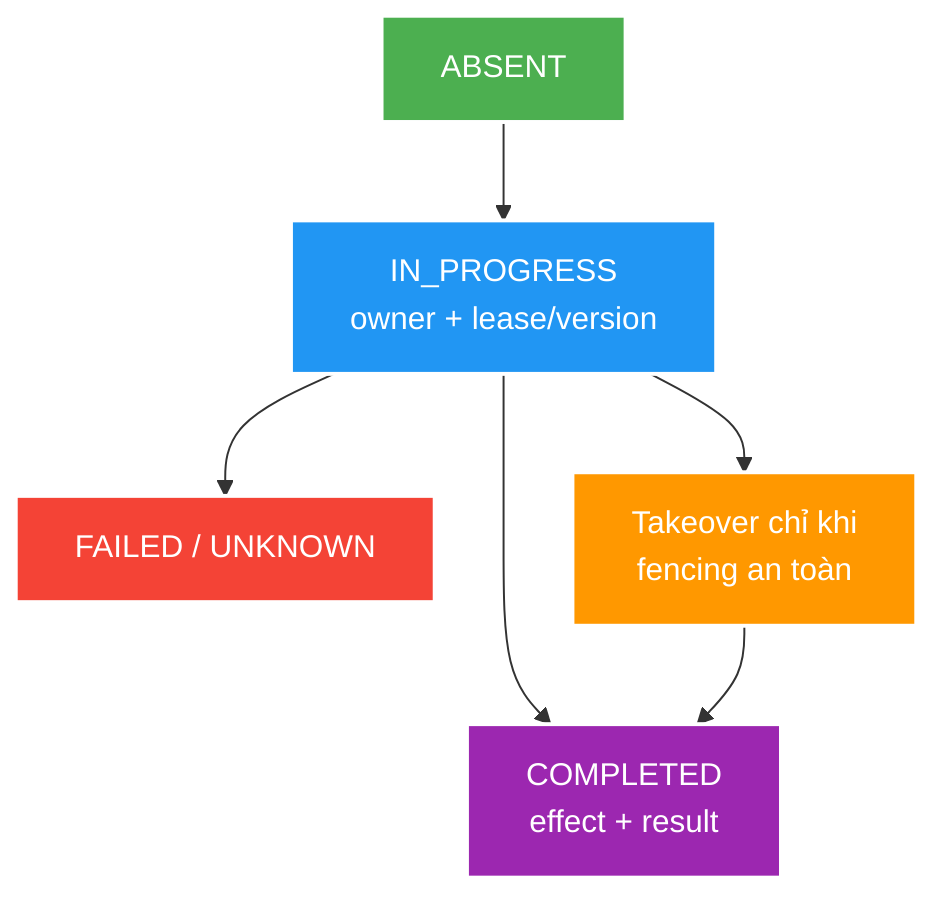

# Idempotency, kết quả không chắc chắn và conditional request

> Type: `DEEP_DIVE` 
> Domain: `architecture` 
> Target depth: `D3 — thiết kế state machine/durable claim và fault-inject mọi commit/response boundary` 
> Teaching readiness: `TEACHABLE_DRAFT` 
> Status: `DRAFT` 
> Evidence status: `NOT RUN` 
> Prerequisites: [HTTP/REST core](../core/http-rest-semantics-and-idempotency.md) 
> Related cases: [`GIFT-UC-01`](../../../../use-case-catalog.md#gift-uc-01), [`FOLLOW-UC-01`](../../../../use-case-catalog.md#31-foundation-và-senior-cases) 
> Owner: `Project learner; Codex assists` 
> Updated: `2026-07-26`

## 0. Mental model và cách học

Idempotency là một recovery protocol — giao thức phục hồi — cho tình huống client không biết server đã làm tới đâu. Hãy đặt state machine cạnh các mốc database commit và gửi response. Ở mỗi điểm crash, cần hỏi worker mới có thể tiếp quản mà worker cũ không quay lại commit muộn hay không. Đừng trộn nó với conditional request: idempotency chống xử lý trùng một command logic, còn conditional request bảo vệ phiên bản resource mà client đã quan sát.

## 1. Ambiguous outcome model

Client quan sát timeout/disconnect chỉ biết không nhận được response; server có thể chưa bắt đầu, đang chạy, đã rollback hoặc đã commit. Vì vậy, retry command cần business identity và outcome recovery, không thể dựa vào trực giác ở transport layer.

Một idempotency record thực tế thường có scoped key, request fingerprint, state, owner/lease/version, result reference/response metadata, timestamps và expiry. Atomic insert/unique constraint elects one owner. Concurrent duplicate either waits/polls, gets an in-progress response, or retrieves completed outcome according to contract.

Trạng thái `FAILED` cần được phân loại. Lỗi validation vĩnh viễn có thể trả lại cùng kết quả ổn định; lỗi hạ tầng tạm thời có thể cho phép tiếp quản hoặc retry; trạng thái không rõ do crash phải đối soát với bản ghi nghiệp vụ. TTL phải dài hơn cửa sổ retry/offline thực tế, hoặc danh tính nghiệp vụ phải được bảo vệ bền vững ở nơi khác để record hết hạn không mở lại cửa sổ xử lý trùng.

## 2. State machine và các invariant

Worked example: worker A giữ lease 10 giây rồi bị pause; worker B takeover sau expiry. Nếu A tỉnh lại và vẫn có quyền update, cả hai có thể commit. Fencing token tăng dần phải được durable business write kiểm tra (`token >= current`) để old owner bị từ chối. Lease time đơn lẻ không tạo exclusive ownership khi process/network pause.

`ABSENT -> IN_PROGRESS -> COMPLETED` là luồng thành công chính. Việc lease hết hạn và worker khác tiếp quản không được tạo ra hai owner cùng có quyền commit; cần fencing token, version check hoặc transaction database tùy thiết kế. Khi bản ghi nghiệp vụ và kết quả idempotency cùng nằm trong một database, commit chúng trong cùng transaction thường tạo ranh giới nguyên tử dễ hiểu nhất.

Invariants:

1. Cùng key trong cùng phạm vi và cùng fingerprint chỉ được có tối đa một business effect đã commit.
2. Cùng key nhưng fingerprint khác là xung đột và có thể là tín hiệu lạm dụng.
3. Khi phát lại kết quả đã hoàn tất, caller hiện tại vẫn phải có quyền và hiểu đúng phiên bản hợp đồng.
4. Cleanup không được xóa lớp bảo vệ chống trùng bền vững duy nhất quá sớm.

## 3. Conditional requests

Ví dụ client đọc resource ETag `v7`, gửi `If-Match: v7`; server chỉ update nếu current vẫn v7, nếu không trả precondition failure. Nó ngăn lost overwrite từ stale view. Hai POST command khác delivery nhưng cùng logical gift vẫn cần idempotency identity; ETag không tự biết chúng là duplicate.

`ETag`/`If-Match` biểu diễn điều kiện optimistic concurrency cho trạng thái resource. Nếu version đã đổi kể từ lần client đọc, precondition thất bại và server từ chối ghi đè lên dữ liệu mới. Cơ chế này xử lý cập nhật đồng thời trên một resource, không tự nhận biết hai lần gửi của một command bất kỳ, trừ khi command thật sự tương ứng với việc thay thế một resource có version.

`Strong validator` yêu cầu representation tương đương từng byte theo quy tắc HTTP; `weak validator` chỉ nói nội dung có ý nghĩa tương đương cho mục đích cache. Cách cache/proxy xử lý chúng là một phần của thiết kế. Validator phải thay đổi khi ngữ nghĩa cần độ mới thay đổi, đồng thời không nên để lộ version hoặc trạng thái nội bộ nhạy cảm nếu client không cần biết.

## 4. Fault matrix

| Fault point | State to inspect |
| --- | --- |
| Before idempotency claim | No owner/effect |
| After claim, before business write | Recoverable stale in-progress |
| After business write, before commit | Both rollback if one transaction |
| After commit, before response | Duplicate retrieves committed result |
| During result serialization/storage | Effect/result reconciliation |
| Concurrent same/different payload | One effect / conflict |

Chưa fault injection nào được chạy; evidence `NOT RUN`.

## 5. Bảng đánh đổi

| Storage/design | Correctness | Operability |
| --- | --- | --- |
| DB unique + same tx | Strong local atomicity | Table growth/cleanup |
| Redis `SET NX` + TTL | Fast claim | Crash/expiry/durability gaps |
| Business natural key | Minimal extra state | Only fits natural identity |
| Full response replay | Stable client outcome | PII/size/version retention |
| Result reference replay | Smaller | Reconstruct/auth/version logic |

### 5.1. Pathology A — lease hết hạn nhưng owner cũ vẫn commit

Worker A claim key với lease 10 giây rồi bị GC pause. B thấy lease expired và takeover. A tỉnh lại; nếu durable write chỉ kiểm key chứ không kiểm generation/fencing token, cả A và B có thể effect. Monotonic token phải được business write/transition enforce để stale owner bị từ chối. Lease chỉ nói thời gian, không tạo quyền độc quyền khi clock/process pause.

### 5.2. Pathology B — full response replay lộ dữ liệu hoặc contract cũ

Idempotency table lưu nguyên response gồm PII/auth-dependent fields. Sau vài ngày caller permission đổi hoặc API schema mới, replay bytes cũ có thể leak/không parse. Result reference nhỏ hơn nhưng phải re-authorize và reconstruct stable outcome; full replay cần encryption/access/retention/version policy. Same key phải scoped actor/tenant và fingerprint canonical payload, không chỉ raw header global.

### 5.3. Pathology C — cleanup mở lại duplicate window

TTL 24 giờ nhưng mobile client offline retry sau ba ngày. Record biến mất, natural business row không unique theo operation, effect chạy lại. Cleanup phải dựa retry/offline/provider/audit horizon và có durable natural/business identity hoặc archived duplicate guard. Table-growth cost là operability concern, không phải lý do xóa correctness state sớm.

### 5.4. Thí nghiệm chèn lỗi và cách diễn giải

Đặt các điểm chèn lỗi có kiểm soát ở trước khi claim, sau claim, trước/sau business commit và trước khi serialize response/kết quả. Chạy hai request đồng thời với cùng key/cùng payload rồi cùng key/khác payload; dừng owner lâu hơn lease để kiểm tra fencing; cho record hết hạn rồi retry. Assertion phải chứng minh chỉ có một business effect, kết quả trả lại ổn định hoặc xung đột đúng, replay vẫn kiểm quyền và trạng thái cũ có thể phục hồi. `If-Match` được test riêng bằng hai client cùng cập nhật từ version đã đọc. Evidence vẫn `NOT RUN`; khi chạy thật phải cố định DB isolation, timeout/retry của proxy và baseline serializer.

### 5.5. Walkthrough phục hồi khi record kẹt ở `IN_PROGRESS`

Giả sử worker claim key rồi crash trước business commit. Request retry nhìn thấy `IN_PROGRESS` đã quá lease. Trước khi tiếp quản, worker mới phải phân biệt “nghiệp vụ chưa xảy ra” với “đã commit nhưng record kết quả chưa cập nhật”. Nếu business row có operation ID duy nhất, nó có thể tra và hoàn tất record; nếu không có durable identity, tự chạy lại có nguy cơ tạo side effect trùng. Đây là lý do state `UNKNOWN` cần reconciliation chứ không chỉ đổi thành `FAILED`.

Nếu worker cũ chỉ bị pause và quay lại sau takeover, lease hết hạn chưa đủ tước quyền commit. Fencing token tăng dần phải được kiểm tại durable write; write mang token cũ bị từ chối. Evidence gồm generation của hai owner, row count/unique constraint, business effect cuối và outcome mà hai caller nhận. Chỉ test TTL trên Redis mà không kiểm write bền vững không chứng minh fencing.

Khi lưu full response để replay, cần xét authorization hiện tại, PII, schema version và retention. Khi chỉ lưu result reference, server phải tái dựng response ổn định nhưng có thể re-authorize. Cả hai lựa chọn đều cần contract cho cleanup và key rotation. Raw fault result chưa chạy nên mọi kết luận tại đây vẫn là thiết kế `NOT RUN`.

## 6. Dàn ý phỏng vấn, tóm tắt và phần người học viết lại

Kể ambiguous states, durable record/state/fingerprint, atomic claim và fencing. Nêu TTL cleanup window, authorization/result replay, fault matrix và contrast `If-Match`.

- Lease không đủ nếu old owner có thể commit muộn.
- Cleanup không được xóa duplicate guard trước business retry horizon.
- Full response replay có PII/version cost.
- Conditional request bảo vệ version, idempotency bảo vệ logical command.

`LEARNER TODO — hoàn thiện state machine và fencing rule cho GIFT-UC-01.`

## 7. Guided self-check

1. **Question:** Fencing làm gì? **Đọc lại nếu bí:** diagram và worked example. **Rubric:** monotonic token enforced at durable write rejects stale owner. **My answer:** `LEARNER TODO`
2. **Question:** TTL/cleanup an toàn ra sao? **Đọc lại nếu bí:** mục 1–2, 5. **Rubric:** realistic retry/offline/audit horizon, natural guard/reconciliation, no premature duplicate gap. **My answer:** `LEARNER TODO`
3. **Question:** `If-Match` và key khác gì? **Đọc lại nếu bí:** conditional example. **Rubric:** observed-version concurrency vs delivery dedup/logical operation identity. **My answer:** `LEARNER TODO`

## 8. References

- [RFC 9110 — Idempotent Methods](https://www.rfc-editor.org/rfc/rfc9110.html#name-idempotent-methods)
- [RFC 9110 — Preconditions](https://www.rfc-editor.org/rfc/rfc9110.html#name-preconditions)

## 9. Teach-back checklist

- [ ] Tôi reason từ client-observable ambiguity.
- [ ] Tôi có atomic claim/state/TTL/fencing story.
- [ ] Tôi phân biệt duplicate command với concurrent resource update.
- [ ] Evidence vẫn `NOT RUN`.
