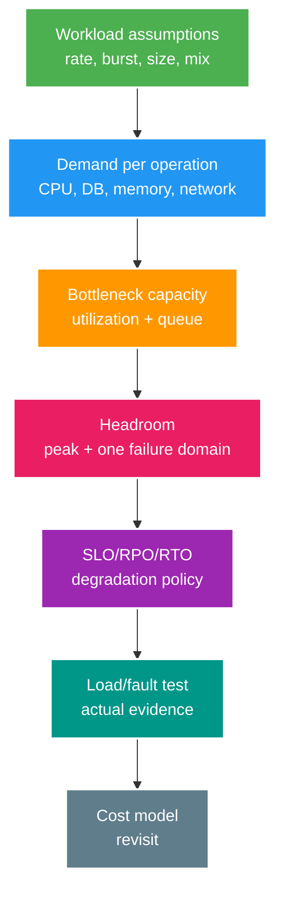

# Architecture Core: Capacity, Queueing, Multi-region và Cost

> Type: `CORE` 
> Domain: `architecture` 
> Target depth: `D3 — ước lượng workload, tìm bottleneck, thiết kế headroom/failure domain và cost model` 
> Teaching readiness: `TEACHABLE_DRAFT` 
> Status: `DRAFT` 
> Evidence status: `NOT RUN` 
> Prerequisites: performance metrics; distributed consistency 
> Related cases: `ARCH-01`; [question bank](../../question-bank/capacity-queueing-multi-region-and-cost.md) 
> Owner: `Project learner; Codex teaches, learner writes back` 
> Updated: `2026-07-26`

## 1. Quantities phải có đơn vị

Throughput là completions/time (requests/s, messages/s, bytes/s). Latency là duration/request, cần percentile/distribution. Concurrency là work đang trong system. Under stable conditions, Little's Law: average concurrency `L = arrival rate λ × average residence time W`; units phải khớp. 10.000 req/s × 0,2s ≈ 2.000 concurrent requests, nhưng burst/tail/resource limits vẫn cần.

Utilization là fraction capacity used at bottleneck. Khi gần saturation, variability tạo queue và tail latency tăng phi tuyến; CPU average 50% không chứng minh system khỏe nếu DB pool/lock/disk/one shard 100%. Capacity plan là workload assumptions → resource demand → bottleneck/queue → headroom/failure → measurement.

## 2. Reliability terms

**Availability** là tỷ lệ thời gian hoặc request mà service dùng được. **Reliability** là xác suất hệ thống hoạt động đúng trong một khoảng. **Durability** là dữ liệu đã ack vẫn sống qua failure theo guarantee đã công bố. **Resilience** là khả năng degrade, cô lập và recover. Service availability cao vẫn có thể trả dữ liệu sai; database durable vẫn có thể unavailable; retry giúp lỗi transient nhưng làm overload nặng hơn.

SLO định nghĩa mục tiêu đo được; error budget hướng dẫn mức risk khi thay đổi. RPO là cửa sổ mất dữ liệu tối đa, RTO là thời gian recovery. **Failure domain** là nhóm thành phần cùng chung số phận như process, node, AZ, region, dependency hoặc account. Headroom phải sống qua failure đã tuyên bố: mất một trong ba zone thì hai zone còn lại vẫn chịu được peak ở chế độ degraded, không chỉ đủ theo average toàn fleet.

## 3. Scaling choices

Vertical scaling bằng node lớn hơn đơn giản và ít coordination nhưng có trần, tăng theo nấc đắt và blast radius lớn. Horizontal scaling phân phối workload stateless, còn dữ liệu stateful cần partition, replication, coordination và rebalancing. “Stateless app” vẫn phụ thuộc session, cache, database, broker và connection.

Scale đúng bottleneck, không scale mù mọi tier. App autoscale theo CPU có thể thêm DB connection cho tới khi database sập. Admission control, concurrency/queue hữu hạn và load shedding bảo vệ resource owner. Queue chỉ làm phẳng burst nếu service rate dài hạn lớn hơn arrival; ngược lại backlog và tuổi event tiếp tục tăng. Khi chênh lệch dương, drain time xấp xỉ `backlog / (consume rate − arrival rate)`, nhưng phải tính retry và cost biến đổi.

## 4. Worked 100k viewers estimate

Ghi assumption tường minh: 100 nghìn viewer đồng thời trên N stream; protocol connection; chat message average/p95; payload cộng overhead framing/TLS; heartbeat; reconnect burst; fan-out topology và phân bố region. Ví dụ chỉ để minh họa, chưa phải evidence: 100 nghìn connection × 1 KiB/s downstream trung bình xấp xỉ 100 MB/s trước overhead; reconnect 1%/s tạo 1.000 handshake/auth mỗi giây; một message trong celebrity room fan-out thành 100 nghìn delivery.

Resource cần tính gồm file descriptor, socket buffer và heap mỗi connection; event-loop/thread model; auth/session cache/database; broker/pub-sub; gateway egress; CPU serialize/compress. Partition hot room, tránh DB write mỗi viewer, giới hạn outbound queue và có slow-consumer policy, thêm reconnect jitter và bảo vệ auth/database. Presence/view count có thể approximate; chat authorization không được âm thầm bỏ.

Load test phải mô phỏng distribution và fan-out, không chỉ mở 100 nghìn socket idle giống nhau. Đo connection success, reconnect latency, message/s, byte/s, queue age/drop, memory/GC/CPU/network và dependency pool.

## 5. Gift spike estimate

Với gift spike, nêu arrival rate, burst, gift mix và idempotent retry. Mô hình hóa DB transaction/s, ledger row/index/lock, outbox write, broker publish, consumer service time và notification. Admission bảo vệ wallet: không nới uniqueness/balance khi spike. Queue notification/analytics không critical, nhưng backlog retention và stale SLO phải hữu hạn. Consumer xử lý 2 nghìn/s trong khi vào 3 nghìn/s suốt 10 phút tạo thêm 600 nghìn backlog; sau đó arrival còn 1 nghìn/s thì net drain 1 nghìn/s và mất khoảng 10 phút nếu chưa tính retry.

Dành headroom cho retry và failure. Shed recommendation, history và presence trước khi ảnh hưởng correctness của payment/gift. Reconciliation xác minh ledger, gift và outbox, không lấy “queue bằng 0” làm bằng chứng duy nhất.

## 6. Multi-region choices

Single-writer region cho order/consistency đơn giản nhưng tăng remote latency và failover RTO. Regional ownership partition account/stream theo home region, cho local write và handoff tường minh. Active-active trên cùng key cần coordination hoặc conflict-free semantics; last-write-wins không chấp nhận được cho wallet. Read/projection có thể local và stale nếu có read-your-writes hoặc version.

Failover gồm routing, vị trí replication data, epoch mới để fence region cũ, dependency/capacity và failback. Chỉ đổi DNS là chưa đủ. RPO/RTO quyết định sync hay async replication, backup, cost và drill. Failure kép mất zone cộng celebrity reconnect cần capacity còn lại, admission/jitter và thứ tự degradation.

## 7. Cost as constraint

Cost model phải gồm compute, replica database/cache/broker, storage/backup/IOPS, network/egress, phí managed service, license, observability, security/compliance, engineering/on-call, DR idle capacity và migration/exit. Chuẩn hóa cost theo request, active viewer, GB hoặc event, đồng thời tính peak/headroom.

Resource bill rẻ nhất có thể làm incident và team cost tăng. So alternative với SLO và business value; dùng billing/utilization thật sau rollout để revisit. FinOps guardrail gồm budget, anomaly và ownership; không cắt backup/redundancy bắt buộc mà thiếu quyết định rủi ro rõ ràng.

## 8. Capstone answer spine

Bản 2 phút nêu requirement, scale, invariant, high-level flow/storage và hai risk/trade-off. Bản 15 phút thêm capacity math, consistency, security, failure, observability, cost và alternative. Bản 45 phút đi vào component/data flow, API/event, bottleneck model, region/DR, migration, test và runbook. Cùng một quyết định nhưng tăng evidence, không đổi kiến trúc theo thời lượng.

## 8.1. Hai worked examples và phản ví dụ

**Worked example tối thiểu — Little's Law:** arrival 500 requests/s và average time-in-system 200 ms cần khoảng 100 concurrent in-flight requests (`L = λW`). Nếu dependency chỉ chịu 60 concurrent ở accepted p99, queue/unbounded concurrency không tạo capacity; cần admission/load shed hoặc giảm service time.

**Worked example gần project — 100k viewers:** 100k sockets không đồng nghĩa 100k messages/s. Model tách connection memory/heartbeat, room skew, inbound chat và outbound fanout bytes, rồi đặt headroom và slow-consumer policy. Load evidence phải ghi payload/rates/duration/hardware/fault, không chỉ connection count.

**Phản ví dụ:** HPA thêm pods theo CPU khi PostgreSQL đã là bottleneck. Mỗi pod mở thêm pool/cache warm/retry làm DB pressure tăng; scale compute nhưng không scale owner capacity. Capacity model phải xác định bottleneck/feedback loop trước scaling knob.

## 9. Learner/self-check

> **Bài viết của tôi — `LEARNER TODO`:** estimate 100k viewers + gift spike with units, bottleneck, failure and cost.

1. **Question:** Latency/throughput/concurrency liên hệ gì? 
   **Đọc lại nếu bí:** mục 1. 
   **Một câu trả lời tốt phải có:** units, Little's Law assumptions, bottleneck utilization, tail/queue. 
   **My answer:** `LEARNER TODO`
2. **Question:** One-zone failure vào capacity thế nào? 
   **Đọc lại nếu bí:** mục 2–3 và 6. 
   **Một câu trả lời tốt phải có:** failure domain, N+1/headroom, dependency/remaining capacity, degrade/failover/RTO. 
   **My answer:** `LEARNER TODO`
3. **Question:** Cost model gồm gì? 
   **Đọc lại nếu bí:** mục 7. 
   **Một câu trả lời tốt phải có:** full lifecycle/egress/ops/DR/migration, normalized unit, SLO/value, actual revisit. 
   **My answer:** `LEARNER TODO`

## 10. References/teach-back

- [Google SRE Book — Handling Overload](https://sre.google/sre-book/handling-overload/)
- [AWS Well-Architected Framework](https://docs.aws.amazon.com/wellarchitected/latest/framework/welcome.html)

- [ ] Tôi estimate bằng assumptions/units.
- [ ] Tôi design queue/headroom/failure recovery.
- [ ] Tôi nối SLO/RPO/RTO với cost.
- [ ] Evidence vẫn `NOT RUN`.
