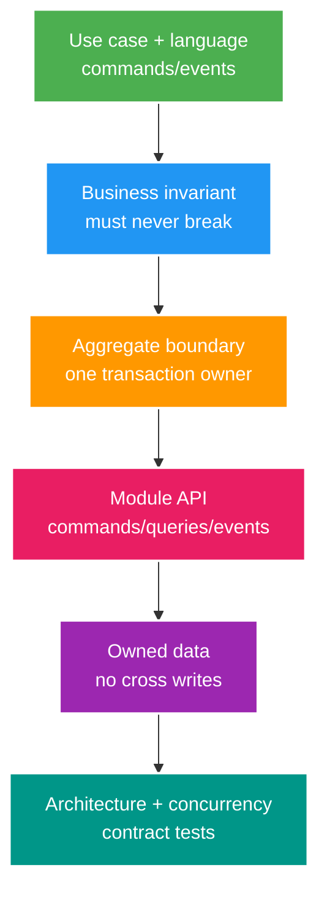

# DDD Core: Aggregates và Modular Boundaries

> Type: `CORE` 
> Domain: `architecture` 
> Target depth: `D3 — dùng invariant/use case để chọn aggregate, module API và data owner` 
> Teaching readiness: `TEACHABLE_DRAFT` 
> Status: `DRAFT` 
> Evidence status: `NOT RUN` 
> Prerequisites: OOP; transaction boundaries 
> Related cases: `MOD-01`; [question bank](../../question-bank/ddd-aggregates-and-modular-boundaries.md) 
> Owner: `Project learner; Codex teaches, learner writes back` 
> Updated: `2026-07-26`

## 1. DDD giải bài toán gì?

Domain-Driven Design không phải bộ annotation/entity patterns. Nó giúp đội ngũ tạo model chung quanh business rules phức tạp, đặt boundary nơi language/rules nhất quán và bảo vệ invariant bằng ownership. Domain là bài toán business tổng; subdomain là capability như Identity, Livestream, Wallet/Gift, Chat/Moderation; bounded context là boundary nơi một từ/model có meaning cụ thể và contract với contexts khác.

“Session” trong Security có thể là authenticated login; trong Livestream là broadcast occurrence. Ép dùng chung class/database concept tạo coupling. Ubiquitous language là conversation + examples + tests + APIs + code thống nhất trong context, không glossary trang trí.

## 2. Entity, value object và aggregate

Entity có continuity identity qua time, dù attributes đổi: `Livestream(id)`, `Wallet(id)`. Value object được định nghĩa bởi values và thường immutable: `Money(amount,currency)`, `StreamTitle`; equality theo attributes. Aggregate là cluster state có root làm consistency boundary: mọi mutation đi qua root/use-case owner và invariant cần immediate consistency được giữ trong một transaction.

Aggregate không đồng nghĩa object graph lớn hoặc JPA cascade. Project lưu IDs tường minh; aggregate có thể load/update qua repositories/queries without ORM associations. Reference aggregate khác bằng ID. Nếu state không cần atomic với invariant hiện tại, giữ ngoài và coordinate eventually.

Ví dụ wallet: invariant balance/ledger conservation và one purchase operation có thể cần one transaction owner. Livestream metadata không cần nằm trong Wallet aggregate chỉ vì gift references stream. Gift workflow links IDs/events. Aggregate quá lớn gây lock contention/load/cascade; quá nhỏ đẩy invariant critical vào race giữa transactions.

## 3. Chọn aggregate từ invariant

Liệt kê commands, rejected conditions, state transitions và concurrency conflicts. Hỏi “điều gì phải đúng ngay khi transaction commit?” chứ không “tables nào related?”. Nếu two fields/rows must change atomically to preserve money, same owner transaction. Nếu notification có thể trễ, outside aggregate via outbox.

Ví dụ `PurchaseGift(commandId, senderWalletId, receiverId, streamId, amount)`: command phải duy nhất; đủ tiền; ledger cân bằng và gift record phải commit nguyên tử nếu cùng data owner. Viewer count, notification và analytics có thể eventual. Test concurrent cùng key hoặc thiếu balance bằng unique/conditional constraint; chỉ validate ở root method mà thiếu DB race guard là chưa đủ.

Rule xuyên aggregate có thể dùng reservation/quota, saga hoặc eventual reconciliation. Không tạo một global aggregate khóa mọi stream/user. Trước hết hỏi invariant có thật sự global và immediate không, rồi chọn consistency tường minh.

## 4. Module API và data ownership

Modular monolith dùng chung process/deployment và có thể chung database vật lý, nhưng mỗi module expose application/domain API và sở hữu write cùng ý nghĩa schema. Module khác không import repository/entity nội bộ hay ghi thẳng table; chúng gọi command/query interface, consume event hoặc dùng read projection có owner rõ.

Dùng cùng database khiến join khả thi về kỹ thuật nhưng boundary vẫn quan trọng. Cross-module read có thể qua API, composed query hoặc read model; cross-write bypass rule và làm extraction/test/migration mất an toàn. Một module sở hữu migration và invariant cho dữ liệu của nó. Shared kernel chỉ chứa concept nhỏ, ổn định và có đồng sở hữu chủ đích; thư mục `common` chứa mọi thứ tạo hidden coupling.

Package-by-feature thể hiện boundary tốt hơn package-by-layer: dùng `wallet/api`, `wallet/application`, `wallet/domain`, `wallet/internal` thay vì controller/service/repository toàn cục. Cấu trúc cụ thể phải hợp project, không làm DDD ceremony.

## 5. Commands, domain events và integration events

Command yêu cầu hành động và có thể bị từ chối, ví dụ `PurchaseGift`. Domain event ghi nhận fact nội bộ như `GiftPurchasedDomainEvent`, có thể mang chi tiết giàu và xuất hiện trong transaction. Integration event là biểu diễn ổn định sau commit, được map/version và giảm secret như `gift.purchased.v1`. Không publish trước commit; dùng outbox.

Event là fact, không phải command cải trang kiểu `PleaseSendGiftEvent`. Consumer sở hữu reaction; producer không biết từng consumer. Evolution, retention và privacy của integration event là contract work. Domain event không tự động là async; handler nội bộ synchronous vẫn có thể tạo transaction coupling.

## 6. Context mapping for livestream

Identity sở hữu account/authentication fact, không sở hữu wallet balance. Livestream sở hữu lifecycle/ownership của stream. Wallet/Gift sở hữu invariant giống tiền và purchase record. Chat/Moderation sở hữu message, mute và ban decision. Analytics consume fact thành projection, không ghi table của owner.

Quan hệ context gồm upstream/downstream; anti-corruption layer (ACL) dịch external/legacy model; conformist chấp nhận upstream model; customer/supplier phối hợp roadmap; shared kernel chỉ khi chủ đích. Gán team, on-call, SLO và contract. Context map phải theo coupling business/team/data thật, không vẽ box rồi ép code.

## 7. Boundary enforcement

Architecture test có thể cấm package cycle/import nội bộ; Spring Modulith có thể model module/event/test tùy version. Chúng không chứng minh context được chọn đúng, runtime không có SQL truy cập shared table ngoài path đã kiểm, hay business invariant an toàn. Kết hợp dependency test, review ownership repository/schema, API/event contract test, concurrency test và observability.

Refactor kiểu strangler: inventory use case/dependency/data write hiện tại; thêm module facade; characterization test; chuyển một vertical slice; cấm direct repository access mới; adapt legacy call rồi xóa path tạm. Tránh big-bang move chỉ đổi folder.

## 8. Hot aggregate evolution

Nếu một stream/wallet row là contention hotspot, đo lock/conflict. Giữ serialization point thật nhỏ bằng conditional update hoặc append ledger. Partition chiều độc lập; reservation/quota bucket phân tán capacity nhưng cần conservation/reconciliation. Event sourcing/append log có thể cải thiện audit/throughput pattern nhưng không xóa concurrency invariant và còn thêm projection/replay complexity.

Không split aggregate chỉ vì performance nếu làm double-spend khả thi. Hãy evolution business model bằng per-wallet ownership, budget bucket theo campaign, escrow/reservation hoặc commutative counter khi không cần chính xác tuyệt đối.

## 8.1. Hai worked examples và phản ví dụ

**Worked example tối thiểu — aggregate invariant:** wallet operation cần balance không âm và one business outcome. Wallet/ledger transaction boundary sở hữu invariant; object khác chỉ tham chiếu ID. Aggregate không được chọn theo “mọi thứ liên quan” mà theo consistency boundary cần atomic.

**Worked example gần project — module boundary:** Streaming module công bố command/state API; Moderation không đọc/ghi trực tiếp tables nội bộ mà gọi capability hoặc consume fact phù hợp. Architecture test bảo dependency direction, còn integration test bảo contract/invariant.

**Phản ví dụ:** một `LivestreamAggregate` chứa stream, creator, viewers, chat, gifts và moderation vì cùng màn hình. Nó tạo lock/load/transaction khổng lồ và owner mơ hồ. Cùng use case UI không đồng nghĩa cùng aggregate consistency boundary.

## 9. Interview/self-check

Ở Foundation cần domain/context/entity/value/aggregate. Senior cần boundary theo invariant, event, enforcement và refactor module. Architect cần context/team/data map. Expert phải redesign hot aggregate với safety evidence.

> **Bài viết của tôi — `LEARNER TODO`:** map Identity/Livestream/Wallet-Gift/Chat and one aggregate invariant.

1. **Question:** Aggregate chọn theo gì? 
   **Đọc lại nếu bí:** mục 2–3. 
   **Một câu trả lời tốt phải có:** invariant, immediate transaction, command/conflict, IDs outside, DB guard. 
   **My answer:** `LEARNER TODO`
2. **Question:** Module same DB vẫn có owner ra sao? 
   **Đọc lại nếu bí:** mục 4 và 7. 
   **Một câu trả lời tốt phải có:** API, one write owner, no repo/table bypass, events/read model, architecture+contract tests. 
   **My answer:** `LEARNER TODO`
3. **Question:** Domain/integration event khác gì? 
   **Đọc lại nếu bí:** mục 5. 
   **Một câu trả lời tốt phải có:** internal fact vs external stable contract, commit/outbox, version/privacy, command distinction. 
   **My answer:** `LEARNER TODO`

## 10. References/teach-back

- [Martin Fowler — Bounded Context](https://martinfowler.com/bliki/BoundedContext.html)
- [Spring Modulith Reference](https://docs.spring.io/spring-modulith/reference/)

- [ ] Tôi model từ invariant và language.
- [ ] Tôi bảo vệ module/data owner bằng tests/contracts.
- [ ] Tôi evolve hot boundary không làm yếu invariant.
- [ ] Evidence vẫn `NOT RUN`.
