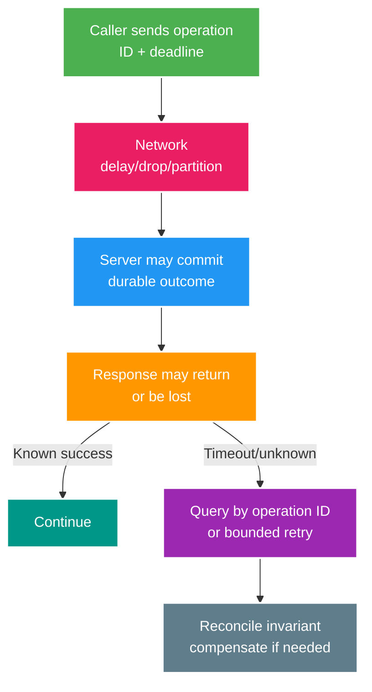

# Distributed Systems Core: Consistency, Clocks và Coordination

> Type: `CORE` 
> Domain: `architecture` 
> Target depth: `D3 — chọn consistency theo invariant, xử lý unknown outcome và dùng version/fencing đúng boundary` 
> Teaching readiness: `TEACHABLE_DRAFT` 
> Status: `DRAFT` 
> Evidence status: `NOT RUN` 
> Prerequisites: transactions; messaging idempotency 
> Related cases: `DIST-01`; [question bank](../../question-bank/distributed-consistency-clocks-and-coordination.md) 
> Owner: `Project learner; Codex teaches, learner writes back` 
> Updated: `2026-07-26`

## 1. Mental model: không có global “now” miễn phí

Trong một process, exception thường cho biết call đã fail trước khi trả kết quả. Qua network, timeout chỉ nói caller chưa nhận response trong deadline; server có thể chưa nhận, đang chạy, đã commit rồi response mất hoặc cả hai phía bị partition. Đây là **unknown outcome**. Retry mù có thể lặp effect; bỏ retry có thể mất intent. Stable idempotency key, operation-status query, durable state và reconciliation biến ambiguity thành workflow xử lý được.

Distributed design bắt đầu từ invariant và failure history, không từ slogan CAP hay “eventual consistency”.

## 2. Consistency guarantees bằng ngôn ngữ use case

**Linearizability/strong consistency**: mỗi completed operation trông như xảy ra tại một điểm giữa invoke/response và mọi clients thấy một order phù hợp real time. Hữu ích cho unique allocation, wallet balance/ownership, lock/fencing state. Nó không đồng nghĩa multi-object ACID trừ system nói vậy.

**Eventual consistency**: nếu ngừng writes, replicas/projections cuối cùng converge; nó không nói convergence trong bao lâu, conflict rule hay user nhìn thấy gì trước đó. Cần lag SLO, monotonic version, conflict/reconciliation.

**Read-your-writes**: session/user thấy write của chính mình; **monotonic reads** không quay về version cũ; **causal consistency** giữ cause trước effect. Routing/session token/version can provide narrower guarantee cheaper than global strong consistency.

State per operation: wallet debit needs one owner/serializable invariant; profile bio may accept last-write/optimistic version plus RYW; viewer analytics accepts async/replay. Một database không có một consistency label áp mọi query—read replica, cache, transaction isolation and conditional writes differ.

## 3. CAP và PACELC dùng đúng

Khi network partition tách nodes, một operation replicated phải chọn tiếp tục trả successful writes có thể conflict (**availability**) hoặc reject/wait để giữ single current order (**consistency**). Đây là per-operation/config choice, không nhãn toàn product. Network partition không phải optional; choice là behavior khi xảy ra.

PACELC nhắc rằng ngay cả Else (no partition), stronger coordination thường đổi latency. Quorum/leader across regions tăng round-trip but safety; local reads faster but stale. Hỏi: partition nào, operation nào, invariant gì, maximum stale/loss, response nào và recovery ra sao.

CAP “A” yêu cầu every non-failing node responds, khác marketing uptime. Database called CP không tự đảm bảo application không double-charge nếu retries thiếu idempotency.

## 4. Clocks và order

Wall clock dùng human timestamps/audit, có thể jump do NTP/manual/VM and skew across nodes. Monotonic clock dùng elapsed duration/deadline trong process; không so giữa hosts và resets on restart. Logical Lamport/version counters capture happens-before/order in a scope, not physical time. Vector clocks can represent causality/concurrent versions but metadata/conflict complexity.

Timestamp alone không chứng minh causality/total order. `updatedAt` last-write-wins có thể drop legitimate concurrent change under skew. Aggregate version/DB sequence/consensus term is stronger for state transition. Use UTC instants for records, monotonic deadlines for timeouts, and version for concurrency.

## 5. Quorum reasoning

Với N replica, W write acknowledgement và R read, điều kiện `R + W > N` gợi ý read/write set giao nhau dưới một số assumption. Nhưng member giao nhau vẫn có thể trả stale; clock, conflict, failed write và hinted handoff đều ảnh hưởng, nên chưa tự động linearizable. Write quorum thay đổi durability/availability khi accept; read quorum chịu latency của member chậm. Sloppy quorum còn chọn node ngoài replica set và làm assumption đổi.

Leader-based replication serialize write tại leader/term còn follower có lag. Đọc follower có thể stale; read-your-writes có thể route leader hoặc chờ replication position. Leader failure/election tạo unavailable window và commit mơ hồ; client cần idempotency/status.

Không tự gán N/R/W cho PostgreSQL nếu chưa map đúng replication, commit và read configuration. Lý thuyết là công cụ reasoning, không phải evidence cấu hình project.

## 6. Coordination: lock, lease, fencing

Distributed lock cấp coordination identity; lease hết hạn theo thời gian. Holder cũ bị pause có thể thức dậy sau khi lease hết và holder mới đã chạy. Nếu downstream chỉ tin “tôi từng giữ lock”, cả hai cùng ghi. **Fencing token** tăng đơn điệu theo mỗi grant; downstream lưu token cao nhất và reject holder stale. Cơ chế này cần downstream hỗ trợ conditional write.

Consensus/election term cung cấp leadership có thứ tự, nhưng business owner vẫn cần unique/conditional constraint. Redis `SET NX PX` có thể coordination best-effort, không tự bảo vệ critical data khi process pause/partition và thiếu fencing. Advisory/row lock của database có scope theo connection/transaction với semantics cụ thể.

## 7. Duplicate and out-of-order events

Stable event ID xử lý exact duplicate; aggregate version xử lý state order. Consumer transition: version bằng current+1 thì apply nguyên tử; nhỏ hơn hoặc bằng current là duplicate/stale nên bỏ kèm audit; lớn hơn current+1 là gap cần park/retry/reconcile. Retention phải giữ dedup ID và nguồn bù gap đủ lâu. Partition key có thể giữ transport order theo aggregate nhưng DLQ/replay vẫn cần version.

Operation có tính giao hoán có thể merge mà không strict order; debit balance thường không thể. CRDT không phải “phép màu eventual consistency”: phép operation/merge của data type phải khớp business semantics và không sửa được external irreversible effect.

## 8. Failure matrix for remote call

Liệt kê failure ở DNS, connect, TLS, request send, server trước/sau commit, response loss, slow/duplicate/reorder, dependency overload và caller crash. Với mỗi điểm, xác định deadline, cancellation thực tế, retry eligibility/budget, idempotency identity, status query, compensation, backpressure và telemetry. Timeout phải nằm trong end-to-end budget; service lồng nhau không được mỗi tầng dùng full caller deadline.

Chỉ retry operation transient và safe/idempotent, có backoff/jitter cùng attempt/concurrency hữu hạn. Hedging giảm tail nhưng nhân load/effect nếu không an toàn. Circuit breaker dừng call nhưng không quyết định unknown outcome.

## 9. Multi-region examples

Wallet nên single writer, consensus group hoặc ownership account theo region; global active-active debit cần coordination/conflict model ngăn double-spend. Profile có thể chấp nhận regional write với version/read-your-writes và conflict policy. Analytics dùng append event, replayable projection và lag SLO. Presence là approximate state ephemeral nên ưu tiên availability/TTL.

Failover đổi epoch/owner; fencing ngăn region cũ ghi sau recovery. DNS không phải fencing. RPO/RTO và external effect quyết định manual reconciliation.

## 9.1. Hai worked examples và phản ví dụ

**Worked example tối thiểu — lease hết hạn:** leader A giữ lease rồi bị pause; B lấy lease mới. Nếu A tỉnh lại vẫn ghi được, lease time không đủ. Monotonic fencing token phải được target owner enforce để reject stale epoch.

**Worked example gần project — read-your-writes:** create stream commit primary nhưng immediate GET chạm replica chưa replay và trả 404. Position/session token hoặc primary fallback tạo explicit RYW contract; sleep cố định chỉ đoán lag.

**Phản ví dụ:** dùng timestamp local “mới hơn thắng” để merge wallet effects giữa hai regions. Clock skew và external side effects làm mất history/conservation. Money cần authoritative ledger/operation identity/fencing/reconciliation, không last-write-wins theo wall clock.

## 10. Interview summary và self-check

Foundation cần partial failure, consistency, CAP và clock. Senior cần quorum, fencing, versioned event và failure matrix. Architect phải chọn theo domain/region. Expert phải contain divergent writer, bảo toàn history, chọn authoritative epoch/ledger và compensation có audit.

> **Bài viết của tôi — `LEARNER TODO`:** kể timeout sau wallet commit, stale leader và out-of-order stream event.

1. **Question:** Timeout chứng minh gì? 
   **Đọc lại nếu bí:** mục 1 và 8. 
   **Một câu trả lời tốt phải có:** unknown outcome, operation ID/status, bounded retry, durable invariant/reconciliation. 
   **My answer:** `LEARNER TODO`
2. **Question:** Lease cần fencing vì sao? 
   **Đọc lại nếu bí:** mục 6. 
   **Một câu trả lời tốt phải có:** pause/expiry/new holder, monotonic term, downstream rejection, business constraint. 
   **My answer:** `LEARNER TODO`
3. **Question:** CAP dùng cho wallet/profile khác nhau ra sao? 
   **Đọc lại nếu bí:** mục 2–3 và 9. 
   **Một câu trả lời tốt phải có:** per-operation invariant, partition behavior, latency/staleness, conflict/recovery. 
   **My answer:** `LEARNER TODO`

## 11. References/teach-back

- [Herlihy & Wing — Linearizability](https://cs.brown.edu/~mph/HerlihyW90/p463-herlihy.pdf)
- [Gilbert & Lynch — Brewer's Conjecture](https://users.ece.cmu.edu/~adrian/731-sp04/readings/GL-cap.pdf)
- [RFC 9330 — Low Latency, Low Loss, Scalable Throughput (queue context)](https://www.rfc-editor.org/rfc/rfc9330)

- [ ] Tôi gọi đúng consistency guarantee theo operation.
- [ ] Tôi xử lý unknown outcome/version/fencing.
- [ ] Tôi có failure matrix và region recovery.
- [ ] Evidence vẫn `NOT RUN`.
