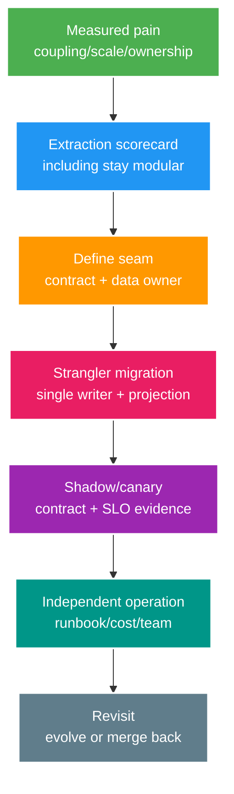

# Microservices Core: Extraction và Service-owned Data

> Type: `CORE` 
> Domain: `architecture` 
> Target depth: `D3 — quyết định extract từ evidence, giữ single data writer và migrate strangler an toàn` 
> Teaching readiness: `TEACHABLE_DRAFT` 
> Status: `DRAFT` 
> Evidence status: `NOT RUN` 
> Prerequisites: modular boundaries; distributed failure; outbox/inbox 
> Related cases: `MS-01`; [question bank](../../question-bank/microservice-extraction-and-service-owned-data.md) 
> Owner: `Project learner; Codex teaches, learner writes back` 
> Updated: `2026-07-26`

## 1. Microservice không phải module qua HTTP

Modular monolith có one process/deployment nhưng internal APIs/data owners được enforce. Microservices có independent deployment/runtime/failure/data ownership và giao tiếp qua unreliable network. Chia code nhỏ nhưng deploy cùng hoặc cùng write database chưa đạt autonomy; ngược lại monolith có module rõ có thể là lựa chọn tốt nhất.

Mỗi remote boundary thêm DNS/TLS, timeout/unknown outcome, serialization/schema, retry amplification, observability, security identity, independent rollout và on-call. Chỉ extract khi benefit về team autonomy, independent scale/resource/reliability hoặc change cadence vượt cost có bằng chứng.

## 2. Extraction scorecard

Đo change coupling qua file/module/team thường co-change; deploy conflict/frequency/lead time; incident/blast radius; nhu cầu scale độc lập và resource profile; business/data owner rõ cùng team vận hành 24/7. Ước lượng network latency, failure rate, platform bị lặp, data migration, contract governance, observability/security và cost phát sinh.

Option không chỉ có microservice: cải thiện modular monolith, tách process/read worker, dùng async queue, scale cả app, tuning database/index hoặc tách full service. Kiến trúc hợp xu hướng không phải evidence. Định nghĩa success, ví dụ analytics deploy độc lập, không truy cập wallet database, có event-lag SLO và giảm resource/incident impact cho monolith. Ghi revisit date và option merge-back.

## 3. Service-owned data

Một service sở hữu write semantics và schema evolution cho dữ liệu của nó. Service khác dùng API, event hoặc owned projection; không shared database write. Table-per-service trong cùng cluster có thể là bước chuyển, nhưng credential/grant/migration database và code phải enforce owner. Shared read cũng coupling schema và rò privacy; chuyển sang query API/projection khi cần.

Shared write thất bại vì bypass invariant/auth/audit, làm independent deploy bất khả thi, buộc schema migration lockstep, tăng incident blast radius và thiếu conflict resolver có thẩm quyền. Foreign key xuyên service database trở thành distributed lifecycle; dùng owner validation, ID, event và reconciliation.

Data duplication là bình thường với read model nhưng mỗi copy phải có purpose, owner, freshness, deletion và rebuild. Source of truth phải rõ. Service không thể gọi database khác trong local transaction rồi gọi toàn chuỗi là ACID.

## 4. Sync vs async interaction

Dùng synchronous API khi caller cần decision/result ngay và latency/availability dependency nằm trong deadline. Dùng async event cho fact propagation, background processing, smoothing và nhiều consumer độc lập. Async không xóa coupling về schema, semantics, lag, idempotency và recovery. Command có thể async nhưng cần operation status.

Tránh chatty chain Gateway → A → B → C vì end-to-end availability bị nhân còn latency cộng và kéo tail. Dùng coarse task API, local projection hoặc orchestration. Mỗi remote call cần propagated deadline, concurrency/queue hữu hạn, chỉ retry transient/idempotent trong budget, circuit/load shedding, identity/authorization, operation ID/status và telemetry. Gateway xử lý external routing/auth/quota/translation, không thành domain god service.

Discovery map logical name tới instance healthy; load balancer chọn instance. Health phải phân biệt startup/readiness/liveness và không route mù tới instance có dependency chết. Platform cụ thể là implementation choice, không phải mục tiêu kiến trúc.

## 5. Strangler extraction

1. Định nghĩa capability/API/event hữu hạn và authoritative data owner.
2. Characterization behavior, contract, invariant hiện tại và baseline SLO/cost.
3. Thêm facade/seam trong monolith; bỏ caller truy cập trực tiếp internals.
4. Tạo schema do service mới sở hữu; backfill snapshot và CDC/outbox projection nếu cần.
5. Giữ **một write owner** ở mọi phase; tránh bidirectional dual-write.
6. Shadow read/output để so sánh; chạy provider/consumer contract và mixed-version test.
7. Route cohort nhỏ cho read path, sau đó chuyển write với idempotency và rollback route.
8. Theo dõi latency/error/lag/data check và reconcile gap.
9. Cut-over, dừng legacy write, giữ rollback/read window rồi decommission sau retention.

Khi chuyển write ownership, freeze/handoff bằng version/epoch; old path reject sau cutoff. Rollback không được tạo hai writer. Expand-contract schema/API hỗ trợ mixed version.

## 6. Contract evolution

Independent deploy đòi producer và consumer version cùng tồn tại. Ưu tiên optional field additive, meaning ổn định, reader tolerant nhưng hữu hạn; chỉ version endpoint/event khi breaking. Consumer-driven/provider contract test bắt assumption syntax/behavior nhưng không chứng minh production data, performance hoặc business completeness. Usage telemetry cho biết khi nào retire version cũ.

Database migration theo expand column/table, chỉ dual-read/write khi an toàn và bounded, backfill, switch rồi contract sau. Event migration theo consumer-first. API deprecation có deadline/owner. Không expose trực tiếp entity/schema của service.

## 7. Analytics extraction example

Giữ Identity/Wallet/Gift source trong monolith vì critical invariant và team hiện tại. Commit versioned outbox fact. Analytics service consume vào columnar/search store tự sở hữu với inbox/checkpoint, lag SLO, replay/backfill và privacy deletion. Nó không update wallet database. Dashboard chấp nhận freshness đã công bố; rebuild shadow và compare. Analytics down không làm gift purchase down; outbox backlog được retain và bounded.

Extraction này có scale/storage/failure khác biệt và chấp nhận eventual consistency. Tách Wallet trước sẽ thêm network/dual-write risk mà thiếu evidence về team hoặc scale.

## 8. Operational ownership

Mỗi service cần team/on-call, SLO/error budget, dashboard/log/trace, deploy/rollback, secret/patching, capacity/DR/backup, contract catalog và incident runbook. Kubernetes hoặc service mesh không cung cấp domain/data ownership. Nhiều service làm fleet/version/cost tăng.

Nếu latency, incident, cost hoặc velocity tệ hơn, so actual với scorecard. Tối ưu chatty contract, co-locate data, cải thiện ownership hoặc merge back. Merge-back cần source-of-truth, backfill, cutover và compatibility plan; đó không phải thất bại đáng xấu hổ.

## 8.1. Hai worked examples và phản ví dụ

**Worked example tối thiểu — extraction scorecard:** analytics có independent scale/read model và release cadence, nhưng hiện vẫn join trực tiếp tables của streaming. Trước tách service, tạo module API/event contract, backfill/replay và ownership; nếu không data coupling chỉ chuyển qua network.

**Worked example gần project — strangler:** route một read endpoint/cohort sang extracted service, dual-run/compare outcomes, giữ fallback và đo latency/error/data lag. Handoff write ownership chỉ sau old/new compatibility và reconciliation evidence.

**Phản ví dụ:** tạo nhiều deployables nhưng dùng chung PostgreSQL schema và transactions. Network/failure/operations tăng trong khi autonomy/data ownership không có; đây là distributed monolith, không phải microservice boundary trưởng thành.

## 9. Interview/self-check

Foundation cần modular monolith so với service, data owner, sync/async và discovery. Senior cần scorecard, strangler, remote policy và contract. Architect cần selective extraction. Expert cần đánh giá extraction thất bại rồi merge hoặc evolution.

> **Bài viết của tôi — `LEARNER TODO`:** score analytics extraction and define one-writer migration.

1. **Question:** Khi nào nên extract? 
   **Đọc lại nếu bí:** mục 1–2. 
   **Một câu trả lời tốt phải có:** measured pain/benefit, alternatives, ops/team/data seam, success/revisit. 
   **My answer:** `LEARNER TODO`
2. **Question:** Service-owned data nghĩa gì trong migration? 
   **Đọc lại nếu bí:** mục 3 và 5. 
   **Một câu trả lời tốt phải có:** one writer per phase, API/event/projection, backfill/CDC, handoff/fence/reconciliation. 
   **My answer:** `LEARNER TODO`
3. **Question:** Remote call policy gồm gì? 
   **Đọc lại nếu bí:** mục 4. 
   **Một câu trả lời tốt phải có:** deadline, bounded resources, retry/idempotency/status, breaker/shedding, identity/telemetry. 
   **My answer:** `LEARNER TODO`

## 10. References/teach-back

- [Martin Fowler — Microservices](https://martinfowler.com/articles/microservices.html)
- [Martin Fowler — Strangler Fig Application](https://martinfowler.com/bliki/StranglerFigApplication.html)

- [ ] Tôi dùng scorecard thay trend.
- [ ] Tôi giữ one data writer/correct migration.
- [ ] Tôi sở hữu reliability/contracts/ops.
- [ ] Evidence vẫn `NOT RUN`.
