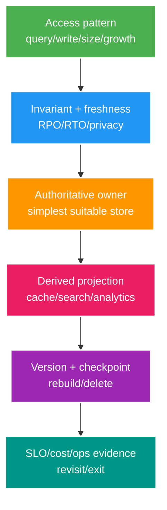

# Storage Architecture Core: Search, Object, Columnar và Selection

> Type: `CORE` 
> Domain: `architecture` 
> Target depth: `D3 — chọn store từ access pattern/SLO, thiết kế projection rebuild và lifecycle/privacy` 
> Teaching readiness: `TEACHABLE_DRAFT` 
> Status: `DRAFT` 
> Evidence status: `NOT RUN` 
> Prerequisites: PostgreSQL; caching; event workflow 
> Related cases: `DATA-01`; [question bank](../../question-bank/storage-selection-search-object-and-columnar.md) 
> Owner: `Project learner; Codex teaches, learner writes back` 
> Updated: `2026-07-26`

## 1. Start from workload, not product name

Trước khi chọn storage, lượng hóa operation: exact key/range/full-text/aggregate scan; read/write QPS và burst; item size/cardinality/growth; latency/freshness; transaction/invariant; retention/deletion; availability/durability/RPO/RTO; security/residency; backup/rebuild; team/cost/exit. Chọn owner đơn giản nhất đáp ứng constraint, thường bắt đầu PostgreSQL cho transactional relational workload.

Polyglot persistence chỉ hợp lý khi evidence workload/SLO vượt chi phí thêm owner, synchronization, security, backup, monitoring, skill và migration.

## 2. Store model families

Relational database có ACID transaction, constraint, join và ad-hoc SQL; scale vertical/partition/replica phức tạp nhưng là default mạnh. Key-value phù hợp known key, value đơn giản và latency thấp nhưng hạn chế query/invariant. Document store cho document/index linh hoạt theo aggregate, đổi lại duplication, schema evolution và transaction semantics phụ thuộc product. Wide-column hợp workload lớn theo partition-key/range, thiết kế table denormalized theo query và phải xử lý hotspot/partition.

Search engine dùng inverted index, tokenization, ranking, filter và aggregation; thường là projection eventual, không phải source cho business invariant. Object storage giữ blob/media/backup với metadata, versioning/lifecycle/consistency semantics; database giữ ownership/metadata chứ không giữ video byte lớn. Columnar analytics nén và scan cột chọn, vectorized aggregation nên tốt cho OLAP nhưng kém với OLTP row update thường xuyên.

Capability giữa product có giao nhau và thay đổi theo version. “NoSQL scale” hoặc “Postgres không scale” không phải requirement có thể kiểm chứng.

## 3. Source of truth + derived projection

Owner database commit entity cùng outbox. Projector consume at-least-once rồi upsert search/cache/columnar theo entity ID và version tăng đơn điệu. Duplicate cùng/cũ hơn bị bỏ; deletion tombstone xóa projection. Đo lag/failure/DLQ và reconcile version/count với owner. Projection phải rebuild được; application định nghĩa behavior khi stale hoặc down.

Search document chỉ chứa field cần search, không chứa secret. Đổi analyzer/mapping thường cần index mới, full backfill, catch-up live change, validate checksum/query sample rồi atomic alias cutover. Có thể rollback alias khi owner không đổi. Application dual-write database và search sẽ có lost/ghost gap.

Đặt freshness SLO thay vì nói “real time”, ví dụ p99 index lag dưới 30 giây. UX read-after-write có thể query owner hoặc dùng session overlay cho tới khi projection bắt kịp.

## 4. Object/media lifecycle

Object key nên opaque/có version; metadata database sở hữu tenant, uploader, status, checksum, content type, size và lifecycle. Upload qua pre-signed URL/session với giới hạn size/type/auth và finalize verification; không tin URL do client gửi để internal fetch. Cần cleanup multipart bỏ dở, encryption/access log, malware/content workflow và CDN cache invalidation.

Versioning chống overwrite nhầm nhưng tăng storage/deletion cost. Lifecycle move/expire; legal hold/retention phải rõ. Database delete propagate object version/delete marker và CDN, kèm reconciliation. Backup khác replica/versioning; restore test xác minh consistency giữa metadata và object.

## 5. Analytics pipeline

Pipeline analytics là versioned event/outbox → Kafka/broker/object landing → transform/checkpoint idempotent → columnar table. Partition theo query, time hoặc tenant cân bằng, không theo key random cardinality cao. Xử lý late event bằng event time/watermark theo report semantics; corrected fact, upsert và dedup rõ. Replay vào shadow table, so aggregate/business invariant rồi cut-over view/alias.

Analytics không phải wallet truth. Aggregation có thể lag; deletion/privacy phải chảy tới raw, derived, export và backup policy. Cost columnar store gồm compute separation, storage, scan, egress và operations.

## 6. Decision matrix and total cost

Chấm mandatory requirement trước: transaction, query, latency, scale, retention, DR/security; sau đó mới weighting operability/cost. Loại storage không bảo vệ hard invariant. Prototype bằng distribution, data, query và failure/rebuild đại diện, không theo vendor benchmark.

TCO gồm instance/replica, storage/I/O/backup, egress, managed/license, on-call expertise, patch/upgrade, observability, data sync/rebuild, security/compliance, migration/exit và vendor lock. Mỗi store mới cần owner, SLO, runbook, deletion và DR. Nếu PostgreSQL GIN/full-text/materialized view hoặc object + SQL đáp ứng nhu cầu đã đo, tránh thêm platform.

## 7. Retention/privacy across copies

Duy trì data inventory/lineage cho PostgreSQL, Redis, search, analytics, object version/CDN, queue/DLQ, backup/export. Owner phát versioned deletion intent; derived store xóa idempotent và ghi completion. Reconciliation phát hiện delete thiếu. Backup có thể expire theo retention/legal hold thay vì sửa; restore process phải reapply deletion ledger để dữ liệu không sống lại.

Access control, tenant isolation và encryption khác theo store. Observability/log có thể là hidden copy. Data minimization tốt hơn gánh deletion complexity.

## 8. Migration/exit pattern

Online storage migration cần authoritative phase, consistent snapshot cùng change position, bulk transform/load, CDC/outbox catch-up có version, checksum/shadow read, cohort cutover, một write owner, rollback và decommission sau retention. Ở petabyte scale phải tính throughput, egress, time, cost, backfill throttling và resume checkpoint. Tránh bidirectional dual-write.

## 8.1. Hai worked examples và phản ví dụ

**Worked example tối thiểu — search index:** PostgreSQL vẫn sở hữu stream metadata; search engine là projection cho full-text/ranking. Outbox/rebuild/version xử lý lag và corruption. Search hit không được dùng làm authoritative ownership/authorization nếu projection stale không chấp nhận.

**Worked example gần project — recorded video:** object storage giữ media blob; PostgreSQL giữ metadata, owner, lifecycle và object reference. Upload cần checksum/idempotency, signed access và orphan cleanup. Không nhét blob lớn vào relational row chỉ để một transaction “đơn giản”.

**Phản ví dụ:** chọn document/columnar database vì “scale” mà chưa ghi access pattern, consistency, retention, query/operation và team ownership. Công nghệ mới không giải quyết requirement chưa được phát biểu và thêm migration/backup/observability cost.

## 9. Interview/self-check

> **Bài viết của tôi — `LEARNER TODO`:** choose stores for stream metadata, search, video objects and analytics with owner/rebuild/delete.

1. **Question:** Storage selection hỏi gì trước? 
   **Đọc lại nếu bí:** mục 1–2. 
   **Một câu trả lời tốt phải có:** access patterns/scale/SLO/invariant/lifecycle/ops/cost, simplest owner. 
   **My answer:** `LEARNER TODO`
2. **Question:** Search projection reliable ra sao? 
   **Đọc lại nếu bí:** mục 3. 
   **Một câu trả lời tốt phải có:** DB+outbox, versioned idempotent upsert/delete, lag/DLQ/rebuild alias/reconcile. 
   **My answer:** `LEARNER TODO`
3. **Question:** Privacy deletion qua backup? 
   **Đọc lại nếu bí:** mục 7. 
   **Một câu trả lời tốt phải có:** inventory/lineage, deletion intent/evidence, backup expiry/legal hold, restore deletion ledger. 
   **My answer:** `LEARNER TODO`

## 10. References/teach-back

- [PostgreSQL — Full Text Search](https://www.postgresql.org/docs/current/textsearch.html)
- [Elasticsearch — Index Aliases](https://www.elastic.co/guide/en/elasticsearch/reference/current/aliases.html)
- [Amazon S3 — Data Consistency Model](https://docs.aws.amazon.com/AmazonS3/latest/userguide/Welcome.html#ConsistencyModel)

- [ ] Tôi choose from workload/invariant.
- [ ] Tôi design projection rebuild/delete.
- [ ] Tôi model TCO/migration/exit.
- [ ] Evidence vẫn `NOT RUN`.
