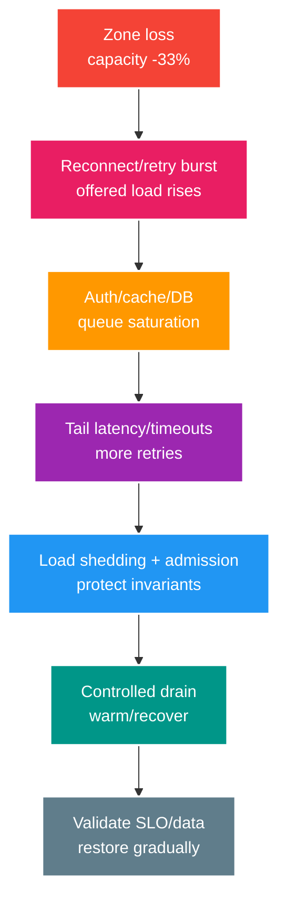

# Deep-dive: Compound Failure, Capacity và Multi-region Recovery

> Type: `DEEP_DIVE` 
> Domain: `architecture` 
> Target depth: `D4 — dẫn dắt capacity/fault model và incident compound celebrity storm + zone failure` 
> Teaching readiness: `TEACHABLE_DRAFT` 
> Status: `DRAFT` 
> Evidence status: `NOT RUN` 
> Prerequisites: [Capacity and multi-region core](../core/capacity-queueing-multi-region-and-cost.md) 
> Related cases: `ARCH-01`; [question bank](../../question-bank/capacity-queueing-multi-region-and-cost.md) 
> Owner: `Project learner; Codex teaches, learner writes back` 
> Updated: `2026-07-26`

## 1. Why compound failures dominate

Incident hiếm khi chỉ có một failure sạch: mất zone làm traffic dồn, reconnect/retry spike, cache lạnh, autoscaler thêm DB connection, broker/database lag tăng và observability drop sample. Test từng component riêng sẽ bỏ lỡ feedback loop. Phải model offered load sau failure, không chỉ normal traffic.

## 2. Queueing feedback

Khi utilization tiến sát capacity, wait tăng; client có thể timeout trong lúc server vẫn làm và retry thêm duplicate load. Autoscaling có detection/provision/warm-up lag cùng downstream ceiling. Bounded concurrency chặn in-flight vô hạn; bounded queue đặt trần memory/wait. Reject sớm kèm retry guidance/jitter tốt hơn accept rồi timeout muộn.

Dùng arrival distribution/burst, service-time histogram và demand theo resource. Average che heavy operation. Little's Law chỉ validate concurrency đo được trong stable window; khi backlog đang tăng thì assumption steady-state không còn đúng. Queue age và drain rate rất quan trọng.

Retry budget gồm original traffic λ và retry factor. Nếu 10% timeout nhưng retry ở ba tầng, amplification có thể vượt xa 30%. Tập trung retry owner, token budget và backoff/jitter. Reconnect dùng randomized backoff cả server/client cùng admission token; tránh mọi client chờ cố định 5 giây.

## 3. 100k viewer failure model

Inventory connection state theo gateway: FD, native/heap buffer, subscription, heartbeat và auth/cache handle. Chọn target connection/node từ load test có p99/GC/network, không theo FD max lý thuyết. Dành headroom đồng thời cho mất một zone và rolling deployment. Với ba AZ cân bằng, N+1 cộng deploy có thể đòi mỗi zone còn lại chạy dưới khoảng 50–60% bình thường, sau đó hiệu chỉnh bằng số đo thật.

Celebrity room tạo fan-out bất đối xứng; partition theo room/subscriber shard, dùng hierarchical fan-out và slow-client queue hữu hạn. Backpressure policy có thể drop/merge presence/count không critical, ngắt slow consumer với resume semantics, nhưng phải giữ moderation/authorization/control. Chat history durable một lần; live delivery công bố rõ at-most/at-least behavior.

Reconnect storm cần gate rẻ ở network/rate trước password, JWT và session database. Cold-cache fallback phải bounded. Pre-warm key/config và synthetic auth; không để health check hammer dependency.

## 4. Gift-sale overload model

Critical path là request validation/idempotency → wallet/ledger transaction → outbox commit → response. Giới hạn concurrent DB work theo pool/lock capacity; reject trước work đắt và cho retry an toàn cùng idempotency key. Tách queue/consumer/pool notification và analytics. Priority không có nghĩa làm maintenance hoặc revoke chết đói.

Nếu capacity database μ = 2,5 nghìn transaction/s còn peak 5 nghìn/s, queue không thể làm spike vô hạn an toàn. Admission, sale quota hoặc virtual waiting room định hình arrival. Giữ ledger invariant và chỉ accept command khi durable intent đã commit. Theo dõi backlog age/SLO và cung cấp operation status cho client.

Recovery phải drain dưới headroom để live traffic ổn định. Throttle redrive/DLQ. Reconcile command, ledger, gift và outbox; customer có response mơ hồ dùng status, không submit key mới.

## 5. Region failover protocol

Prerequisite failover gồm replicated-data position/RPO, standby capacity/config/secret/certificate, dependency availability, traffic control, writer epoch/fencing mới, observability và runbook. Quyết định ai có quyền trigger và risk false failover. Quiesce/fence old write nếu có thể, chọn recovery point, promote writer mới, verify synthetic critical path, chuyển traffic nhỏ rồi monitor và mở rộng.

Region cũ có thể quay lại với worker stale; credential/network cộng fencing phải reject. Failback là migration với catch-up và epoch mới, không phải đảo DNS. External provider/webhook cần endpoint/idempotency; cache/session behavior và user re-auth phải được ghi rõ.

Active-active chỉ dùng nơi có conflict semantics. Wallet regional ownership map user; owner transfer xử lý operation in-flight. Viewer/chat có thể regional với eventual presence và room routing, nhưng propagation moderation/ban authority tạo security lag.

## 6. Degradation hierarchy

Định nghĩa degradation trước incident theo business/invariant: giảm analytics sampling, recommendation, presence frequency và history fetch trước; sau đó cap fan-out/slow client; luôn giữ auth/authorization, stream control, wallet ledger và revocation. Feature flag/load shed phải được test và an toàn; tắt authorization không bao giờ là degradation hợp lệ.

Admission response gồm `Retry-After` hữu hạn và status. Tránh memory queue vô hạn. Operational control plane cần resource riêng để vẫn mitigate được data plane đang overload.

## 7. Cost/architecture sensitivity

Model normal, peak, mất một AZ và DR scenario. Cost lớn nhất livestream có thể là egress chứ không compute. Compression giảm egress nhưng tăng CPU/latency. Managed broker/database giảm ops nhưng có premium và quota. Reserved capacity rẻ cho baseline, on-demand cho burst; cross-region replication/egress đáng kể. Observability cardinality/log volume còn có thể tăng khi bị attack.

Sensitivity analysis hỏi: viewer ×10, chat frequency ×3, payload ×2 và failure lấy mất 1/3 capacity thì resource/cost nào vỡ trước? Xây threshold theo phase và revisit. Chỉ cost-optimize sau profiler/billing thật, vẫn giữ SLO/DR.

## 8. Incident procedure and evidence

Detect rate, latency, saturation, error và queue age theo zone/room/dependency. Contain retry/reconnect, admission, shed theo tier và dừng autoscale/redrive gây hại. Bảo vệ database, broker và control plane; đưa offered load xuống dưới service rate. Restore zone/cache dần, drain backlog, reconcile data, verify SLO và communicate degraded promise.

Game day cần load celebrity room và inject cùng lúc zone loss, cold cache và database latency. Ghi workload generator/version, topology, resource/rate/queue percentile, behavior reject/drop và invariant cuối. Evidence hiện `NOT RUN`.

## 9. Learner/self-check

> **Bài viết của tôi — `LEARNER TODO`:** write compound timeline and quantified degradation/drain plan.

1. **Question:** Vì sao autoscale không cứu saturation? 
   **Đọc lại nếu bí:** mục 2. 
   **Một câu trả lời tốt phải có:** lag/warmup, downstream ceiling, connections/retry feedback, admission/bounded resources. 
   **My answer:** `LEARNER TODO`
2. **Question:** Degrade gì trước? 
   **Đọc lại nếu bí:** mục 3–6. 
   **Một câu trả lời tốt phải có:** classify critical invariant vs approximate/noncritical, slow client/fanout, never weaken security/ledger. 
   **My answer:** `LEARNER TODO`
3. **Question:** Failback cần gì? 
   **Đọc lại nếu bí:** mục 5. 
   **Một câu trả lời tốt phải có:** data catch-up, new epoch/fence, old workers, canary, external effects—not DNS reversal. 
   **My answer:** `LEARNER TODO`

## 10. References/teach-back

- [Google SRE Workbook — Load Balancing at the Frontend](https://sre.google/workbook/load-balancing/)
- [AWS Builders' Library — Avoiding insurmountable queue backlogs](https://aws.amazon.com/builders-library/avoiding-insurmountable-queue-backlogs/)

- [ ] Tôi model compound feedback and headroom.
- [ ] Tôi protect critical invariant with admission/degrade.
- [ ] Tôi canary/drain/reconcile region recovery.
- [ ] Evidence vẫn `NOT RUN`.
