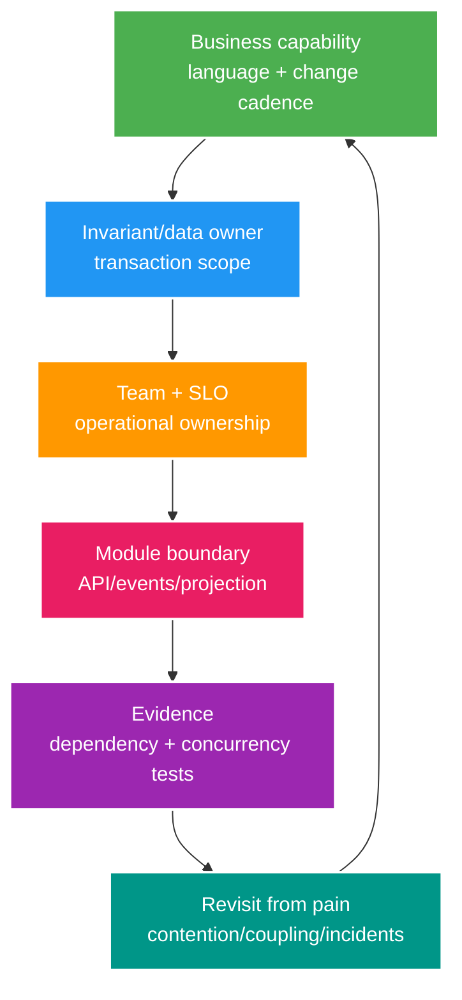

# Deep-dive: Hot Aggregates, Context Mapping và Modular Evolution

> Type: `DEEP_DIVE` 
> Domain: `architecture` 
> Target depth: `D4 — dẫn dắt boundary evolution qua contention, team ownership và migration constraints` 
> Teaching readiness: `TEACHABLE_DRAFT` 
> Status: `DRAFT` 
> Evidence status: `NOT RUN` 
> Prerequisites: [DDD aggregates and modular boundaries core](../core/ddd-aggregates-and-modular-boundaries.md) 
> Related cases: `MOD-01`; [question bank](../../question-bank/ddd-aggregates-and-modular-boundaries.md) 
> Owner: `Project learner; Codex teaches, learner writes back` 
> Updated: `2026-07-26`

## 1. Boundary là socio-technical decision

Boundary tốt căn language, invariant, data, change, team và on-call. Chỉ chia code package không sửa được việc hai team cùng ghi wallet table hoặc một team sở hữu mười SLO không liên quan. Ngược lại, tạo network service cho mọi danh từ chỉ thêm unreliable call mà không có autonomy. Bắt đầu từ event storming và use-case history: command, fact, policy, conflict, actor và owner.

## 2. Aggregate contention diagnosis

Symptom gồm lock wait/deadlock, optimistic conflict/retry, transaction dài, hot index/page và tail tăng dưới một aggregate key. Thu command/key distribution, transaction duration, query/lock evidence và invariant bị chạm. Không suy chỉ từ CPU hoặc entity size.

Ví dụ aggregate global `StreamStatistics` update mọi viewer join/leave/gift: một root serialize cả counter xấp xỉ lẫn tiền. Tách theo semantics: wallet/gift ledger chính xác theo wallet/operation; viewer count approximate và aggregate từ event; stream lifecycle ít thay đổi nhưng exact. Quan hệ object ban đầu không phải một transaction invariant.

Thang giải pháp: rút ngắn transaction/query; conditional atomic update; append-only ledger; partition theo owner/key độc lập; batch/aggregate delta giao hoán; reservation/escrow token; nới exactness với error bound. Mỗi bước đổi model. Reservation phân bổ capacity hữu hạn từ authoritative total; conservation ngăn bucket oversubscription và reservation hết hạn cần reconcile. Đây không phải sharding miễn phí.

Nếu một wallet là celebrity hotspot, exact balance vẫn cần một owner. Có thể queue/serialize command, chia fund thành bucket preallocated chỉ khi có transfer protocol, hoặc redesign credit settlement. Thêm replica không thể accept debit xung đột.

## 3. Aggregate failure patterns

**God aggregate:** loads many children and locks broad data; performance/team coupling. **Anemic root:** service/repositories mutate internals directly; invariant scattered. **One table = aggregate:** database layout drives model. **One request = transaction across modules:** remote/external work held in transaction. **Eventual everything:** critical invariant breaks. **Cross-aggregate synchronous validation:** stale check then write TOCTOU.

Repair bằng cách gọi tên invariant và linearization point. Đặt immediate state dưới owner/DB constraint; phần còn lại dùng ID/reference và durable workflow. Domain service có thể phối hợp calculation nhưng transaction/data owner phải rõ. Test gồm rejected case và concurrent interleaving.

## 4. Context map details

Với mỗi cặp context, ghi upstream owner, downstream use, contract, translation, SLA/lag, failure và change negotiation. Identity publish `AccountDisabled`; Security session consume/revoke. Wallet không đọc identity table; nó yêu cầu verified actor ở command boundary và giữ user ID. Analytics là downstream conformist hoặc ACL projection, không command owner qua backdoor.

Shared kernel là code/model nhiều team cùng đổi nên cost là coordination. Chỉ giữ primitive ổn định như opaque ID hoặc Money contract khi semantics thật sự giống. Tránh shared JPA entity/event class library buộc lockstep deploy. ACL dịch vocabulary external provider sang local model, cô lập churn nhưng cần test/monitoring.

Context boundary không nhất thiết bằng service. Nhiều context có thể sống trong modular monolith; một context có thể cần nhiều internal component. Deployment extraction chỉ làm sau khi có evidence.

## 5. Modular monolith enforcement architecture

Public module API nên expose command/query theo task, không expose repository/entity. Internal package bị chặn bằng convention/test. Event chỉ phát sau commit; synchronous call dành cho immediate response. Read composition có thể ở application query layer dùng projection kiểm soát, nhưng owner vẫn rõ.

Ở database, schema riêng là lớp phòng thủ tùy chọn; grant/migration có thể enforce. Nếu cùng schema cần naming/review. Không navigation foreign-key object xuyên module trong code; ID và database FK vẫn giữ referential integrity nếu quản lý owner/migration contract. Rule project cấm JPA association giúp ID rõ nhưng một mình không ngăn repository bypass.

Architecture test verify dependency/cycle được phép; integration test verify module API; concurrency test verify invariant; thêm event-publication test và review ownership static SQL/repository. Feature Spring Modulith phụ thuộc version; nó hỗ trợ discovery/test/event nhưng không chọn domain thay team.

## 6. Safe refactor sequence

1. Baseline behavior, test, dependency graph hiện tại và violation đã biết.
2. Chọn một use case có owner rõ; ghi language, invariant và module decision.
3. Đặt facade/port quanh implementation hiện có và giữ API.
4. Chuyển command cùng data write về sau owner; dùng adapter tạm cho caller.
5. Thêm dependency rule ngăn bypass mới cùng characterization, contract và concurrency test.
6. Thay cross-write bằng API, event hoặc projection; dùng outbox nếu async.
7. Migrate schema/read model theo expand-contract và shadow compare.
8. Chỉ xóa adapter khi usage telemetry bằng 0; cập nhật docs/ownership.

Không chuyển package, behavior, data và schema cùng lúc nếu thiếu rollback seam. Violation tạm phải có owner/deadline, không thành “TODO mãi mãi”.

## 7. Boundary incident and evolution

Scenario: Chat ghi trực tiếp `stream.status` để chặn message; Livestream đổi enum/migration và Chat làm corrupt workflow. Contain cross writer, xác lập row do Livestream authoritative, audit write, repair data; tạo command/event contract cùng database permission/architecture test. Root cause là ownership bypass, không phải typo enum.

Revisit boundary khi change coupling, contention, team handoff, deploy conflict hoặc incident kéo dài. Merge context/module nếu separation chỉ tạo translation/latency mà thiếu autonomy. Split khi language, invariant, scale và team khác biệt cùng seam evidence. ADR ghi force, alternative, metric và revisit trigger.

## 8. D4 decision checklist

Checklist gồm language/context; command/event; invariant/linearization; aggregate load/conflict; owner module API/data/migration; sync/async contract; read projection; team/SLO; enforcement; refactor/cutover/rollback; privacy/security và evidence. Boundary diagram thiếu các câu trả lời này chưa phải design.

## 9. Learner/self-check

> **Bài viết của tôi — `LEARNER TODO`:** refactor one package-by-layer use case into owner module and solve one hot aggregate.

1. **Question:** Hot aggregate split safely thế nào? 
   **Đọc lại nếu bí:** mục 2–3. 
   **Một câu trả lời tốt phải có:** measured contention, true invariant/linearization, independent dimensions/reservation, reconciliation/concurrency evidence. 
   **My answer:** `LEARNER TODO`
2. **Question:** Context map cần hơn boxes gì? 
   **Đọc lại nếu bí:** mục 4. 
   **Một câu trả lời tốt phải có:** upstream/contract/translation/SLO/failure/change/team/data owner. 
   **My answer:** `LEARNER TODO`
3. **Question:** Safe module refactor sequence? 
   **Đọc lại nếu bí:** mục 5–7. 
   **Một câu trả lời tốt phải có:** baseline/facade/vertical slice/owner/tests/adapter/expand-contract/telemetry rollback. 
   **My answer:** `LEARNER TODO`

## 10. References/teach-back

- [Spring Modulith — Application Modules](https://docs.spring.io/spring-modulith/reference/fundamentals.html)
- [Martin Fowler — DDD Aggregate](https://martinfowler.com/bliki/DDD_Aggregate.html)

- [ ] Tôi nối business/team/data/code boundaries.
- [ ] Tôi thiết kế hot aggregate bằng invariant evidence.
- [ ] Tôi có incremental migration/rollback.
- [ ] Evidence vẫn `NOT RUN`.
