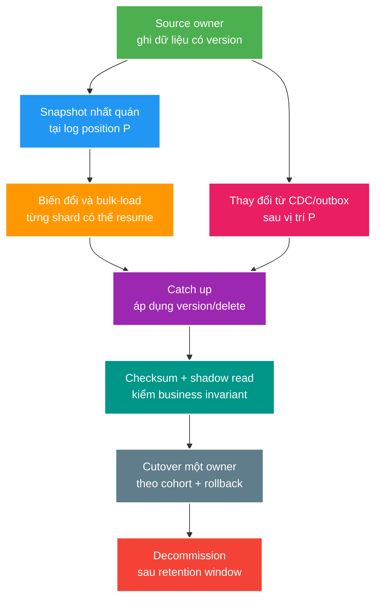

# Deep-dive: di chuyển storage online, rebuild projection và theo dõi dữ liệu đã xóa

> Type: `DEEP_DIVE` 
> Domain: `architecture` 
> Target depth: `D4 — migrate/rebuild petabyte-scale projection với one owner, privacy lineage và rollback` 
> Teaching readiness: `TEACHABLE_DRAFT` 
> Status: `DRAFT` 
> Evidence status: `NOT RUN` 
> Prerequisites: [Storage architecture core](../core/storage-selection-search-object-and-columnar.md) 
> Related cases: `DATA-01`; [question bank](../../question-bank/storage-selection-search-object-and-columnar.md) 
> Owner: `Project learner; Codex teaches, learner writes back` 
> Updated: `2026-07-26`

## 1. State machine của một migration online

Migration online cần chia rõ từng giai đoạn quyền sở hữu dữ liệu. Trước cutover, target chỉ là bản shadow để kiểm tra và không được nhận business write độc lập. Snapshot và change log phải dùng chung một checkpoint để không tạo khoảng trống giữa “dữ liệu đã quét” và “thay đổi phát sinh trong lúc quét”. Mỗi record/tombstone cần version để target áp dụng duplicate hoặc event đến sai thứ tự một cách an toàn.

## 2. Bảo đảm đúng giữa snapshot và change stream

Nếu quét source nhưng CDC bắt đầu ở sai log position, một write xảy ra trong lúc quét có thể bị bỏ mất hoặc bị snapshot cũ ghi đè. Cách an toàn là dùng protocol snapshot/log-position do database hỗ trợ, hoặc một thuật toán lặp lại có version và được mô tả rõ. Target chỉ apply khi `incomingVersion > currentVersion`; delete tombstone cũng mang version để late snapshot/upsert không làm record đã xóa sống lại. Nếu cùng version nhưng payload khác nhau, phải coi đó là lỗi transform hoặc corruption, không chọn ngẫu nhiên một bản.

Chia backfill theo stable range, lưu checkpoint, count, checksum và error cho từng shard. Retry cả shard phải idempotent. Throttle source I/O và replica lag, target ingest cùng network/egress để live traffic luôn được ưu tiên. Ước lượng tổng byte, transfer/transform rate duy trì và live change rate; hệ thống chỉ catch up nếu apply capacity lớn hơn tốc độ phát sinh thay đổi. Compression giảm egress nhưng tốn CPU; parallelism tăng throughput nhưng dùng thêm memory và làm ordering phức tạp.

Schema transformer phải xử lý record invalid/legacy tường minh bằng quarantine, report hoặc repair; không lặng lẽ gán default làm mất nghĩa dữ liệu. Encryption key, tenant mapping và PII minimization thuộc cùng migration contract. Validation cần chạy semantic query và domain invariant trên mẫu đại diện, không chỉ so row count.

## 3. Rebuild search index không downtime

Tạo index mới với mapping/analyzer version rõ ràng, bulk-load snapshot từ data owner rồi stream update/delete có version cho tới khi lag đủ thấp. Chạy golden query set, relevance/offline metric, document count/checksum, so record thiếu/thừa/version và đo performance. Chuyển một read cohort hoặc alias sang index mới và tiếp tục quan sát; write vẫn thuộc owner database/outbox. Alias rollback chỉ an toàn khi index cũ vẫn nhận change hoặc có thể catch up; nếu không, nó đã stale dù đổi alias rất nhanh.

Đổi analyzer làm token và ranking thay đổi nên không thể đòi kết quả byte-equal; product phải chấp nhận semantic difference bằng tiêu chí đã thống nhất. Test cả tombstone, tenant filter, authorization và field redaction. Không đưa secret hoặc toàn bộ raw payload vào index chỉ vì query tiện hơn.

## 4. Replay và backfill analytics

Pin event offset/time range, schema version và version của transformer/rule. Replay vào shadow table/partition và tắt downstream notification không thể hoàn tác. Xử lý late event/watermark, dedup theo business key và correction event. Mỗi partition có checkpoint; throttle cả warehouse lẫn source; so aggregate với data owner hoặc report đã biết. Cutover bằng view/table version, đồng thời bảo đảm live stream tiếp tục ghi theo epoch mới.

Tính lại metric lịch sử bằng rule mới khác với phục dựng đúng report từng công bố. Phải lưu rule version và chọn mục tiêu nào cần đạt. Nếu source đã compact hoặc hết retention thì history không còn đầy đủ; cần object archive hoặc source snapshot. Data-quality SLO phải gồm completeness, freshness và accuracy, không chỉ consumer lag.

## 5. Theo dõi dữ liệu đã xóa qua mọi bản sao

Deletion ledger/event cần ghi subject/resource, scope, version, thời điểm yêu cầu/thực thi, policy hoặc legal hold và owner. Mỗi derived store xử lý idempotent rồi lưu completion reference có thể audit. Catalog phải bao phủ object version, CDN, search, analytics, cache, queue/DLQ, log, export và backup. Không đưa raw subject ID vào metric phạm vi rộng vì chính telemetry có thể trở thành một bản sao PII mới.

Immutable backup cần restricted access, encryption và retention có ngày hết hạn. Khi restore, hệ thống phải replay deletion ledger từ backup point tới hiện tại **trước khi phục vụ traffic**. Nếu không còn deletion history, phải có risk acceptance hoặc global purge workflow. Projection mới khi backfill phải loại record đã xóa hoặc apply tombstone sau snapshot. Trách nhiệm của vendor export và client cache cũng cần được ghi rõ.

Deletion còn là bài toán ordering: late upsert version 5 phải bị từ chối sau delete version 6. TTL chỉ nói dữ liệu có thể hết hạn trong tương lai, không chứng minh deletion SLA và còn có thể bị stale writer gia hạn lại.

## 6. Edge case của object storage

Có nhiều crash window: metadata trong database đã commit nhưng upload mất; object đã upload nhưng bước finalize database thất bại; multipart upload bị bỏ dở; hoặc CDN tiếp tục phục vụ version cũ sau overwrite. Thiết kế upload session/state rõ, ràng buộc pre-signed request, kiểm checksum/size/content, finalize idempotent và có sweeper/reconciliation. Direct-media path tiết kiệm bandwidth của application nhưng authorization, tenant và key prefix phải chặt.

Cross-region replication thường async và semantics của delete marker/version phụ thuộc sản phẩm cụ thể. RPO/RTO drill phải restore metadata và object nhất quán. Lifecycle transition và restore latency quyết định trải nghiệm của cold archive. Với migration cỡ petabyte, egress có thể chi phối cả chi phí lẫn thời gian, không phải CPU transformer.

## 7. Cutover, rollback và decommission

Chọn read cohort theo tenant một cách deterministic rồi shadow-compare. Cutover criteria phải bao gồm catch-up lag, error/quarantine đã xử lý, invariant/checksum, performance, security/deletion, backup/DR/runbook và cost. Tại mọi thời điểm chỉ có một write owner. Rollback read khá dễ nếu old target còn current; rollback write sau khi quyền sở hữu đã chuyển cần reverse change feed và một handoff epoch mới, không thể chỉ đổi traffic.

Chỉ decommission sau khi qua retention/rollback window, telemetry chứng minh không còn consumer, export/legal hold đã giải quyết và deletion evidence đầy đủ. Revoke credential/network, dừng pipeline, archive audit bắt buộc rồi xóa theo policy. Vendor-exit path phải được thử trước emergency.

## 8. Incident scenarios

**Late snapshot làm document đã xóa sống lại:** tombstone không có version nên snapshot cũ ghi đè delete; cần cô lập index, replay deletion, sửa version compare và kiểm lại record đã xóa. **CDC hết retention:** backfill chậm hơn tốc độ log bị loại; phải lấy snapshot mới hoặc tăng retention/capacity, tuyệt đối không cutover khi còn gap. **Dual writer:** source và target cùng nhận write rồi phân kỳ; dừng write, xác lập authority/epoch, giữ cả hai history và reconcile bằng business ID. **Cost explosion:** scan, egress hoặc observability vượt forecast; throttle, repartition hoặc thu hẹp scope rồi tính lại trước khi tiếp tục.

## 9. D4 evidence plan

Evidence plan phải ghi data size/change rate/version, snapshot position, transformer image, checkpoint, throughput/lag, count/checksum/invariant, query sample, cutover timeline, rollback, deletion/DR proof và chi phí cuối. Fault injection gồm kill process, duplicate/reorder/delete event, target outage và áp lực log sắp hết retention. Hiện trạng thái vẫn `NOT RUN`; danh sách này là kế hoạch thí nghiệm, không phải kết quả.

## 10. Learner/self-check

> **Bài viết của tôi — `LEARNER TODO`:** thiết kế một lần rebuild search và quy trình restore không làm dữ liệu đã xóa sống lại.

1. **Question:** Snapshot + CDC gap prevented thế nào? 
   **Đọc lại nếu bí:** mục 1–2. 
   **Một câu trả lời tốt phải có:** consistent position, apply/tombstone idempotent có version, catch-up capacity, checkpoint và reconcile. 
   **My answer:** `LEARNER TODO`
2. **Question:** Rollback thế nào sau khi đã chuyển data owner? 
   **Đọc lại nếu bí:** mục 7. 
   **Một câu trả lời tốt phải có:** một write owner, reverse catch-up/epoch mới, độ fresh của target cũ, cohort và invariant; không chỉ đổi alias/DNS. 
   **My answer:** `LEARNER TODO`
3. **Question:** Restore backup không resurrect delete ra sao? 
   **Đọc lại nếu bí:** mục 5. 
   **Một câu trả lời tốt phải có:** deletion ledger/version, replay từ restore point trước khi serve, mọi derived/object copy và evidence/legal retention. 
   **My answer:** `LEARNER TODO`

## 11. References/teach-back

- [Elasticsearch — Reindex API](https://www.elastic.co/guide/en/elasticsearch/reference/current/docs-reindex.html)
- [PostgreSQL — Logical Decoding](https://www.postgresql.org/docs/current/logicaldecoding.html)
- [AWS S3 — Object Lifecycle Management](https://docs.aws.amazon.com/AmazonS3/latest/userguide/object-lifecycle-mgmt.html)

- [ ] Tôi migration với snapshot position và version rõ ràng.
- [ ] Tôi chứng minh được semantic correctness khi cutover/rollback.
- [ ] Tôi bảo toàn deletion qua rebuild và restore.
- [ ] Evidence vẫn `NOT RUN`.
