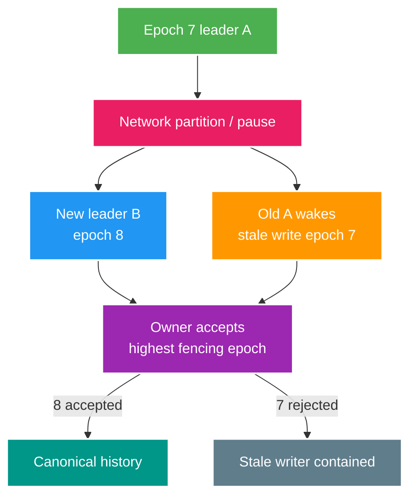

# Deep-dive: Partitions, Leases, Fencing và Divergent-writer Recovery

> Type: `DEEP_DIVE` 
> Domain: `architecture` 
> Target depth: `D4 — formalize histories, coordination safety và incident recovery khi nhiều writers diverge` 
> Teaching readiness: `TEACHABLE_DRAFT` 
> Status: `DRAFT` 
> Evidence status: `NOT RUN` 
> Prerequisites: [Consistency, clocks and coordination core](../core/distributed-consistency-clocks-and-coordination.md) 
> Related cases: `DIST-01`; [question bank](../../question-bank/distributed-consistency-clocks-and-coordination.md) 
> Owner: `Project learner; Codex teaches, learner writes back` 
> Updated: `2026-07-26`

## 1. Safety, liveness và history

Safety: điều xấu không xảy ra—không two owners debit same balance beyond invariant, stale leader không overwrite. Liveness: điều tốt cuối cùng xảy ra—request eventually completes/retries/recovery progresses. Partition thường buộc trade-off: reject writes protects safety but hurts liveness; accept both improves availability but needs merge semantics and cannot undo arbitrary external effects.

Một history phải ghi invoke/response, operation ID, node/epoch, owner commit và external effect. “Test trả 200” chưa đủ đánh giá linearizability. Model checking hoặc reasoning kiểu Jepsen có thể phát hiện violation dưới fault kiểm soát, nhưng không thấy lỗi trong finite test chưa phải formal proof; constraint và protocol vẫn là lớp bảo vệ chính.

## 2. Lease failure walkthrough

A nhận lease tới local time 10:00 rồi pause 30 giây. Coordinator cho lease hết hạn và cấp B token 8. A thức lại với token 7. Nếu target storage nhận plain write, A vẫn corrupt state dù coordinator đúng. Conditional write `incomingFence >= storedFence` ở target sẽ reject. Với database row, lưu fence/version và update theo predicate; với external provider thiếu fencing, coordination không bảo đảm safety nên cần idempotency, reservation, single gateway hoặc reconciliation.

Safety của clock-based lease phụ thuộc assumption giới hạn skew/pause, hiếm khi tuyệt đối trong JVM có GC, VM suspension và network. Protocol chính xác của consensus lease/read optimization rất quan trọng. Coi lease expiry là permission hint; ordered epoch cộng target enforcement bền hơn. Khi release lock phải compare owner/token, không xóa lease của holder khác.

## 3. Quorum/leader edge cases

Client nhận timeout sau khi leader replicate/commit nhưng trước response. Retry sang leader mới cùng operation ID phải trả stored outcome; ID mới tạo duplicate. Leader cũ có thể accept entry chưa commit rồi fail; client chưa thấy success và leader mới discard, nên status phải phân biệt committed. Nếu hệ ack trước durable quorum, failover có thể mất write đã ack; đây là RPO/durability config chứ không chỉ lỗi application retry.

Công thức giao read quorum giả định replica set và cách chọn version mới nhất. Concurrent write cần conflict resolution; read repair/hinted handoff tạo copy tạm. Last-write-wins theo wall clock có thể mất update. Linearizable quorum protocol cần nhiều hơn `R+W>N`. Khi phỏng vấn, nêu assumption thay vì áp Dynamo, Cassandra, Raft hoặc PostgreSQL như quy luật chung.

Follower read sau user write có thể vi phạm read-your-writes. Truyền commit position/session token để chờ hoặc route leader, hoặc chấp nhận UI stale kèm refresh semantics. Cache thêm một replica với invalidation/version riêng. “Database strong” không nói gì về read-replica/cache path.

## 4. Duplicate, gap and causality state machine

Consumer đang lưu aggregate version 10. Event v10 là duplicate nên inbox/version bỏ; v9 stale nên bỏ kèm audit; v11 conditional apply rồi set 11. v13 tạo gap, không apply mù nếu v12 ảnh hưởng invariant. Park với TTL hữu hạn, fetch owner snapshot/event rồi resume. Nếu operation monotonic kiểu max-count hoặc giao hoán, merge khác có thể an toàn nhưng phải ghi algebra, không tự giả định.

Correlation/causation thể hiện lineage nhưng không phải ordering authority. Lamport counter order event có quan hệ nhân quả nhưng vẫn có tie/concurrent event. Vector clock phát hiện concurrency nhưng tăng overhead conflict UI/storage. Consensus sequence hoặc DB aggregate version hợp single owner. Chọn cơ chế hẹp nhất đủ dùng.

Dedup retention ngắn hơn broker/DR replay có thể apply lại old event. Giữ domain unique operation hoặc version ngay cả sau inbox cleanup. Cùng ID nhưng payload khác là corruption/security incident.

## 5. Multi-region writer models

**Single writer region:** simple invariant, remote write latency and failover downtime. Failover assigns new epoch, fences old, waits/reconciles replication position. **Regional ownership:** deterministic shard/account home; local latency, ownership transfer/mobility complexity. Transfer protocol freezes old or uses handoff epoch and ensures one owner. **Active-active merge:** only for data with valid conflict-free/compensation semantics; independent wallet debit cannot LWW safely.

Read path có thể multi-region dù chỉ single write; lag cần hiện trong UI hoặc xử lý bằng RYW routing. Cache invalidation xuyên region mang version. External side effect chạy ở cả hai region không thể merge mất; cần operation idempotency tại provider/global owner hoặc compensation.

## 6. Partition incident runbook

Detection gồm leader/term churn, replication lag, cross-region connectivity, write conflict, fencing reject, timeout/duplicate và business-invariant alarm. Contain đầu tiên bằng disable/fence write ở region/path mơ hồ, giữ log/outbox/database snapshot hai bên và dừng automated compensation/redrive làm mờ history. Xác lập authoritative epoch/source theo protocol, không theo timestamp mới nhất.

Dựng lineage theo business/operation ID qua command, ledger row, outbox/event và provider effect. Phân loại canonical, duplicate tương đương, conflicting và unknown. Reconcile bằng invariant; phát compensation có audit cho external effect. Rebuild replica/projection stale từ authoritative checkpoint kèm version/fence. Validate region cũ không thể write trước khi mở lại; tăng traffic dần và monitor.

Không xóa losing history trước forensic/audit. Chuyển DNS/traffic không tự dừng client hoặc old worker có direct endpoint. Cần credential, network ACL cùng fencing/owner state.

Postmortem cần partition/timeline chính xác, assumption bị vi phạm, detection gap, maximum user/data impact, RPO/RTO, correctness của recovery và compound-fault drill mới. Evidence giữ `NOT RUN` cho tới khi thực thi.

## 7. Timeout/deadline propagation

Caller deadline 2 giây; gateway dùng 1,8 giây; service A dùng 1,2 giây rồi gọi B với hard-coded 2 giây, khiến work tiếp tục sau khi client rời và retry khuếch đại. Propagate remaining deadline và chừa response/cleanup; downstream từ chối nếu không đủ. Cancellation chỉ advisory vì server vẫn có thể commit; status/idempotency xử lý unknown.

Retry budget là một phần capacity. Ba tầng nhân ba attempt tạo 27 call. Chọn một retry owner, cap attempt/time/concurrency, thêm jitter và chỉ retry transient/idempotent. Circuit open/load shed bảo vệ capacity nhưng không giải committed operation mơ hồ.

## 8. Design and evidence checklist

Với mỗi critical operation, ghi invariant/owner, consistency, linearization point, operation identity, read path/RYW, behavior khi timeout unknown, retry/status, leader/lease/fencing, cache/replica version, partition behavior, external effect, RPO/RTO và reconciliation. Lab fault gồm delay/drop response sau commit, process pause quá lease, split writer, clock jump, stale replica/cache và event reorder. Assertion là invariant/history cuối cùng cùng recovery đã đo.

## 9. Interview/teach-back

Câu trả lời Architect chỉ rõ failure domain và operation thay vì nói “chọn CP”. Câu trả lời Expert xử lý paused stale leader, unknown commit, external effect phân kỳ và authoritative recovery mà không đoán bằng timestamp.

> **Bài viết của tôi — `LEARNER TODO`:** produce one history for A epoch7/B epoch8 and incident reconciliation.

1. **Question:** Fencing phải enforce ở đâu? 
   **Đọc lại nếu bí:** mục 2. 
   **Một câu trả lời tốt phải có:** monotonic token, target owner conditional rejection, stale pause, external-system limit. 
   **My answer:** `LEARNER TODO`
2. **Question:** Two-region wallet conflict recover thế nào? 
   **Đọc lại nếu bí:** mục 5–6. 
   **Một câu trả lời tốt phải có:** contain writes, authoritative epoch/ledger, preserve histories, operation IDs/external effects, compensate/rebuild/fence. 
   **My answer:** `LEARNER TODO`
3. **Question:** Fault test chứng minh gì và không gì? 
   **Đọc lại nếu bí:** mục 1 và 8. 
   **Một câu trả lời tốt phải có:** explicit history/invariant under tested faults, versions/config, finite evidence not protocol proof. 
   **My answer:** `LEARNER TODO`

## 10. References

- [Martin Kleppmann — How to do distributed locking](https://martin.kleppmann.com/2016/02/08/how-to-do-distributed-locking.html)
- [Raft paper](https://raft.github.io/raft.pdf)
- [Jepsen — Consistency Models](https://jepsen.io/consistency)

- [ ] Tôi phân biệt safety/liveness và unknown outcome.
- [ ] Tôi thiết kế fencing/region ownership.
- [ ] Tôi có incident history/recovery evidence plan.
- [ ] Evidence vẫn `NOT RUN`.
