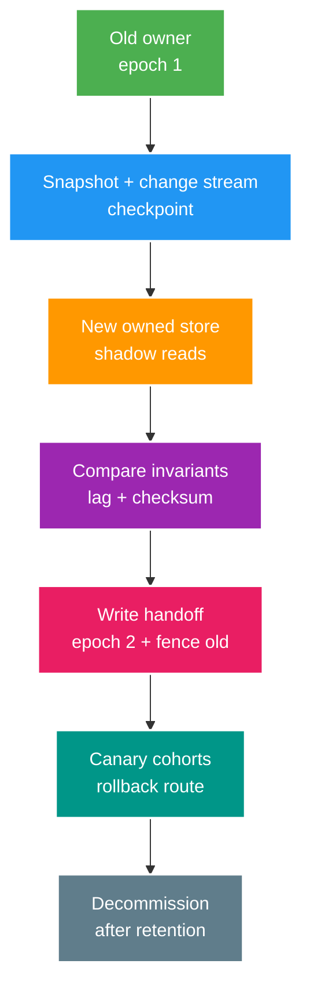

# Deep-dive: Strangler Data Handoff và Failed-extraction Recovery

> Type: `DEEP_DIVE` 
> Domain: `architecture` 
> Target depth: `D4 — migrate ownership online, xử lý split-writer và quyết định evolve/merge-back bằng evidence` 
> Teaching readiness: `TEACHABLE_DRAFT` 
> Status: `DRAFT` 
> Evidence status: `NOT RUN` 
> Prerequisites: [Microservice extraction core](../core/microservice-extraction-and-service-owned-data.md) 
> Related cases: `MS-01`; [question bank](../../question-bank/microservice-extraction-and-service-owned-data.md) 
> Owner: `Project learner; Codex teaches, learner writes back` 
> Updated: `2026-07-26`

## 1. Data handoff is the hard part

Chuyển controller/code thì dễ; chuyển authoritative write khi traffic, retry và old version còn tồn tại mới khó. Migration phải định nghĩa owner epoch: trước E monolith sở hữu, sau E service sở hữu. Router/facade và owner storage reject stale epoch. Thiếu fence, request/worker trễ tới old path sẽ tạo split brain.

## 2. Snapshot + change catch-up

Lấy consistent snapshot tại log position/checkpoint, load idempotent rồi apply CDC/outbox change sau position đó. Nếu snapshot scan trong lúc update mà thiếu position consistency sẽ có gap/duplicate. Mỗi row/event mang source version; destination chỉ upsert bản mới hơn. Bao gồm delete/tombstone và referential ordering. Transform error phải quarantine có owner, không silent skip.

Shadow read so semantic result, không so raw schema. Dùng count/checksum theo shard, invariant query và sampled request diff. Difference có thể hợp lệ do timing/format nên phải classify. Lag SLO và retention bảo đảm change stream chưa expire trước catch-up. Backfill throttle source/target và resume từ checkpoint.

Với sensitive data, giảm tối đa copy/access/retention và thiết kế deletion propagation. Encryption, key, backup và DR phải sẵn sàng trước authority transfer.

## 3. Handoff protocols

**Brief write freeze:** pause commands, drain outbox, catch zero lag, set epoch 2, switch, unpause. Simple/safe but downtime. **Per-entity handoff:** owner mapping/epoch per shard/customer; migrate cohorts online, old owner forwards/rejects. More complexity. **Command facade:** stable ingress routes one owner; retries with same ID query owner state. Avoid dual-write to two owners hoping reconcile later for critical invariant.

Rollback trước authority handoff chỉ cần route old. Sau handoff và new write, rollback code vẫn có thể phải dùng data owner mới; trả write về old cần reverse catch-up và epoch mới, không phải lật DNS. Định nghĩa riêng rollback theo application version, route, schema và owner.

Async job/message trễ cần mang owner/routing epoch hoặc đi qua facade; old consumer không mutate sau fence. API client có thể cache endpoint nên network/credential phải loại bypass. External partner cần compatibility window.

## 4. Remote-chain pathology

Extraction thường thay local transaction/call bằng A → B → C. Availability bị nhân, tail latency cộng dồn và retry mọi tầng khuếch đại. Trace cho thấy network nhưng business unknown outcome cần operation ID/status. Timeout ngắn hơn downstream work tạo ghost processing. Sửa bằng coarse API, local projection, async workflow, một retry owner, deadline propagation và bulkhead.

Circuit breaker bảo vệ caller thread nhưng open state có thể chặn recovery thiết yếu; tách policy interactive/background. Cached fallback có thể vi phạm ownership/security. Dependency SLO/error budget và overload contract như 429, 503, `Retry-After` phải rõ.

## 5. Contract and deployment independence proof

Lập matrix provider old/new nhân consumer old/new qua API, event và schema. Chạy provider verification cùng consumer expectation; test unknown field/enum, missing/default, error semantics, authorization, idempotency, timeout và payload limit. Canary mixed fleet. Usage/version telemetry chứng minh retirement; documentation một mình không đủ.

Schema expand-contract phải hỗ trợ cả hai application generation. Service mới và monolith cũ không cùng write transitional table trừ khi một facade enforce invariant/owner; tách credential. Event producer chỉ đổi sau khi mọi consumer xử lý được; old retained event vẫn phải replay.

## 6. Service-owned-data incident

Scenario: old batch job ghi monolith database sau service handoff trong khi CDC không còn forward. Lý tưởng là owner-epoch/fencing reject phát hiện; nếu không cần reconciliation. Contain cả hai writer, giữ log, xác lập authoritative epoch, match operation theo idempotency/business ID, apply change thiếu không conflict hoặc compensate conflict, rotate old DB credential, disable job và rebuild projection. “Latest wins” theo timestamp có thể phá money/order.

Root control gồm database grant, owner field/epoch conditional write, route inventory, ownership deploy job/consumer và migration checklist. Exit gate gồm one-writer test, không còn old credential usage, invariant/checksum pass và backlog bằng 0 hoặc bounded.

## 7. Failed extraction scorecard

So promised với actual về deploy lead/frequency, change coupling, incident/MTTR, latency/error, independent scaling/utilization, data drift/reconciliation, team/on-call load và total cost. Root cause có thể là boundary sai, chatty contract, shared data, platform chưa trưởng thành hoặc team quá nhỏ, không phải “microservice” trừu tượng.

Option gồm simplify/coarsen API, async projection, co-locate runtime nhưng giữ code boundary, merge service dưới một deployment hoặc full merge-back. Giữ public compatibility; chọn một authoritative store, snapshot/change catch-up ngược, shadow compare, owner handoff và decommission. ADR ghi vì sao decision đổi và chống sunk-cost bias.

## 8. Analytics extraction worked decision

Input cho case analytics: query tiêu CPU/I/O; workload columnar/search khác biệt; eventual lag chấp nhận được; có replay; owner/on-call riêng. Tách analytics read path/event consumer, còn monolith giữ transactional data. Baseline query latency/resource và event volume; provision store; backfill/outbox; shadow dashboard; canary; đặt lag/data-quality SLO. Khi failure, disable dashboard hoặc update projection nhưng purchase tiếp tục. Cost gồm event platform, store, egress và on-call.

## 9. D4 checklist and experiments

Checklist gồm scorecard và alternative giữ modular; seam/team/data owner; snapshot position/version/delete; contract matrix; handoff epoch/fence; rollback sau new write; async job; SLO/capacity/security/DR; reconcile/decommission. Fault lab cần delay CDC, duplicate/reorder, old writer sau handoff, service outage/timeout, schema mixed-version và rollback. Evidence vẫn `NOT RUN`.

## 10. Learner/self-check

> **Bài viết của tôi — `LEARNER TODO`:** specify online analytics handoff and one old-writer incident.

1. **Question:** Rollback after write handoff khác trước handoff ra sao? 
   **Đọc lại nếu bí:** mục 3. 
   **Một câu trả lời tốt phải có:** authority/data changed, route vs owner, reverse catch-up/new epoch, fence old, idempotency. 
   **My answer:** `LEARNER TODO`
2. **Question:** Independent deployment chứng minh bằng gì? 
   **Đọc lại nếu bí:** mục 5. 
   **Một câu trả lời tốt phải có:** mixed-version matrix, contract tests, expand-contract, usage telemetry/canary, no shared writes. 
   **My answer:** `LEARNER TODO`
3. **Question:** Khi nào merge back? 
   **Đọc lại nếu bí:** mục 7. 
   **Một câu trả lời tốt phải có:** compare promised/actual SLO/cost/velocity, root cause/options, one-owner migration and compatibility. 
   **My answer:** `LEARNER TODO`

## 11. References/teach-back

- [AWS Prescriptive Guidance — Strangler Fig Pattern](https://docs.aws.amazon.com/prescriptive-guidance/latest/cloud-design-patterns/strangler-fig.html)
- [Debezium Documentation](https://debezium.io/documentation/reference/stable/)

- [ ] Tôi handoff owner bằng version/fencing.
- [ ] Tôi prove mixed-version/data compatibility.
- [ ] Tôi revisit extraction bằng evidence.
- [ ] Evidence vẫn `NOT RUN`.
