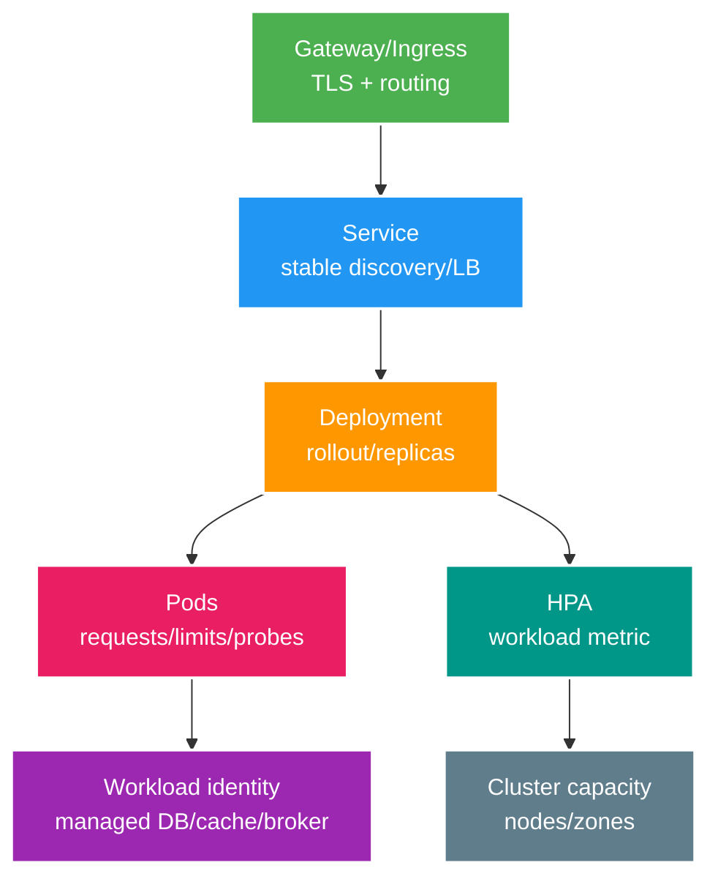

# Cloud Core: Kubernetes, Managed Services và Infrastructure as Code

> Type: `CORE` 
> Domain: `cloud` 
> Target depth: `D3 — vận hành Spring workload, chọn managed service và thay đổi IaC an toàn` 
> Teaching readiness: `TEACHABLE_DRAFT` 
> Status: `DRAFT` 
> Evidence status: `NOT RUN` 
> Prerequisites: container runtime; CI/CD; distributed systems 
> Related cases: `CLOUD-01`; [question bank](../../question-bank/kubernetes-managed-services-and-iac.md) 
> Owner: `Project learner; Codex teaches, learner writes back` 
> Updated: `2026-07-26`

## 1. Kubernetes primitives

Pod chạy một hoặc nhiều container gắn chặt, dùng chung network/lifecycle. Deployment quản lý replica set và rolling rollout cho workload stateless. Service cung cấp discovery/load balancing ảo ổn định tới pod được chọn. Ingress/Gateway API mô tả HTTP/TLS routing bên ngoài do controller thực thi. StatefulSet/PV không tự làm database an toàn; operator hoặc managed service phải sở hữu semantics replication/backup.

Các component này chỉ orchestration hạ tầng; application vẫn cần auth, transaction, idempotency, backpressure và data ownership.

## 2. Config, secrets and identity

ConfigMap phân phối config không nhạy cảm. Kubernetes Secret là API object và cơ chế distribution, không tự mã hóa trong memory/log; cần encryption at rest, RBAC, xét risk namespace/volume/environment, rotation và audit. Ưu tiên cloud/workload identity với credential sống ngắn, scope hẹp thay static access key. Bootstrap trust và service-account permission theo least privilege.

Rollout config immutable/có version; validate và fail fast; rotate secret K1 → K2 theo receiver-first. Tránh secret trong image, IaC state/plan hoặc log. External secret manager thêm bài toán availability, cache và rotation. NetworkPolicy bổ trợ identity, không thay application authorization.

## 3. Resources/probes/rollout

Đo startup Spring, CPU/memory/native, FD/connection và load. Resource request ảnh hưởng scheduling/capacity; limit có thể throttle hoặc OOM. Tách startup, readiness và liveness. Thiết kế graceful drain cùng termination grace. `maxSurge/maxUnavailable` phải tính zone/headroom; PodDisruptionBudget chỉ hạn chế voluntary disruption, không tạo capacity hay ngăn node fail, thậm chí chặn upgrade nếu cấu hình bất khả thi.

Dùng topology spread/anti-affinity giữa zone; chỉ readiness khi pod phục vụ an toàn. Rolling mixed-version cần compatibility. Test eviction, throttle, node drain và zone loss thay vì chỉ tin config.

## 4. Autoscaling layers

HPA đổi replica theo metric; VPA đề xuất/đặt resource và có thể restart; cluster autoscaler cấp node cho pod chưa schedule được. Mỗi feedback loop có delay và tương tác với loop khác. App phải horizontal-scalable nhưng partition, database, broker và pool vẫn là ceiling. HPA theo CPU có thể phản ứng sau latency hoặc nhân DB connection.

Ưu tiên leading signal về workload, queue và saturation với target hữu hạn, cooldown/warmup và headroom tối thiểu; thêm global admission và downstream budget. Scale-down phải drain. Một trăm pod nhân 20 DB connection có thể làm database sập. Test retry storm và cold cache.

## 5. Managed vs self-managed

So sánh đúng service/version theo HA, failover, backup/PITR, patch, upgrade, scaling, observability và support; performance, feature, config, quota; encryption, identity, network, data residency, compliance; lock-in, API, egress, cost; staffing/on-call và exit/migration. Managed service chuyển giao một số task, không chuyển trách nhiệm data model, SLO và incident.

Benchmark semantics critical, load, failover và restore. Self-managed chỉ hợp lý khi cần feature/performance/control đặc biệt và có team chịu recovery 24/7. Docker local hiện tại không hàm ý production decision.

## 6. IaC mental model

IaC code/module cộng provider, state và resource thật tạo ra plan. State map identity/attribute và thường chứa dữ liệu nhạy cảm nên cần remote encryption, locking, access control, audit và backup. Drift là thay đổi thật do manual/external làm lệch code/state. Review plan rồi import/reconcile có chủ đích; không sửa console thường xuyên mà không codify.

Pin provider/module; chạy validation, lint, security và policy; CI identity sống ngắn. Tách environment, account và state để giảm blast radius. Thay đổi production destructive/replace cần approval, backup/restore và maintenance rõ. Plan có thể chứa secret nên phải restrict/redact. Serialize apply bằng lock và có recovery cho partial apply. IaC rollback không phải lúc nào cũng đảo ngược được dữ liệu, IP hoặc resource đã xóa.

## 7. Multi-zone/region

Map scope failure của resource cùng dependency control plane, quota/capacity, DNS/GSLB, identity/KMS, replication/RPO/RTO và egress. Nhân các SLA không phải bằng chứng kiến trúc. Khi zone fail, pod/node và managed data còn lại phải đạt degraded SLO. Với region, cần writer epoch/fencing, traffic, secret/dependency và failback. Phải chạy drill.

Cloud control-plane outage có thể chặn scale/deploy trong khi data plane vẫn phục vụ; cần pre-provision headroom và local runtime behavior. Một dependency chỉ nằm ở một zone/account sẽ phá lợi ích phân tán.

## 8. Kubernetes or simpler PaaS/VM

PaaS/managed container hợp team nhỏ, ít service chuẩn và muốn giảm platform toil. Kubernetes chỉ hợp khi nhu cầu scheduling, extensibility, workload đa dạng, multi-team, self-service hoặc portability đủ bù expertise, upgrade, security và observability. VM có thể đơn giản, dễ kiểm soát cho workload ổn định. So TCO, on-call, lead time, lock-in và exit. Không chọn Kubernetes để học ngay trên production; time-box lab riêng.

## 8.1. Hai worked examples và phản ví dụ

**Worked example tối thiểu — probes:** startup probe cho phép JVM warm/migrate trong bounded time; readiness chỉ nhận traffic khi service phục vụ được; liveness phát hiện process mắc kẹt chứ không restart vì shared DB chậm thoáng qua. Mỗi probe có failure/traffic consequence khác.

**Worked example gần project — resource/pool budget:** deployment 4 pods, mỗi pod DB pool 20 tạo tối đa 80 connections trước surge/HPA. Nếu database budget 60, rollout/autoscale có thể collapse. IaC/deployment config phải tính replica × pool và reserve migration/operations headroom.

**Phản ví dụ:** đưa app lên Kubernetes rồi gọi là HA nhưng mọi pods một zone, readiness phụ thuộc trực tiếp database và không có spare node/data failover. Orchestrator không tự tạo failure-domain design, RPO/RTO hoặc cost-effective platform ownership.

## 9. Learner/self-check

> **Bài viết của tôi — `LEARNER TODO`:** design Spring Deployment/resources/probes/autoscale and IaC change safety.

1. **Question:** HPA/VPA/cluster autoscaler differ? 
   **Đọc lại nếu bí:** mục 4. 
   **Một câu trả lời tốt phải có:** pods/resources/nodes, feedback/restart/warmup, downstream/global cap. 
   **My answer:** `LEARNER TODO`
2. **Question:** Managed service decision? 
   **Đọc lại nếu bí:** mục 5. 
   **Một câu trả lời tốt phải có:** semantics/SLO/HA/restore/security/quota/skills/TCO/exit and benchmark. 
   **My answer:** `LEARNER TODO`
3. **Question:** IaC destructive safety? 
   **Đọc lại nếu bí:** mục 6. 
   **Một câu trả lời tốt phải có:** state/plan/drift, identity/lock/pin/policy/approval, backup/restore and non-reversible reality. 
   **My answer:** `LEARNER TODO`

## 10. References/teach-back

- [Kubernetes Documentation](https://kubernetes.io/docs/home/)
- [Kubernetes Gateway API](https://gateway-api.sigs.k8s.io/)
- [Terraform — State](https://developer.hashicorp.com/terraform/language/state)

- [ ] Tôi design workload lifecycle/capacity.
- [ ] Tôi choose managed/platform from ownership/TCO.
- [ ] Tôi govern IaC/multi-region recovery.
- [ ] Evidence vẫn `NOT RUN`.
