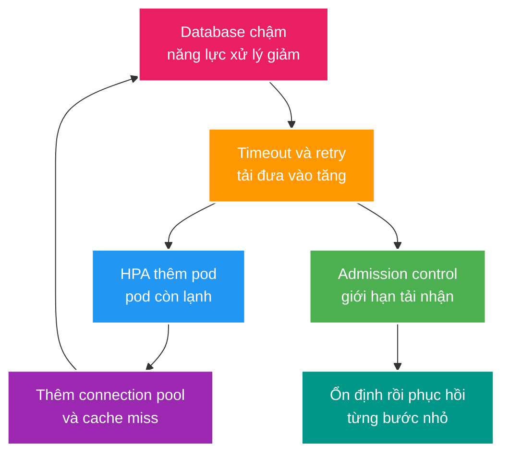

# Deep-dive: Vòng lặp autoscaling, sai lệch IaC và khôi phục vùng

> Type: `DEEP_DIVE` 
> Domain: `cloud` 
> Target depth: `D4 — dẫn dắt xử lý incident có feedback loop và phục hồi cloud qua ràng buộc data plane/control plane` 
> Teaching readiness: `TEACHABLE_DRAFT` 
> Status: `DRAFT` 
> Evidence status: `NOT RUN` 
> Prerequisites: [Cloud core](../core/kubernetes-managed-services-and-iac.md) 
> Related cases: `CLOUD-01`; [question bank](../../question-bank/kubernetes-managed-services-and-iac.md) 
> Owner: `Project learner; Codex teaches, learner writes back` 
> Updated: `2026-07-26`

## 1. Mental model: cloud là một hệ điều khiển có độ trễ

Autoscaling không phải là nút “thêm máy thì hệ thống sẽ khỏe”. Nó là một **feedback loop** — vòng phản hồi: bộ điều khiển đọc tín hiệu cũ, ra quyết định, chờ tài nguyên được cấp, chờ ứng dụng khởi động rồi mới thấy kết quả. Trong khoảng chờ đó, tải và trạng thái downstream vẫn thay đổi. Vì vậy một quyết định đúng ở giây thứ 0 có thể trở thành quyết định gây hại ở giây thứ 60.

Cần tách hai mặt phẳng:

- **data plane** là nơi request thật đi qua: pod, load balancer, database, cache và message broker;
- **control plane** là nơi tạo hoặc thay đổi tài nguyên: Kubernetes API, scheduler, autoscaler, DNS, IAM và công cụ Infrastructure as Code (IaC — hạ tầng được mô tả bằng mã nguồn).

Data plane có thể đang quá tải trong khi control plane vẫn báo “healthy”. Ngược lại, control plane bị lỗi có thể làm ta không scale hoặc không đổi route được, dù các pod hiện tại vẫn phục vụ. Runbook phải nói rõ thao tác nào phụ thuộc mặt phẳng nào.

## 2. Pathology A — thêm pod làm database sập nhanh hơn

Giả sử database chậm vì I/O tăng. Latency ứng dụng và số request đang chờ tăng; CPU của pod cũng tăng do retry và serialization. Horizontal Pod Autoscaler (HPA) thấy CPU cao nên thêm pod. Mỗi pod mới mở một connection pool, nạp cache và chạy health check. Tổng connection và cache miss đổ thêm vào database. Database chậm hơn, timeout nhiều hơn, client retry nhiều hơn và HPA tiếp tục scale.

**Biểu hiện quan sát được:** số pod tăng nhưng throughput không tăng; DB connection tiến sát giới hạn; p99 latency, timeout và retry cùng tăng; pod mới readiness chậm; cache hit ratio giảm.

**Evidence cần lấy:** biểu đồ cùng timeline cho `desiredReplicas`, `readyReplicas`, request rate gốc, retry rate, active DB connection, query latency và cache miss. Chỉ nhìn CPU hoặc số pod sẽ kết luận sai.

**Cách cô lập:** tạm dừng retry/redrive gây hại; giới hạn concurrency tới database ở cả mức mỗi pod và toàn fleet; từ chối sớm request không thiết yếu; giữ queue có giới hạn; không tiếp tục scale khi bottleneck thực nằm ở database. Sau khi database có headroom, làm ấm một nhóm pod canary rồi tăng traffic dần.

**Phòng ngừa:** HPA cần signal phản ánh workload, stabilization window và tốc độ scale hợp lý. Connection budget phải được tính theo `số pod tối đa × pool mỗi pod`, không chỉ cấu hình một pool riêng lẻ. Test phải đưa cả cold cache, retry và pod startup vào cùng một kịch bản.

## 3. Pathology B — probe biến lỗi dependency thành restart storm

`livenessProbe` trả lời “process có bị kẹt đến mức cần khởi động lại không”; `readinessProbe` trả lời “pod có nên nhận traffic mới không”; `startupProbe` bảo vệ ứng dụng khởi động chậm khỏi bị liveness giết sớm. Trộn ba ý nghĩa này tạo lỗi rất khó thấy.

Ví dụ, liveness gọi thẳng database với timeout quá ngắn. Database chậm tạm thời làm hàng loạt pod fail liveness và bị restart. Mỗi pod khởi động lại mở connection, compile code nóng, nạp cache và đăng ký consumer. Tải khởi động làm database và broker chậm hơn, vì vậy các pod tiếp tục chết theo vòng lặp.

Nếu readiness cũng phụ thuộc cứng vào cùng database, tất cả endpoint có thể đồng loạt biến mất khỏi load balancer. Khi đó ứng dụng mất cả khả năng trả response degraded vốn không cần database. Chỉ đánh readiness fail khi pod thật sự không thể phục vụ loại traffic được route tới nó; tách endpoint hoặc mode phục vụ nếu cần.

**Chuỗi nguyên nhân → biểu hiện → bằng chứng:** dependency chậm → probe timeout → restart count tăng → startup connection/cache miss tăng → dependency chậm hơn. Kiểm chứng bằng event của Kubernetes, `restartCount`, thời gian startup, connection rate và dependency latency trên cùng một trục thời gian.

**Mitigation:** liveness chỉ kiểm tra tình trạng nội tại tối thiểu; startup có budget đủ cho worst-case hợp lý; readiness có semantics rõ; thêm jitter nếu nhiều probe cùng nhịp; đặt resource request thực tế để tránh CPU throttling làm probe trễ giả.

## 4. PDB, topology và mất một availability zone

PodDisruptionBudget (PDB) chỉ giới hạn **voluntary disruption** như node drain khi nâng cấp. PDB không ngăn node hoặc availability zone (AZ) chết đột ngột. `maxUnavailable=0` còn có thể làm rollout bị kẹt nếu cluster không có chỗ cho surge pod.

Topology spread và anti-affinity chỉ tạo phân bố khi scheduler còn node/quota thích hợp. Sau khi mất một AZ, hai AZ còn lại phải có đủ CPU, memory, IP, quota và downstream capacity để nhận tải. Nếu bình thường ba AZ đều chạy 80%, mất một AZ sẽ đẩy hai AZ còn lại vượt 100%; “deploy đa AZ” khi đó chưa phải high availability.

Một bài kiểm tra có ý nghĩa phải gồm hai trường hợp: node drain có kiểm soát và mất AZ đột ngột. Quan sát thời gian endpoint bị loại, connection drain, DNS/route hội tụ, reconnect burst và khả năng scheduler đặt pod mới. Headroom phải tính đồng thời cho một AZ mất và một rolling deployment, không tính riêng hai bài toán.

## 5. Pathology C — IaC apply dở dang và state không còn phản ánh thực tế

IaC tool thường thực hiện nhiều API call, không phải một transaction xuyên cloud provider. Apply có thể tạo resource A thành công rồi thất bại ở B. State có thể ghi một phần; tài nguyên thật có thể đã đổi; plan cũ không còn mô tả chính xác hiện trạng. Chạy lại hoặc xóa thủ công theo cảm tính có thể phá resource đang phục vụ production.

Quy trình an toàn:

1. dừng các apply cạnh tranh và giữ state lock;
2. chụp lại state, plan, audit log và danh sách resource thật;
3. đối chiếu từng resource giữa code, state và provider;
4. import hoặc sửa state có kiểm soát nếu resource hợp lệ đã tồn tại;
5. tạo plan mới, review phần replace/delete đặc biệt kỹ rồi mới apply;
6. ghi lại manual emergency change vào code ngay sau incident.

Drift detection nên cảnh báo chứ không tự xóa resource lạ có tính critical. `prevent_destroy`, policy và approval giảm khả năng thao tác nhầm nhưng không thay thế backup/restore drill. Secret từng đi vào Terraform state vẫn là dữ liệu nhạy cảm ngay cả khi đã xóa khỏi source; phải giới hạn truy cập, mã hóa, audit và rotate khi lộ.

**Version boundary:** hành vi locking, state backend và provider migration phụ thuộc phiên bản Terraform/OpenTofu, provider và backend đang dùng. Pin version/lock file và thử nâng cấp module/provider ở non-production. Không suy từ một phiên bản sang mọi phiên bản.

## 6. Managed service không xóa failure semantics

“Managed” nghĩa là nhà cung cấp gánh một phần vận hành, không có nghĩa là failover tức thì hoặc không mất kết nối. Database managed vẫn có thể reset connection, đổi writer, lag replica hoặc chặn API control plane. Application phải reconnect bằng retry có giới hạn và xử lý **unknown outcome** — client timeout nhưng transaction có thể đã commit.

Trước khi chọn dịch vụ, cần ghi rõ: failover time đã công bố và đã đo; endpoint/DNS thay đổi thế nào; transaction đang chạy ra sao; replica có stale read bao lâu; quota nào bị throttle; backup/PITR tạo endpoint mới hay ghi đè; KMS, IAM và network dependency nào có thể chặn recovery.

Multi-AZ giải bài toán mất một zone, không tự động giải bài toán mất region. Cross-region replication thường bất đồng bộ nên có Recovery Point Objective (RPO — lượng dữ liệu chấp nhận mất) khác 0. Recovery Time Objective (RTO — thời gian phục hồi) phải gồm thời gian con người quyết định, promote, đổi route và xác minh nghiệp vụ, không chỉ thời gian API tạo resource.

## 7. Protocol khôi phục region và fencing writer cũ

Một failover an toàn cần trả lời “ai được quyền ghi” trước khi trả lời “đổi DNS thế nào”. Nếu region cũ bị network partition nhưng vẫn chạy, việc promote region mới có thể tạo hai writer. **Fencing** là cơ chế khiến writer có epoch/token cũ bị storage hoặc service đích từ chối.

Trình tự tham khảo:

1. xác định recovery point và mức mất dữ liệu thực tế;
2. thu hồi quyền ghi hoặc tăng writer epoch để fence region cũ;
3. promote/restore data tại region mới;
4. xác minh secret, KMS, certificate, image, config, quota và downstream;
5. chạy synthetic flow cho login, write, read và event delivery;
6. chuyển một cohort traffic nhỏ, theo dõi invariant rồi mới mở rộng;
7. reconcile message và external side effect nằm trong khoảng RPO;
8. coi failback là một migration mới: catch-up, epoch mới, canary mới.

Active-active chỉ phù hợp khi mỗi loại dữ liệu có conflict semantics rõ. Có thể để presence hoặc viewer count eventual, nhưng wallet ledger không thể “last write wins”. Load balancer health xanh không chứng minh invariant tiền đúng.

## 8. Diagnostic và game day có thể lặp lại

Không ghi `PASS` trước khi chạy. Một experiment tối thiểu nên lưu phiên bản cloud/Kubernetes/IaC/JVM, topology, cấu hình HPA/probe/pool, workload generator và raw timeline.

- Inject DB latency khi HPA và retry đang bật; so sánh với admission control và global concurrency cap.
- Làm node drain rồi mô phỏng mất node/AZ; đo reconnect burst, scheduling và endpoint convergence.
- Trong sandbox, tạo drift và partial apply; thực hành inspect/import/re-plan, tuyệt đối không dùng production.
- Chạy managed database failover và restore backup; đo connection recovery, RPO và RTO nghiệp vụ.
- Diễn tập region failover với writer epoch; cố tình cho worker cũ quay lại để chứng minh fencing từ chối nó.

Kết luận kiến trúc phải dựa vào raw result. Tài liệu này hiện chỉ là thiết kế thí nghiệm nên `Evidence status` vẫn là `NOT RUN`.

## 9. Trade-off cần bảo vệ trước stakeholder

- Giữ nhiều headroom và standby capacity tốn tiền nhưng rút ngắn recovery; scale-from-zero rẻ hơn nhưng có cold-start risk.
- Cache last-known-good giúp sống qua secret manager outage nhưng làm emergency revocation chậm hơn.
- Active-active giảm latency và một số loại downtime nhưng tăng mạnh chi phí conflict resolution, fencing và vận hành.
- Managed service giảm toil nền tảng nhưng tạo quota, control-plane dependency và vendor-specific recovery procedure.

Senior/Architect không chọn theo khẩu hiệu. Câu trả lời tốt nêu invariant cần giữ, RPO/RTO, tải thất bại, bằng chứng đã đo, chi phí và residual risk.

## 10. Bài tập diễn đạt lại và self-check

> **Bài viết của tôi — `LEARNER TODO`:** tự vẽ lại vòng collapse do autoscaling và trình bày protocol failover có fencing.

1. **Question:** Vì sao thêm pod có thể làm database chết nhanh hơn? 
   **Đọc lại nếu bí:** mục 2. 
   **Một câu trả lời tốt phải có:** pool nhân số replica, cold cache, retry amplification, bottleneck stateful, admission và global cap. 
   **My answer:** `LEARNER TODO`
2. **Question:** Khôi phục một IaC apply dở dang ra sao? 
   **Đọc lại nếu bí:** mục 5. 
   **Một câu trả lời tốt phải có:** khóa apply, đối chiếu code/state/resource thật, import/reconcile, plan mới và không xóa mù. 
   **My answer:** `LEARNER TODO`
3. **Question:** Vì sao đổi DNS chưa đủ để failover region an toàn? 
   **Đọc lại nếu bí:** mục 7. 
   **Một câu trả lời tốt phải có:** recovery point, writer epoch/fencing, dependency/capacity, canary, reconcile và failback như migration. 
   **My answer:** `LEARNER TODO`

## 11. References và teach-back

- [Kubernetes HPA](https://kubernetes.io/docs/tasks/run-application/horizontal-pod-autoscale/)
- [Kubernetes PDB](https://kubernetes.io/docs/tasks/run-application/configure-pdb/)
- [Terraform — State Locking](https://developer.hashicorp.com/terraform/language/state/locking)

- [ ] Tôi giải thích được vòng collapse do HPA, retry, pool và cold cache.
- [ ] Tôi biết khôi phục IaC drift/partial apply mà không xóa mù.
- [ ] Tôi bảo vệ được RPO/RTO, fencing và failback protocol.
- [ ] Evidence vẫn là `NOT RUN` cho tới khi chạy game day thật.
