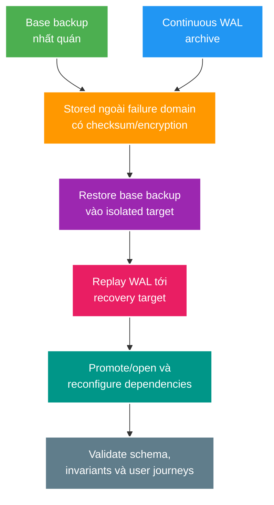

# Sao lưu, khôi phục, PITR và failover

> Type: `CORE` 
> Domain: `database` 
> Target depth: `D4 — thiết kế và diễn tập recovery theo RPO/RTO, tính toàn vẹn và failure domain` 
> Teaching readiness: `TEACHABLE_DRAFT` 
> Status: `DRAFT` 
> Evidence status: `NOT RUN` 
> Prerequisites: PostgreSQL WAL, transactions và replication 
> Related cases: roadmap owner `DR-01`; [question bank](../../question-bank/backup-restore-pitr-and-failover.md) 
> Owner: `Project learner; Codex teaches, learner writes back` 
> Updated: `2026-07-26`

## 0. Vấn đề và mục tiêu học

Backup job xanh không có nghĩa khôi phục được. Recovery cần dữ liệu, WAL, schema/config, secrets/keys, runbook, capacity và validation. **RPO** là mức dữ liệu có thể mất tính theo thời điểm; **RTO** là thời gian khôi phục service ở mức chấp nhận. PITR khôi phục cluster tới một thời điểm/transaction trước lỗi bằng base backup + WAL archive. Failover đổi primary đang phục vụ; restore tạo lại state từ backup. Hai bài toán liên quan nhưng không giống nhau.

Sau bài này, bạn phân biệt logical/physical backup, PITR/failover, thiết kế drill và xác minh business invariants sau recovery.

## 1. Mô hình tư duy cốt lõi

Câu cần nhớ: **backup là input; chỉ restore drill có đo thời gian và invariant mới là recovery evidence**.

## 2. Cơ chế và lựa chọn

Logical backup (`pg_dump`) xuất definitions/data, linh hoạt chọn object và migrate version, nhưng restore database lớn có thể lâu và không tự tạo continuous PITR. Physical base backup sao chép cluster-level files phù hợp streaming/PITR, gắn với PostgreSQL/system compatibility hơn. WAL archive phải liên tục, durable và được monitoring; thiếu một segment cần thiết có thể chặn recovery target.

PITR: lấy base backup trước target, restore config, replay archived WAL tới timestamp/LSN/transaction/name, dừng đúng target rồi promote. Timestamp dễ hiểu nhưng clock/timezone và transactions gần nhau cần cẩn trọng; transaction ID/LSN/restore point chính xác hơn khi đã capture. Sau promotion, tạo timeline mới; old primary không được tự quay lại ghi.

Failover sang standby thường nhanh hơn restore nhưng RPO phụ thuộc sync/async và replay state. Fencing, client connection refresh, retry/idempotency và replica rebuild là phần của runbook. Backup phải ở failure domain khác cluster/account/region theo threat model; encryption vô nghĩa nếu recovery mất key.

## 3. Ví dụ phân tích từng bước

### 3.1. Xóa nhầm dữ liệu lúc 10:15

Không restore đè production ngay. Dựng isolated cluster từ base backup, replay WAL tới ngay trước transaction delete, validate row/invariants, rồi chọn recovery: promote full cluster hoặc trích xuất/reconcile records vào live system. Nếu live system tiếp tục nhận write sau 10:15, full rewind sẽ mất writes mới; selective recovery phức tạp nhưng giảm loss. Stakeholder phải quyết định dựa RPO/business conflicts.

### 3.2. Máy primary ngừng hoạt động

Xác định primary thật sự dead/fenced, kiểm tra standby replay/lag, promote, đổi routing, run smoke/invariant checks và monitor error/retry storm. Database port mở chưa đủ: auth, sequences, extensions, app compatibility, outbox/consumer offsets và cache state cần xem. Ghi actual RTO và estimated/verified RPO.

### 3.3. Phản ví dụ: backup chưa từng restore thử

Nightly upload thành công nhưng retention lifecycle xóa WAL trước base backup window; lúc restore thiếu segment. Symptom chỉ xuất hiện khi disaster. Prevention là automated restore verification, WAL continuity/age alerts và recovery catalog liên kết base backup với required WAL range.

## 4. Invariant, các kiểu hỏng và đánh đổi

- Recovery artifact phải có checksum, encryption/key owner, retention và restore compatibility.
- RPO/RTO phải đo bằng drill ở data size/capacity đại diện.
- Restore target mặc định isolated để tránh ghi đè/side effects ra production.
- Sau recovery phải validate business invariants, không chỉ DB consistency/startup.
- Runbook có decision authority, communication và abort/escalation.

Frequent full backups giảm dependency chain nhưng tốn I/O/storage; incremental/WAL-efficient hơn nhưng restore phức tạp. Multi-region giảm site failure nhưng tăng cost/latency/operational risk. Logical export hữu ích object-level recovery; physical+WAL tốt cho cluster PITR. Strategy thường kết hợp theo threat model.

## 5. Áp dụng, phỏng vấn và tự kiểm tra

Khi `DR-01` active, định nghĩa threat scenarios, RPO/RTO, tạo backup/PITR trong môi trường disposable, inject delete/corruption/primary loss, đo từng phase và verify representative project invariants. Không xóa volume/drop schema trong batch docs này; evidence `NOT RUN`.

**30 giây:** “Tôi không coi backup success là recovery. PostgreSQL PITR cần base backup + WAL archive liên tục, restore isolated và replay tới target. Failover là promotion/routing/fencing, có thể vẫn mất dữ liệu nếu async. Drill phải đo RPO/RTO và validate business invariants, keys/config/dependencies.”

> **Bài viết của tôi — `LEARNER TODO`:** lập runbook cho accidental delete và primary loss, chỉ ra quyết định khác nhau giữa restore, PITR và failover.

1. **Question:** Backup, restore, PITR và failover khác nhau thế nào? 
   **Đọc lại nếu bí:** mục 0–2. 
   **Một câu trả lời tốt phải có:** artifact/process, target state, time/data loss, promotion/routing và use case. 
   **My answer:** `LEARNER TODO`
2. **Question:** Restore “database starts” vì sao chưa pass? 
   **Đọc lại nếu bí:** mục 1, 3.2 và 4. 
   **Một câu trả lời tốt phải có:** schema/extensions/auth, invariants, app journeys, side effects, RPO/RTO và observability. 
   **My answer:** `LEARNER TODO`
3. **Question:** PITR sau accidental delete xử lý writes mới thế nào? 
   **Đọc lại nếu bí:** mục 3.1. 
   **Một câu trả lời tốt phải có:** isolated restore, target selection, full rewind loss, selective reconciliation và stakeholder decision. 
   **My answer:** `LEARNER TODO`

## 6. Nguồn chính thức và trình bày lại

- [PostgreSQL 15 — Backup and Restore](https://www.postgresql.org/docs/15/backup.html)
- [PostgreSQL 15 — Continuous Archiving and PITR](https://www.postgresql.org/docs/15/continuous-archiving.html)

- [ ] Tôi phân biệt restore/PITR/failover.
- [ ] Tôi nối artifact, WAL, key/config và failure domain.
- [ ] Tôi định nghĩa validation sau recovery.
- [ ] Tôi chỉ claim RPO/RTO sau drill.
