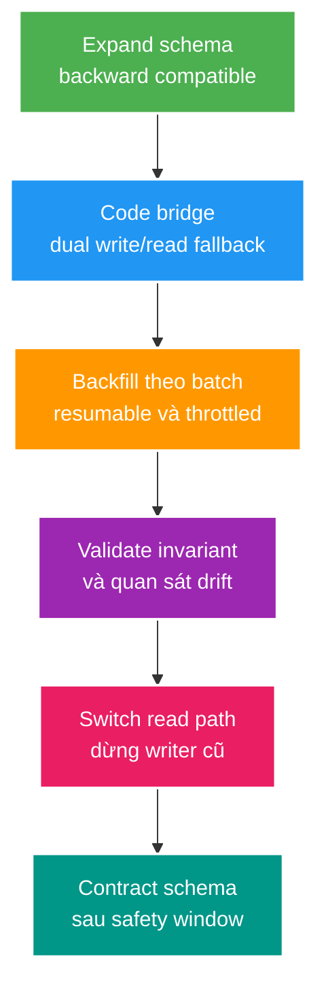

# Thay đổi schema an toàn theo mô hình expand–contract

> Type: `CORE` 
> Domain: `database` 
> Target depth: `D4 — lập migration plan tương thích nhiều version, backfill/rollback có observability và bảo vệ availability` 
> Teaching readiness: `TEACHABLE_DRAFT` 
> Status: `DRAFT` 
> Evidence status: `NOT RUN` 
> Prerequisites: schema/constraint/index và deployment rolling cơ bản 
> Related cases: roadmap owner `DB-04`; [question bank](../../question-bank/expand-contract-schema-migration.md) 
> Owner: `Project learner; Codex teaches, learner writes back` 
> Updated: `2026-07-26`

## 0. Cách dùng và vấn đề trung tâm

Trong rolling deployment, version cũ và mới cùng truy cập một schema. Rename/drop/`NOT NULL` ngay có thể làm một nửa fleet lỗi. Expand–contract chia thay đổi thành các trạng thái mà mỗi trạng thái đều tương thích. Đây không chỉ là chuỗi DDL: code read/write, backfill, validation, observability và rollback đều thuộc protocol.

## 1. Mục tiêu học và từ vựng

**Expand** thêm cấu trúc/capability tương thích. **Backfill** chuyển dữ liệu cũ theo batch, resumable. **Dual write/read** là bridge tạm thời; phải có owner và removal date. **Validate** chứng minh invariant trên toàn dữ liệu. **Contract** xóa cấu trúc cũ chỉ khi không còn reader/writer. **Rollback** deployment thường là roll-forward-compatible code; đảo DDL/data có thể không an toàn.

Sau bài này, bạn thiết kế được migration nhiều release, chỉ ra compatibility matrix, lock/rewrite risk, backfill watermark và exit criteria.

## 2. Mô hình tư duy cốt lõi

Câu cần nhớ: **mỗi bước phải deploy/rollback độc lập trong khi version lân cận vẫn chạy**.

## 3. Cơ chế và ví dụ phân tích từng bước

### 3.1. Đổi tên `display_name` thành `creator_name`

Không rename trực tiếp. Release A thêm nullable `creator_name`. Release B ghi cả hai, đọc new rồi fallback old; retry/upsert phải không làm hai cột drift. Backfill rows cũ theo primary-key ranges, commit từng batch, ghi watermark/rows/error và throttle theo replica lag/load. Validate `creator_name` tương ứng rule. Release C đọc new only; sau khi mọi old binary/job bị loại và safety window qua, add constraint nếu cần rồi drop old ở release D.

### 3.2. Thêm NOT NULL

Thêm cột nullable với default/application behavior tương thích; deploy writer điền giá trị; backfill; kiểm tra không còn null; thêm/validate constraint theo cách giảm lock phù hợp PostgreSQL version; cuối cùng code mới có thể giả định invariant. “Một migration thêm NOT NULL DEFAULT cho bảng lớn” có thể giữ lock/rewrite hoặc tạo load lớn tùy version/expression; phải test exact DDL trên production-like PostgreSQL 15.

### 3.3. Phản ví dụ: ghi kép nhưng không đối soát

Code ghi old thành công rồi new fail vì chúng ở khác transaction/service; read fallback che drift. Khi switch new-only, dữ liệu mất. Bridge phải cùng owner transaction khi có thể, metric mismatch và reconciliation query; nếu cross-system thì cần event/outbox/repair protocol.

## 4. Các kiểu hỏng, ranh giới và đánh đổi

- DDL lock chờ transaction cũ rồi chặn queue phía sau; đặt lock timeout, quan sát blockers và tách DDL khỏi peak.
- Backfill một transaction khổng lồ tạo WAL, bloat, replica lag và rollback lâu. Batch nhỏ, resumable, adaptive throttle.
- Old async worker/cron bị quên vẫn ghi cột cũ. Inventory không chỉ HTTP fleet; gồm job, BI, script và restore procedure.
- Contract quá sớm làm rollback binary không thể chạy. Exit criteria cần deployment telemetry, schema consumers và safety window.

Trigger/database dual write giảm app complexity nhưng giấu behavior và có lifecycle riêng. Application bridge rõ rollout hơn nhưng mọi writer phải nâng. Change-data-capture phù hợp cross-store nhưng eventual/duplicate. Chọn theo owner boundary và failure recovery.

## 5. Áp dụng và phỏng vấn

Khi `DB-04` active, tạo compatibility matrix `{old code,new code} × {old,expanded,contracted schema}`, rehearsal trên snapshot giả lập, đo DDL lock/WAL/backfill rate/replica lag và chạy validation query. Mỗi step có abort/continue threshold. Hiện plan/runtime evidence `NOT RUN`.

**30 giây:** “Expand–contract giữ old/new code tương thích qua rolling deploy: thêm schema additive, bridge read/write, backfill resumable, validate, switch traffic rồi mới drop sau safety window. Rollback chủ yếu là code compatible/roll forward; backfill và destructive DDL cần recovery riêng.”

## 6. Tóm tắt, bài tập và tự kiểm tra

- Schema migration là distributed protocol giữa binaries, jobs và database.
- Additive change đi trước assumption mới.
- Backfill phải bounded, resumable, observable và throttled.
- Validation là gate, không phải cảm giác “chắc đủ”.
- Dual paths là debt tạm thời có exit criteria.
- Contract là bước cuối và thường khó rollback nhất.

> **Bài viết của tôi — `LEARNER TODO`:** viết rollout rename column gồm releases, compatibility, metrics, abort và contract gate.

1. **Question:** Vì sao rename column trực tiếp không an toàn khi rolling deploy? 
   **Đọc lại nếu bí:** mục 0 và 3.1. 
   **Một câu trả lời tốt phải có:** mixed versions, readers/writers, bridge, backfill và rollback binary. 
   **My answer:** `LEARNER TODO`
2. **Question:** Backfill production cần những control nào? 
   **Đọc lại nếu bí:** mục 3–5. 
   **Một câu trả lời tốt phải có:** batching, watermark/idempotency, throttle, WAL/lag/locks, validation và resume. 
   **My answer:** `LEARNER TODO`
3. **Question:** Khi nào được contract? 
   **Đọc lại nếu bí:** mục 2 và 4. 
   **Một câu trả lời tốt phải có:** no old consumers/writers, validated data, new path stable, safety window và recovery plan. 
   **My answer:** `LEARNER TODO`

## 7. Nguồn chính thức và trình bày lại

- [PostgreSQL 15 — ALTER TABLE](https://www.postgresql.org/docs/15/sql-altertable.html)
- [PostgreSQL 15 — Explicit Locking](https://www.postgresql.org/docs/15/explicit-locking.html)

- [ ] Tôi xây được compatibility matrix.
- [ ] Tôi giải thích DDL/backfill operational risk.
- [ ] Tôi có validation và contract exit criteria.
- [ ] Tôi phân biệt rollback code với data reversal.
