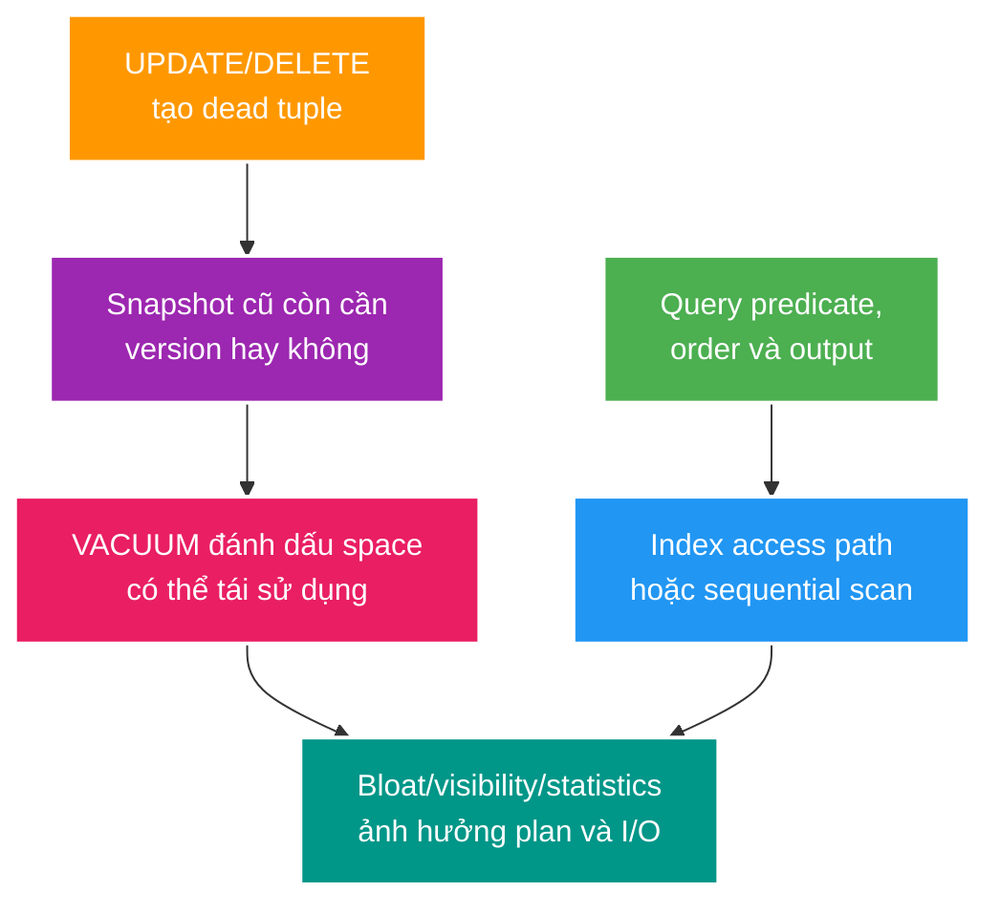

# PostgreSQL Indexing, MVCC, VACUUM và Bloat

> Type: `CORE` 
> Domain: `database` 
> Target depth: `D3 — thiết kế index theo workload, giải thích tuple visibility và chẩn đoán vacuum/bloat bằng evidence` 
> Teaching readiness: `TEACHABLE_DRAFT` 
> Status: `DRAFT` 
> Evidence status: `NOT RUN` 
> Prerequisites: [SQL core](sql-joins-aggregation-window-and-cte.md) 
> Related cases: roadmap owner `DB-01`; [question bank](../../question-bank/indexing-mvcc-vacuum-and-bloat.md) 
> Owner: `Project learner; Codex teaches, learner writes back` 
> Updated: `2026-07-26`

## 0. Cách dùng và vấn đề trung tâm

Đọc index và MVCC như một hệ thống: query tạo access pattern; index đổi đường tìm; update tạo tuple version; vacuum thu hồi khả năng tái sử dụng; transaction dài giữ version cũ sống lâu. “Thêm index” có thể tăng write amplification và bloat, còn “VACUUM chạy rồi” không có nghĩa file nhỏ lại. Baseline là PostgreSQL 15 trong project; metric/runtime evidence chưa chạy.

## 1. Learning objectives và từ vựng

**B-tree** là index mặc định phù hợp equality/range/order trên nhiều kiểu. **Composite index** có nhiều key columns; thứ tự cột quyết định access pattern. **Covering index** dùng `INCLUDE` để mang thêm payload cho khả năng index-only scan mà không biến payload thành search key. **Partial index** chỉ chứa rows thỏa predicate. **Selectivity** mô tả khả năng predicate thu hẹp rows.

**MVCC** cho transaction thấy snapshot phù hợp mà read thông thường không khóa mọi writer. PostgreSQL thường tạo tuple version mới khi update; version cũ trở thành dead đối với mọi snapshot sau khi không còn ai cần. **VACUUM** đánh dấu space có thể tái sử dụng và duy trì visibility map; autovacuum tự kích hoạt theo threshold. **Bloat** là space vật lý lớn hơn dữ liệu hữu ích do churn/fragmentation; regular vacuum thường không trả cuối file cho OS.

Sau bài này, bạn chọn được index từ predicate/order/output, đọc scan/rows/loops/buffers và nối long transaction tới dead tuples, vacuum lag và transaction-ID risk.

## 2. Mental model cốt lõi

Câu cần nhớ: **index tối ưu một access pattern nhưng tạo chi phí cho mọi write; MVCC trì hoãn cleanup, nên transaction lifetime là một phần của storage health**.

## 3. Cơ chế indexing

Với index `(stream_id, created_at DESC, id DESC)`, query equality `stream_id = ?` rồi order/range theo `created_at,id` phù hợp prefix. Query chỉ filter `created_at` thường không tận dụng phần sau hiệu quả như một index bắt đầu bằng `created_at`. Quy tắc “cột selectivity cao trước” không đủ; phải xét equality, range, sort, join và workload.

Index-only scan chỉ tránh heap fetch khi mọi cột cần có trong index **và** visibility map nói page đủ visible. Write churn làm page mất all-visible, nên plan tên “Index Only Scan” vẫn có heap fetch. `INCLUDE` tăng index size/write cost; không thêm mọi output column.

Partial index, ví dụ chỉ cho `status='LIVE'`, nhỏ và hiệu quả nếu query predicate chứng minh được điều kiện đó. Parameterization/predicate khác hình thức có thể khiến planner không dùng. Unique index vừa là access path vừa là concurrency-safe invariant; application pre-check không thay thế nó.

Planner so sánh cost sequential scan, index scan, bitmap scan, join/sort alternatives dựa trên statistics và cost model. Seq scan trên phần lớn bảng có thể đúng vì random heap lookup qua index đắt hơn đọc tuần tự. “Không dùng index” không tự động là bug.

## 4. Cơ chế MVCC và vacuum

Mỗi statement/transaction đọc theo snapshot tùy isolation. Update tạo version mới; index có thể trỏ tới tuple version. Phiên cũ còn mở giữ `xmin` horizon, ngăn vacuum loại versions mà phiên đó có thể thấy. Autovacuum trigger dựa trên dead tuple estimate và settings per table; high-churn table có thể cần tuning khác default.

Regular `VACUUM` làm space reusable trong table và cập nhật visibility/freeze metadata, thường không khóa exclusive lâu như `VACUUM FULL`. `VACUUM FULL` rewrite table, trả space cho OS nhưng cần lock mạnh và extra disk; dùng khi evidence/chấp nhận downtime phù hợp, không như maintenance định kỳ mặc định. Freeze ngăn transaction ID wraparound; đây là correctness concern, không chỉ performance.

## 5. Worked examples

### 5.1. Feed event theo stream

Query: `WHERE stream_id=? AND created_at < ? ORDER BY created_at DESC,id DESC LIMIT 50`. Index `(stream_id, created_at DESC, id DESC)` hỗ trợ equality + keyset range + order. Index chỉ `(status)` có selectivity thấp và không giúp ordering. Verify bằng plan, actual rows, buffers và page-depth latency.

### 5.2. Live streams partial index

Nếu phần rất nhỏ rows ở trạng thái LIVE và hot query luôn `WHERE status='LIVE' ORDER BY started_at DESC`, partial index trên `(started_at DESC,id DESC) WHERE status='LIVE'` có thể nhỏ hơn full index. Nhưng query lấy mọi status không dùng được; state transition tạo index maintenance; uniqueness toàn bảng không thể được bảo vệ bởi partial index đó.

### 5.3. Phản ví dụ transaction dài

Một admin export mở transaction hàng giờ. Trong lúc đó workers update viewer counters liên tục. Old versions không được cleanup vì snapshot cũ; dead tuples và indexes phình, autovacuum chạy nhưng horizon bị giữ. Symptom: table/index size và I/O tăng, query latency xấu. Evidence: active transaction age, vacuum stats, dead tuple estimates, plan/buffers. Fix root cause là transaction scope/export design; tăng vacuum frequency một mình không vượt được horizon.

## 6. Invariants, failure modes và trade-offs

- Mỗi index phải có owner query/invariant và removal criterion.
- Unique business invariant phải nằm ở database boundary khi concurrent writers có thể đua.
- Transaction phải ngắn theo business unit; network/user think time không nằm trong DB transaction.
- Vacuum monitoring phải quan sát progress, dead tuples, transaction age và wraparound, không chỉ “job đã chạy”.

Over-indexing: mỗi insert/update ghi nhiều structures, tăng WAL, lock/contention và cache footprint. Stale statistics: distribution đổi nhưng estimate cũ, planner chọn nested loop/scan sai; `ANALYZE` hoặc extended statistics có thể cần, song query/data design vẫn phải xem. Bloat diagnosis không thể chỉ nhìn một tỷ lệ: table size, live/dead tuple estimates, free space, workload churn và expected growth đều cần context.

## 7. Áp dụng vào project và experiment

Khi `DB-01` active, chọn query list/event thật; tạo fixture distribution có hot/cold stream, capture `EXPLAIN (ANALYZE, BUFFERS)` trước/sau candidate index. Đồng thời chạy update churn với/không long transaction, ghi table/index size, dead tuple/vacuum stats và latency. Không chạy trên production và không dùng `VACUUM FULL` trong task học nếu chưa xác minh lock/disk. Hiện evidence `NOT RUN`.

## 8. Góc nhìn phỏng vấn

**30 giây:** “Tôi thiết kế index từ equality/range/order/output, không từ tên cột. Composite index theo left-prefix và workload; INCLUDE/partial có lợi nhưng tăng write/storage cost. PostgreSQL MVCC giữ tuple versions theo snapshot, vacuum chỉ cleanup khi không snapshot nào cần. Vì vậy long transaction có thể gây bloat và cản vacuum.”

**Senior 2 phút:** thêm index-only/visibility map, seq scan hợp lý, autovacuum tuning, wraparound và evidence plan/buffers/statistics.

## 9. Tóm tắt

- Query shape và data distribution quyết định index có ích.
- Composite order dựa trên equality/range/order, không dùng một slogan selectivity.
- Index-only scan còn phụ thuộc heap visibility.
- MVCC tạo versions; snapshot lâu kéo dài tuổi versions.
- Regular vacuum reuse space, không mặc định shrink file.
- `VACUUM FULL` rewrite/lock mạnh và cần kế hoạch.
- Index tăng read speed có thể đánh đổi write/WAL/cache.

## 10. Bài tập và self-check

> **Bài viết của tôi — `LEARNER TODO`:** thiết kế index cho feed stream, rồi kể causal chain long transaction → dead tuples → vacuum horizon → bloat/latency.

1. **Question:** Vì sao planner chọn seq scan dù có index? 
   **Đọc lại nếu bí:** mục 3. 
   **Một câu trả lời tốt phải có:** selectivity, heap access, cost/statistics, result fraction và evidence plan. 
   **My answer:** `LEARNER TODO`
2. **Question:** Regular VACUUM khác VACUUM FULL thế nào? 
   **Đọc lại nếu bí:** mục 4. 
   **Một câu trả lời tốt phải có:** reuse vs file shrink, rewrite, locks, disk và use case. 
   **My answer:** `LEARNER TODO`
3. **Question:** Chứng minh index mới đáng giữ ra sao? 
   **Đọc lại nếu bí:** mục 6–7. 
   **Một câu trả lời tốt phải có:** owner queries, plan/buffers/latency, write/WAL/size cost và representative distribution. 
   **My answer:** `LEARNER TODO`

## 11. Official references và teach-back

- [PostgreSQL 15 — Indexes](https://www.postgresql.org/docs/15/indexes.html)
- [PostgreSQL 15 — MVCC](https://www.postgresql.org/docs/15/mvcc.html)
- [PostgreSQL 15 — Routine Vacuuming](https://www.postgresql.org/docs/15/routine-vacuuming.html)

- [ ] Tôi thiết kế index từ access pattern.
- [ ] Tôi giải thích được visibility và heap fetch.
- [ ] Tôi nối long transaction tới vacuum/bloat.
- [ ] Tôi biết evidence nào còn `NOT RUN`.

