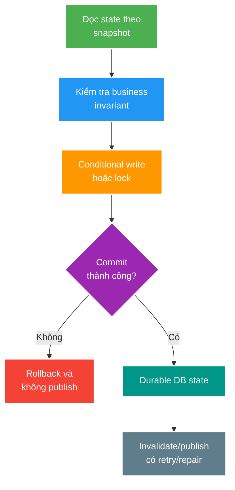

# Transaction Isolation, Locking và After-Commit Consistency

> Type: `CORE` 
> Domain: `database` 
> Target depth: `D3 — tái hiện anomaly, chọn concurrency control và giữ side effect ngoài DB nhất quán với commit` 
> Teaching readiness: `TEACHABLE_DRAFT` 
> Status: `DRAFT` 
> Evidence status: `NOT RUN` 
> Prerequisites: transaction ACID và [MVCC core](indexing-mvcc-vacuum-and-bloat.md) 
> Related cases: roadmap owner `TX-01`; [question bank](../../question-bank/isolation-locking-and-after-commit-consistency.md) 
> Owner: `Project learner; Codex teaches, learner writes back` 
> Updated: `2026-07-26`

## 0. Cách dùng và vấn đề trung tâm

`@Transactional` không làm mọi race biến mất. Nó xác định một DB transaction; isolation và statement shape mới quyết định concurrent histories nào được phép. Sau commit, cache/broker/WebSocket nằm ngoài atomic boundary nên cần delivery/repair strategy riêng. Bài này dùng PostgreSQL 15 semantics và không tuyên bố project đã có reproducer.

## 1. Learning objectives và từ vựng

**Lost update** là hai writer đọc cùng state rồi một kết quả ghi đè kết quả kia. **Write skew** xảy ra khi mỗi transaction ghi dòng khác nhưng cùng phá invariant đọc từ nhiều dòng. **Pessimistic locking** giữ lock trước khi sửa; **optimistic locking** dùng version/conditional update để phát hiện state đã đổi. **Deadlock** là chu trình chờ; DB hủy một transaction để phá chu trình. **After-commit action** chỉ được phát sau commit thành công, nhưng “sau commit” không tự bảo đảm sẽ phát nếu process chết.

Mục tiêu: phân biệt anomaly, chọn atomic SQL/version/lock/serializable theo invariant; dự đoán lock ordering/deadlock; thiết kế cache/event không đi trước commit và có đường hồi phục khi crash.

## 2. Mental model cốt lõi

Câu cần nhớ: **transaction bảo vệ invariant bên trong database; cross-system consistency cần protocol có durable intent, idempotency và repair**.

## 3. Isolation và concurrency control

PostgreSQL `READ COMMITTED` lấy snapshot mới cho mỗi statement. Hai lần SELECT trong cùng transaction có thể thấy dữ liệu khác. `REPEATABLE READ` giữ snapshot ổn định hơn và có thể abort serialization failure khi concurrent update; `SERIALIZABLE` cố bảo đảm kết quả tương đương một thứ tự tuần tự nhưng ứng dụng phải retry transaction bị abort. Isolation cao hơn không bỏ nhu cầu constraint và retry.

Nếu thay đổi diễn đạt được bằng một statement atomic, ưu tiên nó: `UPDATE wallet SET balance=balance-:x WHERE id=:id AND balance>=:x`. Row count 1 nghĩa điều kiện thắng tại write point; 0 nghĩa insufficient/conflict/not found cần phân loại. Optimistic version dùng `WHERE id=? AND version=?`, rồi increment version. Pessimistic `SELECT ... FOR UPDATE` phù hợp critical section ngắn cần current row, nhưng tăng wait/deadlock và không khóa được “absence” tùy predicate/isolation.

Lock nhiều resources phải theo global order. Deadlock vẫn có thể xảy ra do index/foreign key/trigger, nên transaction cần ngắn và error retry có budget/jitter. Không giữ DB transaction qua network call.

## 4. Worked examples

### 4.1. Lost update counter

T1 và T2 cùng đọc `viewer_count=10`, mỗi bên ghi 11; kết quả mất một increment. `UPDATE ... SET viewer_count=viewer_count+1` để DB thực hiện read-modify-write trên locked row tránh pattern này. Với high-contention exact counter, row vẫn thành hotspot; sharding/aggregation là trade-off khác.

### 4.2. Mute user và Redis

Sai: ghi cache `muted=true`, rồi DB transaction fail; authorization đọc Redis và chặn user dù source of truth không đổi. Tốt hơn: commit PostgreSQL trước, sau đó invalidation/update qua after-commit hook nếu chấp nhận best-effort, hoặc ghi outbox cùng transaction nếu event phải durable. Consumer idempotent cập nhật cache; TTL/read-through/repair xử lý missed delivery.

### 4.3. Write skew

Hai moderator cùng kiểm tra “còn ít nhất một moderator on-call”; mỗi người tắt một dòng khác. Row locks riêng lẻ không xung đột nhưng invariant tập hợp bị phá. Có thể serialize bằng một aggregate/guard row, stronger isolation + retry, hoặc model constraint khác. Chọn dựa trên contention và invariant, không chỉ thêm `FOR UPDATE` ngẫu nhiên.

## 5. Failure modes và trade-offs

- Publish trước commit: rollback nhưng event đã ra ngoài, downstream thấy phantom state.
- Publish trực tiếp sau commit: process crash giữa commit và publish, durable state có nhưng event mất. Outbox đóng khoảng trống này bằng durable intent, đổi lại có relay, duplicate và lag.
- Lock order không nhất quán: T1 giữ A chờ B, T2 giữ B chờ A; DB abort một bên. Retry toàn unit of work, không chỉ statement cuối.
- Transaction dài: giữ locks/snapshot/connection, tăng wait, bloat và pool starvation.

`SERIALIZABLE` đơn giản hóa reasoning nhưng có abort cost; optimistic tốt khi conflict hiếm; pessimistic tốt khi conflict thường và critical section ngắn; atomic SQL tốt nhất khi invariant biểu đạt trong một write. Không có lựa chọn “an toàn nhất” độc lập workload.

## 6. Áp dụng và phỏng vấn

Khi `TX-01` active, tạo barrier cho hai transaction, ghi exact interleaving, final state, SQLSTATE/row count và retry result. Với cache/event, inject crash ở trước commit, sau commit-trước-publish và sau publish-trước-ack. Hiện evidence `NOT RUN`.

**30 giây:** “Tôi bắt đầu từ invariant và anomaly. Nếu được, dùng conditional atomic SQL/constraint; conflict hiếm dùng optimistic version, critical section ngắn dùng lock, invariant đa dòng có thể cần guard row hoặc serializable + retry. Side effect chỉ đi sau commit; nếu không được mất thì dùng transactional outbox và idempotent consumer.”

## 7. Tóm tắt, bài tập và self-check

- `@Transactional` không tự ngăn lost update/write skew.
- Isolation là tập histories được phép; failure/retry là phần của contract.
- Atomic conditional write thường hẹp và rõ hơn read-then-write.
- Lock ordering và transaction duration quyết định operability.
- After-commit tránh publish-before-rollback nhưng không lấp crash gap.
- Outbox cho durable intent, không cho exactly-once tuyệt đối.

> **Bài viết của tôi — `LEARNER TODO`:** kể hai concurrent histories và một crash gap, rồi bảo vệ lựa chọn control/delivery.

1. **Question:** Optimistic locking khác pessimistic locking ở đâu? 
   **Đọc lại nếu bí:** mục 3 và 5. 
   **Một câu trả lời tốt phải có:** conflict detection time, wait/abort, retry, contention và invariant scope. 
   **My answer:** `LEARNER TODO`
2. **Question:** Vì sao after-commit callback vẫn có thể mất event? 
   **Đọc lại nếu bí:** mục 4.2 và 5. 
   **Một câu trả lời tốt phải có:** crash window, durable intent, outbox relay, duplicate/idempotency và repair. 
   **My answer:** `LEARNER TODO`
3. **Question:** Tái hiện write skew cần evidence gì? 
   **Đọc lại nếu bí:** mục 4.3 và 6. 
   **Một câu trả lời tốt phải có:** initial invariant, synchronized interleaving, isolation, commits/aborts và final state. 
   **My answer:** `LEARNER TODO`

## 8. Official references và teach-back

- [PostgreSQL 15 — Transaction Isolation](https://www.postgresql.org/docs/15/transaction-iso.html)
- [PostgreSQL 15 — Explicit Locking](https://www.postgresql.org/docs/15/explicit-locking.html)

- [ ] Tôi phân biệt lost update và write skew.
- [ ] Tôi chọn concurrency control từ invariant/workload.
- [ ] Tôi giải thích crash gap sau commit.
- [ ] Tôi không nhận runtime claim khi chưa chạy reproducer.
