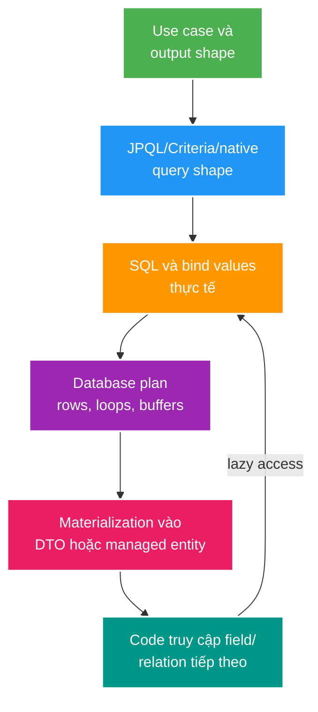

# JPA: N+1, Pagination và Query Plan

> Type: `CORE`<br>
> Domain: `database`<br>
> Target depth: `D3 — kiểm soát persistence context, SQL shape, fetch plan, pagination và chứng minh hiệu năng bằng plan`<br>
> Teaching readiness: `TEACHABLE_DRAFT`<br>
> Status: `DRAFT`<br>
> Evidence status: `NOT RUN`<br>
> Prerequisites: entity/repository cơ bản và [SQL core](sql-joins-aggregation-window-and-cte.md)<br>
> Related cases: roadmap owner `DB-01`; [question bank](../../question-bank/jpa-n-plus-one-pagination-and-query-plans.md)<br>
> Owner: `Project learner; Codex teaches, learner writes back`<br>
> Updated: `2026-07-26`

## 0. Cách dùng và vấn đề trung tâm

JPA cho phép thao tác object, nhưng database vẫn nhận SQL và trả rows. Bài này dạy cách nối ba mô hình: object graph, persistence context và relational query. Sau khi đọc, bạn phải dự đoán được số SQL/row, chọn fetch/projection/page strategy và mở plan để kiểm chứng. Project chủ động lưu relationship ID tường minh, không thêm association annotation; ví dụ association dưới đây chỉ giải thích failure phổ biến, không thay đổi convention đó.

N+1 không phải “JPA chậm” chung chung. Nó xảy ra khi một query lấy N owner rồi code kích hoạt thêm query cho từng owner. Fetch join có thể giảm round-trip nhưng join collection làm nhân rows, phá pagination hoặc dùng nhiều memory. Senior không tìm một annotation dùng mọi nơi; họ thiết kế query theo use case và output shape.

## 1. Learning objectives và từ vựng

Bạn cần hiểu: **persistence context** giữ identity map và managed state trong một unit of work; **dirty checking** so sánh managed state để sinh write khi flush; **flush** đồng bộ pending changes thành SQL nhưng chưa nhất thiết commit; **fetch plan** quyết định dữ liệu nào được load bằng SQL nào; **projection** lấy đúng shape DTO/scalar; **pagination** giới hạn tập kết quả theo total order.

Sau bài này, bạn có thể giải thích N+1 bằng causal chain, phân biệt entity graph/fetch join/batch/projection, tránh collection-fetch pagination và đọc SQL/plan thay vì chỉ đo method time.

## 2. Mental model cốt lõi



Câu cần nhớ: **repository method name không phải performance contract; SQL count, row count và plan mới là observable contract**.

## 3. Cơ chế từng bước

Một entity load vào persistence context có một managed instance cho mỗi database identity. Thay field trong transaction có thể được dirty checking phát hiện ở flush. Flush có thể xảy ra trước query, khi commit hoặc khi gọi explicit; vì vậy exception constraint có thể xuất hiện trước commit. `save()` không đồng nghĩa durable commit.

Lazy relation thường là proxy/collection wrapper. Query owner trả N dòng; vòng lặp chạm relation chưa initialized; mỗi lần chạm phát SQL; tổng thành 1+N. Nếu persistence context hoặc cache đã chứa relation, dev dataset có thể che N+1. Vì thế test phải clear context và đếm statements trên representative cardinality.

Các lựa chọn fetch:

- Fetch join/entity graph phù hợp khi cần một graph nhỏ trong cùng use case. To-one thường an toàn hơn collection.
- Batch fetching gom nhiều lazy keys vào `IN (...)`, giảm round-trip nhưng vẫn load object graph và phụ thuộc batch size.
- DTO projection trả đúng cột/aggregate, phù hợp read model và API list.
- Explicit repository queries với IDs tường minh phù hợp convention của project, làm cost rõ hơn và tránh implicit traversal.

Pagination có hai nhóm. Offset dễ dùng nhưng DB vẫn phải bỏ qua nhiều rows và page có thể drift khi concurrent inserts. Keyset/seek dùng last ordered key, nhanh/ổn định hơn ở page sâu nhưng không jump tùy ý và cần total order cùng index phù hợp. Dù loại nào, collection fetch join với pageable rất nguy hiểm: SQL rows là product owner×children, trong khi page cần tính theo owner. Pattern an toàn là page owner IDs trước, sau đó query detail theo IDs; giữ lại thứ tự page trong application/query.

## 4. Worked examples

### 4.1. N+1 tối thiểu

```java
List<Stream> streams = streamRepository.findTop20ByStatusOrderByStartedAtDesc(LIVE);
for (Stream stream : streams) {
    render(stream.getCreator().getDisplayName());
}
```

Nếu `creator` lazy và chưa có trong context, có một query stream rồi tối đa 20 query creator. Fix không mặc định là EAGER. Nếu output chỉ cần `streamId`, `title`, `creatorName`, projection join một query diễn đạt intent rõ nhất.

### 4.2. Page livestream kèm số gift

Không load `List<Gift>` cho mỗi stream để gọi `size()`. Query page stream IDs theo `(started_at DESC, id DESC)`, rồi aggregate `count(*) GROUP BY stream_id` cho IDs đó hoặc dùng projection/subquery phù hợp. Với 100 stream, output vẫn khoảng 100 rows thay vì materialize hàng nghìn gift entities.

### 4.3. Phản ví dụ fetch join collection

`select s from Stream s join fetch s.gifts` với `Pageable` có thể duplicate owner rows, khiến Hibernate de-duplicate trong memory hoặc pagination không còn theo owner. Symptom là warning, page thiếu/thừa, memory spike. Chứng minh bằng SQL log/statistics và row count; sửa bằng two-step ID pagination hoặc dedicated projection.

## 5. Invariants và boundaries

1. Query list phải có upper bound và total ordering.
2. Một use case phải biết tối đa bao nhiêu SQL và rows theo input size; nếu SQL tăng tuyến tính theo N owner, đó là risk N+1.
3. Transaction boundary không được kéo dài chỉ để lazy loading trong web serialization. Open Session in View che ownership và tạo query ngoài service intent.
4. Entity write model không mặc định là API read model; projection là lựa chọn thiết kế, không phải workaround.
5. `EXPLAIN` của SQL thật với bind values/data distribution mới nói về database cost; Hibernate statistics chỉ cho ORM-side signal.

## 6. Failure modes và trade-offs

N+1: list size tăng → lazy access phát N query → network/parse/plan latency cộng dồn → endpoint p95 tăng. Evidence: statement count scaling 10/100/1000, trace spans, SQL log có kiểm soát. Mitigation phụ thuộc output: projection, fetch join, batch fetch hoặc explicit bulk query.

Unexpected flush: managed entity bị sửa → query tiếp theo yêu cầu flush để giữ consistency → constraint/slow write xảy ra tại điểm tưởng là read. Evidence: SQL order và transaction trace. Mitigation là transaction scope rõ, tránh mutate vô tình và hiểu flush mode; không tắt flush để che invalid state.

Large page: offset 500000 → DB scan/sort/bỏ qua nhiều rows → latency tăng và data drift. Keyset giảm cost nhưng API phải mang cursor và sort key immutable/stable. Count query cũng có thể đắt; nếu UI không cần exact total, dùng `Slice`/has-next là trade-off hợp lý.

## 7. Áp dụng vào project và experiment

Khi `DB-01` active, chọn endpoint list có repository/JPA path thật. Capture: số statements, SQL normalized, rows, plan `ANALYZE BUFFERS`, heap/time ở page sizes, và correctness khi có ties/concurrent insert. So sánh baseline với projection/two-step pagination trên cùng fixture. Hiện tất cả signal này `NOT RUN`; không thêm association để minh họa.

## 8. Góc nhìn phỏng vấn

**30 giây:** “N+1 là query count tăng theo số owner do lazy traversal. Tôi bắt đầu từ output shape, dùng projection hoặc explicit fetch plan, rồi đếm SQL và rows. Với collection + pagination, tôi page owner IDs trước rồi fetch detail. Database performance được xác minh bằng plan và buffers, không chỉ Hibernate log.”

**Senior 2 phút:** nói thêm persistence context/flush, OSIV boundary, offset/keyset, count-query trade-off và representative data.

## 9. Tóm tắt

- Object navigation có thể kích hoạt I/O ẩn.
- Fetch strategy phải theo use case/output, không theo default toàn cục.
- Collection fetch join và pagination thường xung đột về grain.
- Projection tránh materialization không cần thiết.
- Keyset cần total order và index đồng bộ.
- Flush không phải commit; exception có thể xuất hiện ở query kế tiếp.
- Đếm query, rows, loops và buffers trước khi kết luận.

## 10. Bài tập và self-check

> **Bài viết của tôi — `LEARNER TODO`:** mô tả một endpoint list từ output shape tới SQL, plan, materialization; chỉ ra N+1 risk và lựa chọn sửa.

1. **Question:** Vì sao EAGER không phải câu trả lời chung cho N+1?<br>
   **Đọc lại nếu bí:** mục 3 và 6.<br>
   **Một câu trả lời tốt phải có:** use-case shape, over-fetch, query shape, collection cardinality và alternatives.<br>
   **My answer:** `LEARNER TODO`
2. **Question:** Page owner có collection cần thiết kế thế nào?<br>
   **Đọc lại nếu bí:** mục 3 và 4.3.<br>
   **Một câu trả lời tốt phải có:** grain, ID page, bulk detail, stable order và count trade-off.<br>
   **My answer:** `LEARNER TODO`
3. **Question:** Chứng minh một fix N+1 hiệu quả ra sao?<br>
   **Đọc lại nếu bí:** mục 6–7.<br>
   **Một câu trả lời tốt phải có:** scalable fixture, statement/row count, plan/buffers, latency và correctness.<br>
   **My answer:** `LEARNER TODO`

## 11. Official references và teach-back

- [Hibernate ORM 6.6 User Guide — fetching, batching and pagination](https://docs.jboss.org/hibernate/orm/6.6/userguide/html_single/Hibernate_User_Guide.html)
- [PostgreSQL 15 — Using EXPLAIN](https://www.postgresql.org/docs/15/using-explain.html)

- [ ] Tôi nối được object access tới SQL thật.
- [ ] Tôi giải thích được flush khác commit.
- [ ] Tôi thiết kế list query không N+1 và page ổn định.
- [ ] Tôi không bịa performance evidence.

