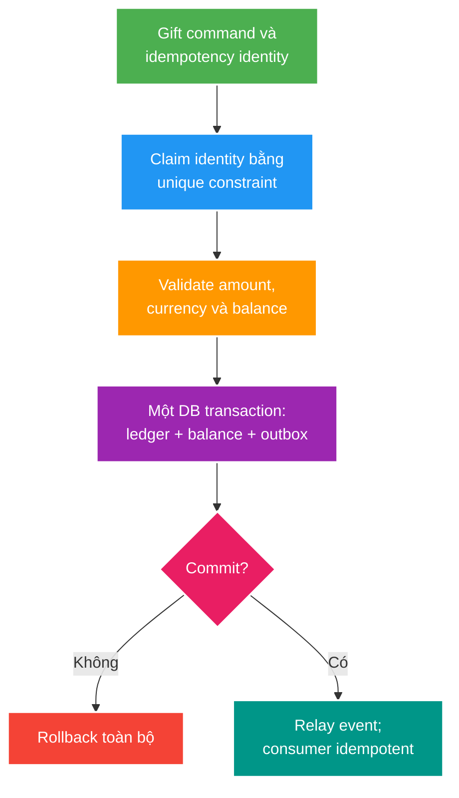

# Ledger, Lost Update và Money Invariants

> Type: `CORE` 
> Domain: `database` 
> Target depth: `D4 — thiết kế money flow chịu retry/concurrency, audit được và bảo vệ quyết định trước stakeholder` 
> Teaching readiness: `TEACHABLE_DRAFT` 
> Status: `DRAFT` 
> Evidence status: `NOT RUN` 
> Prerequisites: [isolation/locking core](isolation-locking-and-after-commit-consistency.md) 
> Related cases: roadmap owner `WAL-01`; [question bank](../../question-bank/ledger-lost-update-and-money-invariants.md) 
> Owner: `Project learner; Codex teaches, learner writes back` 
> Updated: `2026-07-26`

## 0. Cách dùng và vấn đề trung tâm

Balance là snapshot tiện đọc; ledger là lịch sử business effects có thể audit. Nếu chỉ `balance -= amount`, retry có thể trừ hai lần, concurrent writes có thể mất update, và incident không biết tiền đi đâu. Bài này dạy invariant trước schema. Đây là learning design cho gift/wallet simulation; không phải implementation hoặc bằng chứng tài chính production.

## 1. Invariants và từ vựng

**Ledger entry** là một effect bất biến sau khi posted; sửa sai bằng compensating entry, không edit lịch sử. **Idempotency key** định danh một logical command trong scope actor/operation. **Double-entry** ghi debit/credit cân bằng; tổng postings của một transaction bằng zero trong cùng currency/unit. **Available balance** và **book balance** có thể khác khi có holds/pending. Tiền dùng integer minor unit hoặc decimal có scale/rounding policy rõ, không dùng binary floating point.

Các invariant tối thiểu:

1. Một logical gift command tạo tối đa một business effect.
2. Không chi vượt policy tại điểm atomic write.
3. Ledger và materialized balance cùng commit hoặc cùng rollback.
4. Mọi effect truy vết được từ command/idempotency identity.
5. Event downstream không được biến thành effect tiền mới nếu replay.

## 2. Mental model cốt lõi

Câu cần nhớ: **idempotency bảo vệ command identity, constraint/transaction bảo vệ money invariant, ledger bảo vệ auditability**.

## 3. Cơ chế và worked examples

Request mang key K trong scope `(sender, operation)`. Database unique constraint claim K. Nếu lần đầu, transaction conditional-debit wallet, append ledger postings, update materialized balance nếu có và append outbox. Nếu duplicate, trả lại outcome đã lưu; không “chạy lại rồi hy vọng balance giống”. Cùng key nhưng payload khác phải conflict, vì reuse identity cho intent khác là bug/client abuse.

### 3.1. Lost update

Balance 100; hai gift 80 và 30 cùng đọc 100. Read-check-write ở application có thể cùng pass và ghi final sai/âm tùy interleaving. Conditional SQL `UPDATE ... SET balance=balance-:amount WHERE balance>=:amount` serialize trên row và trả affected count. Với nhiều accounts, lock/order IDs nhất quán hoặc dùng postings/constraint strategy phù hợp.

### 3.2. Retry sau timeout

DB commit thành công nhưng HTTP response mất. Client retry K. Không có durable idempotency record thì trừ lần hai. Có unique K + stored outcome, retry nhận cùng result. Idempotency record phải sống ít nhất bằng retry/reconciliation window; TTL ngắn tùy tiện làm resurrect duplicate.

### 3.3. Double-entry gift

Một gift 10 coins có thể debit sender wallet 10, credit creator receivable 10 (cùng unit), và separate fee postings nếu business định nghĩa. Sum postings per transaction bằng zero; materialized balances có thể rebuild/reconcile từ ledger. Nếu currencies khác, cần explicit FX transaction/rate/rounding; không cộng số khác currency vào cùng invariant.

Phản ví dụ: publish `GiftSent`, consumer trừ wallet. Broker redelivery chạy lại handler và trừ hai lần. Messaging at-least-once yêu cầu consumer dedup/business unique key; broker ack không phải money invariant.

## 4. Boundaries, failure modes và decisions

Unique idempotency key không đủ nếu ledger insert và balance update ở transactions khác. Transaction không đủ nếu key được check bằng `SELECT` rồi insert không có unique constraint. Ledger immutable không có nghĩa không thể sửa sai: append reversal liên kết original, giữ audit trail.

Hot wallet row tạo contention. Alternatives gồm serialize per wallet, shard balance buckets cho additive workload, reservation/hold workflow hoặc async ledger acceptance. Mỗi option đổi UX, overspend semantics và reconciliation; không hy sinh correctness chỉ để benchmark đẹp.

Reconciliation so sánh independently-derived values: ledger sum với balance snapshot, outbox published state với broker/consumer effect, external statement nếu có. Alert phải chỉ ra invariant delta và repair procedure. “Exactly once” không nên là lời hứa end-to-end; thiết kế thực tế là at-least-once delivery + idempotent effect + reconciliation.

## 5. Áp dụng, experiment và phỏng vấn

Khi `WAL-01` active, chạy 2–100 concurrent same/different keys, inject timeout sau commit, replay event và kiểm tra: unique business effects, non-negative policy, balanced postings, stable retry response. Record SQL constraints, final ledger/balance/outbox; hiện `NOT RUN`.

**30 giây:** “Tôi coi ledger là immutable audit history, balance là projection. Command có scoped idempotency key được unique constraint claim. Ledger, conditional balance update và outbox commit cùng transaction; retry trả stored outcome. Delivery có thể duplicate nên consumer idempotent và reconciliation kiểm tra invariant.”

Architect follow-up: multi-currency, holds, reversal/refund, hot account, retention/privacy, restore/reconciliation after DR.

## 6. Tóm tắt, bài tập và self-check

- Money bắt đầu từ invariant và identity, không từ controller.
- Application pre-check không chống race; constraint/conditional write mới chống tại owner boundary.
- Retry timeout là trạng thái “unknown outcome”, không phải chắc chắn failed.
- Ledger append-only cho audit; reversal sửa sai mà không xóa lịch sử.
- Balance là projection cần reconcile.
- Outbox đóng commit/publish gap nhưng vẫn có duplicates/lag.

> **Bài viết của tôi — `LEARNER TODO`:** kể lifecycle một gift từ command tới retry/event replay, nêu mọi invariant và owner.

1. **Question:** Idempotency key phải có scope và payload rule nào? 
   **Đọc lại nếu bí:** mục 1 và 3. 
   **Một câu trả lời tốt phải có:** logical identity, unique owner, same-key/same-outcome, payload mismatch và retention window. 
   **My answer:** `LEARNER TODO`
2. **Question:** Vì sao ledger và balance cùng tồn tại? 
   **Đọc lại nếu bí:** mục 0, 3.3 và 4. 
   **Một câu trả lời tốt phải có:** audit history, read projection, rebuild/reconcile, atomicity và reversal. 
   **My answer:** `LEARNER TODO`
3. **Question:** Chứng minh không double debit khi timeout/retry thế nào? 
   **Đọc lại nếu bí:** mục 3.2 và 5. 
   **Một câu trả lời tốt phải có:** failure injection, durable key/outcome, concurrent retries, ledger/balance assertions và event replay. 
   **My answer:** `LEARNER TODO`

## 7. Official references và teach-back

- [PostgreSQL 15 — Constraints](https://www.postgresql.org/docs/15/ddl-constraints.html)
- [PostgreSQL 15 — Transaction Isolation](https://www.postgresql.org/docs/15/transaction-iso.html)

- [ ] Tôi phát biểu được money invariants trước schema.
- [ ] Tôi xử lý retry unknown outcome.
- [ ] Tôi phân biệt ledger và balance projection.
- [ ] Tôi thiết kế duplicate delivery và reconciliation.
