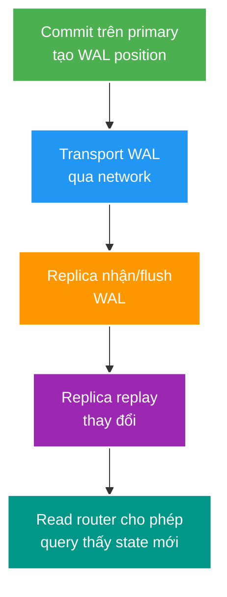

# Replica Lag và Read-Your-Writes

> Type: `CORE` 
> Domain: `database` 
> Target depth: `D4 — thiết kế read routing/consistency theo user journey, lag budget và failover behavior` 
> Teaching readiness: `TEACHABLE_DRAFT` 
> Status: `DRAFT` 
> Evidence status: `NOT RUN` 
> Prerequisites: PostgreSQL transaction/WAL cơ bản 
> Related cases: roadmap owner `DB-02`; [question bank](../../question-bank/replica-lag-and-read-your-writes.md) 
> Owner: `Project learner; Codex teaches, learner writes back` 
> Updated: `2026-07-26`

## 0. Vấn đề và mục tiêu học

Read replica tăng read capacity và isolation workload, nhưng replication bất đồng bộ tạo khoảng thời gian primary đã commit còn replica chưa replay. User vừa đổi title rồi refresh có thể thấy title cũ. “Eventual consistency” không phải câu trả lời UX; senior phải chọn consistency theo operation, đo lag nhiều chiều và có degradation/failover rule.

Bạn cần phân biệt write/flush/replay lag, read-your-writes (RYW), monotonic reads, synchronous replication trade-off và promotion data-loss boundary.

## 1. Mô hình tư duy cốt lõi

Câu cần nhớ: **commit acknowledgement và replica visibility là hai mốc khác nhau; routing phải mang consistency intent**.

## 2. Cơ chế và các mẫu thiết kế

Primary ghi WAL; standby nhận, ghi/flush và replay. Byte lag không trực tiếp bằng seconds: write rate thay đổi. Replay timestamp cũng không phản ánh tốt khi không có traffic. Theo dõi LSN positions, time, queue và user-visible staleness.

RYW patterns:

- Pin session/user/aggregate về primary trong bounded window sau write: đơn giản nhưng tăng primary load và cần shared routing state nếu multi-node.
- Trả commit LSN/version token; read chỉ tới replica đã replay ít nhất token, hoặc chờ bounded rồi fallback primary. Semantics mạnh hơn nhưng plumbing phức tạp.
- Route các critical reads (authorization, balance, immediate confirmation) luôn primary; analytics/feed tolerant reads tới replica.
- Optimistic UI/cache không thay consistency nếu quyết định business vẫn dựa stale state.

Synchronous replication có thể chờ standby ở configured level trước ack, giảm data-loss window nhưng tăng write latency/availability coupling. Nó không tự khiến mọi load-balanced read có session semantics và vẫn cần topology/failure policy.

## 3. Ví dụ phân tích và các kiểu hỏng

Creator update stream title commit ở primary; redirect GET ngẫu nhiên tới lagging replica trả old title. Fix phù hợp có thể là response chứa updated representation, primary pin cho creator journey hoặc LSN-aware routing. Sleep 500 ms là đoán và fail khi lag spike.

Authorization là phản ví dụ nguy hiểm: moderator ban user nhưng message path đọc replica stale và vẫn cho gửi. Security revocation cần primary/strong owner hoặc deny-safe cache protocol; replica throughput không đáng đổi lấy permission window không định nghĩa.

Replica replay có thể chậm vì I/O, long-running query/conflict, network hoặc WAL burst. Routing tiếp tục gửi traffic tạo stale/error amplification. Health gate cần lag threshold theo use case, fallback/circuit breaker và load-shedding để primary không sập vì toàn bộ read đổ về cùng lúc.

Failover: async standby có thể chưa nhận/replay WAL đã ack ở primary; promotion có RPO > 0. Client retries có thể tạo duplicate nếu old outcome unknown. Fencing ngăn old primary quay lại nhận write (split brain). Sau promotion cần xác minh timeline, data/invariants và reconfigure replicas, không chỉ thấy port mở.

## 4. Invariant và đánh đổi

- Mỗi read path tuyên bố consistency class và fallback.
- User không quan sát state quay ngược trong cùng critical journey nếu product yêu cầu monotonicity.
- Failover RPO/RTO là measured objective, không phải “có replica”.
- Router không gửi strong read tới replica chưa đạt required position.

Primary pin dễ triển khai nhưng giảm scale; LSN token chính xác hơn nhưng coupling DB semantics; sync replica giảm RPO nhưng ảnh hưởng p99/availability. Chọn theo business loss, read volume và topology.

## 5. Áp dụng, phỏng vấn và tự kiểm tra

Khi `DB-02` active, tạo delayed replica, đo commit→replay, chạy write-followed-by-read với các routing strategies, inject replica loss/promotion và ghi stale rate/p99/RPO. Hiện topology/evidence `NOT RUN`.

**30 giây:** “Replica async có transport/flush/replay lag nên commit ở primary chưa đồng nghĩa read thấy ngay. Tôi phân loại read: critical dùng primary hoặc LSN/version gate; tolerant dùng replica. Router có lag budget/fallback và failover phải xử lý RPO, retry/idempotency, fencing.”

> **Bài viết của tôi — `LEARNER TODO`:** thiết kế RYW cho update title và nêu vì sao authorization/balance cần rule khác.

1. **Question:** Sleep sau write có bảo đảm RYW không? 
   **Đọc lại nếu bí:** mục 2–3. 
   **Một câu trả lời tốt phải có:** variable lag, commit/replay positions, bound/fallback và token/pinning alternative. 
   **My answer:** `LEARNER TODO`
2. **Question:** Lag đo bằng gì? 
   **Đọc lại nếu bí:** mục 2. 
   **Một câu trả lời tốt phải có:** send/write/flush/replay LSN, time caveat, workload rate và user-visible staleness. 
   **My answer:** `LEARNER TODO`
3. **Question:** Failover thành công cần kiểm tra gì ngoài database start? 
   **Đọc lại nếu bí:** mục 3–4. 
   **Một câu trả lời tốt phải có:** RPO/timeline, fencing, routing, retries/idempotency, invariants và replica rebuild. 
   **My answer:** `LEARNER TODO`

## 6. Nguồn chính thức và trình bày lại

- [PostgreSQL 15 — Warm Standby](https://www.postgresql.org/docs/15/warm-standby.html)
- [PostgreSQL 15 — Monitoring Replication](https://www.postgresql.org/docs/15/monitoring-stats.html#MONITORING-PG-STAT-REPLICATION-VIEW)

- [ ] Tôi mô tả được WAL transport/flush/replay.
- [ ] Tôi phân loại strong và stale-tolerant reads.
- [ ] Tôi thiết kế lag fallback không overload primary.
- [ ] Tôi nối failover tới RPO và fencing.
