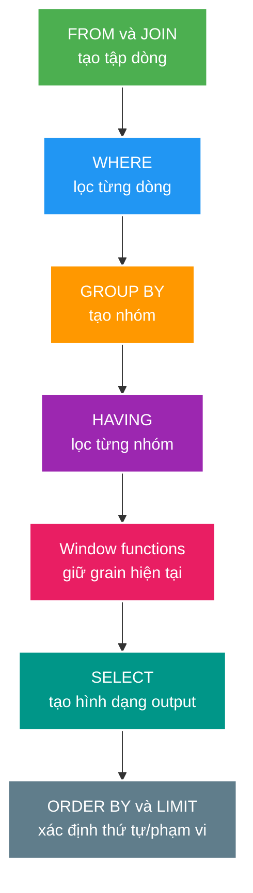

# SQL: JOIN, Aggregation, Window Function và CTE

> Type: `CORE`<br>
> Domain: `database`<br>
> Target depth: `D3 — đọc được yêu cầu, viết query đúng, giải thích logical processing và kiểm chứng bằng execution plan`<br>
> Teaching readiness: `TEACHABLE_DRAFT`<br>
> Status: `DRAFT`<br>
> Evidence status: `NOT RUN`<br>
> Prerequisites: mô hình bảng, primary/foreign key và SQL cơ bản<br>
> Related cases: roadmap owner `SQL-01`; [question bank](../../question-bank/sql-joins-aggregation-window-and-cte.md)<br>
> Owner: `Project learner; Codex teaches, learner writes back`<br>
> Updated: `2026-07-26`

## 0. Cách dùng tài liệu này

Đọc từ câu hỏi dữ liệu tới pipeline logic, sau đó tự chạy lại hai ví dụ bằng giấy trước khi nhìn kết quả. Mục tiêu không phải thuộc cú pháp mà là biết mỗi operator làm thay đổi **số dòng, hình dạng dòng và meaning** như thế nào. Tài liệu dùng PostgreSQL 15 làm baseline; chưa có query nào được chạy trên project nên evidence vẫn `NOT RUN`.

## 1. Vì sao topic này tồn tại?

Một báo cáo “top livestream theo doanh thu” có thể trả số tiền gấp nhiều lần thực tế chỉ vì join hai quan hệ one-to-many trước khi `SUM`. Một `LEFT JOIN` có thể vô tình biến thành `INNER JOIN` vì predicate đặt trong `WHERE`. Window function có thể giải bài toán xếp hạng mà vẫn giữ từng dòng, còn `GROUP BY` làm co nhiều dòng thành một nhóm. Nếu chỉ nhớ syntax, developer thường sửa query tới khi sample data “trông đúng”; senior phải phát biểu grain, invariant và chứng minh trên edge cases.

SQL diễn tả kết quả mong muốn. Optimizer được quyền chọn join order và physical operator khác cú pháp, miễn giữ semantics. Vì vậy logical processing dùng để reasoning correctness; execution plan dùng để reasoning cost. Hai việc này liên quan nhưng không thay thế nhau.

## 2. Mục tiêu học và từ vựng

Sau bài này, bạn có thể:

1. Phát biểu grain của input/output và chọn `JOIN`, aggregation, window hay subquery đúng mục đích.
2. Phân biệt filter trước/sau grouping và filter ở `ON`/`WHERE` với outer join.
3. Tránh fan-out, nondeterministic pagination/ranking và CTE bị dùng như “mẹo tối ưu”.
4. Dùng `EXPLAIN (ANALYZE, BUFFERS)` để kiểm tra estimate, actual rows và I/O thay vì đoán.

**Grain** là “mỗi dòng đại diện cho gì”. **Cardinality** là số dòng. **Fan-out** là một dòng phía trái ghép nhiều dòng phía phải. **Aggregate** co nhiều dòng thành một dòng mỗi group. **Window function** tính trên một cửa sổ nhưng giữ grain của input. **CTE** (`WITH`) đặt tên một query trung gian; nó chủ yếu là công cụ cấu trúc/semantics, không mặc định là nhanh hơn.

## 3. Mô hình tư duy cốt lõi

Hãy reasoning theo logical pipeline sau, dù optimizer có thể thực thi vật lý theo thứ tự khác:



Câu cần nhớ: **xác định grain trước, theo dõi cardinality sau mỗi bước, rồi mới tối ưu plan**.

## 4. Cơ chế và lựa chọn

### 4.1. JOIN và predicate

`INNER JOIN` chỉ giữ cặp khớp. `LEFT JOIN` giữ toàn bộ dòng trái và điền `NULL` khi không khớp. Với outer join, predicate trong `ON` quyết định dòng phía phải nào được ghép; predicate trên cột phải trong `WHERE` loại cả dòng `NULL`, thường làm mất ý nghĩa “giữ toàn bộ bên trái”.

`EXISTS` phù hợp khi câu hỏi là “có ít nhất một dòng liên quan không?” vì nó không nhân bản dòng trái. `JOIN` phù hợp khi cần cột hoặc aggregate của phía liên quan. Không dùng `DISTINCT` như băng dính che fan-out: nó có thể che bug và thêm sort/hash tốn kém.

### 4.2. Aggregation

`WHERE` lọc raw rows trước grouping; `HAVING` lọc group sau aggregate. Mọi biểu thức output không aggregate phải được xác định bởi group key theo rule của DB. `COUNT(*)` đếm dòng; `COUNT(column)` bỏ `NULL`; `COUNT(DISTINCT x)` đếm giá trị khác nhau và thường đắt hơn.

Khi join nhiều one-to-many, aggregate từng nhánh về đúng grain trước rồi join các kết quả. Đây là cách bảo vệ invariant tổng tiền/số lượt không bị cross-product.

### 4.3. Window function

`PARTITION BY` chia cửa sổ logic; `ORDER BY` định nghĩa thứ tự trong mỗi partition; frame định nghĩa các dòng tham gia phép tính tại dòng hiện tại. `row_number()` luôn đánh số duy nhất theo thứ tự đã cho; `rank()` để khoảng trống khi hòa; `dense_rank()` không để khoảng trống. Nếu `ORDER BY` không có tie-breaker ổn định, kết quả giữa các execution có thể đổi.

### 4.4. CTE và subquery

CTE giúp tách stage, tái sử dụng result và diễn đạt recursive query. Trên PostgreSQL hiện đại, non-recursive side-effect-free CTE dùng một lần có thể được inline; `MATERIALIZED`/`NOT MATERIALIZED` ảnh hưởng optimization boundary. Đừng dựa vào folklore “CTE luôn materialize”; xem plan của đúng PostgreSQL version.

## 5. Ví dụ phân tích từng bước

### 5.1. Top 3 stream mỗi creator theo viewer peak

```sql
SELECT creator_id, stream_id, peak_viewers
FROM (
    SELECT creator_id, stream_id, peak_viewers,
           row_number() OVER (
               PARTITION BY creator_id
               ORDER BY peak_viewers DESC, stream_id
           ) AS rn
    FROM livestream
) ranked
WHERE rn <= 3;
```

Input grain là một stream. Window giữ nguyên grain và gắn số thứ tự trong từng creator. Tie-breaker `stream_id` làm kết quả ổn định. `GROUP BY creator_id` không dùng được nếu vẫn cần ba dòng stream cụ thể.

### 5.2. Doanh thu và số viewer không bị nhân chéo

Giả sử một stream có 2 gift và 3 viewer sessions. Join cả hai bảng rồi aggregate tạo 6 dòng, khiến tổng gift bị nhân ba. Sửa bằng cách pre-aggregate:

```sql
WITH gift_total AS (
    SELECT stream_id, sum(amount) AS revenue
    FROM gift GROUP BY stream_id
), viewer_total AS (
    SELECT stream_id, count(*) AS sessions
    FROM viewer_session GROUP BY stream_id
)
SELECT s.id, coalesce(g.revenue, 0), coalesce(v.sessions, 0)
FROM livestream s
LEFT JOIN gift_total g ON g.stream_id = s.id
LEFT JOIN viewer_total v ON v.stream_id = s.id;
```

Mỗi CTE trả đúng một dòng/stream, nên join cuối không fan-out. `coalesce` biến “không có dòng aggregate” thành zero theo business meaning.

### 5.3. Phản ví dụ outer join

`LEFT JOIN gift g ... WHERE g.status = 'PAID'` loại stream không có gift. Nếu mục tiêu vẫn liệt kê stream rỗng, predicate phải nằm trong `ON` hoặc trong pre-aggregation. Symptom là tổng số stream giảm; evidence là so sánh row count và sample không có match.

## 6. Invariant, các kiểu hỏng và đánh đổi

- Trước mỗi aggregate phải biết mỗi dòng đại diện cho gì; nếu không, phép tổng không có meaning đáng tin.
- Query trả page phải có total order ổn định; `ORDER BY created_at` chưa đủ nếu timestamp trùng.
- `NULL` nghĩa “unknown/missing”, không tự động bằng zero hoặc empty string; conversion là quyết định business.
- Correct query trên sample nhỏ chưa chứng minh scale; plan estimate sai, sort spill hoặc nested loop hàng triệu vòng cần runtime evidence.

Failure phổ biến: statistics cũ hoặc predicate correlated làm optimizer ước lượng sai. Trigger là data distribution lệch; mechanism là chọn join/scan dựa trên estimated rows; symptom là actual rows lệch nhiều lần và I/O/loop tăng; chứng minh bằng `EXPLAIN (ANALYZE, BUFFERS)`; xử lý có thể là cập nhật statistics, viết predicate rõ hơn, index đúng hoặc đổi query shape. Không “fix” mặc định bằng hint vì PostgreSQL core không dùng hint như một số DB khác và workload sẽ đổi.

## 7. Áp dụng vào dự án

Khi `SQL-01` active, chọn một query báo cáo livestream có ít nhất hai one-to-many relations. Ghi grain sau từng CTE/join, tạo dataset có zero/one/many và ties, rồi capture SQL + plan + result. Chỉ sau correctness mới so sánh index/query alternatives. Hiện chưa chọn query và chưa có plan thật.

## 8. Góc nhìn phỏng vấn

**30 giây:** “Tôi bắt đầu từ grain và logical processing. JOIN thay cardinality, GROUP BY co dòng, window giữ grain. Với outer join tôi phân biệt predicate ở ON/WHERE; với nhiều one-to-many tôi pre-aggregate để tránh fan-out. Sau khi query đúng, tôi dùng EXPLAIN ANALYZE BUFFERS để so estimate, actual rows và I/O.”

**Senior 2 phút:** thêm ví dụ fan-out, deterministic ordering, distinction logical/physical plan và cách chứng minh plan regression trên production-like data.

Follow-up thường gặp: `WHERE` với `HAVING`; `rank` với `dense_rank`; keyset với offset; CTE materialization; vì sao `DISTINCT` che bug.

## 9. Tóm tắt cô đọng

- Grain là điểm bắt đầu của correctness.
- Outer join nhạy với vị trí predicate.
- Pre-aggregate mỗi nhánh one-to-many trước khi ghép tổng.
- Window tính trên tập dòng mà không làm mất chi tiết.
- Ordering cần tie-breaker nếu kết quả phải ổn định.
- CTE là cấu trúc query; optimization behavior phải xem version và plan.
- Plan chỉ đáng tin khi đọc cả estimate, actual rows, loops và buffers.

## 10. Bài tập diễn đạt lại — phần của tôi

> **Bài viết của tôi — `LEARNER TODO`:** dùng ví dụ revenue/viewer, viết 10–15 câu mô tả grain, pipeline, fan-out, cách sửa và cách kiểm chứng.

## 11. Tự kiểm tra có hướng dẫn

1. **Question:** Vì sao join gift và viewer session có thể làm sai `SUM(amount)`?<br>
   **Đọc lại nếu bí:** mục 4.2 và 5.2.<br>
   **Một câu trả lời tốt phải có:** grain, cardinality, cross-product, pre-aggregation và edge-case zero rows.<br>
   **My answer:** `LEARNER TODO`
2. **Question:** Khi nào predicate của bảng phải nằm trong `ON` thay vì `WHERE`?<br>
   **Đọc lại nếu bí:** mục 4.1 và 5.3.<br>
   **Một câu trả lời tốt phải có:** outer-row preservation, null-extended row và business intent.<br>
   **My answer:** `LEARNER TODO`
3. **Question:** Plan chậm cần thu evidence gì?<br>
   **Đọc lại nếu bí:** mục 6.<br>
   **Một câu trả lời tốt phải có:** representative data, estimate/actual, loops, buffers, sort spill và repeatability.<br>
   **My answer:** `LEARNER TODO`

## 12. Nguồn chính thức và trình bày lại

- [PostgreSQL 15 — Queries](https://www.postgresql.org/docs/15/queries.html)
- [PostgreSQL 15 — Window Functions](https://www.postgresql.org/docs/15/tutorial-window.html)
- [PostgreSQL 15 — Using EXPLAIN](https://www.postgresql.org/docs/15/using-explain.html)

- [ ] Tôi phát biểu grain trước khi viết query.
- [ ] Tôi giải thích được fan-out và outer-join predicate.
- [ ] Tôi chọn đúng aggregate/window/CTE theo output grain.
- [ ] Tôi không tuyên bố performance khi evidence vẫn `NOT RUN`.
