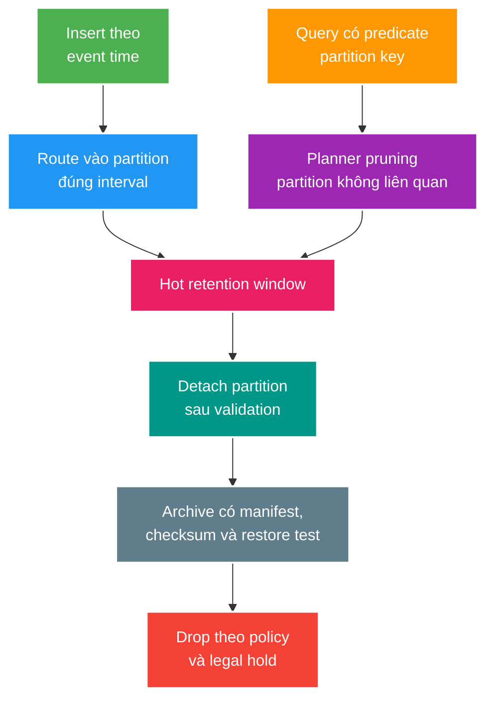

# Partition dữ liệu theo thời gian, retention và archive

> Type: `CORE` 
> Domain: `database` 
> Target depth: `D4 — thiết kế lifecycle dữ liệu lớn theo access, retention, legal/audit và operational recovery` 
> Teaching readiness: `TEACHABLE_DRAFT` 
> Status: `DRAFT` 
> Evidence status: `NOT RUN` 
> Prerequisites: indexing, query plan và migration 
> Related cases: roadmap owner `DB-03`; [question bank](../../question-bank/time-partitioning-retention-and-archive.md) 
> Owner: `Project learner; Codex teaches, learner writes back` 
> Updated: `2026-07-26`

## 0. Vấn đề và mục tiêu học

Event/chat/audit tables tăng theo thời gian. Xóa hàng triệu rows từng dòng tạo WAL/bloat; index/backup/vacuum nặng; nhưng partitioning sai key chỉ tạo thêm complexity. Partitioning chia table logic thành physical partitions; pruning giảm phần phải scan khi predicate khớp partition key. Retention quyết định khi nào dữ liệu hết giá trị; archive chuyển dữ liệu sang tier khác với contract truy xuất/restore.

Sau bài này, bạn chọn key/interval, giải thích pruning/unique constraint boundary, thiết kế detach–archive–drop và tránh over-partitioning.

## 1. Mô hình tư duy cốt lõi

Câu cần nhớ: **partition boundary phải khớp query và data lifecycle; archive chỉ tồn tại khi restore đã được chứng minh**.

## 2. Cơ chế và ví dụ

Range partition theo `created_at` ngày/tháng phù hợp retention time-based. Interval quá nhỏ tạo hàng nghìn tables, planning/catalog/maintenance cost; quá lớn làm hot indexes và drop unit lớn. Chọn từ ingestion volume, common time range, maintenance/RPO và legal unit.

Partition pruning cần predicate suy ra partition bounds. Bọc column bằng function/cast không phù hợp hoặc thiếu time predicate có thể scan nhiều partitions. Mỗi partition vẫn cần indexes theo local query. Primary/unique constraint trên partitioned table thường phải gồm partition key để PostgreSQL bảo đảm uniqueness toàn partitions; global business identity có thể cần model/guard table khác.

### 2.1. Chat events 90 ngày

Partition tháng theo `created_at`; query luôn `stream_id` + time range, mỗi partition index `(stream_id, created_at, id)`. Tạo partitions tương lai trước, có default partition/alert cho routing lỗi tùy policy. Sau 90 ngày, detach partition đủ cũ, verify range/count/checksum, export object storage với manifest, test sample/full restore path, rồi drop sau legal/safety window.

### 2.2. Dữ liệu đến muộn

Event tới muộn sau partition đã detach. Policy phải rõ: reject/quarantine, reopen/import, hay route correction partition. Nếu silently insert default partition, retention và query correctness drift. Event time và ingestion time có meaning khác; chọn partition key theo owner lifecycle.

### 2.3. Phản ví dụ: mỗi stream một partition

Hàng triệu livestream tạo hàng triệu partitions, catalog/planning/migration không chịu nổi. Partitioning không thay index/multi-tenancy. Hash buckets hoặc time range + stream index thường bounded hơn; quyết định cần volume evidence.

## 3. Các kiểu hỏng và đánh đổi

Missing future partition làm insert fail đúng lúc chuyển ngày/tháng; cần scheduled creation + alert. Retention job drop sai timezone/boundary gây data loss; compute cutoff theo UTC/business rule, dry-run manifest và approval. Archive file tồn tại nhưng schema/key/version bị mất thì không query/restore được; lưu manifest, schema, encryption key lifecycle, checksum và restore drill.

Partitioning cải thiện maintenance/drop/pruning, không mặc định tăng mọi query. Query không có partition predicate có thể tệ hơn. Native detach/drop nhanh hơn row delete nhưng lock/foreign-key/dependency cần rehearsal. Legal hold có thể override retention; policy phải lọc đúng partitions/records và audit decision.

## 3.1. Hai ví dụ phân tích và một phản ví dụ

**Worked example tối thiểu — pruning:** bảng partition theo `created_at`; predicate range `[start,end)` cùng timezone giúp planner prune partitions. Bọc key bằng function hoặc filter cột khác có thể scan mọi child, nên phải chứng minh bằng `EXPLAIN`.

**Worked example gần project — archive chat tháng:** pre-create partition, detach sau cutoff/legal hold, export manifest có bounds/schema/rows/checksum/key owner, restore-verify vào isolated schema rồi mới drop theo approval/deletion ledger.

**Phản ví dụ:** chia table nhỏ thành partition ngày vì “query nhanh hơn”. Hàng nghìn relations tăng planning/maintenance, query không filter key vẫn scan rộng và retention/late-event semantics chưa được giải quyết.

## 4. Áp dụng, phỏng vấn và tự kiểm tra

Khi `DB-03` active, model event volume, query windows, partition count/size; chạy plan pruning, insert boundary/late event, detach/archive/restore và retention dry-run. Hiện volume/evidence `NOT RUN`.

**30 giây:** “Tôi partition khi access và lifecycle cùng theo key, thường time range cho event data. Tôi chọn interval từ volume/query/maintenance, kiểm tra pruning và local indexes. Retention dùng detach–validate–archive–restore-test–drop; legal hold và late events có policy riêng.”

> **Bài viết của tôi — `LEARNER TODO`:** thiết kế lifecycle chat event 90 ngày gồm key, interval, indexes, late event và archive restore.

1. **Question:** Khi nào partitioning không giúp? 
   **Đọc lại nếu bí:** mục 2–3. 
   **Một câu trả lời tốt phải có:** predicate mismatch, low volume, too many partitions, missing local indexes và operational cost. 
   **My answer:** `LEARNER TODO`
2. **Question:** Vì sao unique key có thể phải chứa partition key? 
   **Đọc lại nếu bí:** mục 2. 
   **Một câu trả lời tốt phải có:** local partitions, global uniqueness limitation, business identity và alternative owner. 
   **My answer:** `LEARNER TODO`
3. **Question:** Archive được coi là hoàn thành khi nào? 
   **Đọc lại nếu bí:** mục 2.1 và 3. 
   **Một câu trả lời tốt phải có:** manifest/checksum/schema/key, query/restore drill, policy/legal hold và deletion gate. 
   **My answer:** `LEARNER TODO`

## 5. Nguồn chính thức và trình bày lại

- [PostgreSQL 15 — Table Partitioning](https://www.postgresql.org/docs/15/ddl-partitioning.html)

- [ ] Tôi chọn partition key từ query/lifecycle.
- [ ] Tôi giải thích pruning và uniqueness boundary.
- [ ] Tôi có late-event/future-partition policy.
- [ ] Tôi không gọi file chưa restore-tested là archive hoàn chỉnh.
