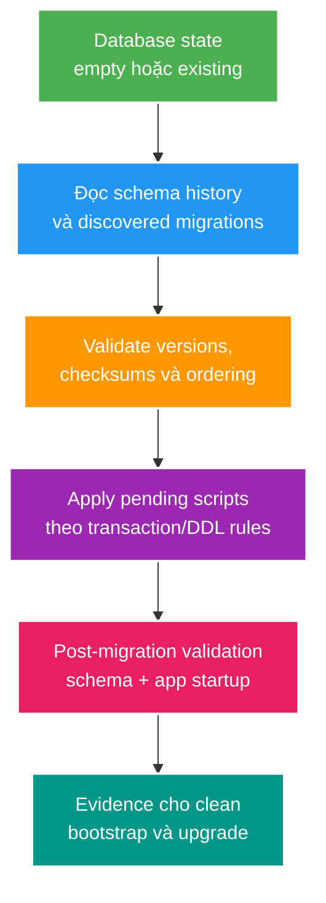

# Versioned Schema Migration với Flyway

> Type: `CORE` 
> Domain: `database` 
> Target depth: `D3 — thiết kế bootstrap/migration deterministic, phân biệt baseline/repair/clean và chẩn đoán schema drift` 
> Teaching readiness: `TEACHABLE_DRAFT` 
> Status: `DRAFT` 
> Evidence status: `NOT RUN` 
> Prerequisites: SQL DDL và [expand–contract](expand-contract-schema-migration.md) 
> Related cases: roadmap owner `MIG-01`; [question bank](../../question-bank/flyway-baseline-and-clean-bootstrap.md) 
> Owner: `Project learner; Codex teaches, learner writes back` 
> Updated: `2026-07-26`

## 0. Cách dùng và vấn đề trung tâm

Schema phải tái tạo được từ version control trên database rỗng và nâng cấp được từ mọi supported state. `ddl-auto=update` hoặc database cá nhân chạy được không chứng minh điều đó. Flyway duy trì schema history và áp migrations theo thứ tự, nhưng tool không tự biến script phá hoại thành an toàn. Project chưa pin/validate Flyway path trong batch này; mọi execution evidence `NOT RUN`.

## 1. Learning objectives và từ vựng

**Versioned migration** chạy một lần theo version và checksum. **Repeatable migration** chạy lại khi checksum đổi, thường dùng view/function/reference artifact phù hợp. **Schema history** ghi installed rank, version, checksum, state. **Baseline** đánh dấu một database hiện hữu bắt đầu được quản lý từ version nào; nó không chạy/kiểm chứng toàn bộ lịch sử trước đó. **Repair** sửa metadata history cho tình huống đã điều tra; không tự sửa schema. **Clean** xóa objects trong configured schemas và là destructive operation, thường phải disabled ngoài disposable local/test.

Sau bài này, bạn thiết kế clean bootstrap, upgrade path, checksum policy và startup gate; biết khi nào baseline là adoption decision chứ không phải chữa migration fail.

## 2. Mental model cốt lõi

Câu cần nhớ: **history cho biết Flyway đã ghi nhận gì; schema assertion và clean/upgrade rehearsal mới chứng minh database đúng**.

## 3. Cơ chế và worked examples

Khi migrate, Flyway scan configured locations, so history với files, validate checksum/order và chạy pending migrations. Sau khi một versioned migration đã chia sẻ, không sửa file để “làm đẹp”; tạo migration mới. Sửa checksum bằng repair mà không hiểu production state làm các môi trường mang cùng version nhưng schema khác nhau.

### 3.1. Clean bootstrap

Tạo PostgreSQL 15 hoàn toàn mới, không schema residue; chạy migrations; validate constraints/indexes/extensions/reference data cần thiết; start application với Hibernate validation, rồi chạy smoke query. Đây bắt được dependency vào hand-written SQL hoặc local `ddl-auto`. Database “empty tables” nhưng còn types/extensions/schemas không phải clean bootstrap.

### 3.2. Existing database adoption

Database legacy đã có schema tương đương V10. Baseline at 10 chỉ ghi marker để V11+ chạy; phải audit schema legacy thực sự khớp expected V10. Nếu hai môi trường legacy khác nhau, cùng baseline tạo false confidence. Có thể cần reconciliation migration/validation trước adoption.

### 3.3. Failure giữa migration

PostgreSQL hỗ trợ transactional DDL cho nhiều lệnh nhưng không phải mọi operation/migration pattern có cùng behavior. Script fail cần đọc history state và actual schema trước retry. Không chạy `repair`/xóa row history theo phản xạ. Migration lớn nên tách DDL/data, idempotent-resumable backfill và expand-contract.

## 4. Invariants, failure modes và trade-offs

- Version control là source của intended schema; manual hotfix phải được đưa trở lại migration/reconciliation.
- CI phải test cả empty bootstrap và upgrade từ supported previous version.
- Production startup không nên để mọi replica cùng tranh migration lock; ownership/deployment gate phải rõ.
- Credentials chạy migration có thể mạnh hơn app runtime; tách quyền giảm blast radius.

Startup auto-migrate tiện cho single instance nhưng khó kiểm soát rolling fleet/long DDL. Dedicated migration job cho gate/observability tốt hơn nhưng pipeline phức tạp. Repeatable scripts tiện cho views nhưng checksum change chạy lại và cần dependency order. Chọn convention rồi kiểm chứng, không trộn `schema.sql`, Hibernate create/update và Flyway như nhiều owners.

## 5. Áp dụng và phỏng vấn

Khi `MIG-01` active, pin Flyway version tương thích Spring Boot, inventory schema creation paths, tạo matrix empty/current/previous/dirty DB và capture history + schema assertions. Không dùng `clean` trên shared database. Hiện case chưa active.

**30 giây:** “Flyway biến migration files thành ordered, checksummed history. Tôi không sửa versioned migration đã phát hành; baseline chỉ adopt existing schema sau audit, repair chỉ sửa metadata sau điều tra, clean là destructive. CI phải chứng minh cả clean bootstrap và upgrade, còn production dùng migration ownership/gate rõ.”

## 6. Tóm tắt, bài tập và self-check

- Migration history không thay schema validation.
- Baseline đánh dấu điểm bắt đầu, không dựng lịch sử cũ.
- Repair không sửa object/data drift.
- Clean bootstrap và upgrade là hai test khác nhau.
- Một schema nên có một automation owner.
- Migration production cần lock/load/rollback-aware rollout.

> **Bài viết của tôi — `LEARNER TODO`:** mô tả bootstrap database rỗng và adoption database legacy; chỉ rõ baseline/validate/repair khác nhau.

1. **Question:** Baseline giải quyết gì và không giải quyết gì? 
   **Đọc lại nếu bí:** mục 1 và 3.2. 
   **Một câu trả lời tốt phải có:** existing schema adoption, marker/version, audit equivalence và drift risk. 
   **My answer:** `LEARNER TODO`
2. **Question:** Vì sao startup pass chưa chứng minh migration chain đúng? 
   **Đọc lại nếu bí:** mục 2–4. 
   **Một câu trả lời tốt phải có:** residue/manual state, history vs schema, clean bootstrap, upgrade path và assertions. 
   **My answer:** `LEARNER TODO`
3. **Question:** Migration fail có nên repair ngay không? 
   **Đọc lại nếu bí:** mục 3.3. 
   **Một câu trả lời tốt phải có:** inspect history/schema, transactional boundary, root cause, retry/reconciliation và approval. 
   **My answer:** `LEARNER TODO`

## 7. Official references và teach-back

- [Spring Boot — Database Initialization](https://docs.spring.io/spring-boot/how-to/data-initialization.html)
- [Flyway documentation](https://documentation.red-gate.com/fd)

- [ ] Tôi phân biệt migrate, validate, baseline, repair và clean.
- [ ] Tôi thiết kế cả bootstrap và upgrade tests.
- [ ] Tôi biết migration ownership trong multi-instance deployment.
- [ ] Tôi không dùng destructive command ngoài disposable environment.

