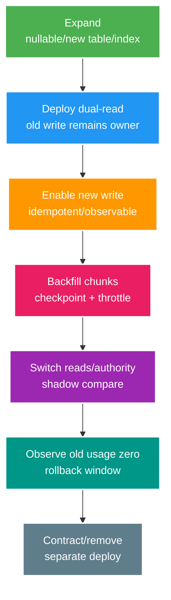

# Phân tích chuyên sâu: Expand–contract, backfill, ghi kép và rollback an toàn

> Type: `DEEP_DIVE` 
> Domain: `database` 
> Target depth: `D4 — migrate schema online qua mixed versions/backfill và recover partial/corrupt change` 
> Teaching readiness: `TEACHABLE_DRAFT` 
> Status: `DRAFT` 
> Evidence status: `NOT RUN` 
> Prerequisites: [Expand-contract core](../core/expand-contract-schema-migration.md) 
> Related cases: `DB-05`; [question bank](../../question-bank/expand-contract-schema-migration.md) 
> Owner: `Project learner; Codex teaches, learner writes back` 
> Updated: `2026-07-26`

## 1. Migration là một giao thức tương thích

Trong rolling deployment, instance cũ, instance mới và schema chuyển tiếp cùng tồn tại. Giai đoạn **expand** thêm cấu trúc mà code cũ có thể bỏ qua và code mới có thể đọc. Sau đó lần lượt triển khai reader/writer tương thích, backfill dữ liệu cũ, chuyển nguồn sự thật, quan sát đủ lâu, rồi **contract** mới xóa cấu trúc cũ. Xóa chỉ được thực hiện sau cửa sổ rollback và bằng chứng không còn ai sử dụng.

## 2. Khóa và việc ghi lại bảng khi chạy DDL

Hành vi phụ thuộc đúng phiên bản PostgreSQL và đúng câu DDL. Thêm column, default, `NOT NULL`, index hoặc đổi type có thể lấy lock, scan hay ghi lại table. Phải đọc tài liệu theo phiên bản và thử trên table đại diện. Đặt lock/statement timeout để migration thất bại có kiểm soát thay vì chờ rồi chặn production, đồng thời quan sát blocker. `CREATE INDEX CONCURRENTLY` giảm thời gian chặn writer nhưng chạy lâu hơn, tốn tài nguyên, có thể để lại index invalid và có ràng buộc transaction. Khi PostgreSQL hỗ trợ, tạo constraint `NOT VALID` rồi validate riêng giúp tách tác động.

Không trộn backfill dài vào cùng transaction của schema migration. Cần kiểm chính xác DDL nào transactional và Flyway đang nhóm transaction thế nào; không suy đoán từ việc một migration trước đó đã chạy được.

## 3. Quy trình backfill dữ liệu cũ

Backfill nên đi theo khoảng key ổn định và chunk nhỏ, chỉ update row còn thiếu hoặc cũ, ghi checkpoint durable và có thể pause/resume. Tránh `OFFSET` vì dữ liệu thay đổi làm phạm vi trượt và chi phí tăng. Writer mới phải điền field mới; backfill dùng predicate/version để không ghi đè giá trị vừa được user cập nhật. Theo dõi số row còn lại, lỗi, tốc độ, ETA và tác động lên vacuum, WAL, index cùng replica lag để throttle.

Ghi kép ở application có thể lệch nếu hai statement không cùng database transaction hoặc instance cũ chỉ ghi cột cũ. Ưu tiên một transaction trong cùng database, giá trị dẫn xuất ở database/trigger tạm thời, hoặc mapping một owner duy nhất. Mỗi phase phải chỉ rõ field nào là nguồn sự thật và có query đối soát. Trigger che một write path và tăng tải, nên phải có telemetry cùng ngày gỡ bỏ.

## 4. Tương thích và rollback

Code cũ phải chịu được column/table/index mới; code mới phải chịu được giá trị thiếu cho tới khi backfill xong. Nếu writer mới dừng ghi cột cũ quá sớm, rollback về binary cũ sẽ đọc dữ liệu stale. Vì vậy phải duy trì write tương thích suốt cửa sổ rollback hoặc quyết định chỉ roll-forward. Bước contract/phá hủy chỉ đến sau khi không còn binary, job, report hay reader cũ và đã xác minh đường backup/restore.

Với enum, đổi type hoặc rename, hãy thêm column/value mapping mới, đọc/ghi tương thích, backfill rồi mới chuyển. Không rename/drop ngay trong một lần deploy. Event, cache và export cũng là consumer schema cần migration. Database view có thể làm lớp tương thích tạm thời nhưng phải có owner và ngày hết hạn.

## 5. Các kịch bản hỏng

DDL chờ lock có thể xếp hàng request phía sau; phải xác định đúng blocker trước khi cancel transaction hay migration. Nếu backfill làm hỏng dữ liệu, dừng job và write path liên quan, xác định checkpoint/version/row bị ảnh hưởng, rồi restore từ nguồn hoặc chạy compensating update có dry-run và audit; không vội restore toàn database. Index tạo dở bị invalid cần inspect rồi drop/recreate an toàn. Khi hai field lệch, giải quyết theo source-of-truth đã định cho phase và query đối soát, không chọn timestamp mới nhất một cách ngây thơ.

Khi migration đã apply nhưng code rollback, checksum và history vẫn còn. Không sửa file migration đã chạy; hãy tạo migration sửa tiếp về phía trước.

## 6. Kế hoạch tạo bằng chứng

Lab phải có schema và dữ liệu đại diện, ma trận binary cũ/mới, tải ghi đồng thời và phép đo lock, thời gian DDL, WAL, replica lag. Chủ động kill/restart backfill, rollback binary ở từng phase và chạy đối soát. Ghi lại PostgreSQL, Flyway, JPA version cùng SQL thật. Bằng chứng hiện `NOT RUN`.

### 6.1. Pathology A — thêm `NOT NULL DEFAULT` chặn traffic hoặc rewrite ngoài dự kiến

Một migration tưởng là “chỉ thêm cột” có thể giữ lock không tương thích đủ lâu vì transaction đang chạy, table size, default expression hoặc PostgreSQL version. DDL chờ lock cũng có thể nằm trước các queries khác trong queue, tạo outage dây chuyền. Không được suy từ syntax rằng operation online.

Phase an toàn thường là add nullable/metadata-safe column với lock timeout, deploy code chấp nhận cả old/new, backfill riêng rồi validate và tighten constraint. Exact fast-default/rewrite behavior phải kiểm theo PostgreSQL version và expression. Staging nhỏ không đại diện lock wait; test cần representative schema/data và concurrent long transaction.

### 6.2. Pathology B — dual-write tạo hai nguồn sự thật

Trong migration tách `full_name` thành fields, code mới ghi cả old/new nhưng code cũ chỉ ghi old. Backfill chạy song song có thể đọc old value cũ rồi overwrite new value vừa được user cập nhật. Nếu hai writes ở khác resource hoặc không cùng transaction, partial failure làm columns lệch.

Phải chỉ định source-of-truth theo phase. Backfill dùng monotonic key/chunk, conditional predicate/version để không overwrite newer data và checkpoint durable. Reconciliation đo mismatch theo bounded query. Nếu cần dual-write, write path chính chịu trách nhiệm atomicity; read path có fallback/compare telemetry nhưng không âm thầm ưu tiên ngẫu nhiên.

### 6.3. Pathology C — rollback binary nhưng schema contract đã bị phá

Team deploy code mới, drop old column ngay khi canary khỏe, rồi cần rollback application. Binary cũ không start hoặc query fail vì column đã mất. Rollback compatibility phải tồn tại qua cả deployment window, queue/job cũ, reporting consumer và cache payload—not just currently running pods.

Contract phase chỉ chạy khi evidence cho thấy không còn reads/writes cũ qua một retention/rollback horizon đã định. Destructive change cần backup/restore hoặc explicit irreversibility decision. Rollback thường là rollback code trong compatible schema, không rollback data bằng cách đảo migration mù.

## 6.4. Ai sở hữu từng giai đoạn và điều kiện thoát

Mỗi phase cần owner, invariant và exit evidence:

1. **Expand:** schema mới additive; old binary vẫn chạy; lock/rewrite được đo.
2. **Compatible write/read:** code hỗ trợ schema transition; source of truth rõ; telemetry mismatch bật.
3. **Backfill:** bounded/resumable/idempotent; rate theo DB/WAL/replica budget; kill/restart không mất progress.
4. **Validate:** constraints/checksums/business samples; old/new app matrix và background consumers pass.
5. **Contract:** chỉ xóa sau usage zero + rollback horizon + approval; monitor errors/lag.

JPA schema validation, Flyway history và application rollout là ba mechanisms khác nhau. `ddl-auto` không thay migration protocol. Cache/search/CDC/outbox có schema/payload lifecycle riêng và cần compatibility mapping.

## 6.5. Thí nghiệm và hàng rào an toàn khi vận hành

Lab clone representative data distribution, giữ một transaction để quan sát lock acquisition, chạy DDL với bounded timeout và đo WAL/replica lag. Backfill phải bị kill giữa chunk rồi resume; chèn concurrent update để test stale overwrite. Chạy old/new binary combinations trước, trong và sau backfill. Rollback binary tại mỗi phase và ghi phase nào không còn reversible.

Guardrails gồm statement/lock timeout phù hợp, chunk/concurrency throttle, pause switch, progress/mismatch metrics, disk/WAL headroom và runbook abort. Evidence phải lưu SQL/version/timing, không chỉ “migration passed”.

## 6.6. Dàn ý trả lời phỏng vấn

Senior kể một expand -> compatible code -> backfill -> validate -> contract sequence và failure cụ thể. Architect thêm mixed fleet, background consumers, data ownership, rollout/rollback horizon và capacity. Expert phân tích DDL lock queue, backfill/write race, version-specific rewrite và irreversibility governance.

### 6.7. Walkthrough quyết định tiếp tục, tạm dừng hay rollback

Ở mỗi phase, người vận hành không hỏi chung chung “migration có xanh không” mà so signal với ngưỡng đã chốt. Trong **expand**, nếu lock acquisition vượt budget hoặc request queue bắt đầu tăng, hủy statement theo runbook; chưa có data transition nên thường retry sau khi loại blocker. Trong **backfill**, nếu replica lag, WAL hoặc mismatch tăng, pause worker tại checkpoint; không rollback toàn migration vì chunk đã hoàn tất phải idempotent và còn hợp lệ. Trong **switch read**, shadow comparison tìm một nhóm row lệch thì giữ old source làm owner, cô lập key range và sửa mapping/backfill. Trong **contract**, phát hiện một cron cũ còn đọc column cũ nghĩa là chưa đạt exit gate; rollback đúng là dừng destructive deploy, không dựng lại column sau khi đã mất dữ liệu.

Điểm khó là phân biệt rollback code với đảo dữ liệu. Binary có thể quay lại nếu schema vẫn backward-compatible. Data transformation nhiều khi không thể đảo chính xác vì user đã ghi giá trị mới; lúc đó phải roll-forward bằng corrective migration hoặc compensation có audit. Bằng chứng quyết định gồm phase, binary/schema version, source-of-truth hiện hành, checkpoint, mismatch sample, lock/WAL/lag và consumer inventory. Không có các dữ liệu này thì “rollback” chỉ là hành động theo cảm giác.

## 7. Bài tập diễn đạt lại và tự kiểm tra

> **Bài viết của tôi — `LEARNER TODO`:** write phase owner/rollback matrix for one column split.

1. **Question:** Vì sao “add column” vẫn cần lock/rewrite experiment theo exact version? 
   **Đọc lại nếu bí:** mục 2 và 6.1. 
   **Một câu trả lời tốt phải có:** lock queue, table/default/version factors, bounded timeout và representative concurrency evidence. 
   **My answer:** `LEARNER TODO`
2. **Question:** Thiết kế backfill không overwrite concurrent write như thế nào? 
   **Đọc lại nếu bí:** mục 3 và 6.2/6.4. 
   **Một câu trả lời tốt phải có:** source of truth, conditional/version predicate, chunks/checkpoint, idempotent resume và reconciliation. 
   **My answer:** `LEARNER TODO`
3. **Question:** Khi nào contract/drop old schema được phép chạy? 
   **Đọc lại nếu bí:** mục 4, 6.3–6.5. 
   **Một câu trả lời tốt phải có:** mixed-version/consumer compatibility, usage-zero evidence, rollback horizon, backup/irreversibility và approval. 
   **My answer:** `LEARNER TODO`

## 8. Tài liệu tham khảo

- [PostgreSQL — ALTER TABLE](https://www.postgresql.org/docs/current/sql-altertable.html)
- [PostgreSQL — Building Indexes Concurrently](https://www.postgresql.org/docs/current/sql-createindex.html#SQL-CREATEINDEX-CONCURRENTLY)

- [ ] Evidence remains `NOT RUN`.
