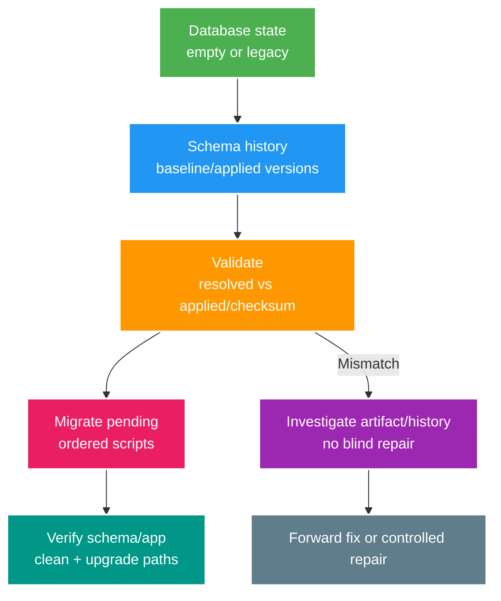

# Phân tích chuyên sâu: Flyway baseline, checksum, repair và khởi tạo sạch

> Type: `DEEP_DIVE` 
> Domain: `database` 
> Target depth: `D4 — recover migration-history drift và prove empty/legacy database upgrade paths` 
> Teaching readiness: `TEACHABLE_DRAFT` 
> Status: `DRAFT` 
> Evidence status: `NOT RUN` 
> Prerequisites: [Versioned schema migration core](../core/versioned-schema-migration.md) 
> Related cases: `DB-06`; [question bank](../../question-bank/flyway-baseline-and-clean-bootstrap.md) 
> Owner: `Project learner; Codex teaches, learner writes back` 
> Updated: `2026-07-26`

## 1. Lịch sử migration là nhật ký kiểm toán

Migration có version phải bất biến sau khi đã apply hoặc chia sẻ. Flyway schema history ghi version, mô tả, type, script, checksum và trạng thái thành công. Môi trường mới chạy theo thứ tự; môi trường cũ validate checksum và state. **Baseline** chỉ đánh dấu schema có sẵn tương ứng một điểm bắt đầu; nó không tạo hoặc kiểm tra object. Baseline thiếu kiểm soát có thể làm Flyway bỏ qua migration mà database thật vẫn cần.

## 2. Khởi tạo database rỗng và tiếp quản database cũ

Clean bootstrap từ database rỗng phải tạo đủ schema hiện tại bằng toàn bộ versioned migration, hoặc baseline migration được bảo trì cộng các migration sau đó theo chiến lược đã định. Production không được dựa vào ORM `ddl-auto`. Khi tiếp quản legacy database, phải kiểm kê schema, dữ liệu và constraint thật; chọn baseline version đúng với trạng thái đã biết, so diff rồi mới baseline. Nếu legacy thiếu object mà script cũ lẽ ra tạo nhưng baseline bỏ qua, lỗi sẽ bị giấu tới một lần deploy sau.

Test tối thiểu các đường: database rỗng tới latest; snapshot release trước tới latest; bản cũ nhất còn hỗ trợ hoặc bản đại diện tới latest; application startup và khả năng rollback binary. Seed/test data phải tách khỏi migration production.

## 3. Khi checksum không khớp

Checksum có thể lệch vì script đã apply bị sửa, line ending/encoding đổi, tool xử lý khác hoặc artifact release không giống repository. Trước tiên so git, artifact, Flyway history và schema thật. Không chạy `repair` chỉ để pipeline xanh: repair sửa metadata, không hoàn tác schema/data và có thể xóa tín hiệu drift. Hướng mặc định là khôi phục script bất biến rồi thêm forward migration. Chỉ repair có kiểm soát khi đã chứng minh database đúng còn metadata sai, kèm backup, approval, audit và phiên bản tài liệu chính xác.

Migration thất bại có thể rollback nhờ transactional DDL của PostgreSQL, nhưng không phải command nào cũng giống nhau. Trước khi chạy lại phải inspect schema, history và lock để biết side effect còn lại. Tạo version sửa tiếp; không xóa history production.

## 4. Xung đột version giữa các nhánh code

Hai branch cùng tạo `V42` sẽ xung đột khi merge hoặc deploy khác thứ tự. CI chạy clean migration có thể bắt lỗi sớm. Team cần quy ước cấp version hoặc timestamp; chỉ đổi số migration chưa apply ở bất kỳ môi trường dùng chung nào. Out-of-order chỉ bật có chủ đích. Repeatable migration chạy lại khi checksum đổi, phù hợp view/function nếu hiểu dependency và order, không phù hợp script dữ liệu phá hủy không idempotent.

Nhiều service không được cùng sở hữu schema history và write path nếu chưa có ranh giới. Mỗi schema owner nên có một migration artifact canonical.

## 5. An toàn trên môi trường production

Artifact migration phải bất biến trong cùng release. Credential của schema owner nên có least privilege và tách khỏi runtime credential khi có thể. Dùng lock timeout, review tác động DDL, backup/restore cho bước phá hủy và expand–contract. Chỉ một job/leader có kiểm soát chạy migration, tránh các replica application tranh nhau ngoài dự kiến. Theo dõi duration, lock, WAL, replica lag và dùng chúng làm deployment gate.

Secret không được xuất hiện trong SQL, log hay schema history. Rollback thường là forward migration kết hợp application compatibility, không phải `flyway clean`. Phải vô hiệu hóa `clean` trên production và môi trường có dữ liệu quan trọng.

## 6. Phòng lab tạo bằng chứng

Lab cần test database rỗng, legacy baseline và release trước; sửa thử applied script để quan sát validate; tái hiện DDL lỗi, migration đồng thời và branch collision. Assertion bao phủ history, schema, dữ liệu và application startup. Chốt phiên bản Flyway, Spring Boot và PostgreSQL. Bằng chứng hiện `NOT RUN`.

### 6.1. Pathology A — baselineOnMigrate che giấu nhầm database

`baseline` ghi rằng schema hiện hữu tương ứng một version; nó không tạo objects và không chứng minh schema thực sự giống expected baseline. Nếu application trỏ nhầm database có tables lạ rồi auto-baseline, migration history trông hợp lệ trong khi starting state sai. Sau đó migrations mới có thể chạy trên nền không tương thích.

Adopt legacy database cần inventory/schema checksum hoặc repeatable verification, backup và explicit approval. Baseline version phải khớp migration chain sẽ được bỏ qua. Production không nên dùng auto-baseline như convenience mặc định; environment identity và schema history phải fail closed.

### 6.2. Pathology B — sửa applied migration rồi dùng repair để “cho xanh”

Developer edit `V12__add_column.sql` sau khi nó đã chạy ở production. Fresh environment nhận nội dung mới; production giữ schema từ nội dung cũ. Flyway validate báo checksum mismatch—đây là drift signal. `repair` chỉ cập nhật metadata/checksum hoặc trạng thái theo command semantics; nó không biến hai schemas/data thành nhau và không undo side effect.

Response đúng là giữ applied file immutable, xác định environments đã nhận version nào, so schema/data impact rồi tạo forward migration sửa sai. Chỉ repair khi nội dung/history đã được chứng minh và metadata chính là phần sai, với audit. “Pipeline đỏ” không phải đủ lý do.

### 6.3. Pathology C — hai branch dùng cùng version

Branch A và B cùng tạo `V20`. Merge order hoặc environment nào deploy trước quyết định script thắng; branch còn lại fail hoặc bị rename sau khi một nơi đã apply. Rename applied migration lại tạo checksum/history drift. Team cần version allocation convention hoặc timestamped versions, merge validation và rule applied script immutable.

Out-of-order migrations có thể cần cho release trains nhưng thay đổi reasoning: một migration cũ chạy sau schema mới phải vẫn tương thích. Không bật tùy tiện. Repeatable migration rerun khi checksum đổi, phù hợp views/functions hơn data mutation không idempotent.

## 6.4. Bootstrap matrix cần chứng minh

Một migration chain production-ready phải chạy ít nhất trên:

1. empty database từ zero;
2. schema của previous supported release với representative data;
3. legacy/adopted schema nếu baseline là requirement;
4. database đã apply toàn chain để validate no-op/repeatable behavior;
5. failure/restart path cho migration có thể partial theo database/DDL semantics.

Sau migrate, assert schema objects/constraints/indexes, critical data transformation, Flyway history và application startup/smoke. `ddl-auto=create/update` trong test có thể che missing migration nên clean-bootstrap test phải để Flyway sở hữu schema.

## 6.5. Trách nhiệm vận hành và ranh giới phiên bản

Chỉ một controlled actor nên chạy migrate cho một schema tại một thời điểm; exact Flyway locking/concurrency behavior phải pin version/database. Application startup migration đơn giản nhưng mọi replica có thể tranh lock và outage phụ thuộc startup. Dedicated migration job cho rollout control tốt hơn nhưng cần orchestration/permission và compatibility với old/new binaries.

PostgreSQL transactional DDL giúp nhiều cases nhưng `CREATE INDEX CONCURRENTLY` và một số operations có transaction restrictions/failure residue riêng. Flyway configuration về transaction grouping, clean, baseline, out-of-order và locations phải fail-safe theo environment. `clean` bị cấm ở production-like data trừ disposable scope đã xác minh.

## 6.6. Điều tra sự cố từng bước và dàn ý phỏng vấn

Khi validate fail: dừng rollout; lưu exact error/history; không edit/repair ngay; xác định applied content từ artifact/repo, compare schema và impact; chọn forward fix hoặc narrowly justified repair; test bootstrap/upgrade matrix; audit decision. Nếu migration failed giữa chừng, đọc database state trước khi rerun vì script có thể không atomic.

Senior cần phân biệt migrate/validate/baseline/repair/clean. Architect thêm release ownership, mixed binaries và rollback. Expert reason về checksum drift, nontransactional DDL, branch collision và bootstrap evidence across environments.

### 6.7. Ba trạng thái phải so trước khi dùng `repair`

Khi Flyway báo lỗi, luôn có ba trạng thái độc lập: **artifact mong đợi** trong source/release, **metadata đã ghi** trong schema history và **schema/data thật** trong database. Checksum mismatch chỉ nói artifact hiện tại khác metadata lúc apply; nó chưa nói schema thật giống bên nào. Vì vậy điều tra lấy nội dung migration từ artifact đã deploy, đọc row history, rồi so object/constraint/data effect liên quan. Nếu artifact cũ và schema thật nhất quán, khôi phục file source rồi thêm forward migration. Nếu schema đúng nhưng metadata sai do một thao tác đã được chứng minh, `repair` mới là lựa chọn có thể cân nhắc. Nếu schema đã chạy dở, sửa metadata trước sẽ xóa dấu vết cần để phục hồi.

Ví dụ `V12` tạo column rồi process chết ở command tiếp theo không transactional. Lần rerun có thể lỗi “column exists”. Cách xử lý không phải xóa history hoặc thêm `IF NOT EXISTS` mù; phải xác định command nào đã có side effect, dữ liệu nào đã đổi, migration có thể viết lại idempotent hay cần `V13` corrective, rồi kiểm lại đường empty-to-latest. Exit gate là ba trạng thái hội tụ và bootstrap/upgrade test cùng pass. Pipeline xanh sau `repair` nhưng database rỗng tạo schema khác production vẫn là failure.

## 7. Bài tập diễn đạt lại và tự kiểm tra

> **Bài viết của tôi — `LEARNER TODO`:** define baseline proof and checksum incident steps.

1. **Question:** Baseline chứng minh điều gì và không chứng minh điều gì? 
   **Đọc lại nếu bí:** mục 2 và 6.1. 
   **Một câu trả lời tốt phải có:** history marker, legacy-state verification, baseline version, wrong-database risk và approval. 
   **My answer:** `LEARNER TODO`
2. **Question:** Xử lý checksum mismatch của applied migration theo thứ tự nào? 
   **Đọc lại nếu bí:** mục 3 và 6.2/6.6. 
   **Một câu trả lời tốt phải có:** freeze/inspect, immutable migration, schema/data comparison, forward fix versus justified repair và audit. 
   **My answer:** `LEARNER TODO`
3. **Question:** Một clean-bootstrap/upgrade matrix đủ mạnh gồm những paths và assertions nào? 
   **Đọc lại nếu bí:** mục 4 và 6.4–6.5. 
   **Một câu trả lời tốt phải có:** empty/previous/legacy/no-op/failure paths, history/schema/data/app assertions và version/config ownership. 
   **My answer:** `LEARNER TODO`

## 8. Tài liệu tham khảo

- [Flyway — Migrations](https://documentation.red-gate.com/flyway/flyway-concepts/migrations)
- [Flyway — Schema History Table](https://documentation.red-gate.com/flyway/flyway-concepts/migrations/flyway-schema-history-table)

- [ ] Evidence remains `NOT RUN`.
