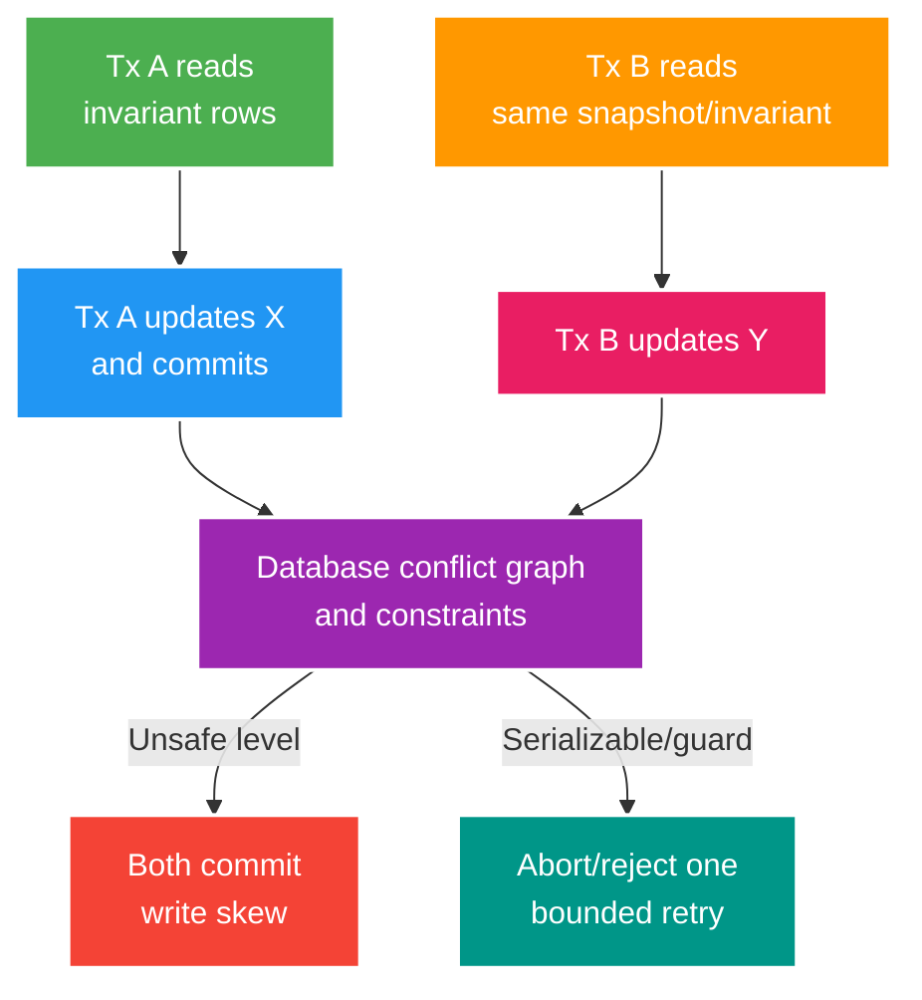

# Phân tích chuyên sâu: Lỗi isolation, deadlock và khoảng trống sau commit

> Type: `DEEP_DIVE` 
> Domain: `database` 
> Target depth: `D4 — reproduce anomalies/deadlocks và thiết kế post-commit workflow crash-safe` 
> Teaching readiness: `TEACHABLE_DRAFT` 
> Status: `DRAFT` 
> Evidence status: `NOT RUN` 
> Prerequisites: [Isolation/locking core](../core/isolation-locking-and-after-commit-consistency.md) 
> Related cases: `DB-03`; [question bank](../../question-bank/isolation-locking-and-after-commit-consistency.md) 
> Owner: `Project learner; Codex teaches, learner writes back` 
> Updated: `2026-07-26`

## 1. Hãy đọc lịch sử giao dịch, đừng chỉ nhớ tên isolation level

Để hiểu isolation, hãy viết lịch sử cụ thể gồm các lần read, write, commit và abort của từng transaction. Lost update, write skew, non-repeatable read và phantom là các lịch sử khác nhau, không phải một lỗi chung. Trong PostgreSQL, `READ COMMITTED` lấy snapshot mới cho mỗi statement; `REPEATABLE READ` dùng snapshot isolation và có thể abort một số conflict nhưng vẫn cần phân tích write skew; `SERIALIZABLE` dùng SSI để phát hiện cấu trúc nguy hiểm và abort. Hành vi chính xác phải gắn với phiên bản và tài liệu PostgreSQL.

## 2. Cách ngăn các lịch sử giao dịch sai

Câu SQL nguyên tử có điều kiện như `UPDATE ... WHERE balance >= amount AND version = ?`, kết hợp số row bị ảnh hưởng và constraint, thường là giải pháp đơn giản nhất. `FOR UPDATE` khóa bi quan các row đã biết và mọi đường code phải khóa cùng thứ tự. Optimistic version phát hiện conflict rồi retry có giới hạn. `SERIALIZABLE` bảo vệ predicate rộng hơn bằng cách abort lịch sử nguy hiểm, nhưng vẫn cần constraint, invariant nghiệp vụ và retry policy. Advisory lock chỉ đúng trong scope key/protocol mà mọi writer đều tuân thủ.

Write skew xảy ra khi hai transaction đọc cùng invariant nhưng ghi hai row khác nhau: mỗi người thấy người kia đang trực rồi cùng tắt trạng thái của mình, khiến “ít nhất một người trực” bị phá. Có thể khóa một guard row chung, biểu diễn invariant bằng constraint/redesign hoặc dùng `SERIALIZABLE` với retry. Isolation của database không kéo dài sang Redis, broker hay service ngoài.

## 3. Deadlocks

Transaction A khóa wallet 1 rồi chờ wallet 2, còn B khóa theo chiều ngược lại; đó là một chu trình chờ. PostgreSQL phát hiện và abort một victim. Phòng ngừa bằng thứ tự khóa xác định, transaction ngắn, không gọi network trong transaction và index tránh khóa/scan quá rộng. Phân loại SQLState/transient error rồi retry có giới hạn và idempotency. Chẩn đoán từ deadlock log, `pg_locks`, activity, query và transaction context; tăng timeout không phá được chu trình.

Lock timeout, statement timeout và transaction timeout bảo vệ ba ranh giới khác nhau. Chờ lock lâu chiếm connection pool và có thể gây retry storm. Tỷ lệ deadlock tăng là tín hiệu thiết kế lock order hoặc transaction model có vấn đề.

## 4. Ranh giới transaction trong Spring

Trong Spring, `@Transactional` phụ thuộc proxy, self-invocation, visibility của method, rollback rule cho checked exception, `readOnly` và propagation. Transaction context không tự đi sang async hoặc thread mới. Catch exception bên trong có thể để transaction ở trạng thái rollback-only rồi cuối method mới ném `UnexpectedRollbackException`. JPA flush có thể phát SQL trước commit, vì vậy cần phân biệt flush, commit và thời điểm listener chạy.

Listener `AFTER_COMMIT` chạy sau khi database commit, nhưng process vẫn có thể chết trước khi listener hoặc publish hoàn tất; exception lúc này không thể rollback commit. Nếu ý định publish phải durable, ghi outbox trong cùng transaction. Listener sau commit có thể nhìn resource ở trạng thái khó hiểu; mở transaction mới chỉ phù hợp với follow-up không critical có failure contract rõ, không thay thế cơ chế reliability.

## 5. Điều gì có thể xảy ra sau khi database đã commit

Database commit gift và outbox nguyên tử, sau đó relay phân phối eventual. Publish trực tiếp sau commit có khoảng trống crash làm mất event; publish trước commit có thể tạo ghost event nếu DB rollback. Cache invalidation sau commit cũng có thể mất hoặc đến sai thứ tự, nên cần versioned event/outbox, TTL và fallback/repair. Nếu HTTP response mất sau commit, idempotency key và endpoint trạng thái giúp client tìm lại outcome.

## 6. Phòng lab tái hiện lỗi

Dùng hai connection cùng barrier tường minh để tái hiện lost update, write skew và deadlock ở isolation level cụ thể; lưu thứ tự statement, thời gian, invariant cuối và SQLState. So sánh conditional update, lock, version và `SERIALIZABLE` retry. Thêm failpoint sau commit nhưng trước publish để chứng minh outbox phục hồi được. Bằng chứng hiện `NOT RUN`.

### 6.1. Pathology A — write skew phá invariant dù hai rows không xung đột

Giả sử luôn phải có ít nhất một moderator trực cho livestream. Transaction T1 đọc rằng moderator A và B đều đang trực rồi tắt A. T2 cùng snapshot cũng thấy cả hai và tắt B. Mỗi transaction update một row khác, nên row lock không buộc chúng xung đột; sau cả hai commit, invariant “ít nhất một người trực” bị phá.

Đây không phải lost update trên cùng row. Sửa bằng optimistic version từng row vẫn có thể không đủ. Các option gồm khóa một aggregate/guard row chung, biểu diễn invariant bằng constraint phù hợp nếu làm được, hoặc dùng `SERIALIZABLE` và retry toàn transaction khi PostgreSQL phát hiện history không serializable. Test cần barrier bảo hai read xảy ra trước hai write, lặp đủ lần và assert invariant cuối chứ không chỉ status code.

### 6.2. Pathology B — deadlock xuất hiện sau khi “tối ưu” batch order

Gift settlement khóa wallet sender rồi receiver, trong khi refund khóa receiver rồi sender. Hai requests chạy đồng thời có thể mỗi bên giữ một row và chờ row còn lại. PostgreSQL phát hiện wait cycle rồi abort một transaction. Retry đúng là chạy lại toàn unit of work với bounded backoff, nhưng chỉ retry che symptom nếu lock order vẫn không nhất quán.

Evidence gồm deadlock log/SQLSTATE, statements và lock graph; query chậm không đồng nghĩa deadlock. Mitigation ưu tiên canonical lock order theo ID, transaction ngắn, index để tránh khóa/scan thừa và không gọi network trong transaction. Retry chỉ áp dụng khi operation idempotent và caller deadline còn đủ.

### 6.3. Pathology C — database commit thành công nhưng event biến mất

Service commit gift rồi chạy listener `AFTER_COMMIT` để publish RabbitMQ. Process chết giữa hai bước. Database đã có gift nhưng broker không có message; transaction listener không thể “rollback lại” commit đã durable. Nếu publish trước commit thì consumer có thể thấy event cho state sau đó rollback. Hai thứ tự đều có crash gap khi dùng hai resource không có atomic protocol.

Transactional outbox đặt domain change và outbox row trong cùng database transaction. Relay publish, đánh dấu hoặc retry; consumer dùng inbox/business identity để xử lý duplicate. Outbox giải quyết durable handoff, không tự bảo đảm global exactly-once hay order xuyên aggregate. Monitor oldest unpublished age, retry/DLQ và reconciliation giữa domain state với downstream effect.

## 6.4. Quy trình chẩn đoán và thí nghiệm từng bước

Lab dùng hai connections và explicit barriers, không dựa vào sleep ngẫu nhiên. Mỗi scenario ghi isolation level thực tế, SQL theo thứ tự, read values, lock wait/deadlock error và final rows. Chạy ba biến thể: naive read-modify-write, conditional/locked update và serializable retry. Với after-commit, thêm deterministic failpoint ngay sau database commit và trước publish; restart relay để chứng minh recovery.

Khi debug production, hỏi invariant nào bị phá và history tối thiểu nào tạo ra nó. `READ COMMITTED` của PostgreSQL cho mỗi statement một snapshot mới; `REPEATABLE READ` dùng transaction snapshot và PostgreSQL có semantics cụ thể; exact anomaly/serialization behavior phải kiểm lại theo PostgreSQL version. Spring `@Transactional` chỉ có hiệu lực qua proxy và rollback rule; self-invocation, checked exception hoặc async thread có thể đổi boundary mà developer tưởng đang có.

## 6.5. Khung ra quyết định và dàn ý phỏng vấn

Pessimistic locking dễ reasoning cho contention thấp nhưng tăng wait/deadlock và giảm throughput. Optimistic version/conditional update phù hợp conflict hiếm, cần UX/retry cho conflict. `SERIALIZABLE` bảo vệ history rộng hơn nhưng application phải xử lý serialization failure. Constraint là lớp phòng thủ mạnh khi invariant biểu diễn được trong database. Outbox dành cho durability qua DB-broker boundary, không thay isolation trong domain transaction.

Ở level Senior, trả lời bằng một concrete interleaving và cách reproduce. Architect thêm contention, retry budget, observability và ownership của relay. Expert phân biệt lost update/write skew/deadlock/crash gap, chỉ ra linearization point và residual risk của mỗi mitigation.

### 6.6. Chọn cơ chế từ hình dạng invariant

Nếu invariant nằm trên một row và update biểu diễn được bằng predicate, conditional SQL thường có ít moving part nhất. Nếu cần sửa vài row đã biết, row lock theo thứ tự cố định dễ lý luận nhưng phải đo contention. Nếu conflict hiếm và user có thể retry, optimistic version giảm thời gian giữ lock. Nếu invariant là predicate trên một tập row thay đổi, một guard/aggregate row hoặc `SERIALIZABLE` có thể phù hợp hơn; tuy nhiên serialization failure là outcome bình thường mà application phải retry trong deadline. Constraint là lớp cuối tốt khi database biểu diễn được invariant, nhưng không bao phủ broker hoặc cache.

Khi production chậm, đừng đổi isolation trước khi viết được history lỗi. Lock wait không phải deadlock; serialization failure không phải connection failure; duplicate event sau outbox không phải lost update. Mỗi loại có retry policy khác nhau. Evidence tối thiểu là transaction ID/correlation, statement order, SQLState, lock graph hoặc event ID và invariant cuối. Nếu retry rate tăng cùng pool wait, mitigation có thể đang khuếch đại incident; admission control và giới hạn retry phải đi cùng cơ chế correctness.

## 7. Bài tập diễn đạt lại và tự kiểm tra

> **Bài viết của tôi — `LEARNER TODO`:** write one write-skew history and after-commit crash timeline.

1. **Question:** Viết history hai transaction làm invariant “còn ít nhất một moderator” bị phá và chọn mitigation. 
   **Đọc lại nếu bí:** mục 1–2 và 6.1. 
   **Một câu trả lời tốt phải có:** reads/writes theo thứ tự, vì sao row version chưa đủ, linearization/serialization và retry contract. 
   **My answer:** `LEARNER TODO`
2. **Question:** Điều tra deadlock khác điều tra slow query như thế nào? 
   **Đọc lại nếu bí:** mục 3 và 6.2. 
   **Một câu trả lời tốt phải có:** wait cycle/SQLSTATE evidence, lock order, transaction scope, bounded retry và idempotency. 
   **My answer:** `LEARNER TODO`
3. **Question:** Vì sao `AFTER_COMMIT` listener không phải durable messaging guarantee? 
   **Đọc lại nếu bí:** mục 5 và 6.3–6.5. 
   **Một câu trả lời tốt phải có:** crash timeline, two-resource gap, outbox/inbox recovery, monitoring và giới hạn exactly-once. 
   **My answer:** `LEARNER TODO`

## 8. Tài liệu tham khảo

- [PostgreSQL — Transaction Isolation](https://www.postgresql.org/docs/current/transaction-iso.html)
- [PostgreSQL — Deadlocks](https://www.postgresql.org/docs/current/explicit-locking.html#LOCKING-DEADLOCKS)
- [Spring — Transaction-bound Events](https://docs.spring.io/spring-framework/reference/data-access/transaction/event.html)

- [ ] Evidence remains `NOT RUN`.
